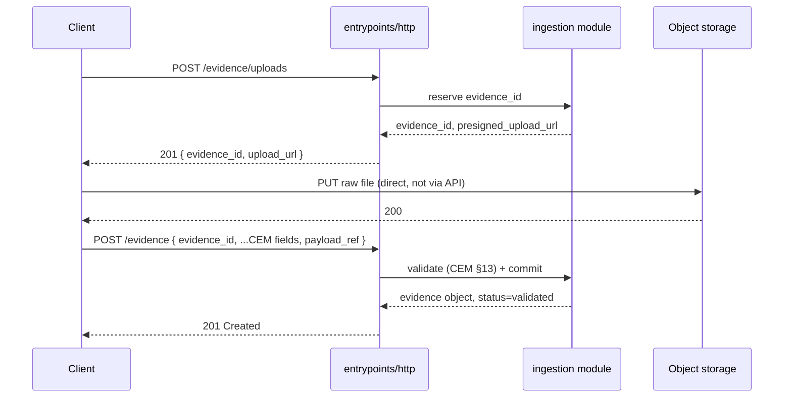
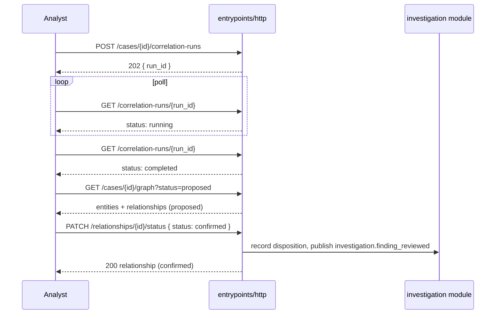
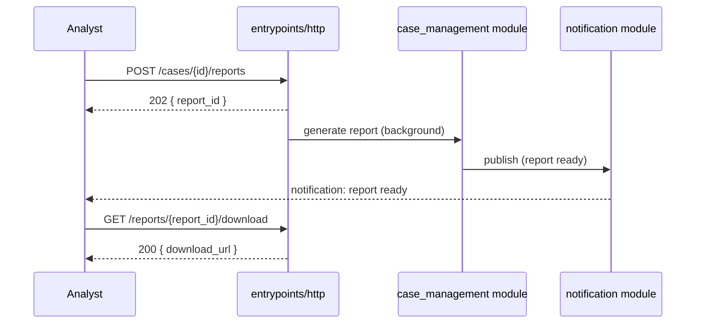
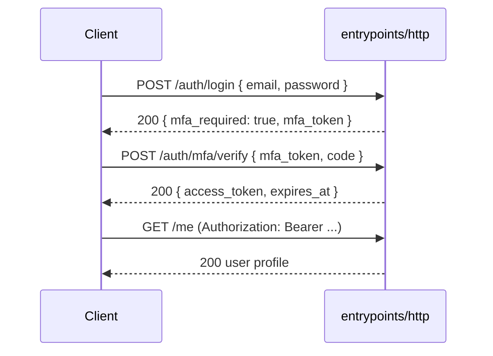

# SentinelAI — API Design

**Status:** Draft — Engineering Reference
**Last updated:** 2026-07-19
**Related documents:** [PRD](prd.md) · [Architecture](architecture.md) · [System Design](system-design.md) · [Database Design](database-design.md) · [Canonical Evidence Model](canonical-evidence-model.md)

This document is the complete REST API contract for SentinelAI. It is **implementation-independent** — no framework (Express, FastAPI, NestJS, Django, or otherwise) is assumed anywhere below; every endpoint is specified purely in terms of HTTP method, URL, headers, JSON shapes, and status codes. It is detailed enough that backend and frontend teams can begin implementation without further clarification. No code appears in this document.

The API is exposed by `apps/server/entrypoints/http` (`system-design.md` §2) as **one resource-oriented surface** — URL paths name resources, not internal modules. The "owning module" column in each endpoint group is for engineering traceability into `database-design.md`'s schema ownership; API consumers never see or depend on it, which is deliberate: it must stay true even after a module is extracted into its own service (`architecture.md` §Architectural Style).

### Section index

| # | Section |
|---|---|
| 1 | [Overview & Scope](#1-overview--scope) |
| 2 | [API Conventions](#2-api-conventions) |
| 3 | [Authentication & Authorization Model](#3-authentication--authorization-model) |
| 4 | [Endpoint Groups by Module](#4-endpoint-groups-by-module) |
| 5 | [Evidence APIs and the Canonical Evidence Model](#5-evidence-apis-and-the-canonical-evidence-model) |
| 6 | [Investigation APIs: Entities, Relationships, Graph, AI Findings, Review](#6-investigation-apis-entities-relationships-graph-ai-findings-review) |
| 7 | [Report Generation APIs](#7-report-generation-apis) |
| 8 | [Notification APIs](#8-notification-apis) |
| 9 | [Authentication APIs](#9-authentication-apis) |
| 10 | [Administrative APIs](#10-administrative-apis) |
| 11 | [Health and Readiness APIs](#11-health-and-readiness-apis) |
| 12 | [Metrics Endpoint](#12-metrics-endpoint) |
| 13 | [Sequence Diagrams](#13-sequence-diagrams) |
| 14 | [API Evolution and Backward Compatibility](#14-api-evolution-and-backward-compatibility) |

---

## 1. Overview & Scope

- One versioned API surface, `/api/v1`, fronting all nine modules (`platform`, `ingestion`, `osint`, `threat_intel`, `forensics`, `social_media`, `case_management`, `investigation`, `notification`).
- Resource-oriented URLs (`/cases`, `/evidence`, `/entities`), not module-prefixed URLs — the API never exposes `apps/server/modules/*` structure.
- `/healthz`, `/readyz`, and `/metrics` are deliberate exceptions: fixed, unversioned, well-known paths, because infrastructure tooling (load balancer probes, Kubernetes, Prometheus) expects them there and doesn't participate in API versioning (Section 11–12).
- Every endpoint below is written so that its behavior is fully determined by this document plus Section 2's conventions — an endpoint's detailed entry states only what's specific to it; shared behavior (pagination, errors, auth headers) is defined once and referenced.

## 2. API Conventions

### 2.1 URI Naming

- Plural nouns for collections: `/cases`, `/evidence` (irregular plural, intentionally used as both singular and collection — there is no `/evidences`), `/entities`, `/relationships`.
- Nesting expresses ownership, capped at one level: `/cases/{case_id}/evidence`, not `/cases/{case_id}/evidence/{evidence_id}/custody-events/{custody_event_id}/...`. Where deeper access is needed, prefer a top-level resource with a filter query parameter over deep nesting.
- Path segments are kebab-case; JSON field names are `snake_case` (Section 2.3), matching `database-design.md` column names directly — no translation layer between DB and API field naming.
- Actions that aren't pure CRUD are modeled as a sub-resource verb-noun, POSTed to: `/relationships/{relationship_id}/status`, `/evidence/{evidence_id}/supersede`, `/feeds/{subscription_id}/sync` — never a verb in the collection path itself (`/relationships/reject` is wrong).

### 2.2 Versioning Strategy

- URI-versioned: `/api/v1/...`. A breaking change produces `/api/v2/...`; both are served concurrently for a defined deprecation window (Section 14).
- Additive changes (new optional field, new endpoint, new enum value) **do not** bump the version — clients must tolerate unknown fields and unknown enum values by design (Section 14).

### 2.3 JSON Conventions

- `snake_case` field names throughout, mirroring `database-design.md`.
- Timestamps are ISO 8601 in UTC with a trailing `Z` (`2026-06-02T14:03:00Z`) — never epoch integers, never local time.
- Absent optional data is **omitted**, not sent as `null`, except where `null` is a meaningful value distinct from "not provided" (e.g. `case.closed_at: null` means "open," which is different from the field being absent, which would be malformed).
- Every request and response body is a JSON object at the top level — never a bare array (see envelope, 2.4).
- Monetary/precise-decimal values (none in Phase 1 scope) would be strings, not floats — noted for future-proofing, not currently applicable.

### 2.4 Response Envelope & Error Object Schema

**Success — single resource:**
```json
{
  "data": { "...": "resource fields" },
  "meta": { "request_id": "req_9f3a...", "correlation_id": "corr_1c2b..." }
}
```

**Success — collection:**
```json
{
  "data": [ { "...": "..." } ],
  "pagination": { "next_cursor": "eyJ0Ijoi...", "has_more": true, "limit": 50 },
  "meta": { "request_id": "req_9f3a...", "correlation_id": "corr_1c2b..." }
}
```

**Error:**
```json
{
  "error": {
    "code": "VALIDATION_FAILED",
    "message": "attributes.sender is required for artifact_type sms_mms_message",
    "details": [ { "field": "attributes.sender", "issue": "required" } ],
    "request_id": "req_9f3a...",
    "correlation_id": "corr_1c2b...",
    "timestamp": "2026-07-19T12:00:00Z"
  }
}
```

**Standard error codes** (SCREAMING_SNAKE_CASE, stable across the API — endpoint-specific detail lives in `details[]`, not in new top-level codes):

| Code | HTTP status | Meaning |
|---|---|---|
| `VALIDATION_FAILED` | 400 or 422 | Request malformed (400) or fails domain/business rules (422) — see distinction below |
| `UNAUTHENTICATED` | 401 | Missing, invalid, or expired credentials |
| `FORBIDDEN` | 403 | Authenticated, but lacks the required role or case-scope grant |
| `NOT_FOUND` | 404 | Resource does not exist or caller has no visibility into it (these are deliberately indistinguishable to avoid leaking existence) |
| `CONFLICT` | 409 | General state conflict |
| `IDEMPOTENCY_KEY_CONFLICT` | 409 | Same `Idempotency-Key` reused with a different request body |
| `PRECONDITION_FAILED` | 412 | `If-Match` ETag no longer matches current state |
| `EVIDENCE_IMMUTABLE` | 409 | Attempted mutation of a `validated`/`superseded` evidence object's core fields |
| `LEGAL_HOLD_VIOLATION` | 409 | Attempted disposal/deletion of evidence under legal hold |
| `SCHEMA_VERSION_UNSUPPORTED` | 400 | Unknown or inactive `(schema_version, category, artifact_type)` combination |
| `RATE_LIMITED` | 429 | Rate limit exceeded (Section 2.13) |
| `INTERNAL_ERROR` | 500 | Unexpected server error |
| `SERVICE_UNAVAILABLE` | 503 | A required dependency is down |

**400 vs. 422:** 400 means the request itself is malformed (unparseable JSON, wrong type for a field, missing a field the *shape* requires). 422 means the request is well-formed JSON but fails a *domain* rule — most importantly, CEM §13's validation rules (Section 5).

### 2.5 Pagination (Cursor vs. Offset)

**Cursor (keyset) pagination is the default and required approach for any collection backed by a large, append-heavy table** — `evidence`, `evidence_custody_events`, `audit_log`, `osint_findings`, `notifications`. Query parameters: `cursor` (opaque, base64-encoded, server-issued — encodes the sort key's last-seen value, e.g. `(ingested_at, evidence_id)`), `limit` (default 50, max 200). Response includes `pagination.next_cursor` and `pagination.has_more`; there is no "jump to page N" and no total count for these collections (computing a total count on an unbounded, actively-growing table is expensive and rarely the actual need).

**Offset pagination (`page`, `page_size`) is permitted only for small, bounded, low-cardinality collections** where a stable total genuinely matters to the UI — `roles`, `notification-rules`, `connectors`, `osint/sources`, `threat-intel/threat-actors`. These responses include `pagination.total_count`.

Why cursor is the default: `OFFSET n` on a large table requires scanning and discarding `n` rows, degrades further with every subsequent page, and produces duplicated/skipped rows under concurrent inserts (exactly the workload evidence ingestion produces). Keyset pagination has none of these problems and pairs directly with the BRIN-indexed time-ordered columns already chosen in `database-design.md` §6–7.

### 2.6 Filtering & Sorting

Standard list query parameters, available on every collection endpoint unless noted otherwise:
- Exact-match filters on enum/status fields: `?status=validated`, `?category=osint`.
- Range filters via `_after`/`_before` suffix on timestamp fields: `?collected_after=2026-06-01T00:00:00Z&collected_before=2026-07-01T00:00:00Z`.
- Free-text search where applicable: `?q=warehouse`.
- `sort=field` for ascending, `sort=-field` for descending (leading `-`). Each endpoint documents its whitelist of sortable fields — sorting on an unlisted field returns `VALIDATION_FAILED` (400).
- Multiple filters combine with AND. There is no OR/complex query language in Phase 1 — a documented limitation, not an oversight; revisit if a real use case demands it.

### 2.7 ETag Usage

Mutable resources (`cases`, `notification_rules`, `entities`, `relationships`) return an `ETag` response header on every `GET`. A `PATCH` to that resource must send `If-Match: <etag>`; a mismatch returns `412 PRECONDITION_FAILED` rather than silently overwriting a concurrent change — this is the API-level expression of the optimistic-concurrency need that arises anywhere two analysts might edit the same case/finding disposition at once.

`evidence` is immutable (no `PATCH` exists on it at all — see Section 5), but `GET /evidence/{evidence_id}` still returns an `ETag` purely for HTTP caching: since the content genuinely never changes, a conditional `GET` with `If-None-Match` can return `304 Not Modified`.

### 2.8 Correlation IDs & Request IDs

- **`X-Request-Id`** — always server-generated, unique per HTTP request, returned in every response and in `meta.request_id`. Use for "what happened on this exact call."
- **`X-Correlation-Id`** — client-supplied if present, otherwise server-generated at the first hop of a workflow, and propagated through every downstream module call and published event for that workflow. This is the same correlation ID `system-design.md` §12 specifies as W3C-Trace-Context-shaped — it is what becomes a real distributed trace ID once a module is extracted (Phase 5), with no format change. Use for "show me everything that happened as a result of this action," including async jobs it triggered.

### 2.9 Idempotency Keys

Required (`Idempotency-Key` header) on every `POST` that creates a resource with real-world consequence: evidence ingestion, case creation, connector-published findings, correlation-run triggers. The server stores `(key, request body hash, response)` for 24 hours; a retried request with the same key and same body replays the original response verbatim (same status code, same body) rather than creating a duplicate. A retried request with the same key but a *different* body returns `409 IDEMPOTENCY_KEY_CONFLICT`. This directly extends `system-design.md` §6's "every event handler is idempotent" principle to the HTTP boundary — a flaky connector retrying a POST must never double-ingest evidence.

### 2.10 Batch APIs

`POST /api/v1/evidence/batch` is the representative pattern (Section 4.2): accepts an array of evidence objects, each optionally carrying its own idempotency key, and returns **per-item results**, not all-or-nothing:
```json
{
  "data": {
    "results": [
      { "index": 0, "status": "created", "evidence_id": "1f3b..." },
      { "index": 1, "status": "error", "error": { "code": "VALIDATION_FAILED", "message": "..." } }
    ]
  },
  "meta": { "request_id": "...", "correlation_id": "..." }
}
```
The HTTP status is `207` (Multi-Status) when results are mixed, `201` when all succeed, `400`/`422` only if the batch envelope itself is malformed.

### 2.11 File Upload APIs

Large payload-bearing evidence (forensic images, captured media) never routes its binary content through the API server. The pattern is presigned-URL, three steps (sequence diagram in Section 13):
1. `POST /api/v1/evidence/uploads` — reserves an `evidence_id` and returns a short-lived presigned upload URL for the object storage bucket (`system-design.md` §9's MinIO/S3).
2. Client uploads the binary directly to that URL.
3. `POST /api/v1/evidence` (or a confirm call referencing the reserved `evidence_id`) finalizes the record with `payload_ref` set and triggers validation/integrity-hash verification.

### 2.12 Long-Running Job APIs & Async Polling

Operations that can't complete within a normal request cycle — AI correlation runs, report generation, large forensic artifact parsing — follow one pattern: the triggering `POST` returns `202 Accepted` with a `Location` header pointing at a job-status resource; the client polls `GET` on that resource until `status` is `completed` or `failed`. No webhooks or WebSocket push in Phase 1 (a documented future enhancement, not a Phase 1 gap — see `notification` module, Section 8, for the mechanism that *does* exist today to tell a user a job finished).

### 2.13 Rate Limiting

Every response includes `X-RateLimit-Limit`, `X-RateLimit-Remaining`, `X-RateLimit-Reset`. Exceeding the limit returns `429 RATE_LIMITED` with a `Retry-After` header. Limits are scoped per authenticated actor (user or connector/service account), not globally — a noisy OSINT connector must not be able to degrade another actor's request budget. Specific numeric quotas are an operational tuning concern, not part of this contract.

### 2.14 API Compatibility Rules

Summarized here; full policy in Section 14.

## 3. Authentication & Authorization Model

- **Authentication:** Bearer token in `Authorization: Bearer <token>`, issued by `POST /api/v1/auth/login` or the SSO flow (Section 9), backed by `platform.sessions`. Every endpoint requires authentication **except** `/healthz`, `/readyz`, `POST /api/v1/auth/login`, `GET|POST /api/v1/auth/sso/*`. `/metrics` is reachable without a bearer token but is expected to be exposed only on an internal scrape network, not the public API surface (Section 12).
- **Authorization:** role-based (`platform.roles`, e.g. `investigator`, `supervisor`, `admin`, `system` for connector/service accounts) **plus case-level scoping** — access to a case's evidence, entities, relationships, and reports additionally requires the caller be the case's owner, an assigned investigator, or an explicitly granted reviewer (PRD FR-2.5). Every endpoint entry in Section 4 states both the required role(s) and whether case-scoping applies.
- Connector/system accounts (used by `osint`, `threat_intel`, `forensics`, `social_media` ingestion pipelines calling back into the API) authenticate the same way, with a `system` role scoped to write-only access on their own module's publish endpoints — they are not granted case-level access at all, consistent with `case_management` owning case-evidence linkage exclusively (`database-design.md` §5).

## 4. Endpoint Groups by Module

Each module's table is the complete endpoint inventory for that module — every endpoint not given full detail below still follows Section 2's conventions and the shape of its fully-detailed sibling endpoints in the same table; deviations are called out inline.

### 4.1 `platform`

| Method | URL | Purpose | Auth (role) | Idempotent? |
|---|---|---|---|---|
| POST | `/api/v1/auth/login` | Password/credential login | none | No |
| POST | `/api/v1/auth/mfa/verify` | Complete MFA challenge | none (mfa_token) | No |
| GET | `/api/v1/auth/sso/{provider}/redirect` | Begin SSO flow | none | N/A |
| GET | `/api/v1/auth/sso/{provider}/callback` | Complete SSO flow | none | No |
| POST | `/api/v1/auth/refresh` | Refresh session token | any | No |
| POST | `/api/v1/auth/logout` | Revoke current session | any | Yes |
| GET | `/api/v1/me` | Current user profile + roles | any | N/A |
| GET | `/api/v1/admin/users` | List users | admin | N/A |
| POST | `/api/v1/admin/users` | Create user | admin | Yes (key) |
| GET | `/api/v1/admin/users/{user_id}` | Get user | admin | N/A |
| PATCH | `/api/v1/admin/users/{user_id}` | Update user profile | admin | No (ETag) |
| POST | `/api/v1/admin/users/{user_id}/disable` | Disable user (soft delete) | admin | Yes |
| GET | `/api/v1/admin/roles` | List roles | admin | N/A |
| POST | `/api/v1/admin/users/{user_id}/roles` | Grant role | admin | Yes |
| DELETE | `/api/v1/admin/users/{user_id}/roles/{role_id}` | Revoke role | admin | Yes |
| GET | `/api/v1/admin/audit-log` | Query/export system audit log | admin, compliance | N/A |
| GET | `/healthz` | Liveness probe | none | N/A |
| GET | `/readyz` | Readiness probe | none | N/A |
| GET | `/metrics` | Prometheus-format metrics | none (network-restricted) | N/A |

Full detail: `POST /api/v1/auth/login` and `GET /api/v1/admin/audit-log` in Section 9–10; `/healthz`, `/readyz` in Section 11; `/metrics` in Section 12.

**`GET /api/v1/me`**

| Attribute | Value |
|---|---|
| Purpose | Return the authenticated caller's profile, roles, and active case grants — the primary call a frontend makes on load to determine what UI to render |
| Path Parameters | none |
| Query Parameters | none |
| Request Body | none |
| Validation Rules | none |
| Response Body | `{ user_id, email, display_name, roles: [string], status }` |
| Success Codes | 200 |
| Error Codes | 401 |
| Authentication | Required |
| Authorization | Any authenticated user |
| Idempotency | N/A (GET) |
| Pagination | N/A |
| Filtering / Sorting | N/A |
| Events Published | none |
| Audit Requirements | none (reads are not audited individually at this granularity — see `platform.audit_log` scope in Section 10) |

```json
// 200 OK
{
  "data": {
    "user_id": "8b5d0f62-...",
    "email": "priya.n@example.org",
    "display_name": "Priya N.",
    "roles": ["investigator"],
    "status": "active"
  },
  "meta": { "request_id": "req_1", "correlation_id": "corr_1" }
}
```

### 4.2 `ingestion`

| Method | URL | Purpose | Auth (role) | Idempotent? |
|---|---|---|---|---|
| POST | `/api/v1/evidence/uploads` | Reserve `evidence_id` + presigned upload URL | investigator, system | Yes (key) |
| POST | `/api/v1/evidence` | Ingest/finalize a canonical evidence object | investigator, system | Yes (key) |
| POST | `/api/v1/evidence/batch` | Bulk ingest | system | Per-item (key) |
| GET | `/api/v1/evidence` | List/search evidence | investigator | N/A |
| GET | `/api/v1/evidence/{evidence_id}` | Get one evidence object | investigator (case-scoped) | N/A |
| GET | `/api/v1/evidence/{evidence_id}/download` | Presigned download URL; records `accessed` custody event | investigator (case-scoped) | No |
| GET | `/api/v1/evidence/{evidence_id}/custody-events` | Full custody ledger for this item | investigator, compliance | N/A |
| POST | `/api/v1/evidence/{evidence_id}/custody-events` | Record a manual custody event (`transferred`, `legal_hold_applied`, `legal_hold_released`, `disposed`) | supervisor, admin | Yes (key) |
| POST | `/api/v1/evidence/{evidence_id}/verify-integrity` | Recompute and check hash against stored value | investigator | Yes |
| POST | `/api/v1/evidence/{evidence_id}/supersede` | Create a corrected version, linked via `supersedes_evidence_id` | investigator | Yes (key) |
| GET | `/api/v1/connectors` | List registered connectors | admin | N/A |
| POST | `/api/v1/connectors` | Register a connector | admin | Yes (key) |
| PATCH | `/api/v1/connectors/{connector_id}` | Update/deactivate a connector | admin | No (ETag) |
| GET | `/api/v1/attribute-schemas` | List registered `(schema_version, category, artifact_type)` entries | any authenticated | N/A |

Full detail for `POST /api/v1/evidence`, `GET /api/v1/evidence`, `GET /api/v1/evidence/{evidence_id}`, `GET /api/v1/evidence/{evidence_id}/custody-events`, `POST /api/v1/evidence/{evidence_id}/supersede` is in Section 5, which documents how these implement the Canonical Evidence Model directly.

### 4.3 `osint`

| Method | URL | Purpose | Auth (role) | Idempotent? |
|---|---|---|---|---|
| GET | `/api/v1/osint/sources` | List OSINT source configs | investigator, admin | N/A |
| POST | `/api/v1/osint/sources` | Register a source | admin | Yes (key) |
| PATCH | `/api/v1/osint/sources/{source_id}` | Update reliability baseline / activate-deactivate | admin | No (ETag) |
| GET | `/api/v1/osint/findings` | List raw findings (pre- or post-publish) | investigator | N/A |
| GET | `/api/v1/osint/findings/{finding_id}` | Get one finding | investigator | N/A |
| POST | `/api/v1/osint/findings` | Manual finding entry | investigator | Yes (key) |
| POST | `/api/v1/osint/findings/{finding_id}/publish` | Normalize and publish into `ingestion.evidence` | investigator, system | Yes |

**`POST /api/v1/osint/findings/{finding_id}/publish`**

| Attribute | Value |
|---|---|
| Purpose | Normalize a raw OSINT finding into the canonical evidence model, per the Extract→Map→Enrich→Validate→Commit pipeline (`canonical-evidence-model.md` §9) |
| Path Parameters | `finding_id` (uuid, required) |
| Query Parameters | none |
| Request Body | `{}` (no body needed — publishing uses the finding's already-stored `raw_attributes`) |
| Validation Rules | Finding must exist, must not already be published (`evidence_id` is null); mapped `attributes` must pass `attribute_schema_registry` validation (CEM §13) or the call fails with `422` and the finding remains unpublished |
| Response Body | `{ finding_id, evidence_id, status: "published" }` |
| Success Codes | 200 |
| Error Codes | 401, 403, 404, 409 (already published), 422 |
| Authentication | Required |
| Authorization | `investigator` or `system`; no case-scope (findings aren't case-linked until `POST /cases/{case_id}/evidence`) |
| Idempotency | Natural — publishing an already-published finding returns `409`, not a duplicate; safe to retry on network failure since the check is on the finding's own state |
| Pagination | N/A |
| Filtering / Sorting | N/A |
| Events Published | `osint.finding_captured` (on the `osint` schema's own outbox) and, indirectly, `evidence.ingested` (published by `ingestion` once the evidence row commits) |
| Audit Requirements | `ingestion.evidence_custody_events` genesis entry (`ingested`); `platform.audit_log` entry (`action: evidence_published_from_osint`) |

### 4.4 `threat_intel`

| Method | URL | Purpose | Auth (role) | Idempotent? |
|---|---|---|---|---|
| GET | `/api/v1/threat-intel/iocs` | List IOCs | investigator | N/A |
| POST | `/api/v1/threat-intel/iocs` | Register an IOC (manual or feed-sourced) | investigator, system | Yes (key) |
| GET | `/api/v1/threat-intel/iocs/{ioc_id}` | Get one IOC | investigator | N/A |
| GET | `/api/v1/threat-intel/iocs/{ioc_id}/matches` | List evidence matches for this IOC | investigator | N/A |
| GET | `/api/v1/threat-intel/threat-actors` | List threat actor profiles | investigator | N/A |
| POST | `/api/v1/threat-intel/threat-actors` | Create a threat actor profile | investigator, admin | Yes (key) |
| GET | `/api/v1/threat-intel/feeds` | List feed subscriptions | admin | N/A |
| POST | `/api/v1/threat-intel/feeds` | Add a feed subscription (STIX/TAXII or vendor API) | admin | Yes (key) |
| POST | `/api/v1/threat-intel/feeds/{subscription_id}/sync` | Trigger an on-demand feed sync (async) | admin | Yes |

**`POST /api/v1/threat-intel/iocs`**

| Attribute | Value |
|---|---|
| Purpose | Register a new indicator of compromise |
| Path Parameters | none |
| Query Parameters | none |
| Request Body | `{ indicator_type, value, threat_actor_id?, first_seen, mitre_attack_ids?: [string] }` |
| Validation Rules | `indicator_type` ∈ {`ipv4`,`ipv6`,`domain`,`url`,`hash_md5`,`hash_sha1`,`hash_sha256`}; `value` format validated against `indicator_type`; `threat_actor_id`, if present, must reference an existing profile |
| Response Body | Full IOC object, including `ioc_id`, `evidence_id: null` (not yet published) |
| Success Codes | 201 |
| Error Codes | 400, 401, 403, 409, 422 |
| Authentication | Required |
| Authorization | `investigator` or `system` |
| Idempotency | `Idempotency-Key` required |
| Pagination | N/A |
| Filtering / Sorting | N/A |
| Events Published | none at creation — `threat_intel.ioc_matched` is published later, when a match against case evidence is found |
| Audit Requirements | `platform.audit_log` entry |

**`GET /api/v1/threat-intel/iocs/{ioc_id}/matches`**

| Attribute | Value |
|---|---|
| Purpose | List evidence items that have matched this IOC |
| Path Parameters | `ioc_id` (uuid, required) |
| Query Parameters | `cursor`, `limit` (Section 2.5) |
| Request Body | none |
| Validation Rules | `ioc_id` must exist |
| Response Body | `{ data: [{ match_id, evidence_id, matched_at, confidence }] }` |
| Success Codes | 200 |
| Error Codes | 401, 403, 404 |
| Authentication | Required |
| Authorization | `investigator` |
| Idempotency | N/A (GET) |
| Pagination | Cursor |
| Filtering | none beyond the path scope |
| Sorting | `matched_at` (default desc) |
| Events Published | none |
| Audit Requirements | none |

### 4.5 `forensics`

| Method | URL | Purpose | Auth (role) | Idempotent? |
|---|---|---|---|---|
| GET | `/api/v1/forensics/artifacts` | List forensic artifacts | investigator | N/A |
| POST | `/api/v1/forensics/artifacts` | Register a forensic artifact (rich record) | investigator, system | Yes (key) |
| GET | `/api/v1/forensics/artifacts/{artifact_id}` | Get one artifact | investigator | N/A |
| POST | `/api/v1/forensics/artifacts/{artifact_id}/publish` | Normalize and publish into `ingestion.evidence` | investigator, system | Yes |

**`POST /api/v1/forensics/artifacts`**

| Attribute | Value |
|---|---|
| Purpose | Register the rich, tool-specific record for a forensic artifact prior to canonical publication |
| Path Parameters | none |
| Query Parameters | none |
| Request Body | `{ artifact_kind, device_info: {...}, acquisition_tool, acquisition_hash, collected_at }` |
| Validation Rules | `artifact_kind` ∈ CEM §6's `digital_forensics`/`mobile_forensics` artifact types; `acquisition_hash` required and must match the declared algorithm's format |
| Response Body | Full artifact record, `evidence_id: null` |
| Success Codes | 201 |
| Error Codes | 400, 401, 403, 422 |
| Authentication | Required |
| Authorization | `investigator` (typically a forensic examiner role) or `system` |
| Idempotency | `Idempotency-Key` required |
| Pagination | N/A |
| Filtering / Sorting | N/A |
| Events Published | none at this step |
| Audit Requirements | `platform.audit_log` entry — artifact registration is itself a chain-of-custody-relevant act even before canonical publication |

### 4.6 `social_media`

| Method | URL | Purpose | Auth (role) | Idempotent? |
|---|---|---|---|---|
| GET | `/api/v1/social-media/accounts` | List monitored accounts | investigator | N/A |
| POST | `/api/v1/social-media/accounts` | Register an account for monitoring | investigator, admin | Yes (key) |
| GET | `/api/v1/social-media/content` | List captured content | investigator | N/A |
| POST | `/api/v1/social-media/content` | Manual/connector content capture entry | investigator, system | Yes (key) |
| POST | `/api/v1/social-media/content/{content_id}/publish` | Normalize and publish into `ingestion.evidence` | investigator, system | Yes |

**`POST /api/v1/social-media/content`**

| Attribute | Value |
|---|---|
| Purpose | Record captured social media content prior to canonical publication |
| Path Parameters | none |
| Query Parameters | none |
| Request Body | `{ platform, account_handle, content_kind, raw_attributes: {...}, captured_at }` |
| Validation Rules | `content_kind` ∈ CEM §6's `social_media_intelligence` artifact types; `captured_at` not in the future |
| Response Body | Full content record, `evidence_id: null` |
| Success Codes | 201 |
| Error Codes | 400, 401, 403, 422 |
| Authentication | Required |
| Authorization | `investigator` or `system` |
| Idempotency | `Idempotency-Key` required |
| Pagination | N/A |
| Filtering / Sorting | N/A |
| Events Published | none at this step |
| Audit Requirements | `platform.audit_log` entry |

### 4.7 `case_management`

| Method | URL | Purpose | Auth (role) | Idempotent? |
|---|---|---|---|---|
| GET | `/api/v1/cases` | List cases (scoped to caller's access) | investigator | N/A |
| POST | `/api/v1/cases` | Create a case | investigator | Yes (key) |
| GET | `/api/v1/cases/{case_id}` | Get one case | investigator (case-scoped) | N/A |
| PATCH | `/api/v1/cases/{case_id}` | Update case title/description | investigator (case-scoped) | No (ETag) |
| POST | `/api/v1/cases/{case_id}/status` | Transition case status | investigator, supervisor (case-scoped) | Yes (key) |
| GET | `/api/v1/cases/{case_id}/status-history` | Full status history | investigator, compliance (case-scoped) | N/A |
| GET | `/api/v1/cases/{case_id}/evidence` | List evidence linked to this case | investigator (case-scoped) | N/A |
| POST | `/api/v1/cases/{case_id}/evidence` | Link evidence to this case | investigator (case-scoped) | Yes (key) |
| DELETE | `/api/v1/cases/{case_id}/evidence/{evidence_id}` | Unlink evidence (does not delete the evidence itself) | investigator, supervisor (case-scoped) | Yes |
| GET | `/api/v1/cases/{case_id}/reports` | List generated reports | investigator (case-scoped) | N/A |
| POST | `/api/v1/cases/{case_id}/reports` | Generate a case report (async) | investigator, supervisor (case-scoped) | Yes (key) |
| GET | `/api/v1/reports/{report_id}` | Poll report job status / metadata | investigator (case-scoped) | N/A |
| GET | `/api/v1/reports/{report_id}/download` | Presigned download URL for a completed report | investigator (case-scoped) | No |

Full detail for `POST /api/v1/cases`, `POST /api/v1/cases/{case_id}/evidence`, `POST /api/v1/cases/{case_id}/reports`, and `GET /api/v1/reports/{report_id}` is in Section 7.

**`POST /api/v1/cases`**

| Attribute | Value |
|---|---|
| Purpose | Create a new case |
| Path Parameters | none |
| Query Parameters | none |
| Request Body | `{ title, description? }` |
| Validation Rules | `title` required, 1–200 chars |
| Response Body | Full case object: `{ case_id, title, description, status: "open", owning_user_id, created_at, closed_at: null }` |
| Success Codes | 201 (`Location: /api/v1/cases/{case_id}`) |
| Error Codes | 400, 401, 422 |
| Authentication | Required |
| Authorization | `investigator` — the creator becomes `owning_user_id` and is automatically case-scoped-granted |
| Idempotency | `Idempotency-Key` required |
| Pagination | N/A |
| Filtering / Sorting | N/A |
| Events Published | `case.created` (a variant of `case.status_changed`, initial transition to `open`) |
| Audit Requirements | `case_management.case_status_history` genesis row; `platform.audit_log` entry |

```json
// Request
POST /api/v1/cases
Idempotency-Key: 6f2a...
{ "title": "Warehouse investigation — 5th St.", "description": "Initiated from social media tip." }

// 201 Created
{
  "data": {
    "case_id": "9c6e1073-...",
    "title": "Warehouse investigation — 5th St.",
    "description": "Initiated from social media tip.",
    "status": "open",
    "owning_user_id": "8b5d0f62-...",
    "created_at": "2026-07-19T12:00:00Z",
    "closed_at": null
  },
  "meta": { "request_id": "req_2", "correlation_id": "corr_2" }
}
```

### 4.8 `investigation`

| Method | URL | Purpose | Auth (role) | Idempotent? |
|---|---|---|---|---|
| GET | `/api/v1/entities` | List entities (filterable by case via evidence linkage) | investigator | N/A |
| POST | `/api/v1/entities` | Analyst pre-registers a known entity | investigator | Yes (key) |
| GET | `/api/v1/entities/{entity_id}` | Get one entity | investigator | N/A |
| PATCH | `/api/v1/entities/{entity_id}/status` | Confirm/reject a proposed entity | investigator (case-scoped) | No (ETag) |
| GET | `/api/v1/entities/{entity_id}/relationships` | Relationships involving this entity | investigator | N/A |
| GET | `/api/v1/entities/{entity_id}/evidence` | Evidence mentioning this entity | investigator | N/A |
| GET | `/api/v1/relationships` | List relationships | investigator | N/A |
| GET | `/api/v1/relationships/{relationship_id}` | Get one relationship | investigator | N/A |
| PATCH | `/api/v1/relationships/{relationship_id}/status` | Accept/reject/annotate an AI finding | investigator (case-scoped) | No (ETag) |
| GET | `/api/v1/relationships/{relationship_id}/evidence` | Supporting evidence for this relationship | investigator | N/A |
| POST | `/api/v1/cases/{case_id}/correlation-runs` | Trigger AI correlation (async) | investigator, supervisor (case-scoped) | Yes (key) |
| GET | `/api/v1/correlation-runs/{run_id}` | Poll correlation job status | investigator (case-scoped) | N/A |
| GET | `/api/v1/cases/{case_id}/graph` | Explore the entity/relationship subgraph for a case | investigator (case-scoped) | N/A |

Full detail for all of these is in Section 6.

### 4.9 `notification`

| Method | URL | Purpose | Auth (role) | Idempotent? |
|---|---|---|---|---|
| GET | `/api/v1/notifications` | List the caller's notifications | any authenticated | N/A |
| PATCH | `/api/v1/notifications/{notification_id}/read` | Mark as read | any authenticated (own notification only) | Yes |
| POST | `/api/v1/notifications/{notification_id}/redeliver` | Retry a failed delivery | admin | Yes |
| GET | `/api/v1/notification-rules` | List notification rules | admin | N/A |
| POST | `/api/v1/notification-rules` | Create a rule | admin | Yes (key) |
| PATCH | `/api/v1/notification-rules/{rule_id}` | Update/deactivate a rule | admin | No (ETag) |

Full detail in Section 8.

## 5. Evidence APIs and the Canonical Evidence Model

Every field in the request/response bodies below is a direct, 1:1 mapping to `canonical-evidence-model.md` §2's Core Evidence Object — the API does not introduce a separate "API model" that then gets translated to the CEM; the CEM *is* the wire format, matching `database-design.md`'s "the CEM is implemented relationally" stance one layer up.

**`POST /api/v1/evidence`**

| Attribute | Value |
|---|---|
| Purpose | Commit a new canonical evidence object — the terminal step of every domain module's Extract→Map→Enrich→Validate→Commit pipeline (CEM §9) |
| Path Parameters | none |
| Query Parameters | none |
| Request Body | Core Evidence Object fields per CEM §2, minus server-assigned ones (`evidence_id`, `ingested_at`, `status`) |
| Validation Rules | The complete CEM §13 rule table — `category`/`artifact_type` pair must be registered; `attributes` must conform to the `attribute_schema_registry` entry for the declared `(schema_version, category, artifact_type)`; `source.system` and `source.collector_id` required; `integrity.hash`+`algorithm` required if `payload_ref` is set, algorithm ∈ {SHA-256, SHA-3-256, SHA-512}; `classification.legal_authority_ref` required for `digital_forensics`, `mobile_forensics`, `social_media_intelligence`, `cloud_evidence` |
| Response Body | Full Core Evidence Object including server-assigned `evidence_id`, `ingested_at`, `status: "validated"` (or `422` with `details[]` listing every failed rule, per field, if validation fails — never a partial/silent commit, per PRD FR-1.3) |
| Success Codes | 201 (`Location: /api/v1/evidence/{evidence_id}`) |
| Error Codes | 400, 401, 403, 409 (idempotency), 422 |
| Authentication | Required |
| Authorization | `investigator` or `system` (connector accounts); no case-scope at this step — evidence is not yet linked to any case |
| Idempotency | `Idempotency-Key` required |
| Pagination | N/A |
| Filtering / Sorting | N/A |
| Events Published | `evidence.ingested` |
| Audit Requirements | `ingestion.evidence_custody_events` genesis entry (`collected` or `ingested`, per CEM §13's rule that the first event must be one of these); `platform.audit_log` entry |

```json
// Request
POST /api/v1/evidence
Idempotency-Key: a1b2...
{
  "schema_version": "1.2.0",
  "category": "mobile_forensics",
  "artifact_type": "sms_mms_message",
  "title": "SMS extracted from device DEV-4471",
  "source": { "system": "Cellebrite UFED", "connector_version": "7.x", "collector_id": "examiner:priya.n", "collection_method": "forensic_extraction" },
  "collected_at": "2026-06-02T14:03:00Z",
  "integrity": { "algorithm": "SHA-256", "hash": "9f3a...c21" },
  "attributes": { "sender": "+1-555-0134", "recipient": "+1-555-0199", "direction": "outgoing", "body": "meet at the usual spot 9pm", "device_id": "DEV-4471" },
  "confidence": 1.0,
  "classification": { "sensitivity": "restricted", "legal_authority_ref": "WARRANT-2026-0417" }
}

// 201 Created
{
  "data": {
    "evidence_id": "1f3b2e2a-0a3a-4d3e-9c3a-7a6b1f2c8d10",
    "schema_version": "1.2.0",
    "category": "mobile_forensics",
    "artifact_type": "sms_mms_message",
    "title": "SMS extracted from device DEV-4471",
    "source": { "system": "Cellebrite UFED", "connector_version": "7.x", "collector_id": "examiner:priya.n", "collection_method": "forensic_extraction" },
    "collected_at": "2026-06-02T14:03:00Z",
    "ingested_at": "2026-06-02T18:41:12Z",
    "integrity": { "algorithm": "SHA-256", "hash": "9f3a...c21", "verification_status": "verified" },
    "attributes": { "sender": "+1-555-0134", "recipient": "+1-555-0199", "direction": "outgoing", "body": "meet at the usual spot 9pm", "device_id": "DEV-4471" },
    "confidence": 1.0,
    "classification": { "sensitivity": "restricted", "legal_authority_ref": "WARRANT-2026-0417" },
    "status": "validated"
  },
  "meta": { "request_id": "req_3", "correlation_id": "corr_3" }
}
```

**`GET /api/v1/evidence`**

| Attribute | Value |
|---|---|
| Purpose | Search/list evidence across all categories |
| Path Parameters | none |
| Query Parameters | `category`, `artifact_type`, `status`, `collected_after`/`collected_before`, `tags`, `q` (full-text on `title`/`description`), plus `cursor`, `limit` |
| Request Body | none |
| Validation Rules | `category`/`artifact_type`, if present, must be registered values |
| Response Body | `{ data: [EvidenceObject], pagination }` |
| Success Codes | 200 |
| Error Codes | 400, 401, 403 |
| Authentication | Required |
| Authorization | `investigator` — results are implicitly filtered to evidence the caller has visibility into (via case grants; unlinked evidence is visible only to its collector and `admin`) |
| Idempotency | N/A (GET) |
| Pagination | Cursor |
| Filtering | See query parameters above |
| Sorting | `ingested_at` (default desc), `collected_at`, `confidence` |
| Events Published | none |
| Audit Requirements | none per-call (list views are not individually audited; see Section 10 scope) |

**`GET /api/v1/evidence/{evidence_id}`**

| Attribute | Value |
|---|---|
| Purpose | Retrieve one evidence object |
| Path Parameters | `evidence_id` (uuid, required) |
| Query Parameters | none |
| Request Body | none |
| Validation Rules | none beyond existence |
| Response Body | Full Core Evidence Object |
| Success Codes | 200, 304 (with `If-None-Match`) |
| Error Codes | 401, 403, 404 |
| Authentication | Required |
| Authorization | `investigator`, case-scoped if linked to a case; the collector and `admin` otherwise |
| Idempotency | N/A (GET) |
| Pagination | N/A |
| Filtering / Sorting | N/A |
| Events Published | none |
| Audit Requirements | **Records an `accessed` custody event** (`ingestion.evidence_custody_events`) — every read of a specific evidence object is chain-of-custody-significant, per CEM §4 |

**`GET /api/v1/evidence/{evidence_id}/custody-events`**

| Attribute | Value |
|---|---|
| Purpose | Return the full, ordered, hash-chained custody ledger for one evidence item — the export surface for legal/court disclosure (PRD FR-2.3–2.4) |
| Path Parameters | `evidence_id` (uuid, required) |
| Query Parameters | `cursor`, `limit` |
| Request Body | none |
| Validation Rules | none beyond existence |
| Response Body | `{ data: [CustodyEvent] }`, each including `entry_hash`/`prev_event_hash` so the chain is independently verifiable by the caller |
| Success Codes | 200 |
| Error Codes | 401, 403, 404 |
| Authentication | Required |
| Authorization | `investigator` (case-scoped), `compliance`/`admin` (unrestricted) |
| Idempotency | N/A (GET) |
| Pagination | Cursor, ordered by `sequence_number` ascending (never resorted — the chain order is the ledger) |
| Filtering / Sorting | Fixed order; no client-controlled sorting, deliberately — this is a legal ledger, not a flexible list view |
| Events Published | none |
| Audit Requirements | This endpoint's own access is itself logged to `platform.audit_log` (viewing a custody ledger is a notable act, even though it doesn't append to the ledger itself) |

**`POST /api/v1/evidence/{evidence_id}/supersede`**

| Attribute | Value |
|---|---|
| Purpose | Correct evidence without ever mutating the original (CEM §12, PRD FR-1.4) |
| Path Parameters | `evidence_id` (uuid, required) — the object being superseded |
| Query Parameters | none |
| Request Body | A full new Core Evidence Object body (same shape as `POST /evidence`), representing the corrected version |
| Validation Rules | Same as `POST /evidence`, plus: the target `evidence_id` must currently be `status: validated` (superseding an already-superseded or tombstoned object is `409`) |
| Response Body | The new evidence object, with `supersedes_evidence_id` set; the original object's `status` becomes `superseded` in the same transaction |
| Success Codes | 201 |
| Error Codes | 400, 401, 403, 404, 409, 422 |
| Authentication | Required |
| Authorization | `investigator` (case-scoped) |
| Idempotency | `Idempotency-Key` required |
| Pagination | N/A |
| Filtering / Sorting | N/A |
| Events Published | `evidence.ingested` (for the new object) and `evidence.superseded` |
| Audit Requirements | Custody event on **both** objects: `superseded` on the original, genesis `ingested` on the new one, cross-referencing each other's `evidence_id` in `notes` |

## 6. Investigation APIs: Entities, Relationships, Graph, AI Findings, Review

This is the API surface implementing the platform's core differentiator (PRD §6) and its most important constraint: **no AI-generated finding is ever presented as confirmed** (PRD FR-7.3) — every entity and relationship the AI produces is created with `status: proposed` and only becomes actionable through an explicit analyst call to the `/status` endpoints below.

**`POST /api/v1/cases/{case_id}/correlation-runs`**

| Attribute | Value |
|---|---|
| Purpose | Trigger an AI correlation pass over a case's linked evidence (async job) |
| Path Parameters | `case_id` (uuid, required) |
| Query Parameters | none |
| Request Body | `{}` or `{ scope: { evidence_ids?: [uuid] } }` to limit the run to specific evidence rather than the whole case |
| Validation Rules | Case must have ≥1 linked evidence item |
| Response Body | `{ run_id, status: "queued" }` |
| Success Codes | 202 (`Location: /api/v1/correlation-runs/{run_id}`) |
| Error Codes | 400, 401, 403, 404, 409 (a run is already in progress for this case) |
| Authentication | Required |
| Authorization | `investigator` or `supervisor`, case-scoped |
| Idempotency | `Idempotency-Key` required |
| Pagination | N/A |
| Filtering / Sorting | N/A |
| Events Published | none at trigger time; `investigation.correlation_generated` fires per finding as the job produces results |
| Audit Requirements | `platform.audit_log` entry at trigger |

**`GET /api/v1/correlation-runs/{run_id}`**

| Attribute | Value |
|---|---|
| Purpose | Poll an AI correlation job's status (Section 2.12's async pattern) |
| Path Parameters | `run_id` (uuid, required) |
| Query Parameters | none |
| Request Body | none |
| Validation Rules | none |
| Response Body | `{ run_id, case_id, status: "queued"\|"running"\|"completed"\|"failed", started_at, completed_at, findings_generated_count }` |
| Success Codes | 200 |
| Error Codes | 401, 403, 404 |
| Authentication | Required |
| Authorization | `investigator`, case-scoped |
| Idempotency | N/A (GET) |
| Pagination | N/A |
| Filtering / Sorting | N/A |
| Events Published | none |
| Audit Requirements | none |

**`GET /api/v1/cases/{case_id}/graph`**

| Attribute | Value |
|---|---|
| Purpose | Return the entity/relationship subgraph for a case — the primary "graph exploration" endpoint for the investigator UI |
| Path Parameters | `case_id` (uuid, required) |
| Query Parameters | `status` (filter relationships/entities by `proposed`\|`confirmed`\|`rejected`, default = `proposed,confirmed`), `entity_types` (comma-separated), `min_confidence` (float), `depth` (integer, default 1, max 3 — hops from directly-evidenced entities) |
| Request Body | none |
| Validation Rules | `depth` capped at 3 to bound query cost (Section 13 performance note) |
| Response Body | `{ data: { entities: [Entity], relationships: [Relationship] } }` — self-contained subgraph; every relationship's endpoints are guaranteed present in `entities` |
| Success Codes | 200 |
| Error Codes | 400, 401, 403, 404 |
| Authentication | Required |
| Authorization | `investigator`, case-scoped |
| Idempotency | N/A (GET) |
| Pagination | None — the graph is returned whole, bounded by `depth`; a case's subgraph is not expected to be unbounded the way `evidence` lists are |
| Filtering | `status`, `entity_types`, `min_confidence` |
| Sorting | N/A (graph, not a list) |
| Events Published | none |
| Audit Requirements | none |

```json
// GET /api/v1/cases/9c6e1073-.../graph?status=proposed,confirmed
{
  "data": {
    "entities": [
      { "entity_id": "8b5d0f62-...", "entity_type": "person", "canonical_name": "Unknown Subject 1", "status": "proposed", "confidence": 0.7 }
    ],
    "relationships": [
      { "relationship_id": "9c6e1073-...", "type": "located_at", "from_entity_id": "8b5d0f62-...", "to_entity_id": "location:5th-street-warehouse", "confidence": 0.65, "status": "proposed" }
    ]
  },
  "meta": { "request_id": "req_4", "correlation_id": "corr_4" }
}
```

**`PATCH /api/v1/relationships/{relationship_id}/status`** — the human-in-the-loop review endpoint (PRD FR-7.3–7.4)

| Attribute | Value |
|---|---|
| Purpose | Record an analyst's disposition of an AI-proposed (or another analyst's manually-proposed) relationship |
| Path Parameters | `relationship_id` (uuid, required) |
| Query Parameters | none |
| Request Body | `{ status: "confirmed"\|"rejected", note? }` |
| Validation Rules | Current `status` must be `proposed` (confirming/rejecting an already-`confirmed`/`rejected` relationship is `409`, forcing an explicit re-open flow rather than silent overwrite); `status` must be one of the two allowed transitions — there is no direct `proposed → proposed` |
| Response Body | Updated relationship object, `status` reflecting the new value |
| Success Codes | 200 |
| Error Codes | 400, 401, 403, 404, 409, 412 (`If-Match` mismatch) |
| Authentication | Required |
| Authorization | `investigator`, case-scoped to the case the relationship's supporting evidence belongs to |
| Idempotency | Not header-based — the state machine itself is the idempotency guard (a repeat call after the first succeeds returns `409`, which is the correct, informative outcome, not a silent no-op) |
| Pagination | N/A |
| Filtering / Sorting | N/A |
| Events Published | `investigation.finding_reviewed` |
| Audit Requirements | `investigation.relationship_revisions` new row (`database-design.md` §3.5); `platform.audit_log` entry |

```json
// Request
PATCH /api/v1/relationships/9c6e1073-.../status
If-Match: "rev-3"
{ "status": "confirmed", "note": "Corroborated by device location history." }

// 200 OK
{
  "data": {
    "relationship_id": "9c6e1073-...",
    "type": "located_at",
    "status": "confirmed",
    "confidence": 0.65
  },
  "meta": { "request_id": "req_5", "correlation_id": "corr_5" }
}
```

**`PATCH /api/v1/entities/{entity_id}/status`** follows the identical contract to the relationship endpoint above (same request/response shape, same `proposed → confirmed|rejected` state machine, same `investigation.entity_revisions` audit trail) — documented once here rather than duplicated.

Remaining endpoints in this group (`GET /entities`, `GET /entities/{id}`, `POST /entities`, `GET /entities/{id}/relationships`, `GET /entities/{id}/evidence`, `GET /relationships`, `GET /relationships/{id}`, `GET /relationships/{id}/evidence`) follow the standard list/get conventions (Section 2) with case-scoped authorization and no side effects beyond the `accessed`-style audit note already established for evidence reads.

## 7. Report Generation APIs

Report generation is the second representative async-job pattern (correlation runs, Section 6, are the first) — chosen deliberately to demonstrate the pattern applies uniformly, not just to AI work.

**`POST /api/v1/cases/{case_id}/reports`**

| Attribute | Value |
|---|---|
| Purpose | Generate a disclosure-ready case report: linked evidence, custody history, and confirmed findings (PRD FR-2.4) |
| Path Parameters | `case_id` (uuid, required) |
| Query Parameters | none |
| Request Body | `{ report_type: "full_disclosure"\|"summary", include_rejected_findings?: boolean (default false) }` |
| Validation Rules | `report_type` must be a registered type |
| Response Body | `{ report_id, status: "queued" }` |
| Success Codes | 202 (`Location: /api/v1/reports/{report_id}`) |
| Error Codes | 400, 401, 403, 404 |
| Authentication | Required |
| Authorization | `investigator` or `supervisor`, case-scoped |
| Idempotency | `Idempotency-Key` required |
| Pagination | N/A |
| Filtering / Sorting | N/A |
| Events Published | none at trigger; a `notification` is dispatched to the requester on completion (Section 8) |
| Audit Requirements | `case_management.case_reports` row created immediately in `queued` state; `platform.audit_log` entry |

**`GET /api/v1/reports/{report_id}`**

| Attribute | Value |
|---|---|
| Purpose | Poll report generation status |
| Path Parameters | `report_id` (uuid, required) |
| Query Parameters | none |
| Request Body | none |
| Validation Rules | none |
| Response Body | `{ report_id, case_id, report_type, status: "queued"\|"running"\|"completed"\|"failed", generated_at }` |
| Success Codes | 200 |
| Error Codes | 401, 403, 404 |
| Authentication | Required |
| Authorization | `investigator`, case-scoped |
| Idempotency | N/A (GET) |
| Pagination | N/A |
| Filtering / Sorting | N/A |
| Events Published | none |
| Audit Requirements | none |

**`GET /api/v1/reports/{report_id}/download`** returns a short-lived presigned URL to the generated document (same pattern as `GET /evidence/{id}/download`), and itself writes a `platform.audit_log` entry (a report leaving the system via download is a disclosure-significant act).

## 8. Notification APIs

**`GET /api/v1/notifications`**

| Attribute | Value |
|---|---|
| Purpose | List the caller's own notifications (new correlations, report completions, SLA alerts — PRD FR-8.1–8.3) |
| Path Parameters | none |
| Query Parameters | `read` (boolean filter), `cursor`, `limit` |
| Request Body | none |
| Validation Rules | none |
| Response Body | `{ data: [{ notification_id, source_module, source_reference_id, message, created_at, read_at }] }` |
| Success Codes | 200 |
| Error Codes | 401 |
| Authentication | Required |
| Authorization | Any authenticated user — implicitly scoped to `recipient_user_id = caller` |
| Idempotency | N/A (GET) |
| Pagination | Cursor |
| Filtering | `read` |
| Sorting | `created_at` desc (fixed) |
| Events Published | none |
| Audit Requirements | none (personal notification list is not a compliance-audit surface) |

**`PATCH /api/v1/notifications/{notification_id}/read`** — marks read; `403` if `recipient_user_id` isn't the caller (not `404`, since the caller legitimately shouldn't be told whether the ID exists for someone else vs. not at all — a deliberate exception to the `NOT_FOUND`-hides-existence convention, justified because notification IDs aren't otherwise guessable/enumerable in a way that matters here).

`notification-rules` endpoints (admin-only CRUD) follow standard conventions; the interesting design point is `notification_rules.trigger_event_type`, which must be one of the event names catalogued in `system-design.md` §6 — the rule engine subscribes to the same event bus every module publishes to, not a separate signal.

## 9. Authentication APIs

Full endpoint detail is in Section 4.1; this section covers the flow, not repeated field tables.

- **Password/credential login:** `POST /api/v1/auth/login` with `{ email, password }`. If the account requires MFA (PRD SR-2), the response is `200` with `{ mfa_required: true, mfa_token }` instead of a session — the client then calls `POST /api/v1/auth/mfa/verify` with `{ mfa_token, code }` to complete login and receive the bearer token.
- **SSO/OIDC/SAML:** `GET /api/v1/auth/sso/{provider}/redirect` starts the flow (302 to the identity provider); `GET /api/v1/auth/sso/{provider}/callback` completes it and issues a session, identical in shape to a successful password login's result.
- **Session lifecycle:** `POST /api/v1/auth/refresh` extends a session before `expires_at`; `POST /api/v1/auth/logout` revokes it immediately (`platform.sessions.revoked_at` set) — revocation is a hard requirement, not just letting the token expire, since a compromised session must be killable on demand.
- Every successful and failed login attempt writes a `platform.audit_log` entry (`action: login_success` / `login_failed`) — failed-login volume is exactly the kind of signal SR-11's internal-misuse detection depends on.

## 10. Administrative APIs

Covered in Section 4.1's table (`/admin/users`, `/admin/roles`, `/admin/audit-log`). The one endpoint worth detailing further:

**`GET /api/v1/admin/audit-log`** implements PRD FR-9.3 (audit log export). Query parameters: `actor_user_id`, `action`, `target_type`, `target_id`, `occurred_after`/`occurred_before`, `cursor`, `limit`; response includes each entry's `prev_entry_hash`/`entry_hash` so an external reviewer can independently verify the hash chain hasn't been tampered with, exactly as `database-design.md` §10 specifies. There is no `DELETE` anywhere in this endpoint group — the audit log has no API-level erasure path at all, matching Section 8's "no soft-delete mechanism, excluded entirely" rule.

## 11. Health and Readiness APIs

- **`GET /healthz`** — liveness. Returns `200 { status: "ok" }` if the process is running and able to handle requests at all. Deliberately checks **no** dependencies (DB, Redis, MinIO) — a dependency outage should trigger `/readyz` failure and traffic rerouting, not a liveness failure and a pointless container restart that won't fix an external dependency being down.
- **`GET /readyz`** — readiness. Returns `200 { status: "ok", checks: { postgres: "ok", redis: "ok", object_storage: "ok" } }` only if every dependency the current request path needs is reachable; `503 { status: "degraded", checks: {...} }` otherwise, with the specific failing check identified. This is what a load balancer or Kubernetes readiness probe should poll, per `system-design.md` §11's "health checks from day one."
- Both are unauthenticated, unversioned, and excluded from rate limiting.

## 12. Metrics Endpoint

**`GET /metrics`** exposes RED metrics (rate, errors, duration) per endpoint group and USE metrics (utilization, saturation, errors) for platform resources, in Prometheus exposition format, per `system-design.md` §12. It is unauthenticated but is expected to be reachable only from an internal scrape network in any real deployment — not exposed on the same public listener as `/api/v1/*` in production topologies (`system-design.md` §13's deployment diagrams place it inside the cluster, not behind the public ingress). Metric names are namespaced per module (`ingestion_evidence_ingested_total`, `investigation_correlation_run_duration_seconds`) so dashboards map directly onto per-service dashboards after any Phase 5 extraction, exactly as `system-design.md` §12 specifies.

## 13. Sequence Diagrams

**Evidence ingestion via API (presigned upload + finalize):**


**AI review workflow:**


**Report generation (async job):**


**Authentication (password + MFA):**


## 14. API Evolution and Backward Compatibility

- **Additive changes never require a version bump**, but consumers are contractually required to tolerate them: new optional request fields, new response fields, new endpoints, and new enum values (`category`, `artifact_type`, `event_type`, `status` values) can all appear within `/api/v1` at any time. Frontend and integration clients must not fail on an unrecognized enum value — they should render a sensible fallback.
- **Breaking changes require a new version path** (`/api/v2`) — removing/renaming a field, changing a field's type or semantics, tightening validation in a way that rejects previously-valid requests, or changing an endpoint's authorization requirements.
- **Deprecation window:** once `/api/v2` exists for a given resource, `/api/v1` remains fully functional and receives a `Sunset` response header (RFC 8594) naming the retirement date, communicated with reasonable advance notice before removal.
- **Coherence with the CEM and database migrations:** a CEM MAJOR version bump (`canonical-evidence-model.md` §12) that changes the Core Evidence Object's shape is, by definition, a breaking API change and must ship as `/api/v2/evidence` (or later) — the API version, the CEM schema version, and any corresponding database migration ADR (`database-design.md` §11) are three views of the same underlying change and must be recorded together, not independently.
- **Every breaking change is recorded as an ADR** (`docs/adr/`) before it ships, per `CLAUDE.md`'s standing convention — an API version bump is exactly the kind of structural decision that convention exists for.
- **Idempotency keys, correlation IDs, and the error object schema (Section 2) are considered part of the stable "API conventions" contract**, not resource-specific — a change to any of them is treated as a breaking change across the *entire* API surface, not just one endpoint, and is versioned accordingly.

---

*Keep this document synchronized with [Canonical Evidence Model](canonical-evidence-model.md) (Section 5), [Database Design](database-design.md) (every endpoint's Audit/Events row should trace to a real table), and [System Design](system-design.md)'s event catalog (Section 6's event names must match exactly). Any endpoint added, removed, or changed in implementation should be reflected here in the same change — this document is the contract implementation must conform to, not documentation written after the fact.*
