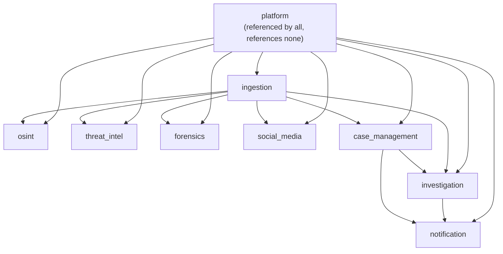
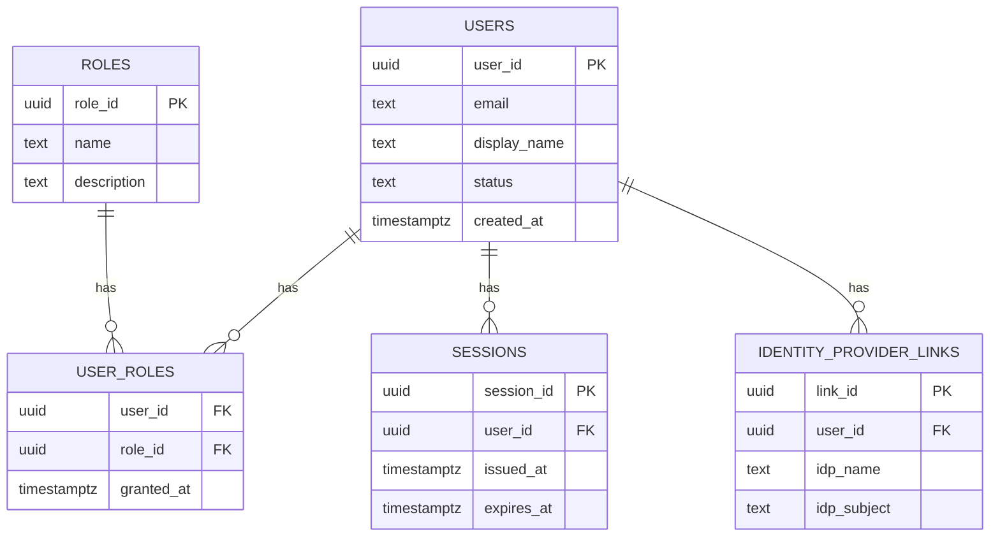
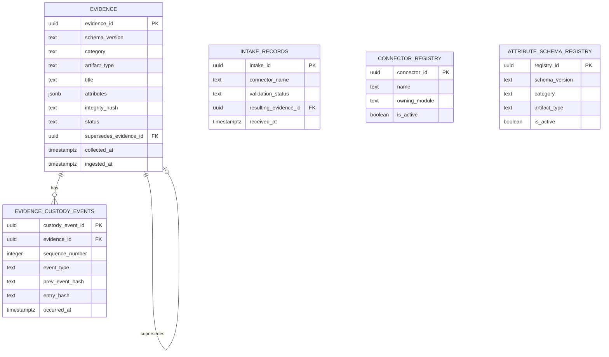
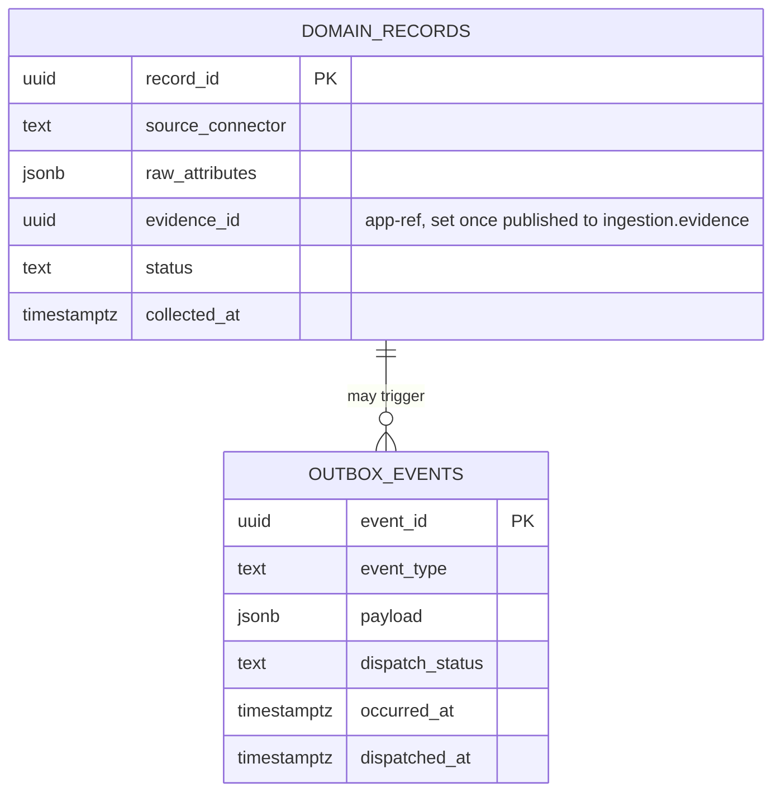
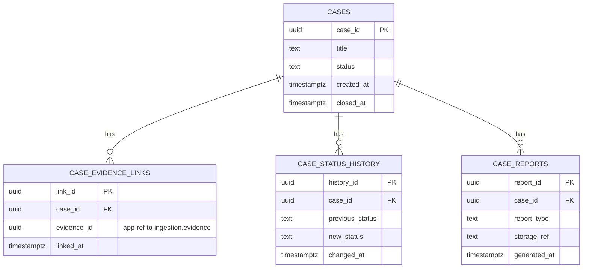
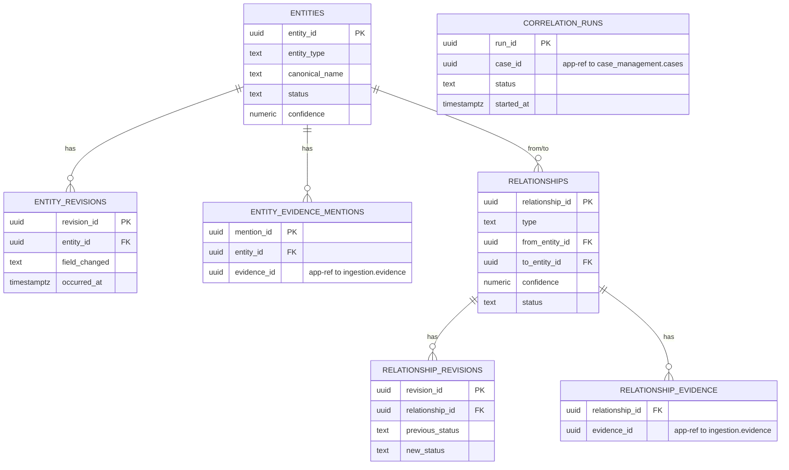

# SentinelAI — Database Design

**Status:** Draft — engineering reference
**Last updated:** 2026-07-19
**Related documents:** [System Design](system-design.md) · [Canonical Evidence Model](canonical-evidence-model.md) · [Architecture](architecture.md) · [PRD](prd.md)

This document is the complete PostgreSQL data model for Phase 1: table-by-table ownership, keys, indexing, partitioning, soft-delete, versioning, audit, migration, backup, and performance design. It implements the [Canonical Evidence Model](canonical-evidence-model.md) relationally and follows [System Design](system-design.md)'s module boundaries down to the schema level. No SQL — this is a data dictionary and set of design rules, not DDL.

## 1. Database Philosophy

- **One PostgreSQL instance in Phase 1, one Postgres schema per `apps/server` module.** Not a naming convention — a real `CREATE SCHEMA` per module, so ownership is enforceable via database permissions, not just team discipline.
- **No cross-schema foreign key constraints, ever.** A column that conceptually references another module's row (e.g. `case_management.case_evidence_links.evidence_id` pointing at `ingestion.evidence`) is a plain UUID column with **no database-enforced FK**. Referential integrity across module boundaries is enforced at the application layer, by the owning module's public interface, at write time. This is the single rule that makes "avoid circular dependencies" true by construction — with zero cross-schema FK constraints, no FK cycle can exist — and what makes Phase 5 extraction (Section 11) a data-migration exercise instead of a constraint-untangling one.
- **Dual storage for evidence-producing modules.** `osint`, `threat_intel`, `forensics`, and `social_media` each persist their own rich, connector/domain-specific record, and separately publish a normalized projection into `ingestion.evidence` — the CEM's core object. `investigation` and `case_management` query only the canonical table, never a domain module's rich table directly. This mirrors the CEM's Extract→Map→Enrich→Validate→Commit pipeline (`canonical-evidence-model.md` §9) at the storage level.
- **Immutability and append-only ledgers where the domain requires it.** `evidence`, `evidence_custody_events`, `audit_log`, `entity_revisions`, `relationship_revisions`, and `case_status_history` are insert-only — nothing is ever UPDATEd or DELETEd from these tables. Corrections are new rows (Sections 8–10).
- **UUIDv4 primary keys everywhere**, never auto-increment integers — chosen specifically so identifiers stay globally unique and collision-free the moment a module's tables move to a physically separate database (Phase 5).
- **All timestamps are `timestamptz`, written and read in UTC.**
- **Naming:** schemas and tables `snake_case`, plural table names, singular column names, every primary key literally named `<entity>_id`.
- **Every table has exactly one owning module** — Section 2 is the enforced map from schema to `apps/server/modules/*`.

## 2. Module-Wise Schema Ownership

| Schema | Owning module | Purpose |
|---|---|---|
| `platform` | `apps/server/platform` | Identity, sessions, roles, system-wide audit log |
| `ingestion` | `ingestion` | Canonical evidence (CEM), custody ledger, connector/schema registries |
| `osint` | `osint` | Raw OSINT findings, source configuration |
| `threat_intel` | `threat-intel` | IOCs, threat actor profiles, feed subscriptions |
| `forensics` | `forensics` | Forensic artifacts (rich/raw) |
| `social_media` | `social-media` | Captured social content (rich/raw) |
| `case_management` | `case-management` | Cases, evidence links, status history, reports |
| `investigation` | `investigation` | Entities, relationships, correlation runs |
| `notification` | `notification` | Notification rules, dispatch records |

Two schemas carry a sanctioned, narrow exception to "no cross-schema access," both purely infrastructural, never business data:
- **`platform.audit_log`** is written to by every module via a shared platform logging interface call (not direct table access) — the one centralized, system-wide audit surface (Section 10).
- **The event dispatcher** (part of `platform`, per `system-design.md` §6) polls every module's own `outbox_events` table to relay events — it reads generic outbox rows across schemas, never a module's business tables.

## 3. Tables

### 3.1 `platform`

| Table | Column | Type | Null? | Notes |
|---|---|---|---|---|
| `users` | `user_id` | uuid | PK | |
| | `external_idp_subject` | text | yes | SSO/OIDC subject identifier |
| | `email` | text | no | |
| | `display_name` | text | no | |
| | `status` | text | no | `active` \| `disabled` |
| | `created_at`, `updated_at` | timestamptz | no | |
| `roles` | `role_id` | uuid | PK | |
| | `name`, `description` | text | no | |
| `user_roles` | `user_id` | uuid | FK → `users` | composite PK with `role_id` |
| | `role_id` | uuid | FK → `roles` | |
| | `granted_at` | timestamptz | no | |
| `sessions` | `session_id` | uuid | PK | |
| | `user_id` | uuid | FK → `users` | |
| | `issued_at`, `expires_at`, `revoked_at` | timestamptz | mixed | `revoked_at` nullable |
| `identity_provider_links` | `link_id` | uuid | PK | |
| | `user_id` | uuid | FK → `users` | |
| | `idp_name`, `idp_subject` | text | no | |
| `audit_log` | `audit_id` | uuid | PK | |
| | `occurred_at` | timestamptz | no | |
| | `actor_user_id` | uuid | app-ref, nullable | null for system-initiated actions |
| | `actor_role`, `action`, `module` | text | no | e.g. `login`, `case_status_changed` |
| | `target_type`, `target_id` | text, uuid | yes | generic/polymorphic, unenforced |
| | `ip_address`, `user_agent` | text | yes | |
| | `details` | jsonb | yes | |
| | `prev_entry_hash`, `entry_hash` | text | no | hash chain (Section 10) |

### 3.2 `ingestion`

> **Derived-state rule (ADR-0015).** `ingestion.evidence` is append-only (ADR-0004), so
> `status`, `legal_hold`, and `integrity_verification_status` store their **INSERT-time
> (genesis) values only** and are never UPDATEd. Current state is derived at read time:
> `status` is `superseded` iff a row exists with `supersedes_evidence_id` pointing at the
> item; `legal_hold` is the latest `legal_hold_applied`/`legal_hold_released` custody event;
> `integrity_verification_status` is `verified`/`failed` by comparing the latest
> `integrity_reverified` custody event's `integrity_hash_at_event` against `integrity_hash`.
> Direct-SQL consumers must apply the same derivation.

| Table | Column | Type | Null? | Notes |
|---|---|---|---|---|
| `evidence` | `evidence_id` | uuid | PK | |
| | `schema_version` | text | no | CEM schema version |
| | `category`, `artifact_type` | text | no | CEM §5–6 |
| | `title`, `description` | text | mixed | |
| | `source` | jsonb | no | system, connector_version, collector_id, method |
| | `collected_at`, `ingested_at` | timestamptz | no | |
| | `integrity_algorithm`, `integrity_hash`, `integrity_verification_status` | text | conditional | required if `payload_ref` set |
| | `payload_ref` | text | yes | object storage URI |
| | `inline_payload` | jsonb | yes | |
| | `attributes` | jsonb | no | category/artifact-type-specific (CEM §6) |
| | `mime_type`, `size_bytes`, `encoding`, `original_filename` | text/bigint | yes | flattened `technical` (CEM §2) |
| | `confidence` | numeric | no | 0.0–1.0 |
| | `reliability_rating` | text | yes | Admiralty code |
| | `sensitivity`, `legal_authority_ref`, `access_restriction_tags` | text/text/jsonb | mixed | flattened `classification` |
| | `geo` | jsonb | yes | |
| | `language`, `tags` | text[] | yes | |
| | `status` | text | no | `pending_validation`\|`validated`\|`quarantined`\|`superseded`\|`tombstoned` |
| | `supersedes_evidence_id` | uuid | FK → `evidence` (self) | intra-schema, nullable |
| | `collector_user_id` | uuid | app-ref, nullable | → `platform.users` |
| | `retention_policy_ref`, `legal_hold` | text/boolean | no | |
| `evidence_custody_events` | `custody_event_id` | uuid | PK | |
| | `evidence_id` | uuid | FK → `evidence` | intra-schema |
| | `sequence_number` | integer | no | |
| | `event_type` | text | no | CEM §4 enum |
| | `occurred_at` | timestamptz | no | |
| | `actor_user_id` | uuid | app-ref, nullable | → `platform.users` |
| | `actor_role`, `authority_ref`, `notes` | text | yes | |
| | `integrity_hash_at_event`, `prev_event_hash`, `entry_hash` | text | no | hash chain |
| `intake_records` | `intake_id` | uuid | PK | pre-normalization staging / dead-letter |
| | `connector_name` | text | no | |
| | `raw_payload_ref` | text | no | |
| | `validation_status`, `validation_errors` | text/jsonb | yes | |
| | `received_at` | timestamptz | no | |
| | `resulting_evidence_id` | uuid | FK → `evidence`, nullable | set once successfully mapped |
| `connector_registry` | `connector_id` | uuid | PK | |
| | `name`, `owning_module`, `mapping_profile_version` | text | no | |
| | `is_active` | boolean | no | |
| `attribute_schema_registry` | `registry_id` | uuid | PK | |
| | `schema_version`, `category`, `artifact_type` | text | no | unique composite |
| | `required_attributes`, `optional_attributes` | jsonb | no | |
| | `is_active` | boolean | no | |

### 3.3 `osint`, `threat_intel`, `forensics`, `social_media` — the domain-producer pattern

These four schemas share a common shape (Section 14 diagrams this generically): one **rich record table**, plus supporting configuration tables, plus their own `outbox_events`.

| Schema | Rich record table | Key columns beyond the common pattern |
|---|---|---|
| `osint` | `osint_findings` | `source_id` (FK → `osint_sources`), `raw_attributes` (jsonb), `reliability_rating` |
| `threat_intel` | `iocs` | `indicator_type`, `value`, `threat_actor_id` (FK → `threat_actor_profiles`), `first_seen`, `last_seen` |
| `forensics` | `artifacts` | `artifact_kind`, `device_info` (jsonb), `acquisition_tool`, `acquisition_hash` |
| `social_media` | `captured_content` | `platform`, `account_handle`, `content_kind`, `raw_attributes` (jsonb) |

Common columns on every rich record table: `<record>_id` (PK), `evidence_id` (app-ref to `ingestion.evidence`, **nullable until the record is published** — a finding can exist pre-normalization), `status`, `collected_at`.

Additional module-specific tables:
- `osint.osint_sources` (`source_id` PK, `name`, `connector_type`, `reliability_baseline`, `is_active`), `osint.osint_connector_state` (`state_id` PK, `source_id` FK, `cursor` jsonb, `last_polled_at`)
- `threat_intel.threat_actor_profiles` (`threat_actor_id` PK, `name`, `aliases` text[], `description`), `threat_intel.feed_subscriptions` (`subscription_id` PK, `feed_name`, `protocol`, `is_active`, `last_synced_at`), `threat_intel.ioc_evidence_matches` (`match_id` PK, `ioc_id` FK → `iocs`, `matched_evidence_id` app-ref, `matched_at`, `confidence`)
- `social_media.social_accounts_observed` (`account_id` PK, `platform`, `handle`, `first_observed_at`, `last_observed_at`)

### 3.4 `case_management`

| Table | Column | Type | Null? | Notes |
|---|---|---|---|---|
| `cases` | `case_id` | uuid | PK | |
| | `title`, `description` | text | mixed | |
| | `status` | text | no | lifecycle enum |
| | `owning_user_id` | uuid | app-ref | → `platform.users` |
| | `created_at`, `closed_at` | timestamptz | mixed | |
| `case_evidence_links` | `link_id` | uuid | PK | |
| | `case_id` | uuid | FK → `cases` | intra-schema |
| | `evidence_id` | uuid | app-ref | → `ingestion.evidence`, unenforced |
| | `linked_by_user_id`, `linked_at` | uuid/timestamptz | no | |
| `case_status_history` | `history_id` | uuid | PK | append-only |
| | `case_id` | uuid | FK → `cases` | |
| | `previous_status`, `new_status` | text | no | |
| | `actor_user_id` | uuid | app-ref | |
| | `changed_at`, `notes` | timestamptz/text | mixed | see Section 5 note on `investigation` |
| `case_reports` | `report_id` | uuid | PK | |
| | `case_id` | uuid | FK → `cases` | |
| | `report_type` | text | no | |
| | `status` | text | no | `queued`\|`running`\|`completed`\|`failed` (api-design.md §7) |
| | `storage_ref` | text | **yes** | NULL until the job completes — a queued report has no object |
| | `generated_by_user_id`, `requested_at` | uuid/timestamptz | no | who asked, and when |
| | `generated_at` | timestamptz | **yes** | NULL until the job completes |
| | `failure_reason` | text | yes | set with `status='failed'` so a poller learns why |

> **`case_reports` is a job-state row.** `POST /cases/{case_id}/reports` inserts it immediately in
> `queued` state so the client has something to poll at `GET /reports/{report_id}`; the background
> job fills `storage_ref`/`generated_at` and flips `status` on completion. That is why the two
> completion columns are nullable — a report that has not run yet cannot have them.

### 3.5 `investigation`

| Table | Column | Type | Null? | Notes |
|---|---|---|---|---|
| `entities` | `entity_id` | uuid | PK | |
| | `entity_type`, `canonical_name` | text | no | CEM §7 |
| | `aliases` | text[] | yes | |
| | `status` | text | no | `proposed`\|`confirmed`\|`rejected` |
| | `confidence` | numeric | no | |
| | `created_by_type`, `created_by_ref` | text/uuid | no | `analyst` or `ai` |
| `entity_revisions` | `revision_id` | uuid | PK | append-only |
| | `entity_id` | uuid | FK → `entities` | |
| | `field_changed`, `previous_value`, `new_value` | text | no | |
| | `changed_by_ref`, `occurred_at` | uuid/timestamptz | no | |
| `relationships` | `relationship_id` | uuid | PK | |
| | `type` | text | no | CEM §8 |
| | `from_entity_id`, `to_entity_id` | uuid | FK → `entities` | intra-schema, both directions |
| | `directional` | boolean | no | |
| | `confidence` | numeric | no | |
| | `valid_from`, `valid_to` | timestamptz | yes | |
| | `status` | text | no | `proposed`\|`confirmed`\|`rejected` |
| | `created_by_type`, `created_by_ref` | text/uuid | no | |
| `relationship_revisions` | `revision_id` | uuid | PK | append-only |
| | `relationship_id` | uuid | FK → `relationships` | |
| | `previous_status`, `new_status` | text | no | |
| `relationship_evidence` | `relationship_id` | uuid | FK → `relationships` | composite PK with `evidence_id` |
| | `evidence_id` | uuid | app-ref | → `ingestion.evidence`; every relationship must have ≥1 row here (CEM §13) |
| `entity_evidence_mentions` | `mention_id` | uuid | PK | |
| | `entity_id` | uuid | FK → `entities` | |
| | `evidence_id` | uuid | app-ref | → `ingestion.evidence` |
| `correlation_runs` | `run_id` | uuid | PK | AI job execution record |
| | `case_id` | uuid | app-ref | → `case_management.cases` |
| | `status`, `started_at`, `completed_at`, `findings_generated_count` | mixed | no | |

### 3.6 `notification`

| Table | Column | Type | Null? | Notes |
|---|---|---|---|---|
| `notification_rules` | `rule_id` | uuid | PK | |
| | `name`, `trigger_event_type`, `channel` | text | no | |
| | `target_role_or_user` | uuid | app-ref | |
| | `is_active` | boolean | no | |
| `notifications` | `notification_id` | uuid | PK | |
| | `rule_id` | uuid | FK → `notification_rules`, nullable | |
| | `recipient_user_id` | uuid | app-ref | → `platform.users` |
| | `source_module`, `source_reference_id` | text/uuid | yes | **generic/polymorphic** — see Section 5 |
| | `message`, `created_at`, `read_at` | mixed | mixed | |
| `notification_deliveries` | `delivery_id` | uuid | PK | |
| | `notification_id` | uuid | FK → `notifications` | |
| | `channel`, `delivery_status`, `attempted_at`, `delivered_at` | mixed | mixed | |

Every schema in Sections 3.3–3.6 also owns its own `outbox_events` table (`event_id` PK, `event_type`, `payload` jsonb, `dispatch_status`, `occurred_at`, `dispatched_at`) — deliberately duplicated per schema rather than centralized (Section 2). This is a compact summary; `docs/event-driven-architecture.md` §9 is the authoritative full envelope (adds `event_version`, `aggregate_type`, `aggregate_id`, `correlation_id`, `causation_id`, `trace_id`, `actor_type`/`actor_ref`, `attempt_count`, `last_error`) and §17 defines the companion `inbox_events` table every consuming module also owns.

## 4. Primary Keys

Every table's primary key is a single `uuid` column named `<entity>_id`, generated at the application layer (not database-generated sequential IDs), with two exceptions that use composite primary keys because the row *is* the relationship: `platform.user_roles` (`user_id`, `role_id`) and `investigation.relationship_evidence` (`relationship_id`, `evidence_id`). No table in this model uses a natural key (email, connector name, etc.) as its primary key — naturals keys are enforced as unique constraints instead, so identity remains stable even if a natural attribute changes.

## 5. Foreign Keys

Two categories, deliberately distinguished throughout Section 3:

- **Intra-schema FK (real, database-enforced):** used only between tables owned by the same module — e.g. `evidence_custody_events.evidence_id → evidence.evidence_id`, `relationships.from_entity_id → entities.entity_id`. These get normal cascade/restrict behavior chosen per table (e.g. custody events `RESTRICT` on delete — but recall evidence is never hard-deleted, Section 8).
- **Inter-schema reference (app-enforced, no DB constraint):** a plain UUID column, validated by calling the owning module's public interface at write time, never by a database FK. Every "app-ref" row in Section 3's tables is this category.

**Dependency graph.** Tracing every inter-schema reference produces a strict DAG — no module's tables reference a module that (transitively) references it back:

(Arrows point from the schema being referenced to the schema referencing it — i.e. "ingestion → osint" reads as "osint holds a reference into ingestion.")

**The one deliberate design call-out that keeps this acyclic:** `investigation` consumes events published by `case_management` (`evidence.linked_to_case`) *and* `case_management` consumes events published by `investigation` (a reviewed-finding notification, per `system-design.md` §7's sequence diagram) — so **event flow** between these two modules is bidirectional. **Data reference direction is not.** `investigation.correlation_runs.case_id` references `case_management.cases`, but `case_management` never stores a pointer into `investigation`'s tables — `case_status_history` records the *fact* that a finding was reviewed (as a status-history row with plain text/enum values) in its own vocabulary, not as a foreign UUID into `investigation.relationships`. Event flow direction and data-reference direction are allowed to differ; keeping reference direction acyclic is what actually matters for extraction.

`notification.notifications.source_reference_id` is intentionally untyped/polymorphic (paired with `source_module`) rather than a set of nullable typed FK-like columns per possible source — this keeps `notification` a generic, low-coupling terminal consumer that doesn't need to change shape every time an upstream module's schema changes.

## 6. Indexing Strategy

General rules, applied across every schema:

- Every inter-schema reference column (Section 5) gets a plain B-tree index — it's always used in a lookup, never enforced by a constraint, so the index is the only thing keeping those lookups fast.
- Every `status` column used in filtering gets an index; where one status value dominates queries (e.g. `evidence.status = 'validated'` is the overwhelming majority read path), a **partial index** on the non-default values (`quarantined`, `superseded`, `tombstoned`) is cheaper and more useful than indexing the whole column.
- `evidence(category, artifact_type)` — composite index; investigators and the AI layer routinely filter by both together.
- `evidence(ingested_at)`, `evidence_custody_events(occurred_at)`, `audit_log(occurred_at)` — these are large, insert-ordered, append-only tables; a **BRIN index** is preferred over B-tree here (far smaller, and effective precisely because the column is naturally correlated with physical row order).
- `evidence.attributes` (jsonb) — **GIN index** for attribute-based search across category-specific fields.
- `evidence.title`/`description` — GIN with `pg_trgm` (or native `tsvector`) for investigator full-text search.
- `case_evidence_links` — indexed on **both** `case_id` and `evidence_id` independently; queried in both directions ("evidence for this case" and "which cases reference this evidence").
- `entities.aliases` (text[]) — GIN index, for alias lookup during entity resolution (CEM §10).
- `relationships(status)` — indexed; the AI-findings review queue is a `status = 'proposed'` filter run constantly.
- `notifications(recipient_user_id, read_at)` — composite, for "my unread notifications."
- Unique constraints (not just indexes) on: `attribute_schema_registry(schema_version, category, artifact_type)`, `identity_provider_links(idp_name, idp_subject)`.

## 7. Partitioning Strategy

Candidates: `evidence`, `evidence_custody_events`, `audit_log`, `osint_findings`, `intake_records` — large, append-only, naturally time-ordered.

- **Recommended approach:** PostgreSQL native declarative range partitioning by a timestamp column (`ingested_at` / `occurred_at`), monthly once volume justifies it (quarterly is fine initially). Benefits: faster time-bounded investigative queries, cheap retention/archival (dropping an old partition is far cheaper than row-by-row deletes), and better vacuum/maintenance behavior at scale.
- **Not needed on day one.** At Phase 1, single-developer scale, partitioning would be premature operational overhead. What matters now is not creating the partitions — it's not *precluding* them later.
- **Forward-compatibility requirement:** PostgreSQL requires the partition key to be part of every unique constraint on a partitioned table. So even in Phase 1's unpartitioned tables, the partition-key column (`ingested_at`/`occurred_at`) should already be included alongside the primary key in any composite unique constraint that will matter post-partitioning — retrofitting this after the fact on a live evidentiary table is exactly the kind of redesign this whole architecture is trying to avoid.
- **Legal-hold exclusion is mandatory.** Any automatic partition-drop/archive job must check `legal_hold` before dropping a partition — a blanket "drop partitions older than N months" policy is not acceptable when even one row in that partition is under legal hold (PRD retention/legal-hold NFR).

## 8. Soft Delete Strategy

No table holding evidentiary, audit, or identity data is ever hard-deleted. The mechanism varies by table's actual semantics rather than a single generic `is_deleted` flag everywhere:

| Table category | Mechanism | Example |
|---|---|---|
| Evidence | `status = 'tombstoned'` + a `disposed` custody event; physical purge only via an explicit, logged, legally-authorized retention job — never application code, never while `legal_hold = true` | `ingestion.evidence` |
| Cases | Full lifecycle `status` (`open`/`closed`/`archived`), not a boolean flag — more expressive and audit-friendly | `case_management.cases` |
| AI-derived graph objects | `status = 'rejected'` — kept, not removed; a rejected proposal is itself useful (don't re-suggest it) and auditable | `investigation.entities`, `.relationships` |
| Identity | `status = 'disabled'` — never hard-deleted, since historical `actor_id`/`collector_id` references across the whole system must stay resolvable | `platform.users` |
| Reference/config data (non-evidentiary) | Simple `is_active` boolean + `deactivated_at` — no lifecycle richness needed | `osint.osint_sources`, `threat_intel.feed_subscriptions`, `notification.notification_rules` |

**General rule:** hard `DELETE` is reserved for tables that are genuinely ephemeral and carry no evidentiary or audit significance — expired `platform.sessions` rows, stale `osint.osint_connector_state` cursors. Anything referenced, even loosely, as an actor, source, or subject of an audit/custody trail is never hard-deleted.

## 9. Versioning

Three distinct versioning concerns:

1. **Schema/attribute versioning** — `evidence.schema_version` plus `ingestion.attribute_schema_registry`, which defines the valid/required `attributes` keys for each `(schema_version, category, artifact_type)` combination (CEM §12). Connector mapping profiles declare which registry entry they target.
2. **Object-level versioning** — `evidence` versions via supersession (`supersedes_evidence_id`, Section 8); `entities` and `relationships` version via their append-only `*_revisions` tables, so a confidence or status change is a new row, never an overwrite — mirroring the custody-ledger pattern for the same auditability reason.
3. **Migration/DDL versioning** — the schema structure itself (tables, columns, indexes) is versioned via the migration history described in Section 11; this is a distinct concern from (1) and (2) above, which version the *data*, not the *DDL*.

## 10. Audit Tables

Two audit surfaces exist, deliberately, for different audiences — a degree of overlap between them is intentional, not a data-modeling mistake:

- **`ingestion.evidence_custody_events`** — the narrow, evidentiary-grade ledger, hash-chained per `evidence_id` (CEM §4), formatted for legal chain-of-custody export and admissibility. Scoped strictly to evidence handling.
- **`platform.audit_log`** — the broad, system-wide security/administrative trail: logins, role changes, config changes, and a lighter-weight record of case/evidence access alongside everything else. Hash-chained the same way (`prev_entry_hash`/`entry_hash`) so it's independently tamper-evident (PRD SR-4 — not editable even by an administrator), but serves compliance/security review across the *whole* system, not one evidence item.

Both are append-only, both are excluded from any soft-delete mechanism (Section 8) entirely — there is no `status` column on either; a row, once written, exists forever short of an explicit, ADR-recorded retention purge.

`case_management.case_status_history`, `investigation.entity_revisions`, and `investigation.relationship_revisions` are domain-scoped history tables, not audit tables in the compliance sense — they exist to serve their own module's UX ("show this case's status history") and are a narrower, faster query surface than filtering `platform.audit_log` by `target_id` would be.

## 11. Migration Strategy

- **Per-module migration ownership.** Each module maintains its own migration file directory and history, scoped to only its own schema — e.g. `apps/server/modules/case-management/migrations/` — even though Phase 1 runs them all against one physical database. A migration file that creates or alters an object outside its module's schema is a CI failure (a natural extension of the existing `pr-validation.yml` checks), not just a review comment.
- **Applied in dependency order** — the order from Section 5's DAG: `platform` → `ingestion` → {`osint`, `threat_intel`, `forensics`, `social_media`, `case_management`} → `investigation` → `notification`.
- **Forward-only, additive by default.** Most migrations are MINOR in the CEM's versioning sense (Section 9) — new tables, new nullable columns, new indexes — and require no coordination. Breaking changes (dropping/renaming a column another module might reference by convention, changing a type) require an ADR and an explicit **expand/contract** sequence: add the new shape → dual-write → backfill → cut reads over → remove the old shape. A single destructive migration against evidentiary data is never acceptable.
- **Non-blocking by default, even in Phase 1** — cheap to require now, painful to retrofit later: index and constraint additions on large tables (`evidence`, `evidence_custody_events`, `audit_log`) use non-blocking, concurrent-build patterns rather than locking the table for the duration.
- **Migration tooling itself is not yet chosen** — it's decided alongside the `apps/server` language/framework ADR (`docs/architecture.md` Open Questions), since most migration tools are framework-coupled. Whatever is chosen must support per-schema-scoped, ordered, tracked migrations, per the rules above.
- **Extraction-time migration (Phase 5).** When a module is extracted, its migration history moves verbatim to the new service's own repository and database — no rewrite needed, because every migration was already scoped to exactly that module's schema from day one.

## 12. Backup Strategy

- **Continuous WAL archiving + daily base backups**, enabling point-in-time recovery — a Phase 1 requirement, not later hardening (`system-design.md` §11: evidence data loss is not a recoverable failure mode for this product category).
- **Recommended targets** (to be confirmed/formalized against real contractual SLAs once they exist, not asserted as already-contracted): RPO ≤ 5 minutes via continuous WAL shipping, RTO ≤ 1 hour for a Phase 1 single-instance restore.
- **Encrypted at rest** (PRD SR-1), stored in the same S3-compatible object storage already provisioned for evidence artifacts — but in a **separate bucket with separate credentials**, so a compromise of one doesn't automatically compromise the other.
- **Air-gapped deployments keep backups entirely inside the enclave.** No automatic offsite/cloud replication path — an easy detail to miss, and a real compliance failure if backups silently egress a supposedly air-gapped boundary.
- **Legal-hold-aware retention.** Backup rotation/expiry must check for legal holds before deleting the last remaining copy of held data — a naive "delete backups older than 90 days" policy is not sufficient on its own.
- **Restore testing is scheduled, not assumed.** A backup that has never been restored is unverified; periodic automated restore-and-verify drills are part of the strategy, not an afterthought.
- **Per-schema logical exports** (in addition to physical backups) as a supplementary mechanism — being able to export just one module's schema is directly useful preparation for Phase 5 extraction, when that schema needs to become its own physical database.

## 13. Performance Considerations

- **Connection pooling is required from Phase 1**, not deferred — both `entrypoints/http` and `entrypoints/worker` connect to the same instance concurrently; unpooled connections exhaust Postgres's connection limit quickly.
- **Read/write connection separation, wired from day one.** Reporting/analytics-style queries (case report generation, dashboards) route through a distinctly-named "read" role/pool even though it points at the same primary in Phase 1 — a zero-cost decision now that lets a real read replica (`system-design.md` §10, Phase 4) be introduced later as pure infrastructure, no application code change.
- **JSONB is the escape hatch, not the default.** `evidence.attributes` stays flexible JSONB for the long tail of category-specific fields, but any field that actual query patterns prove is a common filter/sort target gets promoted to a real typed, indexed column — decided by evidence, not speculatively.
- **No cross-schema joins, including for performance reasons, not just boundary purity.** When `investigation` occasionally needs both the canonical evidence row and a domain module's rich record, it batch-fetches through that module's interface rather than attempting a join that isn't possible anyway (different schemas, no FK).
- **Hash-chain writes are isolated per chain.** `evidence_custody_events`' hash chain is scoped per `evidence_id`; `audit_log`'s hash chain is a separate, global sequence. Neither should serialize against the other, and neither should sit on the same lock/contention path as high-volume evidence ingestion writes — the chain only needs to serialize against itself.
- **Autovacuum tuning matters even for insert-only tables** — visibility-map maintenance and index-only-scan efficiency still benefit from tuned autovacuum settings on high-insert-volume append-only tables, not just update-heavy ones.
- **No live cross-schema aggregation queries for dashboards.** A fast "cases with recent AI activity" dashboard needs data from `case_management` and `investigation` together — since a live join across those schemas isn't available, the correct mechanism is a materialized, periodically-refreshed aggregate built by an application-level job that reads through each module's public interface and writes the result into its own dedicated reporting store. This is a **Phase 4+ concern** (per PRD enterprise hardening), flagged here as a design constraint, not specified further now.

## 14. ER Diagrams

**`platform` schema:**

**`ingestion` schema:**

**Domain-producer pattern** — the shape shared by `osint`, `threat_intel`, `forensics`, and `social_media` (materializing as `osint_findings`, `iocs`, `artifacts`, and `captured_content` respectively):

**`case_management` schema:**

**`investigation` schema:**

---

*Keep this document synchronized with [Canonical Evidence Model](canonical-evidence-model.md) (any CEM field change should be reflected in Section 3) and with the actual migration files once `apps/server` implementation begins — this document is the design those migrations must conform to, not documentation written after the fact.*
