# SentinelAI — Deployment Architecture

**Status:** Authoritative Deployment Reference
**Last updated:** 2026-07-19
**Related documents:** [System Design](system-design.md) · [Database Design](database-design.md) · [Event-Driven Architecture](event-driven-architecture.md) · [Security Architecture](security-architecture.md) · [Backend Implementation Guide](backend-implementation-guide.md)

This document is the authoritative reference for how SentinelAI is built, packaged, deployed, scaled, secured at the infrastructure layer, and recovered from failure. `system-design.md` §13 introduced deployment topology at a high level; this document is where that topology becomes implementation-grade — real Kubernetes manifests, real Dockerfile stages, real operational procedures. It does not duplicate `backend-implementation-guide.md` (application code) or `security-architecture.md` (security architecture) — it references both and shows how their requirements are satisfied at the infrastructure layer.

**Stack decisions made here, definitively**, extending the pattern `backend-implementation-guide.md` established: **Kubernetes** (target orchestration, Part 4), **cert-manager** + **NGINX Ingress Controller** (Part 6), **CloudNativePG** (Postgres operator, Part 8), **HashiCorp Vault** + **External Secrets Operator** (Part 11), **Harbor** (container registry, Part 5), **cosign/Sigstore** (image signing, Part 5), **ArgoCD** (GitOps deployment, Part 18), **Prometheus + Grafana + Loki + Tempo + Alertmanager** (Part 20), **arq** workers on Kubernetes `Deployment`/`Job` resources (Part 10, matching `backend-implementation-guide.md` Part 12). Each should be recorded as an ADR per `CLAUDE.md`'s convention; this document is the technical content those ADRs point to.

### Contents

| Part | Topic | Part | Topic |
|---|---|---|---|
| 1 | Deployment Philosophy | 13 | High Availability |
| 2 | Environment Strategy | 14 | Disaster Recovery |
| 3 | Infrastructure Architecture | 15 | Scaling Strategy |
| 4 | Kubernetes Architecture | 16 | Performance |
| 5 | Container Architecture | 17 | Security Hardening |
| 6 | Networking | 18 | Deployment Workflow |
| 7 | Storage Architecture | 19 | Release Strategy |
| 8 | Database Deployment | 20 | Monitoring Deployment |
| 9 | Message Bus Deployment | 21 | Air-Gapped Deployment |
| 10 | AI Worker Deployment | 22 | Multi-State Deployment Model |
| 11 | Secrets Management | 23 | Hardware Sizing |
| 12 | Configuration Management | 24 | Implementation Checklist |

---

# Part 1 — Deployment Philosophy

- **Phase 1's deployment target and Phase 5's are the same architecture at different scale, not two designs.** `system-design.md` §13's single-host `docker-compose` and this document's Kubernetes target both run the same container images, the same module boundaries, the same schema-per-module database — deployment topology is additive, never a rewrite.
- **Every environment runs the same artifacts.** The container image promoted to production is byte-identical to the one tested in staging — configuration varies (Part 12), the image never does.
- **Deployment must work with zero external connectivity.** Air-gapped isn't a special case bolted on later — every tool chosen in this document (Harbor, Vault, CloudNativePG, Prometheus stack) is self-hostable, and Part 21 is not an afterthought section but a first-class deployment profile.
- **Infrastructure is declarative and version-controlled.** Every Kubernetes manifest, Terraform module, and Helm value file lives in the repository, reviewed the same way application code is (`CONTRIBUTING.md`) — no manual `kubectl apply` against production that isn't first a merged, reviewed change.
- **Recoverability is designed in, not bolted on.** Part 13's HA and Part 14's DR are load-bearing requirements from the first production deployment, matching `database-design.md` §12's "not later hardening" stance.
- **A deployment change is reversible by default.** Rolling updates, database migrations (`backend-implementation-guide.md` Part 4), and releases (Part 19) are all designed with a rollback path considered *before* the forward path ships, not improvised during an incident.

# Part 2 — Environment Strategy

| Environment | Purpose | Data | Topology |
|---|---|---|---|
| **Development** | Individual developer iteration | Synthetic/seeded, never real evidence | `docker-compose` (`system-design.md` §13), or a local `kind`/`k3d` cluster for K8s-manifest work |
| **Testing (CI)** | Automated unit/integration/contract tests (`backend-implementation-guide.md` Part 13) | Ephemeral, created and destroyed per CI run | Containers spun up in the CI runner, no persistent infra |
| **QA** | Manual/exploratory testing, pre-release validation | Synthetic, refreshed regularly | A dedicated, persistent low-tier Kubernetes namespace or cluster |
| **Staging** | Production-topology rehearsal — the last environment before production | Synthetic or sanitized/de-identified, never real evidence | Full production topology at reduced scale (Part 23's Small/Medium tier) |
| **Production** | Live customer deployment | Real evidence, full compliance/audit scope | Full topology per the customer's deployment profile (Part 22) |
| **Air-gapped** | A production variant with zero external network egress | Real evidence | Identical to Production topology, sourced entirely from Part 21's offline mirrors |

Promotion flows strictly left to right (Development → Testing → QA → Staging → Production) — no environment is skipped for a change bound for production, and air-gapped is a deployment *profile* of Production, not a separate pipeline stage.

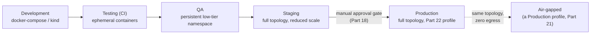

Each promotion re-runs the full CI/CD sequence (Part 18) against the target environment — nothing is promoted by copying artifacts by hand, and nothing skips the automated test/scan gates that were already satisfied one environment earlier.

# Part 3 — Infrastructure Architecture

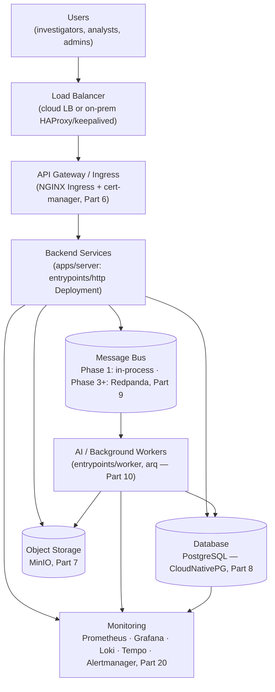

This is `system-design.md` §13's deployment diagram at full resolution — every box above is a real Kubernetes resource by Part 4, a real container image by Part 5, and a real network path by Part 6.

**How to read the chain against a real request:** an investigator's browser call to `POST /api/v1/evidence` traverses every box left to right — Load Balancer (TLS termination, Part 6) → Ingress (routing, rate limiting) → `entrypoints/http` pod (`backend-implementation-guide.md` Part 2) → Postgres (the write, Part 8) and MinIO (the presigned upload target, `security-architecture.md` §24) → an outbox row on the Message Bus path (Part 9) → an AI/background worker picks it up asynchronously (Part 10) → every hop emits metrics/logs/traces to Monitoring (Part 20) along the way, not just at the edges. No box in this diagram is optional in a production deployment — a topology missing any of them is not a smaller version of this architecture, it's an incomplete one.

# Part 4 — Kubernetes Architecture

## Namespaces

| Namespace | Contents |
|---|---|
| `sentinelai-app` | `apps/server` Deployments (Part 8's DB and Part 7's storage clients connect out from here) |
| `sentinelai-data` | CloudNativePG `Cluster`, MinIO tenant — the data zone (`security-architecture.md` §3) |
| `sentinelai-observability` | Prometheus, Grafana, Loki, Tempo, Alertmanager (Part 20) |
| `ingress-nginx` | Ingress controller |
| `cert-manager` | Certificate lifecycle (Part 6) |
| `vault` | Secrets management (Part 11) |
| `external-secrets` | External Secrets Operator |
| `harbor` | Container registry (Part 5) |
| `argocd` | GitOps deployment controller (Part 18) |

Each namespace has a default-deny `NetworkPolicy` (Part 6) — cross-namespace traffic is allow-listed explicitly, never implicit.

```yaml
# k8s/base/namespace-sentinelai-app.yaml
apiVersion: v1
kind: Namespace
metadata:
  name: sentinelai-app
  labels:
    name: sentinelai-app
    pod-security.kubernetes.io/enforce: restricted   # Part 17
    pod-security.kubernetes.io/audit: restricted
```

Every namespace's manifest carries the same three Pod Security Admission labels — enforcement is uniform across the cluster, not opt-in per namespace.

## Workload Types

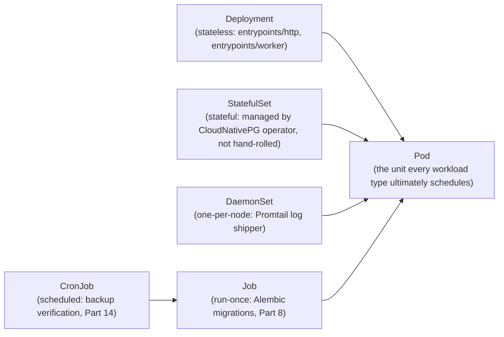

`entrypoints/http` and `entrypoints/worker` (`system-design.md` §2) are each a `Deployment` in Phase 1's Kubernetes target — two Deployments, one image, different `command`, matching `docker-compose.yml`'s already-established pattern exactly. Post-extraction (Phase 5), each extracted module becomes its own additional `Deployment`.

```yaml
# k8s/base/entrypoints-http-deployment.yaml
apiVersion: apps/v1
kind: Deployment
metadata:
  name: sentinelai-http
  namespace: sentinelai-app
spec:
  replicas: 3
  selector:
    matchLabels: { app: sentinelai-http }
  template:
    metadata:
      labels: { app: sentinelai-http }
    spec:
      containers:
        - name: http
          image: harbor.internal/sentinelai/server:1.4.2
          command: ["python", "-m", "sentinelai.entrypoints.http"]
          ports: [{ containerPort: 8080 }]
          envFrom:
            - configMapRef: { name: sentinelai-config }
            - secretRef: { name: sentinelai-secrets }
          resources:
            requests: { cpu: "500m", memory: "512Mi" }
            limits: { cpu: "2", memory: "1Gi" }
          readinessProbe:
            httpGet: { path: /readyz, port: 8080 }
            periodSeconds: 5
          livenessProbe:
            httpGet: { path: /healthz, port: 8080 }
            periodSeconds: 10
          securityContext:
            runAsNonRoot: true
            readOnlyRootFilesystem: true
            allowPrivilegeEscalation: false
```

## Jobs, CronJobs, Ingress, NetworkPolicies, PVCs, StorageClasses, ConfigMaps, Secrets

Shown in full where each is most relevant: Alembic `Job` (Part 8), backup-verification `CronJob` (Part 14), `Ingress` and `NetworkPolicy` (Part 6), `PersistentVolumeClaim`/`StorageClass` (Part 7), `ConfigMap`/`Secret` (Part 12).

# Part 5 — Container Architecture

## Multi-Stage Dockerfile

```dockerfile
# apps/server/Dockerfile
FROM python:3.12-slim AS builder
WORKDIR /build
COPY pyproject.toml poetry.lock ./
RUN pip install --no-cache-dir poetry && \
    poetry export -f requirements.txt --without-hashes -o requirements.txt
COPY src/ src/
RUN pip install --no-cache-dir --target=/deps -r requirements.txt

FROM gcr.io/distroless/python3-debian12:nonroot AS runtime
WORKDIR /app
COPY --from=builder /deps /app/deps
COPY --from=builder /build/src /app/src
ENV PYTHONPATH=/app/deps:/app/src
USER nonroot
ENTRYPOINT ["python", "-m"]
CMD ["sentinelai.entrypoints.http"]
```

Distroless final stage, non-root user, no shell/package manager in the shipped image — implements `security-architecture.md` §44's container-security requirements directly, not as an afterthought.

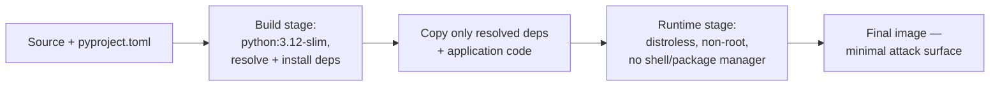

## Image Tagging, Signing, SBOM

Tags are immutable semantic versions plus the Git SHA (`1.4.2-a1b2c3d`) — `latest` is never deployed. Every image is signed with cosign and carries an SBOM (Syft-generated, `security-architecture.md` §42) attached as an OCI artifact in Harbor:

```bash
syft packages harbor.internal/sentinelai/server:1.4.2 -o spdx-json > sbom.spdx.json
cosign sign --key cosign.key harbor.internal/sentinelai/server:1.4.2
cosign attach sbom --sbom sbom.spdx.json harbor.internal/sentinelai/server:1.4.2
```

Kubernetes admission control (`kyverno` or `cosign`'s policy-controller) rejects any image whose signature doesn't verify — `security-architecture.md` §45's "only run signed, verified images" is enforced at admission, not by deploy-time discipline alone.

## Base Image Policy

Only distroless or minimal-slim base images are approved for production; base images are rebuilt weekly regardless of application code changes to pick up upstream security patches (`security-architecture.md` §44), and every rebuild re-triggers Part 5's signing and scanning pipeline.

| Image | Base | Rationale |
|---|---|---|
| `sentinelai/server` (`entrypoints/http`, `entrypoints/worker`) | `gcr.io/distroless/python3-debian12:nonroot` | No shell, no package manager — minimal post-compromise capability |
| `sentinelai/worker-gpu` | NVIDIA CUDA runtime base, slimmed | GPU driver compatibility requires a less minimal base than distroless allows |
| `sentinelai/ops-tools` (migration/backup jobs) | `python:3.12-slim` | Needs a shell for operational scripting; never used for the request-serving path |

An approved-base-image allowlist, enforced by the same Kyverno/cosign admission policy that checks signatures (above), rejects any image built from an image not in this table.

# Part 6 — Networking

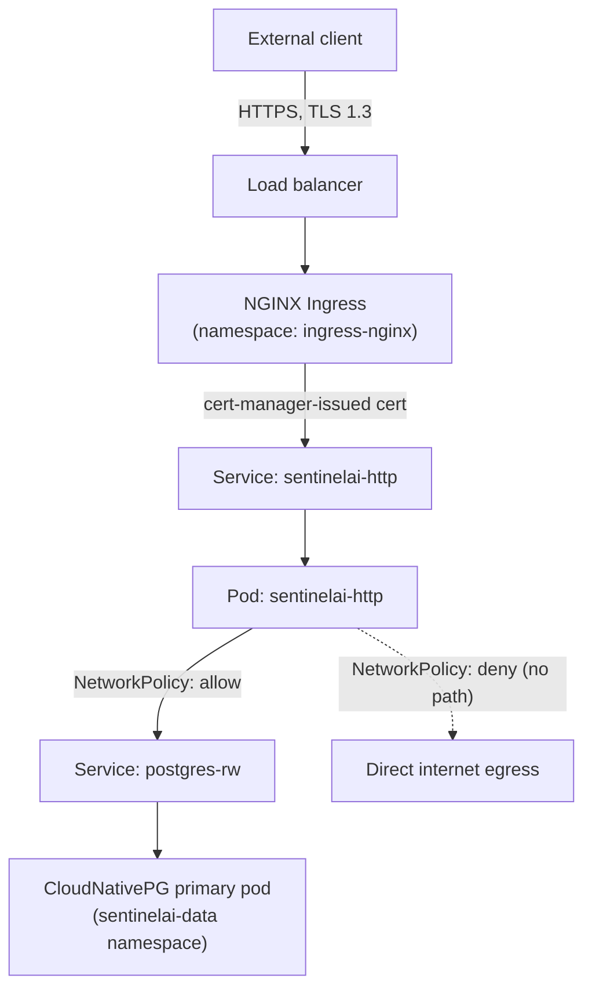

## Ingress & Internal Networking

```yaml
# k8s/base/ingress.yaml
apiVersion: networking.k8s.io/v1
kind: Ingress
metadata:
  name: sentinelai-api
  namespace: sentinelai-app
  annotations:
    cert-manager.io/cluster-issuer: internal-ca-issuer  # security-architecture.md §17
    nginx.ingress.kubernetes.io/rate-limit: "100"
spec:
  tls:
    - hosts: [api.sentinelai.internal]
      secretName: sentinelai-api-tls
  rules:
    - host: api.sentinelai.internal
      http:
        paths:
          - path: /
            pathType: Prefix
            backend: { service: { name: sentinelai-http, port: { number: 8080 } } }
```

```yaml
# k8s/base/networkpolicy-default-deny.yaml
apiVersion: networking.k8s.io/v1
kind: NetworkPolicy
metadata:
  name: default-deny-all
  namespace: sentinelai-data
spec:
  podSelector: {}
  policyTypes: [Ingress, Egress]
---
apiVersion: networking.k8s.io/v1
kind: NetworkPolicy
metadata:
  name: allow-app-to-postgres
  namespace: sentinelai-data
spec:
  podSelector: { matchLabels: { app: postgres } }
  ingress:
    - from: [{ namespaceSelector: { matchLabels: { name: sentinelai-app } } }]
      ports: [{ port: 5432 }]
```

The data namespace's default-deny plus a narrow allow rule is `security-architecture.md` §3's "no direct route" network zone rule, expressed as an enforced Kubernetes object rather than a documented intention.

## TLS & Certificates

`cert-manager` issues every certificate: a public `ClusterIssuer` (ACME/Let's Encrypt or enterprise CA) for internet-facing endpoints in cloud/dedicated-cloud profiles; an **internal `ClusterIssuer` backed by a private CA** for every internal/service certificate and for the entire certificate chain in air-gapped deployments (`security-architecture.md` §17) — automatic rotation well before expiry in both cases.

## DNS, Reverse Proxy, Service Mesh (Future)

Internal DNS resolves via Kubernetes' built-in CoreDNS; external DNS (cloud/dedicated-cloud only) points at the load balancer, and air-gapped deployments run their own internal authoritative DNS zone (`sentinelai.internal`) with no forwarder to any public resolver — a detail easy to overlook since most clusters default to forwarding unresolved queries upstream, which would be a silent egress path in an air-gapped profile (Part 21).

| Layer | Cloud / dedicated-cloud | Air-gapped |
|---|---|---|
| External DNS | Public DNS provider → cloud LB | N/A — no external DNS |
| Internal DNS | CoreDNS (cluster-internal) | CoreDNS, forwarder disabled, internal-only zone |
| Reverse proxy | NGINX Ingress | NGINX Ingress (identical) |
| Certificate authority | Public CA + internal CA (Part 6) | Internal CA only |

NGINX Ingress doubles as the reverse-proxy layer for Phase 1–4; a service mesh (Istio or Linkerd) is a **Phase 5+ candidate**, adopted only if mTLS-everywhere (`security-architecture.md` §11) and traffic-shaping needs (Part 19's canary releases) outgrow what Ingress-level routing and per-Pod TLS can provide — not adopted preemptively.

# Part 7 — Storage Architecture

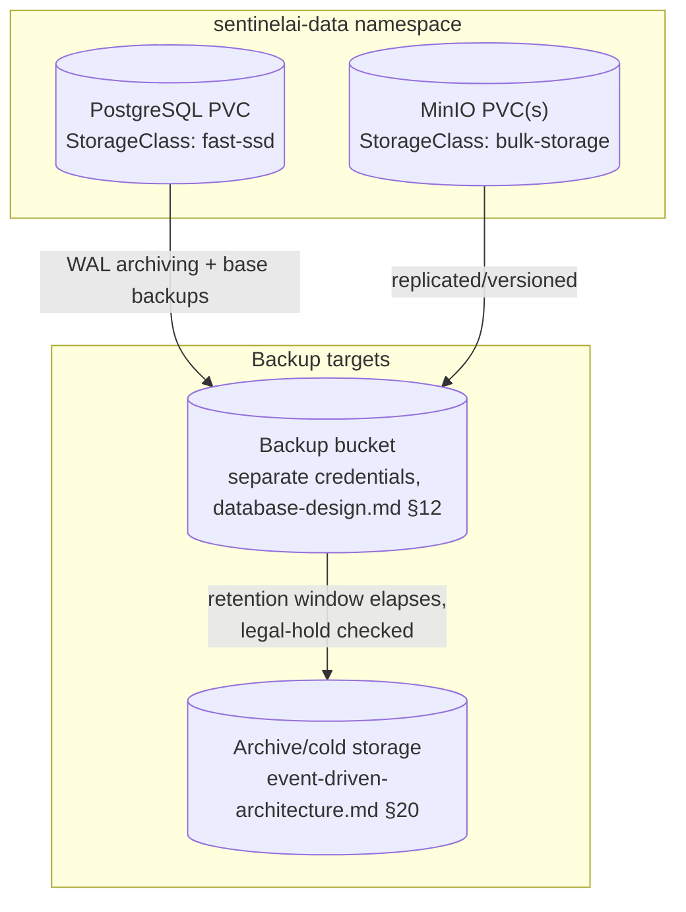

Two `StorageClass`es: `fast-ssd` (low-latency block storage for Postgres — the database is the platform's single highest-IOPS-sensitivity component) and `bulk-storage` (higher-capacity, cost-optimized for MinIO's evidence artifacts, which are written once and read infrequently thereafter per CEM's immutability model).

## Backups, Snapshots, Restore Strategy

Implements `database-design.md` §12 exactly: continuous WAL archiving + daily base backups (CloudNativePG's native `Backup`/`ScheduledBackup` CRDs), MinIO bucket replication to the backup target, and volume-level snapshots (via the CSI driver's `VolumeSnapshot` API) as a fast-restore complement to logical backups — snapshots restore an entire PVC quickly for infrastructure failures; logical backups restore to an arbitrary point in time for data-level incidents. Both respect legal hold (Part 14 details the restore/validation procedure).

# Part 8 — Database Deployment

## Primary, Replica, HA

CloudNativePG manages Postgres primary/replica topology and automated failover — hand-rolled streaming replication is explicitly avoided given how easy it is to get subtly wrong:

```yaml
# k8s/base/postgres-cluster.yaml
apiVersion: postgresql.cnpg.io/v1
kind: Cluster
metadata:
  name: sentinelai-postgres
  namespace: sentinelai-data
spec:
  instances: 3   # 1 primary + 2 replicas
  storage:
    storageClass: fast-ssd
    size: 500Gi
  postgresql:
    parameters:
      max_connections: "200"
      shared_buffers: "4GB"
  backup:
    barmanObjectStore:
      destinationPath: "s3://sentinelai-backups/postgres"
      s3Credentials:
        accessKeyId: { name: backup-credentials, key: ACCESS_KEY_ID }
        secretAccessKey: { name: backup-credentials, key: SECRET_ACCESS_KEY }
    retentionPolicy: "30d"
```

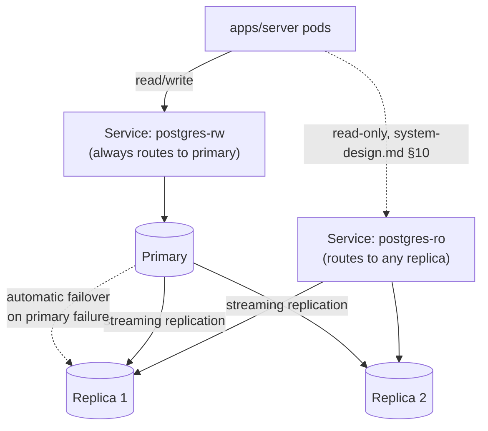

The `postgres-ro` service is the distinctly-named read pool `database-design.md` §13 already calls for, wired to real replicas from the moment HA is deployed — no application code change needed when replicas go from "not yet provisioned" to "provisioned," per that document's forward-compatibility design.

## Migration Ordering & Alembic Execution

A `Job`, run once per deployment as a pre-sync hook (ArgoCD `PreSync`, Part 18), applies every module's Alembic migrations in `database-design.md` §5's DAG order:

```yaml
# k8s/base/migration-job.yaml
apiVersion: batch/v1
kind: Job
metadata:
  name: sentinelai-migrate
  namespace: sentinelai-app
  annotations: { argocd.argoproj.io/hook: PreSync }
spec:
  template:
    spec:
      restartPolicy: Never
      containers:
        - name: migrate
          image: harbor.internal/sentinelai/server:1.4.2
          command: ["python", "-m", "sentinelai.platform.migrate_all"]
          # runs each module's `alembic upgrade head` in order:
          # platform -> ingestion -> {osint,threat_intel,forensics,social_media,case_management}
          # -> investigation -> notification  (database-design.md §5, §11)
```

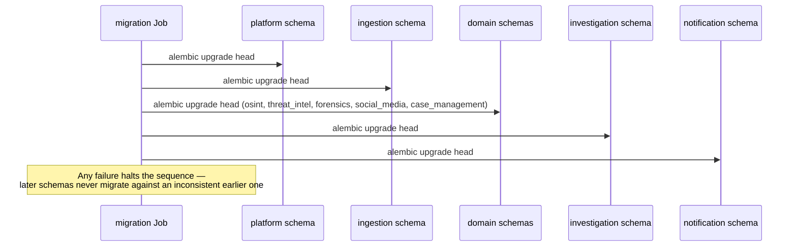

## Rollback Policy

A schema migration's `downgrade()` (`backend-implementation-guide.md` Part 4) is the rollback mechanism for a *failed* migration Job specifically; a rollback of the *application* to a prior version does **not** automatically run `downgrade()` — per that document's expand/contract discipline, a rolled-back application version must remain compatible with the *new* schema shape (additive changes only), so no live downgrade is needed for the common case. A destructive schema change is never deployed without the expand/contract sequence completing first.

# Part 9 — Message Bus Deployment

**Phase 1 — in-process.** No message-bus infrastructure to deploy — `event-driven-architecture.md` §2's dispatcher runs inside the `entrypoints/http` and `entrypoints/worker` processes already deployed in Part 4. Nothing in this section applies until Phase 3+.

**Phase 3+ — Redpanda**, deployed via the Redpanda Kubernetes Operator:

```yaml
# k8s/overlays/phase3/redpanda-cluster.yaml
apiVersion: cluster.redpanda.com/v1alpha2
kind: Redpanda
metadata:
  name: sentinelai-events
  namespace: sentinelai-data
spec:
  chartRef: {}
  clusterSpec:
    statefulset:
      replicas: 3
    storage:
      persistentVolume:
        storageClass: fast-ssd
        size: 200Gi
    tls:
      enabled: true    # security-architecture.md §16, event-driven-architecture.md §21
```

**Scaling & partitioning:** topics are partitioned by `aggregate_id` (`event-driven-architecture.md` §18) — partition count is set per topic based on expected per-aggregate-type volume, sized to allow one consumer instance per partition at peak (Part 15's horizontal scaling applies identically to consumer `Deployment` replica counts). **Retention** matches `event-driven-architecture.md` §20's policy: dispatched messages retained on-cluster for the hot-table-equivalent window, then a Kafka Connect-style sink job exports older segments to the same archive bucket Part 7 already provisions, legal-hold-checked exactly as that document specifies.

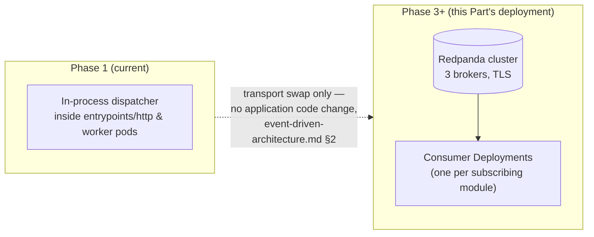

The migration from Phase 1 to Phase 3+ is purely an infrastructure change at this layer — deploying the `Redpanda` CRD above and pointing the already-existing outbox-reading relay at it instead of the in-process dispatcher. Nothing in this Part requires a second implementation of event handling; it requires deploying one more resource.

# Part 10 — AI Worker Deployment

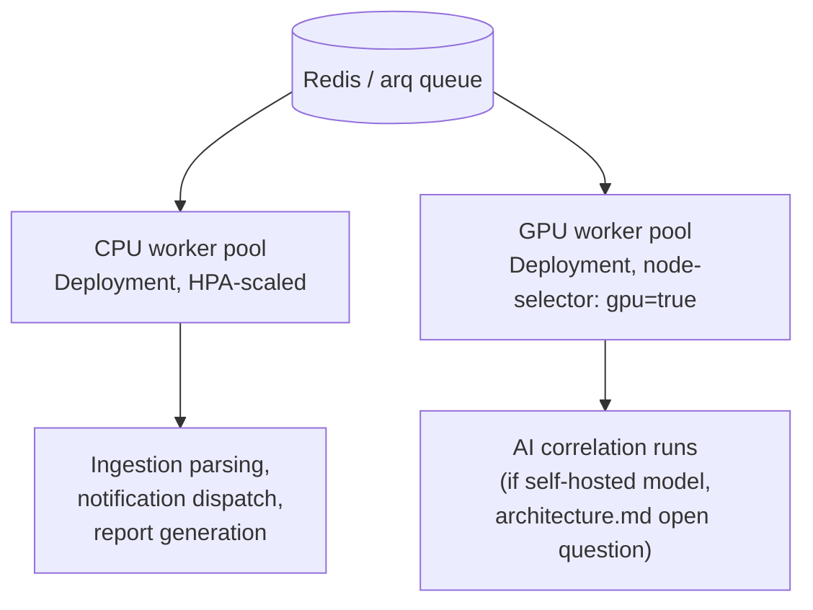

CPU workers (`entrypoints/worker`, `backend-implementation-guide.md` Part 12) run as a standard `Deployment`, horizontally autoscaled on queue depth (Part 15). **GPU workers are conditional** — only provisioned if the still-open AI model strategy (`architecture.md` Open Questions, `security-architecture.md` §52) resolves to self-hosted inference; a hosted-API strategy needs no GPU nodes at all. This document does not resolve that choice; it provisions for either outcome without committing infrastructure ahead of the decision:

```yaml
# k8s/base/gpu-worker-deployment.yaml (provisioned only if self-hosted inference is chosen)
apiVersion: apps/v1
kind: Deployment
metadata: { name: sentinelai-gpu-worker, namespace: sentinelai-app }
spec:
  replicas: 2
  template:
    spec:
      nodeSelector: { "nvidia.com/gpu": "true" }
      tolerations: [{ key: "nvidia.com/gpu", operator: Exists, effect: NoSchedule }]
      containers:
        - name: worker
          image: harbor.internal/sentinelai/worker-gpu:1.4.2
          resources:
            limits: { "nvidia.com/gpu": "1" }
```

**Queue isolation:** correlation-run jobs and routine background jobs (report generation, connector polling) use **separate arq queues**, so a burst of AI correlation work never starves report generation, and vice versa — matching `event-driven-architecture.md` §14's named-retry-policy-per-workload-class principle applied to worker capacity, not just retries. **Concurrency** per worker pod is set conservatively for GPU workers (often `1` concurrent job per GPU) and higher for CPU workers, tuned against Part 23's sizing tiers.

# Part 11 — Secrets Management

**Vault + External Secrets Operator (ESO)** is this document's committed answer to `security-architecture.md` §12's "secrets manager, product TBD" and §51's required ADR — self-hostable (air-gapped compatible), short-lived dynamic database credentials via Vault's database secrets engine, and full retrieval auditing.

```yaml
# k8s/base/externalsecret-db-credentials.yaml
apiVersion: external-secrets.io/v1beta1
kind: ExternalSecret
metadata: { name: postgres-app-credentials, namespace: sentinelai-app }
spec:
  secretStoreRef: { name: vault-backend, kind: ClusterSecretStore }
  refreshInterval: 1h    # short-lived, per security-architecture.md §12
  target: { name: sentinelai-secrets }
  data:
    - secretKey: DATABASE_URL
      remoteRef: { key: database/creds/ingestion-app-role }
```

**Rotation** follows `security-architecture.md` §47's dual-validity overlap pattern, automated by Vault's lease system for database credentials and by a scheduled `CronJob` for anything Vault doesn't natively rotate (API keys for external connectors). **Bootstrap secrets** — the initial Vault unseal keys/root token and the cluster's own bootstrap admin credential — are generated once at cluster creation, split via Shamir's Secret Sharing across multiple custodians (standard Vault practice — e.g. a 5-key split with a 3-key quorum required to unseal), and never stored in any repository or CI system, including in encrypted form. **Certificate lifecycle** is Part 6's cert-manager, itself authenticating to Vault's PKI secrets engine for the internal CA in air-gapped deployments.

**Worked example — a database credential's full lifecycle.** `ingestion`'s `entrypoints/http` pod starts, ESO's `ExternalSecret` (above) requests a lease from Vault's database secrets engine; Vault creates a short-lived Postgres role scoped to only the `ingestion` schema (`database-design.md` §1's least-privilege principle, now enforced at the credential-issuance layer, not only by convention), valid for the `refreshInterval`. ESO refreshes it automatically before expiry; the pod never sees the underlying Vault token, only the resulting `DATABASE_URL`. If the pod is compromised, the leaked credential expires within the hour and grants access to exactly one module's schema — never the whole database.

| Secret class | Issuer | Typical TTL |
|---|---|---|
| Database credentials | Vault database secrets engine | 1 hour (ESO `refreshInterval`) |
| Internal TLS certificates | cert-manager + Vault PKI engine | 90 days, auto-renewed at 60 |
| External connector API keys | Vault KV engine, rotated by scheduled `CronJob` | 30–90 days, per connector's own constraints |
| Vault unseal keys / root token | Generated once, Shamir-split | Effectively permanent — rotated only on suspected compromise (`security-architecture.md` §48) |

# Part 12 — Configuration Management

**Environment variables** (via `ConfigMap` for non-secret config, `Secret`/ESO for sensitive values) are the sole runtime configuration mechanism — no config file baked into the image, so the same image is genuinely identical across environments (Part 1):

```yaml
# k8s/overlays/production/configmap.yaml
apiVersion: v1
kind: ConfigMap
metadata: { name: sentinelai-config, namespace: sentinelai-app }
data:
  ENVIRONMENT: "production"
  LOG_LEVEL: "info"
  DATABASE_POOL_SIZE: "20"
  FEATURE_FLAGS_BACKEND: "unleash"
```

**Config files** are limited to what genuinely cannot be an environment variable (e.g. a structured OpenTelemetry exporter config) and are mounted from a `ConfigMap` volume, still version-controlled. **Feature flags** run on self-hosted **Unleash** (air-gapped compatible, per Part 1's philosophy) — a flag decouples *deploy* from *release* (Part 19), letting a feature ship dark and activate independently of a rollout. **Versioning:** every `ConfigMap`/`Secret` change is a new Kubernetes object revision tracked in Git (Kustomize overlays per environment), never an in-place `kubectl edit` against a running cluster.

# Part 13 — High Availability

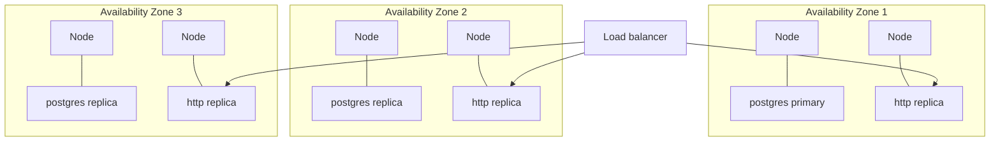

| Failure domain | Mitigation |
|---|---|
| **Node failure** | `Deployment` replicas spread via `podAntiAffinity`; Kubernetes reschedules within seconds; CloudNativePG promotes a replica if the primary's node fails |
| **AZ failure** | `topologySpreadConstraints` across zones for both stateless `Deployment`s and CloudNativePG's replica placement — no single AZ loss removes the last healthy copy of anything |
| **Database failure** | Automatic primary→replica failover (Part 8); connection strings resolve through the `postgres-rw` Service, so failover is transparent to `apps/server` |
| **Storage failure** | PVCs on replicated `fast-ssd`/`bulk-storage` classes; MinIO deployed in distributed mode (erasure-coded across nodes) rather than single-node |
| **Recovery** | Automated where the failure class allows (node/AZ/DB), procedural and validated where it doesn't (Part 14) |

Single-node/single-AZ deployments (Part 22 and 23's Small tier) accept reduced HA explicitly, as a documented trade-off for cost — never silently.

**Worked scenario: a node fails mid-request.** An `entrypoints/http` pod on a failing node is serving an in-flight `PATCH /relationships/{id}/status` request when its node becomes unreachable. The Kubernetes Service's endpoint controller removes the pod from rotation within seconds of the failed liveness probe (Part 4); the client-side retry (idempotent by design, `api-design.md` §2.9/§6) lands on a healthy replica in another AZ. If the failing node also hosted a Postgres replica (never the primary, by `podAntiAffinity` design), CloudNativePG detects the lost replica and continues serving reads from the remaining ones without a failover event at all — only a *primary* node failure triggers Part 8's failover sequence, which completes automatically within CloudNativePG's configured detection window, typically under 30 seconds.

# Part 14 — Disaster Recovery

**RPO ≤ 5 minutes** (continuous WAL shipping), **RTO ≤ 1 hour** for a single-instance restore, **RTO ≤ 4 hours** for a full-region/site rebuild — the same recommended targets `database-design.md` §12 already sets, formalized here as the DR contract, still subject to confirmation against a real contractual SLA before being asserted as guaranteed.

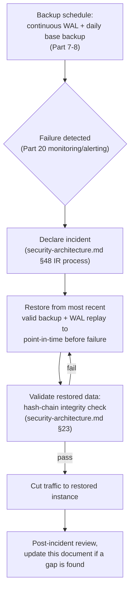

**Backup schedules** per Part 7–8: continuous WAL, daily base backups, MinIO replication. **Restore validation** is a scheduled `CronJob`, not a manual, easy-to-skip step:

```yaml
# k8s/base/backup-verification-cronjob.yaml
apiVersion: batch/v1
kind: CronJob
metadata: { name: backup-restore-drill, namespace: sentinelai-data }
spec:
  schedule: "0 3 * * 0"   # weekly
  jobTemplate:
    spec:
      template:
        spec:
          restartPolicy: Never
          containers:
            - name: restore-drill
              image: harbor.internal/sentinelai/ops-tools:1.4.2
              command: ["/scripts/restore_and_verify.sh"]
```

A backup that has never been restored is, per `database-design.md` §12, unverified — this job exists specifically so that claim is never true in practice.

**Worked DR scenario: full site loss (XL/central-agency profile only, Part 22–23).** The primary site becomes entirely unreachable. The DR site — provisioned at reduced capacity but running the identical Part 3–20 architecture — is promoted: its Postgres replica set (continuously fed via cross-site WAL shipping, distinct from the intra-cluster replication in Part 8) is promoted to primary, MinIO's cross-site bucket replication is confirmed current, and DNS/load-balancer records cut over. This is the ≤4-hour RTO target — validated on the same cadence as the single-instance restore drill above, not assumed to work because the single-instance version does. A Small/Medium-tier deployment (Part 23) that has no DR site accepts this as an explicit, documented risk rather than an oversight — full site redundancy is an XL-tier and central-agency-profile expectation, not a universal requirement of this architecture.

# Part 15 — Scaling Strategy

| Component | Horizontal | Vertical | Autoscaling trigger |
|---|---|---|---|
| `entrypoints/http` | `Deployment` replica count | Resource requests/limits (Part 4) | `HorizontalPodAutoscaler` on CPU + request latency |
| `entrypoints/worker` (CPU) | Replica count | Resource requests/limits | `HPA` on arq queue depth (custom metric via Prometheus adapter) |
| GPU workers | Replica count, bounded by available GPU nodes | GPU class selection (Part 23) | Manual or `HPA` on GPU-queue depth, capped by cluster GPU capacity |
| Database | Read replicas (Part 8) | Instance size (vCPU/RAM) | Manual — database vertical scaling is a planned operation, not autoscaled |
| Redpanda (Phase 3+) | Broker count + partition count (Part 9) | Broker instance size | Manual, capacity-planned ahead of projected volume |

Autoscaling is bounded (`minReplicas`/`maxReplicas`) in every case — unbounded autoscaling is a cost and, for the database connection pool, a stability risk (`backend-implementation-guide.md` Part 14's explicit pool-size configuration exists precisely to cap this).

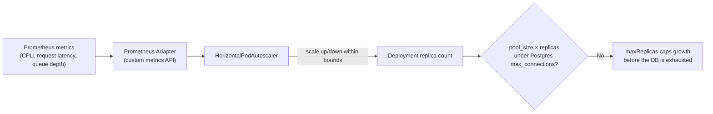

```yaml
# k8s/base/hpa-http.yaml
apiVersion: autoscaling/v2
kind: HorizontalPodAutoscaler
metadata: { name: sentinelai-http, namespace: sentinelai-app }
spec:
  scaleTargetRef: { apiVersion: apps/v1, kind: Deployment, name: sentinelai-http }
  minReplicas: 3
  maxReplicas: 12
  metrics:
    - type: Resource
      resource: { name: cpu, target: { type: Utilization, averageUtilization: 70 } }
    - type: Pods
      pods:
        metric: { name: http_request_duration_p95_seconds }
        target: { type: AverageValue, averageValue: "500m" }
```

`maxReplicas: 12` is set deliberately against Part 8's `max_connections: 200` and the configured per-pod pool size — the ceiling exists so autoscaling can never itself become the cause of a database outage.

# Part 16 — Performance

- **Connection pools:** the async engine's pool (`backend-implementation-guide.md` Part 2/14) is sized against the *cluster's* total Postgres `max_connections`, not per-pod in isolation — `replica_count × pool_size` must stay under the database's configured ceiling (Part 8's `Cluster` spec), enforced by a documented sizing formula, not left to accident during a scale-up.
- **Caching:** Redis-backed, cache-aside (`backend-implementation-guide.md` Part 14) — deployed as its own `Deployment`/`StatefulSet` in `sentinelai-data`, sized independently of the message-queue Redis usage if volume ever warrants separating them.
- **Compression:** gzip/brotli at the Ingress layer for API responses and static assets; MinIO/Postgres traffic between in-cluster components is not compressed (CPU cost outweighs the benefit on a fast internal network).
- **CDN considerations:** cloud/dedicated-cloud profiles front `apps/web`'s static assets with a CDN (`system-design.md` §13); air-gapped deployments serve them directly from the Ingress, since there is no external CDN to use by definition (Part 21).

| Optimization | Applies to | Note |
|---|---|---|
| Connection pool sizing | Postgres access | Formula-bound against `max_connections`, above |
| Cache-aside | Read-heavy, rarely-changing data | `backend-implementation-guide.md` Part 14 |
| Response compression | API responses, static assets | Ingress-layer, not application-layer |
| CDN | `apps/web` static assets | Cloud/dedicated-cloud only |
| Cursor pagination + BRIN indexes | Large, append-heavy list endpoints | `api-design.md` §2.5, `database-design.md` §6–7 |

# Part 17 — Security Hardening

Reference: `security-architecture.md` §44 in full. Implementation, at the cluster level:

- **Pod Security:** the cluster enforces the `restricted` Pod Security Standard cluster-wide (via Pod Security Admission, not the deprecated PodSecurityPolicy) — no pod runs privileged, as root, or with a writable root filesystem by default.
- **Network Policy:** default-deny per namespace (Part 6), explicit allow-lists only.
- **Image scanning:** Harbor's built-in Trivy integration scans on push and on a recurring schedule (`security-architecture.md` §43's dual-trigger scanning), gating promotion to any environment beyond Development on a clean or accepted-risk scan result.
- **Runtime security:** Falco (or equivalent eBPF-based runtime monitor) watches for anomalous in-container behavior (unexpected process execution, unexpected outbound connections) — a runtime complement to Part 5's build-time scanning, catching what only shows up once a container is actually running.
- **SELinux/AppArmor:** node-level mandatory access control profiles are enabled and enforced (not permissive/audit-only) on every cluster node, a defense-in-depth layer beneath the container boundary itself.

**How these five layers compose, worked through an example:** a compromised dependency somehow ships in a signed, scanned image (a supply-chain attacker who compromised the build pipeline itself, `security-architecture.md` §46). Pod Security Admission still confines it to a non-root, non-privileged, read-only-filesystem container; NetworkPolicy still confines its egress to only what that pod's namespace explicitly allows (Part 6); Falco still flags the anomalous behavior once the payload actually executes; and SELinux/AppArmor still constrain what a container-escape attempt could touch at the host level even if every layer above it were somehow defeated. No single layer is assumed sufficient — this is `security-architecture.md` §1's defense-in-depth principle expressed entirely at the infrastructure layer.

# Part 18 — Deployment Workflow

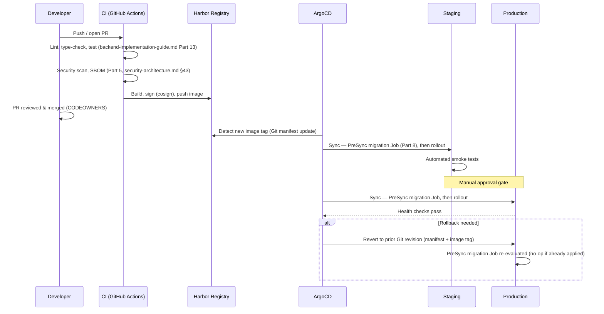

Every arrow above is a Git-tracked, reviewable event — there is no deployment path that bypasses this sequence, including for a hotfix (a hotfix is a fast pass through the *same* sequence, not a shortcut around it). "Fast" means a smaller change and expedited review, never a skipped scan, an unsigned image, or a direct `kubectl apply` against production outside ArgoCD's reconciliation loop.

# Part 19 — Release Strategy

| Strategy | Used for | Mechanism |
|---|---|---|
| **Rolling** (default) | Routine releases | Kubernetes' native `RollingUpdate` strategy on the `Deployment` — the default for nearly every change |
| **Blue/Green** | High-risk major version boundaries (e.g. an API `/v2` cutover, `api-design.md` §14) | Two full parallel environments; traffic switches at the Ingress once the green environment is fully validated |
| **Canary** | Changes to the AI correlation path or other high-uncertainty logic | A small weighted percentage of Ingress traffic routed to the new version first, widened gradually |
| **Feature flags** | Decoupling deploy from release (Part 12) | Unleash — a feature ships dark, activates independently of any deploy event |

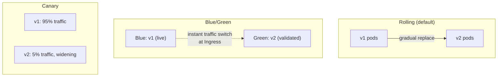

**Version compatibility is what makes rolling/canary safe at all** — `api-design.md` §14's additive-only-within-a-version rule and `event-driven-architecture.md` §23's dual-publish rule exist *specifically* so that two versions of the application can run simultaneously during any of the strategies above without one version's requests/events breaking the other's assumptions. A release strategy that requires "everything cuts over atomically" is a sign a compatibility rule was violated upstream, not a reason to add more deployment-layer complexity to compensate.

# Part 20 — Monitoring Deployment

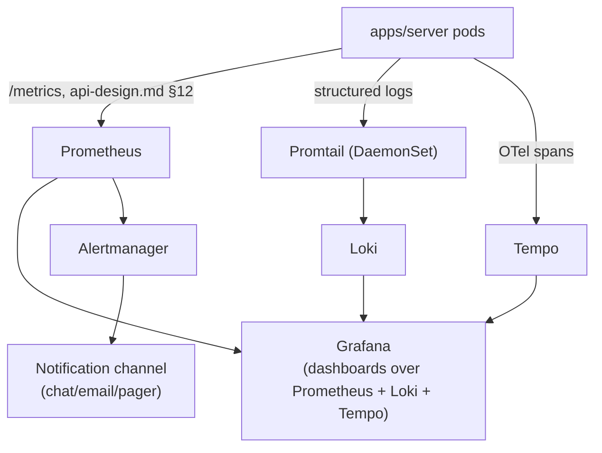

Prometheus scrapes every pod's `/metrics` (RED/USE metrics, `system-design.md` §12); Promtail (a `DaemonSet`, per Part 4) ships structured logs to Loki, correlatable by the same `correlation_id`/`trace_id` `event-driven-architecture.md` §11 and `backend-implementation-guide.md` Part 10 already establish; Tempo receives OpenTelemetry traces; Grafana is the single pane of glass across all three; Alertmanager fires on the thresholds `event-driven-architecture.md` §28 and `security-architecture.md` §49 already define, routed to whatever on-call channel a given deployment uses. **Health probes** (`/healthz`, `/readyz`, `api-design.md` §11) back both Kubernetes' own liveness/readiness gating (Part 4's `Deployment` spec) and Prometheus's own up/down alerting — the same two endpoints serve both purposes, not duplicated implementations.

**Alert routing**, matching `event-driven-architecture.md` §28 and `security-architecture.md` §49's named signals to Alertmanager severity:

| Signal | Source | Severity | Route |
|---|---|---|---|
| `outbox_oldest_pending_age_seconds > 300` | Prometheus (app metrics) | Warning | Engineering channel |
| `events_dead_lettered_total` increase, `investigation.correlation_generated` | Prometheus | Critical | Engineering + on-call page |
| Postgres primary unreachable | CloudNativePG operator metrics | Critical | On-call page, immediate |
| Failed login burst across accounts | `platform.audit_log` → log-based alert (Loki) | Critical | Security/on-call page |
| Backup-verification `CronJob` failure | Kubernetes Job status | Critical | On-call page — a failed drill means DR posture is unverified |
| CSP violation report spike | Application logs (Loki) | Warning | Security channel |

Every row above already exists as a *named signal* in the referenced document — this table is the deployment-layer wiring, not a new alerting policy invented here.

# Part 21 — Air-Gapped Deployment

Consolidates `security-architecture.md` §41 into a concrete build/deploy procedure:

- **Offline package generation:** a connected build environment produces a single portable bundle — every container image (Part 5), Helm charts, Kubernetes manifests, and Python/OS dependency mirrors — packaged as a signed tarball for physical or one-way transfer into the air-gapped environment.
- **Dependency mirrors:** an internal PyPI mirror (e.g. `devpi`) and an internal apt/OS package mirror, refreshed from the connected build environment on a defined cadence, never pulled live from the internet by the air-gapped cluster itself.
- **Offline container registry:** Harbor's replication feature pushes the connected environment's verified, signed images into the air-gapped Harbor instance — the air-gapped cluster only ever pulls from its own internal Harbor.
- **Offline updates:** the same signed-bundle mechanism as initial deployment — no component in the air-gapped environment auto-updates from any external source, including OS packages, malware-scan signatures (`security-architecture.md` §25), and threat-intel feed data (which, by definition, cannot update live in this profile — a customer accepting air-gapped deployment accepts feed staleness as a trade-off, a limitation `prd.md`'s risk register should carry).
- **Offline license validation:** licensing (for SentinelAI itself and any commercial component in the stack) is validated against a locally-issued, time-bounded license file rather than a phone-home license server — a hard requirement given zero egress, not a nice-to-have.

| Component | Connected-environment source | Air-gapped import mechanism |
|---|---|---|
| Container images | Harbor (connected) | Harbor replication over signed offline bundle |
| Python/OS packages | Public PyPI/apt upstream | Internal `devpi`/apt mirror, refreshed on a defined cadence |
| Malware scan signatures | Vendor update feed | Approved offline import process (`security-architecture.md` §25, §41) |
| Threat intel feeds | Live STIX/TAXII sources | Not available — accepted staleness, tracked as a documented limitation |
| License file | License server (connected profiles) | Locally-issued, time-bounded file |

# Part 22 — Multi-State Deployment Model

Four deployment profiles, matching `prd.md` §4's customer segments and `security-architecture.md` §40's tenant-isolation recommendation:

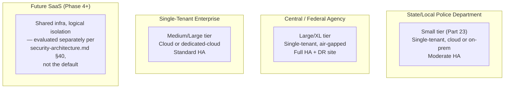

| Profile | Tier (Part 23) | Air-gapped? | HA | Tenancy |
|---|---|---|---|---|
| State/local police department | Small–Medium | Optional | Moderate (single-AZ acceptable) | Single-tenant, dedicated |
| Central/federal agency | Large–XL | Typically yes | Full multi-AZ + DR site | Single-tenant, dedicated, physically isolated |
| Single-tenant enterprise | Medium–Large | No | Standard multi-AZ | Single-tenant, dedicated |
| Future SaaS | Varies | No | Standard | Shared/logical — **not the default**, requires the Phase 4 ADR `security-architecture.md` §40 already calls for |

Every profile except the future-SaaS one runs the **identical** deployment architecture from Parts 3–20 at a different Part 23 sizing tier and a different Part 21 connectivity posture — this document does not define four different architectures, it defines one architecture with documented dials.

**What actually varies per profile**, concretely: node count and class (Part 23), whether Part 21's offline mirrors are the only update path or a fallback, whether Part 13's DR site exists at all, and which Part 22 table row's HA level is contracted. **What never varies**: the module boundaries, the schema-per-module database design, the event catalog, the API contract, and the security controls — a state police department's deployment and a central agency's deployment run the same container images built from the same repository, differing only in the configuration and scale documented in this Part and Part 23.

# Part 23 — Hardware Sizing

| Tier | Nodes | Per-node | Storage | GPU | Suitable for |
|---|---|---|---|---|---|
| **Small** | 3 | 4 vCPU / 16 GB RAM | 500 GB–1 TB, `fast-ssd` + `bulk-storage` | None (hosted AI API) | Pilot deployments, small departments, <10 concurrent users |
| **Medium** | 5 | 8 vCPU / 32 GB RAM | 2–5 TB | Optional 1× inference-class GPU (e.g. L4/A10 equivalent) | <50 concurrent users, single-AZ or light multi-AZ |
| **Large** | 10+ | 16 vCPU / 64 GB RAM | 10 TB+, tiered hot/archive | 2+ inference-class GPUs | <200 concurrent users, full multi-AZ HA |
| **XL** | 20+ | 16–32 vCPU / 64–128 GB RAM | 50 TB+, tiered with dedicated archive storage | Dedicated GPU node pool, scaled to correlation-run volume | Central/federal agency scale, full HA + DR site |

Each tier's node count already includes the redundancy Part 13 requires (e.g. Small's 3 nodes is the *minimum* for meaningful `podAntiAffinity` spread, not a bare-minimum single-node count padded for appearance) — under-provisioning below a tier's stated node count silently forfeits that tier's HA guarantees even if every other resource looks adequate.

**GPU recommendations** are deliberately given as classes, not specific hardware SKUs, and are conditional on the still-open self-hosted-vs-hosted AI model decision (Part 10) — inference-class GPUs (cost-optimized) are sufficient if self-hosting a moderately-sized model; larger self-hosted models would push toward the Large/XL tier's dedicated pool regardless of concurrent-user count. **Storage recommendations** assume evidence artifact growth is the dominant long-term storage driver (not database row count) — `bulk-storage` capacity should be planned against expected evidence *ingestion volume over the deployment's lifetime*, not current-day usage, since evidence is immutable and never shrinks (CEM §12).

**Worked sizing example.** A state police department (Small tier) ingesting an estimated 50 GB of forensic images and captured media per month projects to roughly 3 TB of `bulk-storage` over a five-year retention horizon before any archival tiering — comfortably within the Small tier's 500 GB–1 TB *hot* allocation only if archival tiering (Part 7) to cheaper cold storage is configured from day one, not added reactively once the hot tier fills. This is exactly why Part 7's archive-bucket path exists as a first-class part of the storage architecture rather than a future add-on: for this platform's actual data-growth profile, needing it is the expected case, not the edge case.

## Glossary

| Term | Definition |
|---|---|
| **CloudNativePG** | The Postgres Kubernetes operator managing primary/replica topology, failover, and backups (Part 8) |
| **ESO (External Secrets Operator)** | Syncs Vault-held secrets into Kubernetes `Secret` objects, refreshed on a TTL (Part 11) |
| **PreSync hook** | An ArgoCD mechanism running a Job (e.g. migrations) before the main manifest sync (Part 8, 18) |
| **Pod Security Admission** | Kubernetes' built-in enforcement of pod security standards (`restricted`, Part 17) — the successor to the deprecated PodSecurityPolicy |
| **Expand/contract** | The multi-step migration pattern (add new shape → dual-write → cut over → remove old shape) used for any breaking schema change (`backend-implementation-guide.md` Part 4) |
| **Sync waves / hooks** | ArgoCD's mechanism for ordering resources within one deployment (e.g. the migration `PreSync` `Job` before the main rollout, Part 8, 18) |
| **RPO / RTO** | Recovery Point/Time Objective — maximum acceptable data loss / downtime for a given failure class (Part 14) |
| **Failure domain** | A boundary (node, AZ, database, storage) within which a single failure is expected to be contained (Part 13) |
| **GitOps** | Declaring the desired cluster state in Git and reconciling it automatically (ArgoCD), rather than applying changes imperatively (Part 18) |
| **Admission control** | A Kubernetes policy layer (Kyverno/cosign policy-controller) that can reject a resource — e.g. an unsigned image — before it's ever scheduled (Part 5) |

# Part 24 — Implementation Checklist

**Deployment readiness**
- [ ] Every image referenced in a manifest is signed and its signature verifies (Part 5)
- [ ] Every namespace carries the Pod Security Admission labels shown in Part 4, not just `sentinelai-app`
- [ ] Every namespace has a default-deny `NetworkPolicy` plus explicit allows (Part 6)
- [ ] `ConfigMap`/`Secret` values are environment-specific overlays, not hardcoded into base manifests (Part 12)
- [ ] The migration `Job` is wired as a `PreSync` hook, not a manual step (Part 8, 18)

**Production readiness**
- [ ] The deployment's Part 23 sizing tier was chosen from projected load, not copied from another deployment of a different scale
- [ ] HA is configured per Part 13 for the deployment's actual profile (Part 22) — not silently reduced from what was sized
- [ ] Prometheus/Grafana/Loki/Tempo/Alertmanager are deployed and alert routing is verified end-to-end, not just "installed" (Part 20)
- [ ] Autoscaling bounds (`minReplicas`/`maxReplicas`) are set deliberately, not left at defaults (Part 15)
- [ ] Resource requests/limits are set on every container — no unbounded pod (Part 4, 16)

**Security**
- [ ] Pod Security Admission enforces `restricted` cluster-wide (Part 17)
- [ ] Vault + ESO is the only path secrets reach a pod — no secret in a `ConfigMap` or committed manifest (Part 11)
- [ ] Runtime security monitoring (Falco or equivalent) is active, not just image scanning (Part 17)
- [ ] Air-gapped deployments have zero configured or observed egress paths (Part 21)
- [ ] Every base image in use appears in Part 5's approved-base-image table
- [ ] TLS 1.2+ is enforced at every hop — Ingress, internal service calls, and database connections alike (Part 6, `security-architecture.md` §16)

**Rollback**
- [ ] Every release has a validated ArgoCD revert path exercised in staging before it's trusted in production (Part 18)
- [ ] Every migration shipped has a real `downgrade()` and an expand/contract plan for breaking changes (Part 8, `backend-implementation-guide.md` Part 4)
- [ ] Feature flags exist for any release judged risky enough to want a non-deployment kill switch (Part 12, 19)
- [ ] The team knows, in advance, which of Part 19's four release strategies a given change will use — not decided improvisationally mid-incident

**Disaster recovery**
- [ ] The weekly restore-verification `CronJob` has a passing run within the last 7 days before go-live (Part 14)
- [ ] RPO/RTO targets are confirmed against the deployment's actual contractual SLA, not assumed from this document's recommended defaults (Part 14)
- [ ] Legal-hold-aware retention is verified end-to-end: a held item survives a simulated backup-rotation and archival-sweep cycle (Part 7, 14, `database-design.md` §7/§12)
- [ ] A full DR-site failover has been exercised at least once for any XL-tier/central-agency deployment, not only documented (Part 14, 22–23)

**Air-gapped-specific (Part 21, applies only to that profile)**
- [ ] The offline package bundle's signature is verified before import into the air-gapped environment
- [ ] Zero configured or observed egress paths exist anywhere in the cluster, including DNS forwarders (Part 6)
- [ ] The offline license file is time-bounded and its expiry is tracked — a phone-home-free license doesn't mean an indefinite one

---

*Keep this document synchronized with [System Design](system-design.md) §13 (whose deployment diagrams this document implements at full resolution), [Database Design](database-design.md) §12 (backup/restore policy this document's Parts 7–8 and 14 make concrete), [Event-Driven Architecture](event-driven-architecture.md) (Part 9's Redpanda deployment and Part 21's retention), [Security Architecture](security-architecture.md) (Parts 6, 11, 17, 21 implement its network, secrets, hardening, and air-gapped requirements), and [Backend Implementation Guide](backend-implementation-guide.md) (Part 8's migration execution and Part 10's worker deployment run the code that guide specifies). Any infrastructure change should be reflected here in the same change.*
