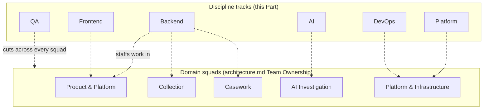
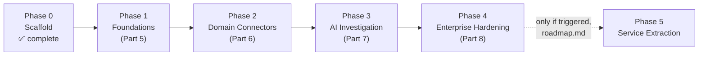
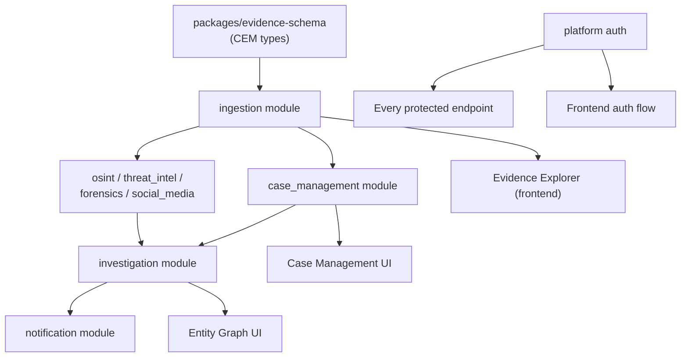
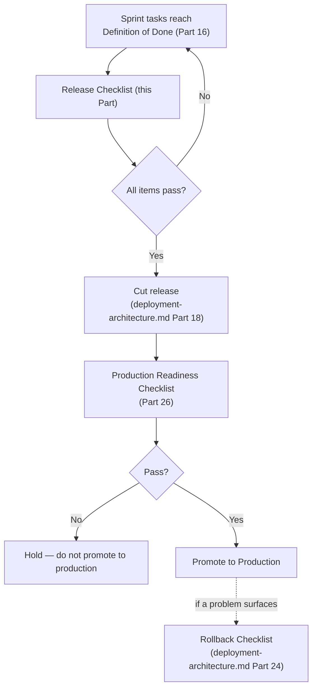

# SentinelAI — Engineering Roadmap

**Status:** Authoritative Master Execution Plan
**Last updated:** 2026-07-19
**Related documents:** [PRD](prd.md) · [Architecture](architecture.md) · [System Design](system-design.md) · [Database Design](database-design.md) · [API Design](api-design.md) · [Event-Driven Architecture](event-driven-architecture.md) · [Canonical Evidence Model](canonical-evidence-model.md) · [Security Architecture](security-architecture.md) · [Frontend Architecture](frontend-architecture.md) · [Backend Implementation Guide](backend-implementation-guide.md) · [Deployment Architecture](deployment-architecture.md) · [Roadmap (phase definitions)](roadmap.md)

**This document does not redefine architecture — it schedules it.** Every module, endpoint, event, table, page, and component named below already has an authoritative definition in the documents listed above; this document says *when* it gets built, *by which discipline*, *in what order*, and *what "done" means*. Where this document and an architecture document appear to disagree, the architecture document is correct and this document has drifted — fix the drift, don't reinterpret the architecture.

`docs/roadmap.md` already defines the five phases (0–5) and each phase's exit criteria; this document does not redefine those phases — it is the execution plan *for* them.

### Contents

| Part | Topic | Part | Topic |
|---|---|---|---|
| 1 | Development Philosophy | 16 | Definition of Done |
| 2 | Repository Structure Review | 17 | Backend Task Breakdown |
| 3 | Team Structure | 18 | Frontend Task Breakdown |
| 4 | Sprint Planning Strategy | 19 | AI Module Tasks |
| 5 | Phase 1 — Foundations (MVP Core) | 20 | Infrastructure Tasks |
| 6 | Phase 2 — Domain Connectors | 21 | Security Tasks |
| 7 | Phase 3 — AI Investigation Engine | 22 | Testing Tasks |
| 8 | Phase 4 — Enterprise Hardening | 23 | Performance Tasks |
| 9 | Task Dependencies | 24 | Documentation Tasks |
| 10 | Critical Path | 25 | Release Checklist |
| 11 | Milestones | 26 | Production Readiness Checklist |
| 12 | Git Strategy | 27 | Technical Debt Register |
| 13 | Branching Model | 28 | Risks |
| 14 | Pull Request Rules | 29 | Open ADRs |
| 15 | Code Review Checklist | 30 | Final Engineering Checklist |

---

# Part 1 — Development Philosophy

- **Architecture first, code second, always.** No task in Parts 17–19 is picked up without its governing architecture document open beside it — `backend-implementation-guide.md` and `frontend-architecture.md` are not references to skim, they're the specification the code is graded against (Part 15's review checklist).
- **Every task ships with its tests and its documentation update in the same PR.** "I'll add tests later" and "I'll update the docs later" are both Part 16's Definition-of-Done violations, not acceptable technical debt.
- **Small, reviewable increments over large batched changes.** A task sized `XL` (Part 4's scale) is broken down before it enters a sprint, not carried as one giant PR.
- **The critical path (Part 10) is protected deliberately.** Work that unblocks other work is prioritized over work that's merely valuable in isolation, even when the isolated work is easier or more appealing to build.
- **Solo-developer reality is not hidden behind aspirational team language.** Every "Owner: Backend" or "Owner: QA" in this document names a *discipline*, not a hired person — today, one developer covers all of them (Part 3), and this document is written to scale honestly as the team grows, matching the stance already established in `security-architecture.md` §48 and `architecture.md`'s Team Ownership section.
- **Nothing in Parts 17–19 invents scope.** Every task traces to a named section of an architecture document; a task with no such citation is not a real task yet.

# Part 2 — Repository Structure Review

The repository, as architected, is ready for implementation to begin against it without restructuring:

| Path | Status | Governing document |
|---|---|---|
| `apps/web` | Scaffolded, empty | `frontend-architecture.md` |
| `apps/server` (`entrypoints/http`, `entrypoints/worker`, `modules/*`, `platform`) | Scaffolded, empty | `architecture.md`, `backend-implementation-guide.md` Part 1 |
| `packages/evidence-schema` | Scaffolded, empty | `canonical-evidence-model.md` |
| `packages/ui-components`, `shared-types`, `shared-utils`, `sdk` | Scaffolded, empty | `frontend-architecture.md` §21 |
| `infra/` | Scaffolded, empty | `deployment-architecture.md` |
| `docs/` | Complete — the full architecture series this roadmap schedules | This document |
| `.github/`, `CONTRIBUTING.md`, `SECURITY.md` | Complete — governance already in force | Parts 12–15 extend, not replace, these |

No new top-level folder is required before Phase 1 work begins. The one structural item still outstanding is `backend-implementation-guide.md`'s own recommendation: formally record the Python/FastAPI/SQLAlchemy/Alembic/Pydantic v2 and React/React Query stack decisions as ADRs (Part 29) before the first line of application code lands.

**What "ready" means, concretely.** Every folder in the table above being "scaffolded, empty" is not a gap this roadmap needs to close before work starts — it's the intended starting state. `apps/server/modules/ingestion/` containing only a `README.md` today and a full `models.py`/`repository.py`/`service.py`/`router.py`/`migrations/` tree by the end of Phase 1 is exactly the transition Parts 5 and 17 schedule. A reviewer checking "is the repository ready for Part 5 to begin" should find: the folder exists, its `README.md` correctly states its purpose and points at the governing architecture document, and nothing about its current emptiness contradicts anything in `architecture.md` or `backend-implementation-guide.md` Part 1's project layout. All three are true today.

# Part 3 — Team Structure

Six discipline tracks. Today, one developer covers all six; this is the target structure the CODEOWNERS squads in `architecture.md`'s Team Ownership section grow into, not a competing org chart — the squads are *domain* groupings (who owns `case_management` vs. `investigation`), these tracks are *discipline* groupings (who has the skill set for a given task class). A real task is staffed by intersecting both.

| Track | Owns | Primary governing documents |
|---|---|---|
| **Backend** | `apps/server` application code | `backend-implementation-guide.md`, `api-design.md`, `event-driven-architecture.md` |
| **Frontend** | `apps/web` application code | `frontend-architecture.md` |
| **AI** | `investigation` module's correlation/extraction logic, prompt/model integration | `canonical-evidence-model.md` §10, `prd.md` FR-7.x |
| **Platform** | `platform/` cross-cutting code (auth, events, db plumbing), shared packages | `backend-implementation-guide.md` Part 1, 8 |
| **QA** | Test strategy execution, release validation | `backend-implementation-guide.md` Part 13, `frontend-architecture.md` §43 |
| **DevOps** | `infra/`, CI/CD, Kubernetes, monitoring | `deployment-architecture.md` |



A real sprint task is the intersection of exactly one domain squad (which module) and one or more discipline tracks (what skill it needs) — neither dimension alone fully describes who should pick up a task.

**Every `architecture.md` Part, mapped to when it stops being purely aspirational and starts being enforced:**

| `architecture.md` section | Enforced from |
|---|---|
| Architectural style (modular monolith) | Phase 1, day one |
| Domain boundaries | Phase 1, day one |
| Team ownership (CODEOWNERS squads) | Aspirational until the team grows past one — becomes real the moment a second engineer joins, per this Part |
| Non-functional requirements | Phase 1 (baseline), ongoing (maturity) |
| Tech stack | Resolved by `backend-implementation-guide.md`/`frontend-architecture.md`/`deployment-architecture.md` |
| Open questions | Tracked as this document's Part 29 |

# Part 4 — Sprint Planning Strategy

**Cadence:** two-week sprints. **Ceremonies** (defined now for when staffing allows them; today's solo cadence is a lightweight weekly self-review against the same board): sprint planning (pull from the phase backlog, Part 5–8), daily standup, sprint review against Part 16's Definition of Done, retrospective feeding Part 27's technical debt register.

**Priority scale**, used in every task table below:

| Priority | Meaning |
|---|---|
| **P0** | Blocking — nothing downstream on the critical path (Part 10) can proceed without it |
| **P1** | High — required for the current phase's exit criteria (`roadmap.md`) |
| **P2** | Medium — valuable, not phase-blocking |
| **P3** | Deferred — explicitly scheduled for a later phase, not this one |

**Complexity scale** (T-shirt sizing, used in every task table below):

| Size | Effort |
|---|---|
| **XS** | < 1 day |
| **S** | 1–2 days |
| **M** | 3–5 days |
| **L** | 1–2 weeks |
| **XL** | > 2 weeks — must be decomposed into smaller tasks before entering a sprint |

**Calibration examples**, drawn from already-scheduled tasks elsewhere in this document, so the scale isn't abstract:

| Size | Example task | Why this size |
|---|---|---|
| XS | Argon2id password hashing (Part 21) | A single, well-defined library integration with no new schema or endpoint |
| S | `POST /api/v1/cases` (Part 17) | One endpoint, one table already exists, no cross-module orchestration |
| M | `PATCH /relationships/{id}/status` (Part 17) | A state machine, an outbox publish, and case-scope authorization — more moving parts than a plain CRUD endpoint |
| L | Evidence upload flow (Part 17) | Spans presigned URLs, quarantine, malware scanning, and integrity verification — several coordinated components |
| XL | Entity Graph UI (Part 18) | Data-fetching, rendering, interaction, and right-panel integration are each independently substantial — decomposed into sub-tasks before sprint entry, per the scale's own rule |

Story points are not used — T-shirt sizing is coarser and, across a task list this large, more consistently estimable by a solo developer or a newly-formed team without a shared calibration history yet.



Each phase's sprint backlog is pulled directly from that phase's Part (5–8) and the corresponding rows of Parts 17–24 filtered to that phase — there is no separate backlog maintained outside this document.

**Illustrative Phase 1 sprint plan** (six two-week sprints, ~12 weeks — illustrative pacing, not a committed date, since staffing is currently solo):

| Sprint | Focus | Key tasks (Part 17 references) |
|---|---|---|
| 1 | `platform` foundation | Auth (login, MFA), `users`/`roles`/`sessions` migration, FastAPI app skeleton |
| 2 | `packages/evidence-schema` + `ingestion` core | CEM types, `evidence`/`evidence_custody_events` migration, `POST/GET /evidence` |
| 3 | `ingestion` completion | Upload flow, integrity verification, supersede, connector registry |
| 4 | `case_management` core | `cases`/`case_evidence_links` migration, case CRUD, evidence linking |
| 5 | `apps/web` shell | `AuthLayout`/`AppLayout`, login flow, case list/detail, manual evidence entry form |
| 6 | Integration + M1 | End-to-end journey (login → case → evidence → custody visible), CI/CD baseline, M1 milestone demo (Part 11) |

Phases 2–4 follow the same sprint-planning discipline against their own Part (6–8) workstream tables; this document does not pre-commit their sprint-by-sprint breakdown, since Phase 1's actual velocity is the input that makes later phases' pacing a real estimate rather than a guess.

**PRD functional requirements traceability**, mapped to phase (`prd.md` §7 is authoritative for the requirement text):

| PRD requirement group | Implemented in phase |
|---|---|
| FR-1.x (Evidence Ingestion) | 1 |
| FR-2.x (Case Management) | 1 |
| FR-3.x (OSINT) | 2 |
| FR-4.x (Threat Intelligence) | 2 |
| FR-5.x (Digital Forensics) | 2 |
| FR-6.x (Social Media) | 2 |
| FR-7.x (AI Investigation Engine) | 3 |
| FR-8.x (Notifications) | 3 |
| FR-9.x (Access Control & Audit) | 1 (core RBAC/audit), 4 (audit export, FR-9.3) |

**`system-design.md` Part mapping:**

| `system-design.md` Part(s) | Implemented in phase |
|---|---|
| §1–2 (High-level architecture, modular monolith design) | 1 — this is the `apps/server` structure Part 2 of this document already confirms is scaffolded and ready |
| §3 (Future microservice evolution) | Reference — Phase 5 only, not scheduled by default |
| §4–5 (Domain boundaries, module interactions) | 1, enforced every phase after |
| §6–7 (Event-driven architecture, data flow) | 1 (in-process), 3+/5 (Redpanda) |
| §8 (External integrations) | 2 (connector-specific), 1 (identity provider) |
| §9 (Tech stack justification) | Resolved by `backend-implementation-guide.md`/`frontend-architecture.md`/`deployment-architecture.md` — reference only now |
| §10–12 (Scalability, fault tolerance, observability) | 1 (baseline), ongoing (maturity) |
| §13 (Deployment topology) | Fully detailed by `deployment-architecture.md` — reference only now |

# Part 5 — Phase 1 — Foundations (MVP Core)

Scope per `roadmap.md`: auth, `packages/evidence-schema`, `case_management` CRUD, `ingestion`'s generic intake path, `entrypoints/http`, a bare-bones `apps/web`. **No AI, no domain connectors yet.** Exit criteria (verbatim from `roadmap.md`): *an analyst can create a case, manually ingest a piece of evidence, and see it attached to the case with a recorded chain of custody.*

| Workstream | Key deliverables | Priority | Owner |
|---|---|---|---|
| `platform` auth | Login, MFA, session management, RBAC dependencies (`backend-implementation-guide.md` Part 8) | P0 | Backend, Platform |
| `packages/evidence-schema` | CEM Core Evidence Object as Pydantic + TS types | P0 | Backend, Frontend |
| `ingestion` module | `evidence` + `evidence_custody_events` tables, `POST/GET /evidence` (manual entry only) | P0 | Backend |
| `case_management` module | `cases`, `case_evidence_links` tables, case CRUD + evidence linking endpoints | P0 | Backend |
| `entrypoints/http` | FastAPI app skeleton, middleware, exception handlers (`backend-implementation-guide.md` Part 2) | P0 | Backend |
| `apps/web` shell | `AuthLayout`/`AppLayout`, login flow, case list/detail, evidence manual-entry form | P0 | Frontend |
| CI/CD baseline | Lint/test/scan pipeline, first ArgoCD staging sync (`deployment-architecture.md` Part 18) | P0 | DevOps |

Part 17–18 give the full task breakdown this workstream table schedules.

**Phase 1 acceptance walkthrough** (how M1, Part 11, is actually verified, not just claimed): an investigator logs in (MFA-protected), creates a case, uploads a piece of evidence through the presigned-URL flow, links it to the case, and views the case's Evidence tab showing the linked item with a visible, correct chain-of-custody entry for the `ingested` event. Every step above is a real, already-scheduled task in Parts 17–18 — M1 is this exact sequence working end to end in Staging, demonstrated, not inferred from individual tasks being marked Done in isolation.

# Part 6 — Phase 2 — Domain Connectors

Scope per `roadmap.md`: `osint`, `threat_intel`, `forensics`, `social_media` — first connectors for each, publishing into the canonical evidence model. Exit criteria: *evidence from at least two distinct domains can be ingested into the same case.*

| Workstream | Key deliverables | Priority | Owner |
|---|---|---|---|
| `osint` module | Source config, one connector, publish-to-evidence flow | P0 | Backend |
| `threat_intel` module | IOC registry, one feed integration, `evidence.ingested` consumer for matching | P0 | Backend |
| `forensics` module | One artifact parser, publish-to-evidence flow | P1 | Backend |
| `social_media` module | One platform connector, publish-to-evidence flow | P1 | Backend |
| `apps/web` Evidence Explorer | Category/artifact-type-aware detail rendering (`frontend-architecture.md` §26) | P0 | Frontend |
| SSRF/upload hardening | `security-architecture.md` §30, §24–26 fully enforced before any external-facing connector ships | P0 | Backend, Security |

**Why connectors are P0/P1-split rather than all P0:** `osint` and `threat_intel` are prioritized first because M2's exit criteria only requires *two* domains, and those two have the clearest, most immediately demonstrable value (an OSINT finding correlating with a known threat-actor IOC is a compelling, concrete milestone demo). `forensics` and `social_media` are real Phase 2 scope, not deferred to Phase 3, but can trail by a sprint or two without blocking M2 — Part 10's critical path only requires "at least one domain connector," and `osint`/`threat_intel` satisfy that fastest given their comparatively simpler acquisition model (API/feed pull) versus `forensics`' artifact-parsing complexity.

# Part 7 — Phase 3 — AI Investigation Engine

Scope per `roadmap.md`: `investigation` module's correlation engine, analyst review workflow, `notification` module. Exit criteria: *the platform surfaces at least one non-obvious cross-domain correlation an analyst confirms is useful.*

| Workstream | Key deliverables | Priority | Owner |
|---|---|---|---|
| AI model strategy ADR | Hosted vs. self-hosted resolved (`architecture.md` Open Questions, Part 29) | P0 | AI, Platform |
| `investigation` correlation engine | Entity/relationship extraction, confidence scoring, `correlation_runs` job | P0 | AI, Backend |
| Review workflow API | `PATCH .../status` endpoints, non-optimistic client behavior | P0 | Backend, Frontend |
| Entity Graph UI | `frontend-architecture.md` §27 in full | P0 | Frontend |
| `notification` module | Event-driven dispatch, notification inbox UI | P1 | Backend, Frontend |
| AI-specific security | Prompt-injection evaluation, thin-event payload discipline (`security-architecture.md` §2.1 scenario 3) | P0 | AI, Security |
| GPU/worker infrastructure | Conditional on the AI model strategy ADR (`deployment-architecture.md` Part 10) | P1 | DevOps |

**Phase 3 acceptance walkthrough:** a case with linked evidence from two domains (Phase 2's M2 state) is run through a correlation job; the resulting `proposed` relationship is visible in both the review queue and the Entity Graph, visually distinct from any `confirmed` state; an analyst reviews it, confirms it, and a notification reflects the confirmation. M3 is this sequence, demonstrated against a case an analyst independently judges the correlation useful for — not a synthetic fixture engineered to look good.

# Part 8 — Phase 4 — Enterprise Hardening

Scope per `roadmap.md`: multi-tenancy, fine-grained RBAC/audit export, report generation, SDK. Exit criteria: enterprise-scale operational and compliance readiness, not a single functional milestone.

| Workstream | Key deliverables | Priority | Owner |
|---|---|---|---|
| Tenant isolation ADR + implementation | `security-architecture.md` §40 | P1 | Platform, Security |
| Audit log export | `GET /admin/audit-log` full implementation | P1 | Backend |
| Report generation | Async job, PDF/document rendering, `packages/sdk` | P1 | Backend, Frontend |
| Full HA/DR deployment | `deployment-architecture.md` Parts 13–14 exercised in a real environment | P0 | DevOps |
| Compliance certification prep | `security-architecture.md` §50's mapping validated against a real audit | P2 | Security, Platform |

**Phase 4's checklist-style acceptance, itemized against the governing documents it draws from:**

| Readiness item | Governing document |
|---|---|
| Full multi-AZ HA exercised, not just configured | `deployment-architecture.md` Part 13 |
| A real DR-site failover drill completed (XL-tier profiles) | `deployment-architecture.md` Part 14 |
| Every Part 24 checklist in `deployment-architecture.md` passing | `deployment-architecture.md` Part 24 |
| Every Part 53 checklist item in `security-architecture.md` passing | `security-architecture.md` §53 |
| Tenant isolation ADR recorded, whichever way it resolves | `security-architecture.md` §40, Part 29 |
| `packages/sdk` published with documentation | `frontend-architecture.md` §21, Part 24 |
| Service extraction readiness review | Confirm whether Phase 5 (`roadmap.md`) is actually triggered yet — not assumed | P2 | Platform |

**Phase 4 is a maturity gate, not a single feature demo — its Part 11 milestone (M4) is a checklist, not a walkthrough:** every item in Part 26's Production Readiness Checklist passes, `security-architecture.md` §50's compliance mapping has been validated against at least one real framework relevant to the first production customer's segment (`prd.md` §4), and Part 8's tenant-isolation ADR has an actual decision recorded (even if that decision is "not now, single-tenant remains the default") rather than sitting open past this phase.

# Part 9 — Task Dependencies



The universal rule beneath every dependency above: **a database table must exist (migration merged) before its repository; a repository before its service; a service before its router; a router before its frontend hook; a hook before its UI.** No task in Parts 17–18 is scheduled out of this order regardless of which discipline is available first.

**Per-layer dependency chain, made explicit for any task in Parts 17–18:**

| Layer | Depends on | Cannot start before |
|---|---|---|
| Migration | Module's schema decided (`database-design.md`) | Nothing — this is the first code artifact for a new module |
| Model (`models.py`) | Migration merged | The migration exists |
| Repository | Model exists | The model exists |
| Service | Repository exists, any cross-module service dependency (`public.py`) available | The repository and any dependency's `public.py` exist |
| Router | Service exists, Pydantic schemas defined | The service exists |
| Frontend hook | Router deployed to at least a dev/staging environment, contract-testable | The endpoint is reachable |
| Frontend component | Hook exists | The hook exists |
| Page/route | Its constituent components exist | The components exist |
| End-to-end test | The full chain above, for the journey under test | Every layer above is deployed |

This table is the mechanical justification for every "Dependencies" column in Parts 17–24 — a task's dependency list is derived from this chain, not asserted independently per task.

# Part 10 — Critical Path

The single longest dependency chain from an empty repository to Phase 3's exit criteria:

```
platform auth → packages/evidence-schema → ingestion (evidence + custody tables, POST /evidence)
  → case_management (cases + linking) → at least one domain connector (Phase 2)
  → investigation (correlation engine, requires the AI model strategy ADR)
  → review workflow API → Entity Graph UI → Phase 3 exit criteria demonstrated
```

Everything not on this chain (notification, admin UI, reports, most of Phase 4) can be built in parallel by additional capacity but **cannot shorten this path** — the chain above is the minimum wall-clock time to a working, demonstrable AI-assisted correlation, and is the sequence Part 4's sprint planning protects first when capacity is constrained (today: always).

# Part 11 — Milestones

| Milestone | Corresponds to | Definition of "reached" |
|---|---|---|
| **M0** | Phase 0 (complete) | This entire documentation series exists and is internally consistent |
| **M1** | Phase 1 exit criteria | Case creation, manual evidence ingestion, chain-of-custody visible, end to end through the UI |
| **M2** | Phase 2 exit criteria | Evidence from ≥2 domains linked into one case |
| **M3** | Phase 3 exit criteria | One AI correlation confirmed useful by a real review |
| **M4** | Phase 4 complete | Multi-tenancy ADR resolved and (if adopted) implemented, full HA/DR exercised, SDK published |
| **M5** | Phase 5 (conditional) | Only reached if a real scaling/team bottleneck triggers it (`roadmap.md`) — not scheduled by default |

**Feature availability by phase** (a cross-cutting view of Parts 5–8's workstream tables, useful for answering "can a customer do X yet" without re-reading four separate Parts):

| Feature | Phase 1 | Phase 2 | Phase 3 | Phase 4 |
|---|---|---|---|---|
| Login, MFA, RBAC | ✅ | ✅ | ✅ | ✅ |
| Case creation, evidence linking | ✅ | ✅ | ✅ | ✅ |
| Manual evidence entry | ✅ | ✅ | ✅ | ✅ |
| Chain-of-custody visibility | ✅ | ✅ | ✅ | ✅ |
| OSINT / threat intel connectors | — | ✅ | ✅ | ✅ |
| Forensics / social media connectors | — | ✅ | ✅ | ✅ |
| AI correlation / Entity Graph | — | — | ✅ | ✅ |
| Analyst review workflow | — | — | ✅ | ✅ |
| Notifications | — | — | ✅ | ✅ |
| Report generation | — | — | — | ✅ |
| Audit log export | — | — | — | ✅ |
| Multi-tenancy | — | — | — | Conditional (ADR, Part 29) |
| `packages/sdk` | — | — | — | ✅ |

# Part 12 — Git Strategy

Extends, does not replace, `CONTRIBUTING.md`'s existing trunk-based/Conventional-Commits policy. Every commit that lands on `main` traces to exactly one task from Parts 17–24; a commit with no corresponding task is either an undocumented scope addition (stop and add the task first) or genuinely out-of-band (a typo fix, explicitly labeled `chore:`).

# Part 13 — Branching Model

| Branch prefix | Used for | Example |
|---|---|---|
| `feat/<module>-<slug>` | New functionality, mapped to a Parts 17–20 task | `feat/ingestion-evidence-upload` |
| `fix/<module>-<slug>` | Bug fixes | `fix/investigation-confidence-scoring` |
| `chore/<slug>` | Non-functional repo maintenance | `chore/upgrade-sqlalchemy` |
| `docs/<slug>` | Documentation-only changes | `docs/update-api-design-v2` |
| `security/<slug>` | Security-track work (Part 21), reviewed with elevated scrutiny | `security/rotate-signing-keys` |

One branch, one task — a branch spanning multiple unrelated Parts-17–24 tasks is a signal the work should have been split before starting, not a PR to push through as-is.

**Branch lifetime:** short-lived, matching `CONTRIBUTING.md`'s trunk-based policy — a branch open longer than roughly one sprint (Part 4) without merging is itself a signal to re-examine the task's sizing (was it actually `XL` and should have been decomposed before starting?) or to split the in-progress work into a mergeable increment plus a follow-up task.

**Naming discipline extends into the task tables:** a branch name's `<slug>` should be recognizable against the corresponding row in Parts 17–24 — `feat/ingestion-evidence-upload` maps unambiguously to the `POST /api/v1/evidence/uploads` flagship task, not to some other unrelated ingestion work, so a reviewer can find the specification without asking.

# Part 14 — Pull Request Rules

- Every PR description names the task(s) it closes, from Parts 17–24's tables, by row.
- Every PR includes its tests and documentation update in the same diff (Part 1, Part 16).
- PR size is capped in practice by task sizing (Part 4) — an `L`/`XL` task is expected to land as more than one PR, not one enormous one.
- CODEOWNERS review is mandatory per `.github/CODEOWNERS`'s existing squad mapping; a `security/*` branch additionally requires the security track's review regardless of which squad's code it touches.
- CI (lint, type-check, tests, security scan — `backend-implementation-guide.md` Part 16, `deployment-architecture.md` Part 18) must pass before merge, no exceptions, no `--no-verify`.

# Part 15 — Code Review Checklist

Consolidates, rather than duplicates, the checklists already defined elsewhere:

- [ ] `backend-implementation-guide.md` Part 16's checklist, for any backend change
- [ ] `frontend-architecture.md` §48's checklist, for any frontend change
- [ ] `security-architecture.md` §53's checklist, for any change touching auth, data, or infrastructure
- [ ] `deployment-architecture.md` Part 24's checklist, for any infrastructure/CI change
- [ ] The PR's cited task's **Acceptance Criteria** (Parts 17–24) are demonstrably met, not just "code looks right"
- [ ] The PR's cited task's **Testing Requirements** and **Documentation Requirements** are both satisfied

# Part 16 — Definition of Done

A task is **not** done until every one of these is true — this is the single gate every task in Parts 17–24 is measured against, and it is why every task below carries the same eight fields:

1. Code merged to `main` via a reviewed PR (Parts 12–15)
2. Automated tests exist at the layer(s) the task's **Testing Requirements** specify and pass in CI
3. The task's **Acceptance Criteria** are verified true, not assumed
4. Documentation is updated in the same change — the governing architecture document if behavior changed, or this roadmap if scope/estimate changed
5. No new entry required in Part 27's Technical Debt Register as an *unintentional* consequence (a deliberate, documented deferral is acceptable; an accidental shortcut is not)
6. Deployed to at least Staging (`deployment-architecture.md` Part 2) and observed healthy (Part 20 monitoring)

**What Definition-of-Done deliberately does not require:** a task is not held to "deployed to Production" — that's Part 25's Release Checklist, a separate, later gate covering multiple completed tasks bundled into a release. Conflating the two would make individual tasks impossible to close incrementally, defeating Part 1's "small, reviewable increments" principle. A task can be Done and still wait, unreleased, behind a feature flag (Part 12) or simply behind the next scheduled release.

**Definition of Ready** — the complementary gate a task must satisfy *before* entering a sprint, not just before leaving one:

- [ ] The task cites a specific section of a governing architecture document (Part 1's rule) — no task without a citation enters a sprint
- [ ] Dependencies (Part 9's chain) are already Done, or are scheduled in the same sprint with a clear internal order
- [ ] Complexity is `L` or smaller — an `XL` task is decomposed first (Part 4)
- [ ] An Owner (discipline track, Part 3) is assigned, even if that track is "whichever of the six the solo developer is wearing this week"
- [ ] Expected output, Acceptance Criteria, Testing Requirements, and Documentation Requirements are filled in — using the nearest flagship example in its Part as a template if not already fully specified

**Sprint velocity assumptions**, stated explicitly rather than left implicit: a solo developer's realistic sprint capacity is roughly 6–8 `M`-sized tasks (or the `S`/`L` equivalent) per two-week sprint, accounting for review-of-self, context switching across Part 3's six discipline tracks, and the non-feature overhead (Parts 12–16, 21–24) every sprint also carries. This is a planning assumption to validate against Sprint 1–2's actual throughput (Part 4's illustrative Phase 1 plan), not a guarantee — the first two real sprints are themselves the calibration data future sprint planning should use instead of this estimate.

---

# Part 17 — Backend Task Breakdown

## Modules

| Module | Phase | Priority | Complexity | Dependencies | Owner |
|---|---|---|---|---|---|
| `platform` (auth, db, events plumbing) | 1 | P0 | L | None — foundational | Platform |
| `ingestion` | 1 | P0 | L | `platform`, `packages/evidence-schema` | Backend |
| `case_management` | 1 | P0 | L | `ingestion` | Backend |
| `osint` | 2 | P0 | M | `ingestion` | Backend |
| `threat_intel` | 2 | P0 | M | `ingestion` | Backend |
| `forensics` | 2 | P1 | M | `ingestion` | Backend |
| `social_media` | 2 | P1 | M | `ingestion` | Backend |
| `investigation` | 3 | P0 | XL (decompose) | `case_management`, all Phase 2 modules, AI model ADR | AI, Backend |
| `notification` | 3 | P1 | M | `case_management`, `investigation` | Backend |

## API Endpoints (every endpoint; `api-design.md` is authoritative for request/response shape) — 90 total

**`platform` — 19 endpoints, Phase 1 (P0)**

| Method | Endpoint |
|---|---|
| POST | `/auth/login` |
| POST | `/auth/mfa/verify` |
| GET | `/auth/sso/{provider}/redirect` |
| GET | `/auth/sso/{provider}/callback` |
| POST | `/auth/refresh` |
| POST | `/auth/logout` |
| GET | `/me` |
| GET / POST | `/admin/users` |
| GET / PATCH | `/admin/users/{user_id}` |
| POST | `/admin/users/{user_id}/disable` |
| GET | `/admin/roles` |
| POST | `/admin/users/{user_id}/roles` |
| DELETE | `/admin/users/{user_id}/roles/{role_id}` |
| GET | `/admin/audit-log` *(Phase 4)* |
| GET | `/healthz`, `/readyz`, `/metrics` |

**`ingestion` — 14 endpoints, Phase 1 (P0)**

| Method | Endpoint |
|---|---|
| POST | `/evidence/uploads` |
| POST | `/evidence` |
| POST | `/evidence/batch` |
| GET | `/evidence` |
| GET | `/evidence/{evidence_id}` |
| GET | `/evidence/{evidence_id}/download` |
| GET / POST | `/evidence/{evidence_id}/custody-events` |
| POST | `/evidence/{evidence_id}/verify-integrity` |
| POST | `/evidence/{evidence_id}/supersede` |
| GET / POST | `/connectors` |
| PATCH | `/connectors/{connector_id}` |
| GET | `/attribute-schemas` |

**`osint` — 7 endpoints, Phase 2 (P0)**

| Method | Endpoint |
|---|---|
| GET / POST | `/osint/sources` |
| PATCH | `/osint/sources/{source_id}` |
| GET | `/osint/findings` |
| GET | `/osint/findings/{finding_id}` |
| POST | `/osint/findings` |
| POST | `/osint/findings/{finding_id}/publish` |

**`threat_intel` — 9 endpoints, Phase 2 (P0)**

| Method | Endpoint |
|---|---|
| GET / POST | `/threat-intel/iocs` |
| GET | `/threat-intel/iocs/{ioc_id}` |
| GET | `/threat-intel/iocs/{ioc_id}/matches` |
| GET / POST | `/threat-intel/threat-actors` |
| GET / POST | `/threat-intel/feeds` |
| POST | `/threat-intel/feeds/{subscription_id}/sync` |

**`forensics` — 4 endpoints, Phase 2 (P1)**

| Method | Endpoint |
|---|---|
| GET / POST | `/forensics/artifacts` |
| GET | `/forensics/artifacts/{artifact_id}` |
| POST | `/forensics/artifacts/{artifact_id}/publish` |

**`social_media` — 5 endpoints, Phase 2 (P1)**

| Method | Endpoint |
|---|---|
| GET / POST | `/social-media/accounts` |
| GET / POST | `/social-media/content` |
| POST | `/social-media/content/{content_id}/publish` |

**`case_management` — 13 endpoints, Phase 1 core (P0) / Phase 4 reports (P1)**

| Method | Endpoint |
|---|---|
| GET / POST | `/cases` |
| GET / PATCH | `/cases/{case_id}` |
| POST | `/cases/{case_id}/status` |
| GET | `/cases/{case_id}/status-history` |
| GET / POST | `/cases/{case_id}/evidence` |
| DELETE | `/cases/{case_id}/evidence/{evidence_id}` |
| GET / POST | `/cases/{case_id}/reports` *(Phase 4)* |
| GET | `/reports/{report_id}` *(Phase 4)* |
| GET | `/reports/{report_id}/download` *(Phase 4)* |

**`investigation` — 13 endpoints, Phase 3 (P0)**

| Method | Endpoint |
|---|---|
| GET / POST | `/entities` |
| GET | `/entities/{entity_id}` |
| PATCH | `/entities/{entity_id}/status` |
| GET | `/entities/{entity_id}/relationships` |
| GET | `/entities/{entity_id}/evidence` |
| GET | `/relationships` |
| GET | `/relationships/{relationship_id}` |
| PATCH | `/relationships/{relationship_id}/status` |
| GET | `/relationships/{relationship_id}/evidence` |
| POST | `/cases/{case_id}/correlation-runs` |
| GET | `/correlation-runs/{run_id}` |
| GET | `/cases/{case_id}/graph` |

**`notification` — 6 endpoints, Phase 3 (P1)**

| Method | Endpoint |
|---|---|
| GET | `/notifications` |
| PATCH | `/notifications/{notification_id}/read` |
| POST | `/notifications/{notification_id}/redeliver` |
| GET / POST | `/notification-rules` |
| PATCH | `/notification-rules/{rule_id}` |

**Flagship task — full detail:**

**`POST /api/v1/evidence`** (`api-design.md` §5, CEM §2/§13)
- **Priority:** P0 | **Complexity:** L | **Dependencies:** `packages/evidence-schema`, `platform` auth, `ingestion.evidence` migration | **Owner:** Backend
- **Expected output:** `EvidenceIngestionService.ingest()`, router, Pydantic schemas, outbox publish of `evidence.ingested` (`backend-implementation-guide.md` Part 19's worked example is this exact task)
- **Acceptance criteria:** A valid request produces `201` with a `validated` evidence object and a genesis custody event; every CEM §13 rule violation produces `422` with per-field `details[]`; malformed shape produces `400`
- **Testing requirements:** Integration test asserting custody genesis + outbox row (as shown in the guide); contract test against the documented response shape; API test for both 400 and 422 paths
- **Documentation requirements:** None if implemented exactly as specified — `api-design.md` and `canonical-evidence-model.md` already document this endpoint fully; only update them if implementation reveals a genuine spec gap

**`PATCH /api/v1/relationships/{relationship_id}/status`** (`api-design.md` §6)
- **Priority:** P0 | **Complexity:** M | **Dependencies:** `investigation` entities/relationships tables, review-workflow authorization | **Owner:** Backend, AI
- **Expected output:** `RelationshipReviewService.review()` (shown in full in `backend-implementation-guide.md` Parts 5, 7, 19)
- **Acceptance criteria:** Only `proposed → confirmed|rejected` succeeds; a repeat call on an already-dispositioned relationship returns `409`; `investigation.finding_reviewed` is published in the same transaction
- **Testing requirements:** Unit test on the state-machine guard; integration test on outbox atomicity; API test asserting case-scope `403` for an unauthorized caller
- **Documentation requirements:** None — fully specified already; this is the flagship example precisely because no spec gap is expected

**Every `api-design.md` Part, mapped to its implementing phase:**

| `api-design.md` Part(s) | Implemented in phase |
|---|---|
| §1–2 (Overview, conventions — envelope, versioning, pagination, idempotency, batch, uploads, async jobs, rate limiting) | 1 — every convention is load-bearing from the very first endpoint, never bolted on later |
| §3 (Authentication & authorization model) | 1 |
| §4.1–4.2 (`platform`, `ingestion` endpoint groups) | 1 |
| §4.3–4.6 (`osint`, `threat_intel`, `forensics`, `social_media` groups) | 2 |
| §4.7 (`case_management` group) | 1 (core), 4 (reports) |
| §4.8 (`investigation` group) | 3 |
| §4.9 (`notification` group) | 3 |
| §5–8 (Evidence, Investigation, Report, Notification API deep-dives) | Matches the owning module's phase above |
| §9–10 (Authentication, Administrative API deep-dives) | 1 |
| §11–12 (Health/readiness, Metrics) | 1 |
| §13–14 (Sequence diagrams, evolution/compatibility rules) | Reference + ongoing enforcement, no separate task |

**Every `backend-implementation-guide.md` Part, mapped to its implementing phase:**

| `backend-implementation-guide.md` Part(s) | Implemented in phase |
|---|---|
| 1–4 (Coding standards, FastAPI standards, SQLAlchemy standards, Alembic) | 1 — the foundation every later module's code is written against |
| 5–6 (Services, Events) | 1 |
| 7–9 (API implementation, Authentication, File handling) | 1 |
| 10–12 (Logging, Error handling, Background jobs) | 1 |
| 13–16 (Testing, Performance, Security rules, Code review checklist) | 1, ongoing enforcement every phase after |
| 17–18 (AI coding rules, Anti-patterns) | Ongoing — enforced on every PR from Part 15 of this document, not a one-time setup task |
| 19–20 (Examples, Cross references) | Reference only |

**`POST /api/v1/cases`** (`api-design.md` §4.7)
- **Priority:** P0 | **Complexity:** S | **Dependencies:** `platform` auth, `case_management.cases` migration | **Owner:** Backend
- **Expected output:** `CaseService.create()`, router, Pydantic `CaseCreate`/`CaseRead` schemas, `case.created` outbox publish
- **Acceptance criteria:** `201` with `Location` header; creator becomes `owning_user_id` and is automatically case-scope-granted; idempotency key required and honored
- **Testing requirements:** API test for the idempotency-replay path (same key, same body → identical response); integration test for the case-scope grant being immediately usable by the creator
- **Documentation requirements:** None — fully specified

**`POST /api/v1/evidence/uploads` → `POST /api/v1/evidence` (upload finalize)** (`api-design.md` §2.11, `security-architecture.md` §24)
- **Priority:** P0 | **Complexity:** L | **Dependencies:** MinIO/object-storage client, `ingestion.evidence` migration, quarantine bucket provisioned (`deployment-architecture.md` Part 7) | **Owner:** Backend
- **Expected output:** `ObjectStorage` abstraction (`backend-implementation-guide.md` Part 9), reservation endpoint, finalize endpoint, `scan_evidence` worker wiring
- **Acceptance criteria:** A file is never reachable via the evidence-serving path before scanning completes; forensic-category malware detections are flagged not blocked, non-forensic detections are blocked (`security-architecture.md` §25)
- **Testing requirements:** Integration test simulating both the forensic and non-forensic scan-result branches; a streaming-hash test against a large (simulated) file to confirm memory usage stays bounded
- **Documentation requirements:** None — fully specified; update `security-architecture.md` §25 only if a real scan-engine integration reveals a policy edge case its category-based rule didn't anticipate

**`POST /api/v1/cases/{case_id}/correlation-runs`** (`api-design.md` §6, `event-driven-architecture.md` §25.8)
- **Priority:** P0 | **Complexity:** L | **Dependencies:** `investigation` schema, `run_correlation` worker, AI model strategy ADR resolved (Part 29) | **Owner:** AI, Backend
- **Expected output:** Async job trigger endpoint, `correlation_runs` row lifecycle (`queued`→`running`→`completed`/`failed`), progress-reporting worker
- **Acceptance criteria:** `202` with `Location` pointing at the poll endpoint; a second trigger while one is already in progress for the same case returns `409`; the job's own DB row is the source of truth for status, not in-memory queue state (`backend-implementation-guide.md` Part 18 #73)
- **Testing requirements:** Integration test for the job lifecycle state transitions; a cancellation test verifying cooperative (not forced) cancellation
- **Documentation requirements:** None — fully specified

## Events (full inventory; `event-driven-architecture.md` §25 is authoritative)

| Publishing module | Events | Phase | Priority |
|---|---|---|---|
| `platform` | `user.created`, `user.disabled`, `role.granted`, `role.revoked` | 1 | P2 |
| `ingestion` | `evidence.ingested`, `evidence.superseded`, `evidence.validation_failed` | 1 | P0 |
| `osint` | `osint.finding_captured`, `osint.source_activated/deactivated` | 2 | P1 |
| `threat_intel` | `threat_intel.ioc_registered`, `threat_intel.ioc_matched` | 2 | P0 |
| `forensics` | `forensics.artifact_registered`, `forensics.artifact_processed` | 2 | P1 |
| `social_media` | `social_media.content_captured`, `social_media.account_registered` | 2 | P1 |
| `case_management` | `case.created`, `case.status_changed`, `evidence.linked_to_case`, `evidence.unlinked_from_case`, `case.report_generated` | 1 (core), 4 (reports) | P0 / P1 |
| `investigation` | `investigation.correlation_run_completed/_failed`, `investigation.correlation_generated`, `investigation.finding_reviewed` | 3 | P0 |
| `notification` | `notification.dispatched`, `notification.delivery_failed` | 3 | P1 |

Every consumer relationship in `event-driven-architecture.md` §25 (`threat_intel` and `investigation`'s subscriptions, `case_management`'s consumption of `investigation.finding_reviewed`) is a task of equal priority to its publisher — a published event with no implemented consumer is incomplete work, not a separate future task.

**Every `event-driven-architecture.md` Part, mapped to its implementing phase:**

| `event-driven-architecture.md` Part(s) | Implemented in phase |
|---|---|
| §1–13 (Bus architecture, naming, versioning, envelope, IDs, idempotency, delivery guarantees) | 1 — the Outbox/Inbox pattern is foundational, not deferred |
| §14–15 (Retry, DLQ) | 1 |
| §16–17 (Outbox/Inbox table implementation) | 1 |
| §18 (Ordering guarantees) | 1 (per-aggregate already true in-process) |
| §19–20 (Replay, retention/archival) | 3+ (no real replay need until real event volume exists) |
| §21–23 (Security, signing, validation/evolution rules) | 1 (validation), 4+ (full signing, if adopted) |
| §24–25 (Discovery, catalog) | Ongoing — this document *is* the catalog, kept current every phase |
| Redpanda transport (§2's Phase 3+ variant) | 3+/5, only when volume or extraction actually demands it |

## Database Migrations (one row = one module's initial-schema migration, `database-design.md` §3 is authoritative for exact tables)

| Module schema | Tables created | Phase | Priority | Complexity |
|---|---|---|---|---|---|
| `platform` | `users`, `roles`, `user_roles`, `sessions`, `identity_provider_links`, `audit_log` | 1 | P0 | M |
| `ingestion` | `evidence`, `evidence_custody_events`, `intake_records`, `connector_registry`, `attribute_schema_registry` | 1 | P0 | M |
| `osint` | `osint_findings`, `osint_sources`, `osint_connector_state`, `outbox_events` | 2 | P0 | S |
| `threat_intel` | `iocs`, `threat_actor_profiles`, `feed_subscriptions`, `ioc_evidence_matches`, `outbox_events` | 2 | P0 | S |
| `forensics` | `artifacts`, `outbox_events` | 2 | P1 | S |
| `social_media` | `captured_content`, `social_accounts_observed`, `outbox_events` | 2 | P1 | S |
| `case_management` | `cases`, `case_evidence_links`, `case_status_history`, `case_reports`, `outbox_events` | 1 | P0 | M |
| `investigation` | `entities`, `entity_revisions`, `relationships`, `relationship_revisions`, `relationship_evidence`, `entity_evidence_mentions`, `correlation_runs`, `outbox_events` | 3 | P0 | L |
| `notification` | `notification_rules`, `notifications`, `notification_deliveries`, `outbox_events` | 3 | P1 | S |

Every module additionally requires an `inbox_events` table for each of its consumed events (`event-driven-architecture.md` §17) — folded into the same migration as the module's other tables, not a separate task.

**Every `database-design.md` Part, mapped to its implementing phase:**

| `database-design.md` Part(s) | Implemented in phase |
|---|---|
| §1–5 (Philosophy, schema ownership, tables, keys, foreign keys) | 1 — the no-cross-schema-FK rule is enforced from the first migration, not retrofitted |
| §6–7 (Indexing, partitioning) | 1 (indexes), 2+ (partitioning, only once real volume justifies it) |
| §8–9 (Soft delete, versioning) | 1 |
| §10 (Audit tables) | 1 |
| §11 (Migration strategy) | 1 — per-module Alembic ownership is this Part's implementation |
| §12 (Backup strategy) | 1 |
| §13 (Performance considerations) | 1 (pooling, read-pool wiring), ongoing (tuning) |
| §14 (ER diagrams) | Reference only — no separate implementation task |

**Every `canonical-evidence-model.md` Part, mapped to its implementing phase:**

| `canonical-evidence-model.md` Part(s) | Implemented in phase |
|---|---|
| §1–4 (Principles, Core Evidence Object, metadata, chain of custody) | 1 |
| §5–6 (Categories, artifact types) | 1 (`digital_forensics`, `mobile_forensics`, `manual`), 2 (the remaining categories as their connectors ship) |
| §7–9 (Entities, relationships, connector mapping strategy) | 3 (entities/relationships are `investigation`'s domain), 2 (connector mapping per connector) |
| §10 (AI extraction targets) | 3 |
| §11 (Knowledge graph mapping) | 3 |
| §12–13 (Versioning, validation rules) | 1 — enforced from the first `POST /evidence` |
| §14 (Example objects) | Reference only |

## Repositories (one per aggregate root per module, `backend-implementation-guide.md` Part 3)

| Module | Repositories |
|---|---|
| `platform` | `UserRepository`, `RoleRepository`, `SessionRepository`, `AuditLogRepository` |
| `ingestion` | `EvidenceRepository`, `CustodyEventRepository`, `IntakeRecordRepository`, `ConnectorRegistryRepository`, `AttributeSchemaRegistryRepository` |
| `osint` | `OsintFindingRepository`, `OsintSourceRepository` |
| `threat_intel` | `IocRepository`, `ThreatActorRepository`, `FeedSubscriptionRepository`, `IocEvidenceMatchRepository` |
| `forensics` | `ArtifactRepository` |
| `social_media` | `CapturedContentRepository`, `SocialAccountRepository` |
| `case_management` | `CaseRepository`, `CaseEvidenceLinkRepository`, `CaseStatusHistoryRepository`, `CaseReportRepository` |
| `investigation` | `EntityRepository`, `RelationshipRepository`, `EntityRevisionRepository`, `RelationshipRevisionRepository`, `CorrelationRunRepository` |
| `notification` | `NotificationRepository`, `NotificationRuleRepository`, `NotificationDeliveryRepository` |

## Services (business-logic orchestration, `backend-implementation-guide.md` Part 5)

| Module | Services |
|---|---|
| `platform` | `AuthenticationService`, `UserAdministrationService`, `AuditService` |
| `ingestion` | `EvidenceIngestionService`, `EvidenceSupersessionService`, `EvidenceIntegrityService`, `ConnectorRegistryService` |
| `osint` | `OsintFindingService`, `OsintSourceConfigService` |
| `threat_intel` | `IocRegistrationService`, `IocMatchingService`, `FeedSyncService` |
| `forensics` | `ArtifactRegistrationService` |
| `social_media` | `ContentCaptureService`, `AccountMonitoringService` |
| `case_management` | `CaseService`, `CaseEvidenceLinkService`, `CaseStatusService`, `ReportGenerationService` |
| `investigation` | `CorrelationService`, `RelationshipReviewService`, `EntityReviewService`, `GraphQueryService` |
| `notification` | `NotificationDispatchService`, `NotificationRuleService` |

## Workers (arq job functions) and Scheduled Jobs

| Worker/job | Module | Kind | Phase |
|---|---|---|---|
| `run_correlation` | `investigation` | On-demand job (`POST /correlation-runs`) | 3 |
| `generate_report` | `case_management` | On-demand job (`POST /cases/{id}/reports`) | 4 |
| `scan_evidence` | `ingestion` | On-demand job (post-upload, `security-architecture.md` §25) | 1 |
| `sync_threat_feed` | `threat_intel` | On-demand + scheduled (`POST /feeds/{id}/sync`) | 2 |
| `poll_osint_source` | `osint` | Scheduled (`CronJob`, per-source cadence) | 2 |
| `poll_social_media_account` | `social_media` | Scheduled (`CronJob`, per-account cadence) | 2 |
| `dispatch_notification` | `notification` | Event-triggered (consumes `investigation.correlation_generated`, `case.status_changed`, `case.report_generated`) | 3 |
| `backup_restore_drill` | `platform`/DevOps | Scheduled `CronJob`, weekly (`deployment-architecture.md` Part 14) | 1 |
| `event_archival_sweep` | `platform` | Scheduled `CronJob` (`event-driven-architecture.md` §20) | 3+ |
| `audit_integrity_sweep` | `platform` | Scheduled `CronJob` (`security-architecture.md` §23) | 1 |

Each repository/service pair is scheduled as one task alongside the endpoint(s) it backs (see the API Endpoints table above) — they are never separately estimated line items in practice, since a service with no endpoint calling it is speculative work `backend-implementation-guide.md` Part 18 (#33) explicitly forbids.

---

# Part 18 — Frontend Task Breakdown

## Pages / Routes (full inventory; `frontend-architecture.md` §4 is authoritative)

| Route | Feature | Phase | Priority | Complexity |
|---|---|---|---|---|
| `/login`, SSO callback | `auth` | 1 | P0 | M |
| `/dashboard` | `dashboard` | 1 (basic), 3 (review-queue widget) | P0 | M |
| `/cases`, `/cases/:id` (Overview, Evidence tabs) | `cases` | 1 | P0 | L |
| `/cases/:id/graph` | `investigation` | 3 | P0 | L |
| `/cases/:id/timeline` | `cases` | 2–3 | P1 | M |
| `/cases/:id/reports` | `cases` | 4 | P1 | M |
| `/evidence`, `/evidence/:id` | `evidence` | 1 | P0 | L |
| `/investigation/review` | `investigation` | 3 | P0 | M |
| `/osint`, `/threat-intel`, `/forensics`, `/social-media` | respective | 2 | P1 | M each |
| `/notifications` | `notifications` | 3 | P1 | S |
| `/admin/*` | `admin` | 1 (users/roles), 4 (audit log) | P1 | M |

## Layouts

| Layout | Phase | Priority | Complexity |
|---|---|---|---|
| `AuthLayout` | 1 | P0 | XS |
| `AppLayout` (top bar, nav, right panel shell) | 1 | P0 | M |
| `CaseLayout` (case sub-nav) | 1 | P0 | S |

## Feature Modules (full inventory; `frontend-architecture.md` §22 is authoritative)

`auth`, `dashboard`, `cases`, `evidence`, `investigation`, `osint`, `threat-intel`, `forensics`, `social-media`, `notifications`, `admin` — eleven feature folders, phased exactly as their corresponding backend module (Part 17) and frontend routes (above); a feature module's frontend work never starts before its backing API is at least contract-testable (Part 9's dependency rule).

## Components (full inventory; `frontend-architecture.md` §20–21 is authoritative)

**Primitives (`packages/ui-components`)** — Button, Input, Select, Checkbox, Badge, Icon, Spinner, Tooltip. Phase 1, P0, built once and consumed everywhere thereafter.

**Composites (`packages/ui-components` or `apps/web/src/shared`, per the promotion rule)**

| Composite | Backs | Phase |
|---|---|---|
| `DataTable` (§31) | Every list view in Part 17's endpoint tables | 1 |
| `FilterBar` (§30) | Evidence Explorer, case list, IOC list | 1–2 |
| `Modal` shell (§17) | Confirmation dialogs, form modals, detail previews | 1 |
| `Toast` (§16) | Every mutation's transient feedback | 1 |
| `StatusBadge` (§19's worked example) | Evidence status, classification, job status | 1 |
| `CommandPalette` (§29, §37) | Global navigation | 2 |

**Feature components (live in `apps/web/src/features/*`)**

| Component | Feature | Phase |
|---|---|---|
| `EvidenceDetailPanel` | `evidence` | 1 |
| `EvidenceUploadFlow` | `evidence` | 1 |
| `CaseStatusControl` | `cases` | 1 |
| `CaseEvidenceLinkPanel` | `cases` | 1 |
| `RelationshipReviewCard` | `investigation` | 3 |
| `EntityGraphCanvas` | `investigation` | 3 |
| `TimelineView` | `cases` | 2–3 |
| `NotificationInbox` | `notifications` | 3 |
| `AdminAuditLogViewer` | `admin` | 4 |

**Layout components** — `AppLayout`, `AuthLayout`, `CaseLayout` (already scheduled above under Layouts).

## React Query Hooks (representative; one per query-key family, `frontend-architecture.md` §10–11)

| Hook | Backs | Phase | Priority |
|---|---|---|---|
| `useEvidence(id)`, `useEvidenceList(filters)` | Evidence Explorer | 1 | P0 |
| `useCase(id)`, `useCaseList(filters)` | Case Management | 1 | P0 |
| `useCaseGraph(caseId, filters)` | Entity Graph | 3 | P0 |
| `useRelationshipReview()` (non-optimistic mutation, §10) | Investigation UI | 3 | P0 |
| `useNotifications()` | Notification inbox | 3 | P1 |
| `useCorrelationRunStatus(runId)`, `useReportStatus(reportId)` | Async job polling (§13, §47) | 3–4 | P1 |

## Forms (full inventory; `frontend-architecture.md` §14 is authoritative)

Case creation, manual evidence entry (schema-driven), evidence linking, relationship/entity review, manual IOC entry, notification rule config, admin user/role management — seven forms, phased with their target endpoint (Part 17's API table).

## Tables, Visualizations, Workflows

| Category | Items | Phase | Priority |
|---|---|---|---|
| Tables | Evidence Explorer, case list, IOC list, artifact list, notification list, admin user/role/audit-log lists | 1–4 | P0–P1 |
| Visualizations | Entity Graph (§27), Timeline (§28) | 3 | P0 / P1 |
| Workflows | Login+MFA (§6), evidence upload (§34), case creation, finding review (§24), report generation (§13, §47) | 1–4 | P0–P1 |

**Flagship tasks — full detail:**

**Login + MFA flow** (`frontend-architecture.md` §6)
- **Priority:** P0 | **Complexity:** M | **Dependencies:** `POST /auth/login`, `POST /auth/mfa/verify` deployed | **Owner:** Frontend
- **Expected output:** `AuthLayout`, login form, MFA challenge screen, in-memory token storage (never `localStorage`), silent refresh
- **Acceptance criteria:** A `401` from any subsequent API call triggers a single global redirect to `/login` with the return-to route preserved; MFA-required accounts cannot reach `/dashboard` without completing the challenge
- **Testing requirements:** Component test for both the MFA-required and no-MFA-required branches; a test explicitly asserting no token appears in `localStorage`/`sessionStorage`
- **Documentation requirements:** None — fully specified

**Manual evidence entry form (schema-driven)** (`frontend-architecture.md` §14)
- **Priority:** P0 | **Complexity:** L | **Dependencies:** `GET /attribute-schemas`, `POST /evidence` | **Owner:** Frontend
- **Expected output:** A form that renders its `attributes` fields from the live attribute-schema-registry response, not a hardcoded per-category field list
- **Acceptance criteria:** Adding a new CEM category/artifact_type to the registry requires zero frontend code change to become enterable; server-side `422` field errors are correctly surfaced even when client-side validation passed
- **Testing requirements:** Integration test rendering the form against at least two different registry responses (proving it's genuinely schema-driven, not coincidentally working for one category); a test for the server-422-after-client-pass race
- **Documentation requirements:** None — fully specified

**Flagship task — full detail:**

**Entity Graph UI** (`frontend-architecture.md` §27)
- **Priority:** P0 | **Complexity:** XL (decompose: data-fetching, rendering, interaction, right-panel integration as separate sub-tasks) | **Dependencies:** `GET /cases/{id}/graph` deployed, `useCaseGraph` hook, graph-rendering library selected and isolated into its own bundle chunk (§41) | **Owner:** Frontend
- **Expected output:** A working, filterable, interactive graph view matching §27's node/edge visual-encoding table exactly — proposed vs. confirmed edges visually distinct
- **Acceptance criteria:** Filtering by `status`/`entity_types`/`min_confidence`/`depth` re-requests the server's filtered view (never client-side filters a larger fetched set); clicking a node/edge opens the correct right-panel detail; virtualized at realistic case scale (§32)
- **Testing requirements:** Component tests for each visual-encoding state; integration test for the filter-to-refetch behavior; a dedicated error boundary (§42) with its own test
- **Documentation requirements:** None if built exactly to §27's spec; update `frontend-architecture.md` §27 in the same change if the chosen graph-rendering library imposes a real constraint the spec didn't anticipate

**Every `frontend-architecture.md` Part, mapped to its implementing phase:**

| `frontend-architecture.md` Part(s) | Implemented in phase |
|---|---|
| §1–2 (Philosophy, SPA architecture) | 1 — foundational, never revisited as a separate task |
| §3–8 (Folder structure, routing, layout, auth, authz, navigation) | 1 |
| §9–13 (State management, React Query, API client, errors, loading) | 1 |
| §14–17 (Forms, validation, notifications, modals) | 1 (forms/validation), 3 (notifications) |
| §18–22 (Theme, tokens, component hierarchy, shared library, feature modules) | 1 (baseline), ongoing (grows every phase) |
| §23–25 (Dashboard, Investigation UI, Case Management UI) | 1 (Dashboard/Case basics), 3 (Investigation UI) |
| §26–28 (Evidence Explorer, Entity Graph, Timeline) | 1 (Explorer), 3 (Graph), 2–3 (Timeline) |
| §29–35 (Search, filters, tables, virtualization, infinite scroll, uploads, offline) | 1 |
| §36–44 (Accessibility, shortcuts, i18n readiness, performance, splitting, error boundaries, testing, Storybook) | 1 — non-negotiable from the first PR, per §36's "accessible by construction" |

---

# Part 19 — AI Module Tasks

`architecture.md`'s Open Questions and `security-architecture.md` §52 both flag the AI model strategy as unresolved; this Part is where that unresolved status has the most direct scheduling consequence — nothing below its first row can start until it's decided.

| Task | Priority | Complexity | Dependencies | Owner |
|---|---|---|---|---|
| AI model strategy ADR (hosted vs. self-hosted) | P0 | M | None — blocks everything else in this Part | AI, Platform |
| Provider-agnostic AI interface (`system-design.md` §9's port/adapter pattern) | P0 | M | Model strategy ADR | AI, Backend |
| Entity/relationship extraction from evidence `attributes` | P0 | L | Provider interface, `evidence.ingested` consumer | AI |
| Confidence scoring | P0 | M | Extraction pipeline | AI |
| `supporting_evidence_ids` traceability enforcement (CEM §13) | P0 | S | Extraction pipeline | AI, Backend |
| `correlation_runs` job orchestration (arq) | P0 | M | `investigation` schema, extraction pipeline | AI, Backend |
| Prompt-injection defense evaluation (`security-architecture.md` §2.1 scenario 3, SR-9) | P0 | M | Provider interface | AI, Security |
| GPU worker deployment (conditional) | P1 | M | Model strategy ADR resolves to self-hosted | AI, DevOps |
| Explainability UI integration (finding detail view, §24) | P0 | M | Extraction pipeline, Entity Graph UI | AI, Frontend |
| Entity resolution / deduplication candidate generation (CEM §10) | P1 | M | Extraction pipeline | AI |
| Cross-source correlation candidate detection (CEM §10) | P1 | L | Extraction pipeline, ≥2 domain connectors live | AI |
| Model/run reference logging on every proposal (CEM §10's `created_by`) | P0 | XS | Extraction pipeline | AI, Backend |

**Acceptance criteria common to every task in this Part** (not repeated per row): no output is ever written with `status` other than `proposed`; every entity/relationship the pipeline creates has ≥1 `supporting_evidence_ids` entry that resolves to a real, non-tombstoned evidence object; the pipeline degrades gracefully (system-design.md §11) if the AI provider is unreachable — ingestion and case management continue functioning.

**Flagship task — full detail:**

**Entity/relationship extraction pipeline**
- **Priority:** P0 | **Complexity:** L | **Dependencies:** Provider-agnostic AI interface, `evidence.ingested` and `evidence.linked_to_case` consumption (`event-driven-architecture.md` §25.8) | **Owner:** AI
- **Expected output:** A pipeline that, given a case's linked evidence, proposes `entities`/`relationships` rows with `status: proposed`, `confidence`, and populated `supporting_evidence_ids`
- **Acceptance criteria:** Output is deterministic-enough to be testable (a fixed evidence fixture set produces a stable, assertable set of proposals); no proposal is ever generated without at least one real evidence citation; a provider outage produces zero proposals, not a crash of the ingestion/case-management path
- **Testing requirements:** A fixture-based integration test suite covering each supported CEM category's extraction path; a fault-injection test simulating provider unavailability
- **Documentation requirements:** Update `canonical-evidence-model.md` §10 if the actual extraction targets implemented diverge from what that section anticipated

# Part 20 — Infrastructure Tasks

| Task | Priority | Complexity | Dependencies | Owner |
|---|---|---|---|---|
| Kubernetes namespace + Pod Security Admission baseline (`deployment-architecture.md` Part 4) | P0 | S | None | DevOps |
| CloudNativePG cluster (Part 8) | P0 | M | Namespace baseline | DevOps |
| Vault + External Secrets Operator (Part 11) | P0 | M | Namespace baseline | DevOps, Security |
| Harbor registry + cosign signing pipeline (Part 5) | P0 | M | None | DevOps |
| ArgoCD GitOps pipeline + migration PreSync hook (Part 8, 18) | P0 | M | Harbor, CloudNativePG | DevOps |
| cert-manager + internal CA (Part 6) | P0 | S | Namespace baseline | DevOps, Security |
| Prometheus/Grafana/Loki/Tempo/Alertmanager stack (Part 20) | P1 | L | Namespace baseline | DevOps |
| Air-gapped offline bundle tooling (Part 21) | P2 | L | Full stack above functional in a connected environment first | DevOps |
| DR site provisioning (XL-tier profiles only) | P2 | L | Full HA stack | DevOps |
| Backup-restore-verification `CronJob` (`deployment-architecture.md` Part 14) | P0 | S | CloudNativePG cluster | DevOps |
| Autoscaling (`HorizontalPodAutoscaler`) bounds tuned against real load | P1 | S | Staging environment under representative traffic | DevOps |
| Approved-base-image allowlist + admission policy (`deployment-architecture.md` Part 5) | P0 | S | Harbor, cosign policy-controller | DevOps, Security |

**Flagship task — full detail:**

**ArgoCD GitOps pipeline + migration PreSync hook**
- **Priority:** P0 | **Complexity:** M | **Dependencies:** Harbor registry, CloudNativePG cluster, first application image built | **Owner:** DevOps
- **Expected output:** ArgoCD `Application` manifests per environment (Kustomize overlays, `deployment-architecture.md` Part 12), the migration `Job` wired as a `PreSync` hook exactly as that document's Part 8 specifies
- **Acceptance criteria:** A merged manifest change syncs to staging automatically; a migration failure halts the sync before the main rollout proceeds; a manual approval gate exists before any production sync
- **Testing requirements:** A staged rollback drill (revert to a prior Git revision) exercised and passing before this task is considered done, per `deployment-architecture.md` Part 24's rollback checklist
- **Documentation requirements:** None if built exactly to `deployment-architecture.md` Part 18's sequence diagram; update it if the real ArgoCD configuration reveals a step that diagram didn't anticipate

**Every `deployment-architecture.md` Part, mapped to when its infrastructure is actually provisioned** (a schedule this Part's compact task table implies but doesn't spell out):

| `deployment-architecture.md` Part | Provisioned in phase |
|---|---|
| Part 4 (Kubernetes namespaces, Pod Security) | 1 |
| Part 5 (Container registry, image signing) | 1 |
| Part 6 (Networking, TLS, cert-manager) | 1 |
| Part 7–8 (Storage, database HA) | 1 (single instance), 4 (full HA) |
| Part 9 (Message bus) | Not until Phase 3+/5 — in-process until then |
| Part 10 (AI workers) | 3, conditional on the AI model ADR |
| Part 11 (Secrets — Vault/ESO) | 1 |
| Part 13–14 (HA/DR) | 1 (basics), 4 (full exercise) |
| Part 20 (Monitoring stack) | 1 (basic health checks), 2 (full Prometheus/Grafana/Loki/Tempo) |
| Part 21 (Air-gapped tooling) | 2 (only if an air-gapped customer is targeted before Phase 4) |

# Part 21 — Security Tasks

| Task | Priority | Complexity | Dependencies | Owner |
|---|---|---|---|---|
| MFA implementation (TOTP + WebAuthn, `security-architecture.md` §8) | P0 | M | `platform` auth | Backend, Security |
| RBAC + ABAC enforcement (§6) | P0 | M | `platform` auth, `case_management` | Backend, Security |
| Argon2id password hashing (§19) | P0 | XS | `platform` auth | Backend |
| Evidence integrity hash + verification endpoint (§18) | P0 | S | `ingestion` | Backend |
| Chain-of-custody hash chain (§21) | P0 | M | `ingestion.evidence_custody_events` | Backend |
| Audit log write path + hash chain (§22) | P0 | M | `platform.audit_log` | Backend |
| SSRF-guarded outbound client (§30) | P0 | S | Any connector module | Backend, Security |
| Image signing + admission control (`deployment-architecture.md` Part 5) | P0 | M | Harbor | DevOps, Security |
| Penetration testing engagement (§5 of PRD's SR requirements) | P2 | L | A staging environment demonstrating Phase 1–3 | Security (external) |
| Compliance mapping validation (§50) | P2 | L | A near-production deployment | Security |
| SSRF-guarded outbound client rollout to every connector (§30) | P0 | S per connector | The SSRF client itself, then one row per Phase 2 connector | Backend, Security |
| Anomaly detection on access patterns (§23, SR-11) | P1 | M | `platform.audit_log` populated with real usage | Backend, Security |
| Rate limiting on `/auth/*` specifically, stricter than general API (§31) | P0 | S | `platform` auth | Backend, Security |

**Flagship task — full detail:**

**Chain-of-custody hash chain + INSERT-only DB permission enforcement**
- **Priority:** P0 | **Complexity:** M | **Dependencies:** `ingestion.evidence_custody_events` migration | **Owner:** Backend, Security
- **Expected output:** `OutboxWriter`-style genesis/append custody-event writer (`backend-implementation-guide.md` Part 19), plus a database role grant restricting the application's credential to `INSERT`-only on this table — no `UPDATE`/`DELETE` grant exists at all, per `security-architecture.md` §21
- **Acceptance criteria:** Any attempted `UPDATE`/`DELETE` against the table, even from application code with a bug, fails at the database-permission layer, not merely by application-code discipline; hash-chain verification correctly detects a simulated tamper (a manually altered row via a superuser connection, used only in the test)
- **Testing requirements:** A repository test attempting `UPDATE`/`DELETE` and asserting a permission-denied database error; a hash-chain-recomputation test with an intentionally corrupted fixture
- **Documentation requirements:** None — fully specified in `security-architecture.md` §21 and `database-design.md` §4

**Every `security-architecture.md` Part, mapped to its implementing phase:**

| `security-architecture.md` Part(s) | Implemented in phase |
|---|---|
| §5–9 (Auth, RBAC/ABAC, MFA, sessions) | 1 |
| §12–17 (Secrets, keys, encryption, certificates) | 1 |
| §18–23 (Evidence integrity, hashing, custody, audit, tamper detection) | 1 |
| §24–26 (Upload, malware scanning, object storage security) | 1 |
| §27–37 (Injection prevention, headers, CSP, browser security) | 1–2 |
| §38–39 (Classification, legal hold) | 1 |
| §40 (Tenant isolation) | 4, conditional |
| §41 (Air-gapped deployment security) | 2+, only if targeted |
| §42–47 (Supply chain, CI/CD, secret rotation) | 1 |
| §48–49 (Incident response, monitoring) | 1 (structure), ongoing (maturity) |
| §20 (Digital signatures) | Open — no phase commitment (Part 29) |

# Part 22 — Testing Tasks

| Task | Priority | Complexity | Dependencies | Owner |
|---|---|---|---|---|
| `pytest` unit/integration/contract harness (`backend-implementation-guide.md` Part 13) | P0 | M | `platform` db session fixtures | QA, Backend |
| `httpx.AsyncClient` API test harness with auth override | P0 | S | Auth implemented | QA, Backend |
| Frontend component/integration test harness (`frontend-architecture.md` §43) | P0 | M | Shared component library started | QA, Frontend |
| End-to-end critical-journey suite (login → case → evidence → review → report) | P1 | L | Phase 1–4 features functional | QA |
| Contract tests against `api-design.md` documented shapes | P0 | S (ongoing per endpoint) | Each endpoint as it ships | QA, Backend |
| Load testing against Part 23's sizing tiers | P2 | M | A staging environment | QA, DevOps |

**Flagship task — full detail:**

**End-to-end critical-journey suite**
- **Priority:** P1 | **Complexity:** L | **Dependencies:** Phase 1–3 features functional in staging | **Owner:** QA
- **Expected output:** Automated coverage of login→MFA, case creation, evidence ingestion+linking, AI finding review, report generation — the same journey `security-architecture.md`'s capstone diagram, `api-design.md`'s sequence diagrams, and `frontend-architecture.md` §46's screen flow all independently describe
- **Acceptance criteria:** The suite runs in CI on every merge to `main` targeting staging; a broken journey fails the pipeline, not just a manual QA pass
- **Testing requirements:** N/A — this task *is* the testing requirement for every other Phase 1–3 task's end-to-end coverage
- **Documentation requirements:** A runbook entry (Part 24) for interpreting and triaging a suite failure

**Testing pyramid ratio guidance**, mirroring `backend-implementation-guide.md` Part 13's coverage-emphasis stance rather than a rigid percentage: substantially more unit and component tests than integration tests, substantially more integration tests than end-to-end tests — with deliberate extra integration coverage specifically for the review workflow (Part 17's `PATCH .../status` flagship) and the upload flow (Part 17's evidence-upload flagship), since those are the two surfaces where a subtle regression is both easiest to introduce and costliest given this platform's evidentiary stakes, echoing `frontend-architecture.md` §43's identical stance on the frontend side.

# Part 23 — Performance Tasks

| Task | Priority | Complexity | Dependencies | Owner |
|---|---|---|---|---|
| Connection pool sizing formula validated against real load (`deployment-architecture.md` Part 16) | P1 | S | Staging environment | Backend, DevOps |
| Cursor pagination + BRIN index verification (`database-design.md` §6–7) | P0 | S | `ingestion.evidence` at realistic row count | Backend |
| Frontend bundle-size budget in CI (`frontend-architecture.md` §39) | P1 | S | Frontend build pipeline | Frontend, DevOps |
| Entity Graph virtualization at scale (§32) | P0 | M | Entity Graph UI functional | Frontend |
| Redis cache-aside for `attribute_schema_registry` | P2 | S | `ingestion` | Backend |
| Batch-insert path for `POST /evidence/batch` verified against realistic batch sizes | P1 | S | `POST /evidence/batch` implemented | Backend, QA |
| GPU worker concurrency tuning (`deployment-architecture.md` Part 10) | P2 | S | GPU workers deployed | AI, DevOps |

**Flagship task — full detail:**

**Entity Graph virtualization at realistic scale**
- **Priority:** P0 | **Complexity:** M | **Dependencies:** Entity Graph UI functional (Part 18), a test case with a realistically large entity/relationship count | **Owner:** Frontend
- **Expected output:** Only currently-visible nodes/edges rendered into the DOM/canvas regardless of the total loaded graph size, per `frontend-architecture.md` §32
- **Acceptance criteria:** No dropped-frame scroll/pan degradation at the case sizes Part 23's Medium/Large sizing tiers project; retrofitting this after the fact is explicitly avoided by building it in from this task's first PR, per that document's Anti-Patterns list
- **Testing requirements:** A performance test asserting frame-time stays under a defined budget at a synthetic large-graph fixture
- **Documentation requirements:** None — fully specified

# Part 24 — Documentation Tasks

| Task | Priority | Complexity | Owner |
|---|---|---|---|
| Keep every architecture document's "keep synchronized" note honored — no doc drifts from implementation | P0 (ongoing) | — | Whoever's task caused the change |
| Runbooks for the operational procedures in `deployment-architecture.md` (restore drill, rotation, failover) | P1 | M | DevOps |
| API client/SDK documentation (`packages/sdk`) | P2 | M | Backend, Frontend |
| End-user (investigator-facing) help documentation | P2 | L | Product/whoever owns UX copy |
| ADR write-ups for every "Resolved, formal ADR pending" row in Part 29 | P0 | S each | Whoever made the original decision |
| Onboarding guide for a new engineer joining any of Part 3's six tracks | P2 | M | Whoever's track is being onboarded into |

**Which document owns which code area**, so "update the docs" is never ambiguous about *which* doc:

| Code area | Governing document to update |
|---|---|
| A new/changed API endpoint | `api-design.md` |
| A new/changed database table or index | `database-design.md` |
| A new/changed event type or subscription | `event-driven-architecture.md` §25 |
| A new/changed evidence category or artifact type | `canonical-evidence-model.md` §5–6 |
| A new/changed frontend route, component, or feature | `frontend-architecture.md` |
| A new/changed Kubernetes resource or infra tool | `deployment-architecture.md` |
| A scope, phase, or estimate change | This document |
| A structural code-organization convention | `backend-implementation-guide.md` Part 1 |

# Part 25 — Release Checklist

- [ ] Every task claimed "done" for this release satisfies Part 16's Definition of Done
- [ ] Version bump follows `api-design.md` §14 / `event-driven-architecture.md` §23 / CEM §12's coordinated-versioning rule if any of those changed
- [ ] Migration dry-run against a staging snapshot completed (`deployment-architecture.md` Part 8)
- [ ] Changelog entry written, referencing closed Parts 17–24 tasks
- [ ] `deployment-architecture.md` Part 24's Deployment Readiness checklist passed
- [ ] `backend-implementation-guide.md` Part 16's code review checklist has been satisfied for every merged PR in the release, not just spot-checked
- [ ] `frontend-architecture.md` §48's checklist likewise satisfied for every frontend PR in the release
- [ ] No open `security/*`-branch PR (Part 13) remains unmerged and untriaged at release cut



# Part 26 — Production Readiness Checklist

Cross-references, does not duplicate, `deployment-architecture.md` Part 24's four checklists (Deployment, Production, Security, Rollback, DR readiness) — treat that document's checklist as this Part's content by reference. Roadmap-specific additions:

- [ ] The current phase's exit criteria (Part 5–8) are demonstrated, not merely "code complete"
- [ ] Part 27's Technical Debt Register has no `P0` item outstanding against this release
- [ ] Part 28's Risks have a named owner and mitigation status, not just a description

**Risk severity × likelihood**, applied to Part 28's register (a standard risk-matrix view, useful for prioritizing mitigation effort against Part 4's limited sprint capacity):

| Risk (Part 28) | Severity | Likelihood | Priority to mitigate |
|---|---|---|---|
| Team scale remains solo through Phase 2–3 | High (schedule) | High (current reality) | P0 — Part 10's critical-path protection is the active mitigation |
| AI model strategy ADR unresolved past Phase 2 | High (blocks Phase 3 entirely) | Medium | P0 — escalate before it becomes urgent |
| Primary customer segment undecided | Medium (affects prioritization, not feasibility) | Medium | P1 |
| Compliance certification timeline | Medium (gates production, not development) | Low, until Phase 4 nears | P2 — revisit as Phase 4 approaches |

# Part 27 — Technical Debt Register

Seeded with every deliberate deferral already named across the architecture series — a debt register entry is a *documented trade-off*, not a discovered mistake. Every sprint retrospective (Part 4) reviews this register for two things: has any `P0`-equivalent item's planned-resolution phase arrived without the item actually being resolved, and has the sprint just completed introduced any *new* deliberate trade-off worth recording here rather than leaving implicit.

| Item | Introduced by | Impact | Planned resolution |
|---|---|---|---|
| In-process event bus (no durable broker) | `event-driven-architecture.md` §2 (Phase 1 choice) | No cross-process event durability yet | Phase 3+/5, Redpanda (`deployment-architecture.md` Part 9) |
| Single-tenant only | `architecture.md`, `security-architecture.md` §40 | No SaaS/shared-infra offering | Phase 4 ADR, evaluated not assumed |
| No field-level encryption beyond table/volume-level | `security-architecture.md` §15 | Reduced defense-in-depth for the most sensitive field subset | Phase 4+ candidate |
| No digital signatures on evidence hashes | `security-architecture.md` §20 | Weaker non-repudiation than the maximum available | Open — key-custody model undecided (Part 29) |
| No service mesh | `deployment-architecture.md` §6 | No automatic mTLS between (currently nonexistent) inter-service calls | Phase 5, only if extraction actually happens |
| No offline-first frontend writes | `frontend-architecture.md` §35 | Field connectivity loss blocks writes | Not planned to resolve — a deliberate, permanent scope boundary given chain-of-custody risk |
| No service mesh, mTLS is per-Deployment TLS only | `deployment-architecture.md` §6 | No automatic traffic-shaping for canary releases pre-mesh | Phase 5+ candidate, adopted only if extraction actually happens |
| GPU worker capacity unprovisioned until the AI model ADR resolves | `deployment-architecture.md` Part 10 | Phase 3 cannot begin infra provisioning in parallel with the ADR discussion | Resolve the ADR before Phase 2 completes (Part 28) |
| Feature flag service (Unleash) introduced but not yet load-bearing for any real rollout | `deployment-architecture.md` Part 12 | Deploy/release decoupling (Part 19's release strategies) isn't exercised until a real risky release needs it | First real canary/flagged release, Phase 3+ |
| Localization is structurally ready but zero locales beyond English are shipped | `frontend-architecture.md` §38 | No non-English customer can be served yet | Not scheduled — PRD explicitly scopes full localization as future-roadmap, not MVP |
| No digital signatures on evidence hashes yet (only integrity hashing) | `security-architecture.md` §20 | Weaker non-repudiation than the maximum available for court admissibility | Open — key-custody model undecided (Part 29), not scheduled to a phase |
| No field-level encryption beyond table/volume-level | `security-architecture.md` §15 | Reduced defense-in-depth for the single most sensitive field subset | Phase 4+ candidate, not committed |
| No Redpanda deployed yet — event durability is process-local only | `event-driven-architecture.md` §2, `deployment-architecture.md` Part 9 | An in-flight event is lost if a Phase 1 pod crashes mid-dispatch, recoverable only via the outbox row's `pending` status and a redeployment | Phase 3+/5, whichever triggers first |

# Part 28 — Risks

Execution-focused subset of `prd.md` §14's risk register — risks that specifically affect scheduling or team allocation:

| Risk | Effect on this roadmap | Mitigation |
|---|---|---|
| Team scale remains solo through Phase 2–3 | Critical path (Part 10) elapses in solo-developer wall-clock time, not team-parallel time | Part 10's critical-path protection is the primary lever available today |
| AI model strategy ADR unresolved past Phase 2 | Blocks all of Part 19, stalls Phase 3 entirely | Escalate the ADR (Part 29) before Phase 2 completes, not after |
| Primary initial customer segment undecided (`prd.md` §14) | Affects which Phase 2 connector is actually prioritized first | A go-to-market decision, tracked here as a blocking dependency on Part 6, not silently assumed |
| Compliance certification timeline (CJIS/FedRAMP) | Can gate real production deployment even after Phase 4 code is complete | Tracked separately from code-complete milestones (Part 11) |
| Solo developer is a single point of failure for delivery | Any absence stalls the entire critical path (Part 10), not just a slice of it | Documentation-first discipline (Part 1, 24) means a second engineer could pick up any task from its cited architecture doc alone, without oral-tradition knowledge |
| AI extraction quality unknown until real evidence volume is tested | Phase 3's exit criteria ("a correlation confirmed useful") could take longer than Part 19's estimates assume | Budget schedule slack into Phase 3 specifically, not distributed evenly across all phases |
| Third-party connector APIs (OSINT sources, threat feeds) change without notice | Breaks Phase 2 connectors post-ship, outside this roadmap's control | `event-driven-architecture.md` §23's compatibility rules limit blast radius; connector-specific monitoring (Part 20) catches breakage early |
| Kubernetes/tooling complexity (Part 20) outpaces solo-developer operational capacity | Deployment work (`deployment-architecture.md`'s full 24-Part scope) could consume disproportionate time relative to feature work | `deployment-architecture.md` Part 2's environment progression means Phase 1 only needs `docker-compose`, not a full cluster — the K8s complexity is deliberately deferred, not front-loaded |
| Estimation drift as the task list (Parts 17–24) proves optimistic or pessimistic in practice | Later-phase sprint plans built on Part 4's velocity assumption could be systematically wrong | Recalibrate the velocity assumption after Sprint 1–2, per Part 4's own stated caveat, rather than propagating an untested estimate forward |

# Part 29 — Open ADRs

The consolidated list of every "should be recorded as an ADR" flag raised across the entire architecture series — the master list this roadmap exists partly to force resolution of:

| ADR needed | Raised in | Status | Blocks |
|---|---|---|---|
| `apps/server` language/framework | `architecture.md`, `database-design.md` §11 | **Resolved** by `backend-implementation-guide.md` — formal ADR write-up still pending | — |
| Frontend library | `system-design.md` §9 | **Resolved** by `frontend-architecture.md` — formal ADR write-up still pending | — |
| Deployment tooling (K8s stack) | `system-design.md` §9 | **Resolved** by `deployment-architecture.md` — formal ADR write-up still pending | — |
| AI model strategy (hosted vs. self-hosted) | `architecture.md`, `security-architecture.md` §52 | **Open** | Part 19 entirely, Phase 3 |
| Secrets manager / KMS-HSM product | `security-architecture.md` §12–13, §51 | **Resolved** (Vault) by `deployment-architecture.md` — formal ADR write-up still pending | — |
| Tenant isolation model | `security-architecture.md` §40, §51 | **Open** | Phase 4 (Part 8) |
| Digital signature key custody model | `security-architecture.md` §20, §51 | **Open** | Optional — no current blocker |
| Object Lock/WORM specific adoption | `security-architecture.md` §26, §51 | **Resolved** direction (S3 Object Lock/equivalent) by `deployment-architecture.md`'s storage architecture — final product confirmation pending | — |
| Monorepo build/test orchestration across polyglot services | `architecture.md` Open Questions | **Superseded** — single-language (Python+TS) stack decided, orchestration now a straightforward CI concern, not a cross-language one | — |
| Release/versioning strategy per service | `architecture.md` Open Questions | **Open**, low urgency pre-extraction | Phase 5 only |
| Multi-tenancy model, if ever adopted (logical vs. physical) | `security-architecture.md` §40 | **Open**, recommendation stated (physical/dedicated by default) but not formally decided | Phase 4 (Part 8) |
| Background job framework (arq) | `backend-implementation-guide.md` Part 12 | **Resolved** — formal ADR write-up still pending | — |
| Container registry, image signing product (Harbor, cosign) | `deployment-architecture.md` Part 5 | **Resolved** — formal ADR write-up still pending | — |
| GitOps controller (ArgoCD) | `deployment-architecture.md` Part 18 | **Resolved** — formal ADR write-up still pending | — |
| Monitoring stack (Prometheus/Grafana/Loki/Tempo/Alertmanager) | `deployment-architecture.md` Part 20 | **Resolved** — formal ADR write-up still pending | — |
| Feature flag service (Unleash) | `deployment-architecture.md` Part 12 | **Resolved** — formal ADR write-up still pending | — |

Every "Open" row above is this document's honest admission of what remains undecided — Part 28's risk register and Part 5–8's phase scoping both already account for the ones that block near-term work. Every "Resolved — formal ADR write-up still pending" row is a lower-urgency but still real task: the decision has already been made and is already being scheduled against elsewhere in this document, but the written record `CLAUDE.md`'s convention requires does not yet exist — Part 24's documentation tasks and Part 30's final checklist both call this out as something to close before, not during, Phase 1's first sprint.

**ADR template reference** (per `CLAUDE.md`'s convention, `docs/adr/0001-record-architecture-decisions.md`):

| Field | Content for each row above |
|---|---|
| Status | `Proposed` for every currently-open row; `Accepted` once written up, even for already-resolved decisions |
| Context | The governing document(s) column already cited — copy the reasoning from there, don't re-derive it |
| Decision | The specific product/tool choice, or the explicit "not now" for a deferred one |
| Consequences | Cross-reference this roadmap's Part 27 (if the decision creates debt) or Part 5–8 (if it unblocks a phase) |

**ADR authoring order:** write up the `Resolved` rows first — they're mechanical (the reasoning already exists in the cited architecture document) and clear the backlog quickly — before spending deliberation time on the genuinely `Open` rows, which require real analysis rather than transcription.

# Part 30 — Final Engineering Checklist

Before Phase 1 implementation work begins in earnest:

- [ ] Every "Resolved, formal ADR pending" row in Part 29 has its ADR actually written in `docs/adr/`
- [ ] The AI model strategy ADR is scheduled with a real target date, not left open-ended, given it blocks Phase 3 entirely (Part 28)
- [ ] Part 3's team structure is understood by whoever picks up each task, even while one person covers all six tracks
- [ ] Part 12–16's git/PR/review/DoD process is in force from the very first Phase 1 commit, not introduced retroactively once "it matters more"
- [ ] Part 9's dependency graph and Part 10's critical path are the actual basis for what gets built first — not, e.g., whichever task looks most interesting
- [ ] Every Part 17–24 "Part mapping table" has been spot-checked against its cited document for accuracy — this document was written in one pass and, like any such document, may contain a phase-assignment error worth catching before it misdirects real work
- [ ] Part 5's illustrative Phase 1 sprint plan is treated as a starting point to revise after Sprint 1, not a fixed commitment
- [ ] Everyone touching this project — even an audience of one — has actually read Part 1 through 16 once, not just the task tables in Parts 17–24
- [ ] This checklist itself has been revisited at the start of every subsequent phase (Part 5–8), not treated as a one-time gate only relevant before Phase 1
- [ ] Part 3's discipline tracks have real staffing plans, even if today's answer for all six is the same one person
- [ ] Part 11's milestone sequence (M0 through M5) is understood as the actual measure of progress — not sprint velocity, not lines of code, not task-count throughput
- [ ] The full Contents table at the top of this document has been used at least once as a navigation aid before assuming a topic isn't covered here
- [ ] Every "Part mapping table" (Parts 17–20) has a corresponding, real task somewhere in Parts 17–24 for each phase it names — a mapping row with no matching task is a scheduling gap, not a documentation-only concern
- [ ] The Glossary and "How This Document Is Used" section have been read by anyone who will maintain this document going forward, not just by whoever wrote it
- [ ] This document's own "keep synchronized" closing note is treated as a real, ongoing obligation — not boilerplate
- [ ] Phase 1's Sprint 1 (Part 4) is scheduled to start, with its tasks pulled from Part 5 and Part 17 in the order Part 9–10 specify
- [ ] Nothing above is checked off prematurely — an unchecked box is more useful to this project than a false one

## Glossary

| Term | Definition |
|---|---|
| **Discipline track** | A skill-based grouping (Backend, Frontend, AI, Platform, QA, DevOps — Part 3), distinct from the domain-based CODEOWNERS squads in `architecture.md` |
| **Flagship task** | A task given full 8-field treatment (Priority/Complexity/Dependencies/Owner/Expected output/Acceptance criteria/Testing requirements/Documentation requirements) as a worked example other same-category tasks should be expanded to when picked up |
| **T-shirt sizing** | This roadmap's complexity scale (XS/S/M/L/XL, Part 4) — deliberately coarser than story points |
| **Critical path** | The single longest dependency chain from an empty repository to a milestone (Part 10) — the sequence protected first when capacity is constrained |
| **Definition of Done** | The six-point gate (Part 16) every task must satisfy before being considered complete, regardless of task category |
| **Technical debt register** | A living list of *deliberate* trade-offs (Part 27) — distinct from an accidentally-discovered defect |
| **ADR** | Architecture Decision Record (`docs/adr/`) — the formal write-up a resolved-but-undocumented decision (Part 29) still requires |
| **Milestone** | A phase-exit-criteria demonstration (Part 11), distinct from a task or a sprint |
| **Exit criteria** | The phase-completion test defined in `roadmap.md`, which this document schedules work toward but does not redefine |
| **Definition of Ready** | The complementary gate (Part 16) a task must satisfy *before* entering a sprint |
| **Sprint velocity** | The realistic per-sprint task throughput (Part 4) — an assumption to calibrate against real Sprint 1–2 data, not a guarantee |
| **Part mapping table** | The recurring "every §X of document Y, mapped to its implementing phase" tables (Parts 17–20) tracing this roadmap's scheduling back to the architecture series it schedules |
| **Feature availability matrix** | The Part 11 table answering "can a customer do X yet" per phase, without re-reading four separate Parts |

## How This Document Is Used

- **Starting a sprint:** pull tasks from the current phase's Part (5–8), cross-referenced against Parts 17–24's tables for that phase, in Part 9–10's dependency/critical-path order.
- **Picking up an individual task:** find its row in Parts 17–24; if it's not one of the flagship full-detail examples, expand it to the same eight fields before starting, using the nearest flagship example in that Part as the template.
- **Reviewing a PR:** Part 15's checklist, plus the specific task's Acceptance/Testing/Documentation requirements from wherever it's defined.
- **Planning a new phase or re-scoping an existing one:** update the relevant Part 5–8 workstream table and this document's Parts 9–11 accordingly — never silently diverge from what's written here.
- **Onboarding a new contributor to any Part 3 track:** point them at this document first, then the specific architecture documents their first few tasks cite — this document is the map, not a substitute for reading the territory.

---

*Keep this document synchronized with every document in the header's Related Documents list — a scope, phase, or estimate change anywhere in Parts 5–24 should be reflected back into the governing architecture document in the same change, and vice versa. This document is the schedule; the architecture documents remain the specification.*
