# SentinelAI — Event-Driven Architecture

**Status:** Draft — Architecture Specification
**Last updated:** 2026-07-19
**Related documents:** [Architecture](architecture.md) · [System Design](system-design.md) · [API Design](api-design.md) · [Database Design](database-design.md) · [Canonical Evidence Model](canonical-evidence-model.md)

This document is the complete specification of SentinelAI's asynchronous messaging architecture: how events are produced, transported, consumed, retried, replayed, secured, and evolved. It is an **architecture specification, not implementation code** — no framework, library, or language is assumed anywhere below. It extends `system-design.md` §6 (which introduced the event bus at a high level) and `database-design.md` §2–3 (which established that every module owns its own `outbox_events` table) into a complete, implementable contract.

**Precedence note:** `system-design.md` §6's event catalog was written first and at lower resolution. Where the two differ in detail, **this document's Section 25 is authoritative** — `system-design.md` should be read as the high-level introduction to the same catalog this document now fully specifies, not a competing source of truth.

### Section index

| # | Section | # | Section |
|---|---|---|---|
| 1 | [Why SentinelAI Is Event-Driven](#1-why-sentinelai-is-event-driven) | 16 | [The Outbox Pattern](#16-the-outbox-pattern) |
| 2 | [Event Bus Architecture](#2-event-bus-architecture) | 17 | [The Inbox Pattern](#17-the-inbox-pattern) |
| 3 | [Module Communication Model](#3-module-communication-model) | 18 | [Event Ordering Guarantees](#18-event-ordering-guarantees) |
| 4 | [Domain Events vs. Integration Events](#4-domain-events-vs-integration-events) | 19 | [Event Replay](#19-event-replay) |
| 5 | [Event Ownership Rules](#5-event-ownership-rules) | 20 | [Event Retention and Archival](#20-event-retention-and-archival) |
| 6 | [Event Naming Conventions](#6-event-naming-conventions) | 21 | [Event Security and Signing](#21-event-security-and-signing) |
| 7 | [Event Versioning](#7-event-versioning) | 22 | [Event Validation, Authorization, and Schemas](#22-event-validation-authorization-and-schemas) |
| 8 | [Event Payload Conventions](#8-event-payload-conventions) | 23 | [Event Evolution and Compatibility Rules](#23-event-evolution-and-compatibility-rules) |
| 9 | [Event Envelope Format](#9-event-envelope-format) | 24 | [Event Discovery](#24-event-discovery) |
| 10 | [Event Metadata](#10-event-metadata) | 25 | [Event Catalog](#25-event-catalog) |
| 11 | [Correlation IDs, Causation IDs, and Trace IDs](#11-correlation-ids-causation-ids-and-trace-ids) | 26 | [Complete Event Lifecycle](#26-complete-event-lifecycle) |
| 12 | [Idempotency Strategy](#12-idempotency-strategy) | 27 | [Failure, Duplicate, and Replay Handling — Summary](#27-failure-duplicate-and-replay-handling--summary) |
| 13 | [Delivery Guarantees: Exactly-Once vs. At-Least-Once](#13-delivery-guarantees-exactly-once-vs-at-least-once) | 28 | [Monitoring, Observability, and Event Metrics](#28-monitoring-observability-and-event-metrics) |
| 14 | [Retry Strategy](#14-retry-strategy) | 29 | [Event Contracts — Summary](#29-event-contracts--summary) |
| 15 | [Dead Letter Queue Strategy](#15-dead-letter-queue-strategy) | 30 | [Implementer Checklist](#30-implementer-checklist) |

---

## 1. Why SentinelAI Is Event-Driven

Four forces specific to this platform make request/response calls the wrong default for cross-module communication, and events the right one:

1. **Domain isolation must survive contact with a real workflow.** `architecture.md`'s module boundary rules forbid one module reaching into another's tables or internals. A workflow like "evidence arrives → gets linked to a case → gets AI-correlated → an analyst reviews the finding → someone gets notified" spans five modules. Events let each module react to *facts* published by another without either module knowing the other's internals — exactly the isolation the modular monolith is designed to preserve.
2. **Most cross-module work is inherently asynchronous.** OSINT/social-media polling, forensic artifact parsing, AI correlation runs, and notification delivery are none of them "the caller is waiting for an immediate answer" — they're "something happened, react when you get to it." Modeling that as a synchronous call chain would mean an analyst's `POST /evidence` blocking on every downstream module's processing time.
3. **Auditability is a first-class requirement, not a byproduct.** PRD FR-9.2/SR-4 require every consequential action be attributable and logged. An event, by construction, is a timestamped, attributed record of "this fact became true" — the event stream is itself a large part of the system's audit trail, distinct from but complementary to `database-design.md` §10's `audit_log` and `evidence_custody_events`.
4. **Phase 5 extraction must not require a rewrite.** `system-design.md`'s central constraint is that a solo-developer Phase 1 must become an enterprise platform "by extension, not by rewrite." Events are the one integration style that survives a module moving from an in-process call to a network call unchanged — the whole point of this document is to make that literally true at the mechanism level (Section 2).

**What this deliberately gives up, and why it's still the right trade:** an event-driven design sacrifices immediate consistency (a consumer sees a fact slightly after it became true, never instantly) and makes end-to-end debugging harder than a single call stack (Section 11's correlation IDs and Section 28's observability exist specifically to compensate for this). Both costs are accepted because the alternative — synchronous cross-module calls — would violate the module isolation this platform's evidentiary and extraction requirements depend on, and would make every analyst-facing request as slow as its slowest downstream module.

## 2. Event Bus Architecture

**Phase 1 — in-process relay, built on Outbox + Inbox from day one.** There is no message broker process to operate. Instead: a module's business transaction writes its state change **and** an outbox row in the *same database transaction* (Section 16); a single in-process **Event Dispatcher**, part of `apps/server/platform`, polls every module's `outbox_events` table on a short interval, and for each undispatched row, invokes the in-process handlers registered for that `event_type`. This is deliberately **not** a naive synchronous function call at the point of publish — publishing and handling are already decoupled, already retryable, and already idempotency-checked (Section 17), exactly as they will be once a real broker exists. Phase 1 is not a simplified version of the architecture; it is the same architecture with an in-process transport.

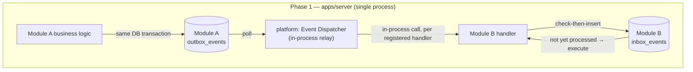

**Phase 3+ — Redpanda.** The dispatcher's relay half is replaced by a Kafka-wire-compatible producer that reads the same `outbox_events` tables and publishes to Redpanda topics (partitioned by `aggregate_id`, Section 18); each module's handlers become real consumer processes. **Nothing about the outbox write, the payload envelope, the inbox check, or the event catalog changes** — only the transport between "row written to outbox" and "handler invoked" does.

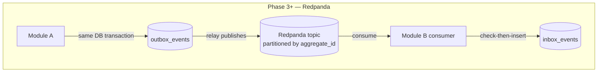

### 2.1 How an Event Moves Through the System — Step by Step

The full journey of a single event, from the fact becoming true to its eventual archival, is the same nine steps regardless of Phase 1 or Phase 3+ transport:

1. A module's business logic determines a fact has become true (e.g. evidence passed CEM §13 validation).
2. In the **same database transaction** as the business write, the module inserts one row into its own `outbox_events` table (Section 16), `dispatch_status = pending`.
3. The transaction commits — the fact and its announcement are now atomically durable.
4. The relay/dispatcher (Phase 1: in-process poller; Phase 3+: broker producer) picks up the pending row on its next poll cycle.
5. The event is delivered to every registered consumer for that `event_type` (Section 25's catalog is the registration list).
6. Each consumer's handler performs the Inbox check (Section 17) — insert-first, on the composite `(event_id, handler_name)` key.
7. If the insert succeeds (first delivery to this handler), the handler executes its business logic and marks the inbox row `processed`. If it fails (duplicate delivery), the handler skips — no side effects re-run.
8. The relay marks the outbox row `dispatched` once delivery to all registered consumers has been attempted; a handler failure moves the row to `failed` and into the retry loop (Section 14) instead.
9. After the retention window elapses (Section 20), the dispatched outbox row and its corresponding inbox rows are archived to cold storage and removed from the hot tables.

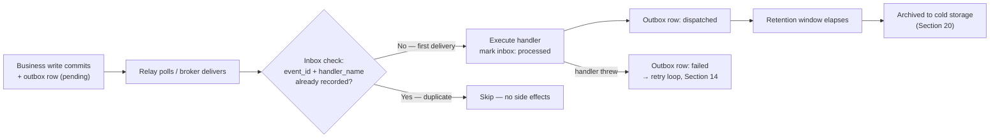

### 2.2 Dispatcher Requirements

Independent of language/framework (per this document's implementation-independence, matching `api-design.md`'s stance), the Phase 1 dispatcher must satisfy these properties — they are architectural requirements, not implementation choices:

- **Per-module poll, not one global poll.** The dispatcher polls each module's `outbox_events` table independently, so one module's backlog (Section 28) never delays another's dispatch.
- **Bounded batch size per poll cycle.** Pulling an unbounded number of pending rows in one cycle risks starving other modules' polls and creating unpredictable memory pressure — a fixed, configurable batch size per cycle is required.
- **At-least-once handoff to handlers, never fire-and-forget.** The dispatcher only marks a row `dispatched` after every registered handler has been invoked and either succeeded or been durably marked `failed` (Section 14) — never optimistically before confirming delivery.
- **Backpressure-aware.** If a handler is consistently slow, the dispatcher must not silently accumulate an ever-growing in-memory queue of pending invocations — it should throttle its own poll rate rather than fail in an unbounded way, since `system-design.md` §11's health/readiness checks depend on the dispatcher itself staying healthy.
- **Graceful shutdown drains in-flight work.** On process shutdown, the dispatcher completes (or safely aborts and leaves `pending`, never partially-processed) in-flight handler invocations rather than dropping them mid-flight — a partially-run handler with no inbox record is exactly the atomicity gap Section 16 exists to prevent.

## 3. Module Communication Model

Two styles, chosen per interaction — restated from `system-design.md` §5 with the decision rule made explicit:

| Use **request/response** (public interface) when… | Use an **event** when… |
|---|---|
| The caller needs an immediate answer to proceed (e.g. "does this evidence exist?") | The caller doesn't need to wait — "this happened, react if you care" |
| The operation must be transactionally consistent with the caller's own write | The operation is naturally asynchronous or best-effort |
| There is exactly one consumer, known at the call site | There may be zero, one, or several consumers, and the publisher shouldn't need to know which |

Request/response is the minority case in this system. The known Phase 1 instances:

| Caller → Callee | Why sync, not event |
|---|---|
| `case_management` → `ingestion`: does this `evidence_id` exist and pass validation? | `POST /cases/{id}/evidence` (`api-design.md` §4.7) needs an immediate yes/no to return the right HTTP status |
| `investigation` → `case_management`: what evidence is currently linked to this case? | A correlation run needs the case's evidence set at the moment it starts, not an eventually-consistent view |
| `entrypoints/http` → any module: fetch a single resource by ID for a `GET` | Direct API reads are always synchronous by nature — events model state *changes*, not state *queries* |

Everything else in Section 25's catalog is event-driven.

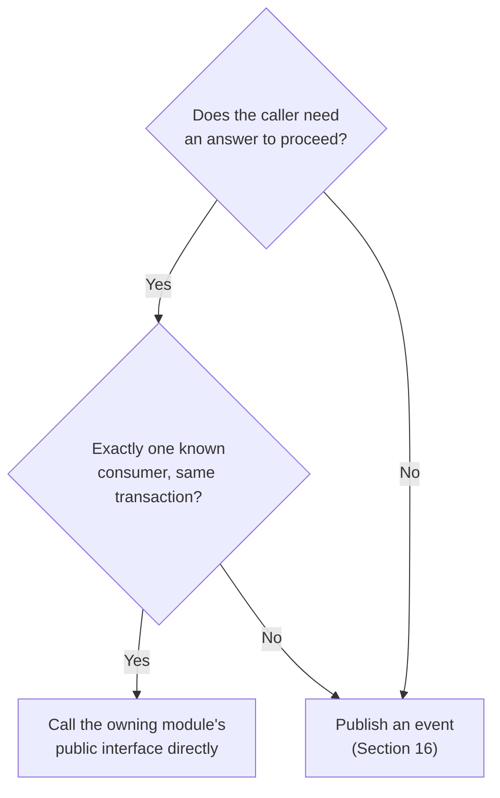

## 4. Domain Events vs. Integration Events

- **Domain events** are internal to a module's own bounded context — fine-grained state changes a module's own code cares about (e.g. `investigation` recalculating an entity's confidence score after a new mention). They may never leave the module and have no obligation to be stable or versioned.
- **Integration events** are the curated subset (or coarser-grained derivative) of domain events a module publishes for *other* modules to consume. A row in a module's `outbox_events` table **is** an integration event — publishing to the outbox is the act of promoting a domain fact into the public contract.

This distinction matters operationally: a module is free to refactor its internal domain events at will; changing an *integration* event is subject to Section 23's compatibility rules. Section 25's catalog documents integration events only — internal domain events are each module's own concern and out of scope for this document.

**Worked example.** When `investigation` scores a proposed relationship, it may internally fire several fine-grained domain events as evidence accumulates — "confidence recalculated: 0.4 → 0.55," "confidence recalculated: 0.55 → 0.65," each reflecting one more piece of corroborating evidence found. None of these individually becomes an integration event; they're `investigation`'s own business, refactorable at will. Only when an analyst disposes of the finding does `investigation` publish the integration event `investigation.finding_reviewed` — the one fact other modules actually need to know about, at the granularity they need it.

## 5. Event Ownership Rules

- **Every event type has exactly one owning (publishing) module**, matching the "every module owns its own schema" rule (`database-design.md` §1). Only the owning module may write rows of that `event_type` to any outbox table.
- **The owning module alone defines and versions that event type's payload schema** (Section 22). Consumers depend on the schema; they never redefine it.
- **A consumer may subscribe to any event type**, but the *subscription itself* is architecturally registered in Section 25's catalog — an undocumented subscription is a code-review violation, the same way an unregistered module boundary crossing is (`apps/server/README.md`'s module rules).
- **`investigation`'s subscription breadth is a deliberate, documented exception.** Every other module may only subscribe to events published by `platform`, `ingestion`, or `case_management` (the allowed direction of `database-design.md` §5's dependency DAG). `investigation` is additionally allowed to subscribe to `threat_intel.ioc_matched` — this is the concrete mechanism implementing "investigation is the sole cross-domain reader" (`system-design.md` §4), not a violation of it.
- Note that `investigation` does **not** need to subscribe to `osint.finding_captured`, `forensics.artifact_processed`, or `social_media.content_captured` directly — every domain module's raw finding eventually publishes into the canonical `evidence.ingested` event once normalized (CEM §9's pipeline), so subscribing to `evidence.ingested` alone covers all current *and future* evidence categories (mobile forensics, blockchain intelligence, drone/IoT, cloud evidence — CEM §5) without `investigation` ever needing a new subscription when a new domain module is added.

## 6. Event Naming Conventions

`<aggregate>.<past_tense_fact>`, all lowercase, `snake_case` within each segment, dot-separated, e.g. `evidence.ingested`, `case.status_changed`, `investigation.finding_reviewed`.

**The aggregate prefix names the primary subject of the fact, not necessarily the publishing module.** `evidence.linked_to_case` is published by `case_management` (the module performing the link), not by `ingestion` (which owns the `evidence` aggregate) — because the fact being announced is fundamentally about a change in evidence's relationship state, and readers should be able to find it by searching for "what can happen to evidence" without needing to already know which module caused it. The catalog's **Source** column (Section 25) is the authoritative record of which module actually publishes each event type; the name is a readability aid, not an ownership declaration.

Always past tense (`ingested`, not `ingest`) — an event describes something that already happened, never a command or request.

**Compliance check across the catalog** (Section 25 in full): every event name below satisfies `<aggregate>.<past_tense_fact>` — `evidence.ingested`, `evidence.superseded`, `evidence.linked_to_case`, `evidence.unlinked_from_case`, `case.created`, `case.status_changed`, `case.report_generated`, `osint.finding_captured`, `threat_intel.ioc_matched`, `forensics.artifact_processed`, `social_media.content_captured`, `investigation.correlation_generated`, `investigation.finding_reviewed`, `notification.dispatched`. None encodes a module name that isn't also a valid aggregate name — a naming-convention linter (a natural CI addition alongside the schema-compatibility check in Section 23) can mechanically verify this pattern.

## 7. Event Versioning

Every event type carries its own `event_version` (semver), independent of the CEM's `schema_version` (though related when a payload wraps CEM fields — Section 8). **MINOR** bump: an additive, backward-compatible payload change (new optional field, new enum value consumers must tolerate). **MAJOR** bump: a breaking payload change — handled by Section 23's dual-publish/deprecation process, never by silently changing an existing version's meaning.

**Worked example — a MINOR change:** `investigation.correlation_generated` ships at `1.0.0` with `{ case_id, relationship_id, confidence }`. Adding `entity_types_involved: [string]` to help `notification` render a richer message is a `1.1.0` MINOR bump — existing consumers ignore the new field and keep working unmodified. **Worked example — a MAJOR change:** later replacing the single `confidence` float with a structured `{ score, method }` object is a breaking shape change — it ships as `2.0.0`, published *alongside* `1.x` (both versions on the bus simultaneously) until every consumer (today: only `notification`) has migrated, per Section 23's dual-publish rule.

## 8. Event Payload Conventions

- `snake_case` fields, ISO 8601 UTC timestamps — identical conventions to `database-design.md` and `api-design.md`; there is one JSON convention across the whole platform, not one per layer.
- **Hybrid "thin event + reference" policy.** A payload carries enough denormalized data for the common-case consumer to act without a follow-up call (e.g. `evidence.ingested` includes `category`, `artifact_type`, and `title`, not just `evidence_id`), but never the full aggregate body and never large/sensitive payload content — a consumer that needs more fetches the full object via the owning module's public interface or API (`api-design.md`). This is both an efficiency choice (avoids a network round-trip for the common case once modules are extracted) and a security choice (Section 21) — sensitive evidence content doesn't need to transit the event bus at all.
- Where a payload represents a CEM evidence fact, its fields are a **subset** of the Core Evidence Object (CEM §2) using identical field names — never a re-shaped or renamed projection.

**Worked examples of the "thin event + reference" policy:**

| Event | What's inlined (thin) | What's referenced, not inlined |
|---|---|---|
| `evidence.ingested` | `category`, `artifact_type`, `title`, `collected_at` — enough for a consumer to decide *whether* it cares | `attributes` (may be large/sensitive) — a consumer that needs it calls `GET /evidence/{evidence_id}` |
| `investigation.finding_reviewed` | `relationship_id`, `disposition`, `reviewed_by` | The full relationship object and its `supporting_evidence_ids[]` — fetched via `GET /relationships/{id}` if needed |
| `case.status_changed` | `case_id`, `previous_status`, `new_status` | Case title/description — irrelevant to most consumers, which only need to know a transition happened |

## 9. Event Envelope Format

Every event, regardless of type, is wrapped in the same envelope — this is the full column set of every module's `outbox_events` table, extending `database-design.md` §3's compact listing with the metadata columns this document defines:

| Field | Type | Description |
|---|---|---|
| `event_id` | uuid | Globally unique identifier for this specific event instance |
| `event_type` | text | Per Section 6's naming convention |
| `event_version` | text | Semver of this event type's payload schema (Section 7) |
| `aggregate_type` | text | The kind of entity this event is about (`evidence`, `case`, `relationship`, ...) |
| `aggregate_id` | uuid | The specific entity — doubles as the Redpanda partition key (Section 18) |
| `payload` | jsonb | Event-specific data (Section 8) |
| `correlation_id` | uuid | Workflow-spanning identifier (Section 11) |
| `causation_id` | uuid, nullable | The event/request that directly caused this one (Section 11) |
| `trace_id` | text, nullable | W3C Trace Context identifier (Section 11) |
| `actor_type` | text | `user` \| `system` \| `connector` |
| `actor_ref` | uuid, nullable | Reference to `platform.users` or a connector identity |
| `occurred_at` | timestamptz | When the fact became true (not when it was published) |
| `dispatch_status` | text | `pending` \| `dispatched` \| `failed` \| `dead_letter` |
| `attempt_count` | integer | Dispatch attempts so far |
| `last_attempted_at` | timestamptz, nullable | |
| `last_error` | text, nullable | |
| `dispatched_at` | timestamptz, nullable | |

**Illustrative envelope instances** (data, not implementation — the same style of example used throughout `canonical-evidence-model.md` §14 and `api-design.md`):

```json
{
  "event_id": "b7e1...",
  "event_type": "evidence.ingested",
  "event_version": "1.0.0",
  "aggregate_type": "evidence",
  "aggregate_id": "1f3b2e2a-...",
  "payload": { "category": "mobile_forensics", "artifact_type": "sms_mms_message", "title": "SMS extracted from device DEV-4471", "collected_at": "2026-06-02T14:03:00Z" },
  "correlation_id": "corr_C1",
  "causation_id": "req_1",
  "trace_id": "00-4bf9...-00f0...-01",
  "actor_type": "user",
  "actor_ref": "examiner:priya.n",
  "occurred_at": "2026-06-02T18:41:12Z",
  "dispatch_status": "dispatched",
  "attempt_count": 1
}
```

```json
{
  "event_id": "c2f4...",
  "event_type": "investigation.finding_reviewed",
  "event_version": "1.0.0",
  "aggregate_type": "relationship",
  "aggregate_id": "9c6e1073-...",
  "payload": { "case_id": "9c6e1073-...", "relationship_id": "9c6e1073-...", "disposition": "confirmed", "reviewed_by": "8b5d0f62-..." },
  "correlation_id": "corr_C1",
  "causation_id": "req_3",
  "trace_id": "00-4bf9...-02c1...-01",
  "actor_type": "user",
  "actor_ref": "8b5d0f62-...",
  "occurred_at": "2026-07-19T12:05:00Z",
  "dispatch_status": "pending",
  "attempt_count": 0
}
```

## 10. Event Metadata

**Metadata** (everything in the envelope except `payload`) answers "what happened, when, why, and as part of what" — it is uniform across every event type and is never business data. **Payload** is the only field whose shape varies by `event_type`. This separation is what lets the dispatcher, retry logic, DLQ handling, and observability tooling (Section 28) treat every event identically regardless of its business meaning — none of that infrastructure ever needs to parse `payload`.

## 11. Correlation IDs, Causation IDs, and Trace IDs

Three distinct identifiers, each answering a different question, easy to conflate and deliberately kept separate:

| ID | Question it answers | Scope | Origin |
|---|---|---|---|
| **`correlation_id`** | "Which business workflow does this belong to?" | Spans an entire multi-step workflow (evidence ingested → linked → correlated → reviewed → notified) | Set at the originating HTTP request (`api-design.md` §2.8's `X-Correlation-Id`) and propagated unchanged through every event the workflow produces |
| **`causation_id`** | "What exactly, one hop back, caused this?" | One link in a causal chain | The `event_id` (or API `X-Request-Id`) of the immediate trigger; forms a traceable causal DAG when followed backward event-by-event |
| **`trace_id`** | "What was the technical execution path, for latency/debugging?" | A single technical operation, possibly spanning process/network boundaries | W3C Trace Context, generated at the entrypoint, becomes a true distributed trace ID with no format change after Phase 5 extraction (`system-design.md` §12) |

A single event carries all three. `correlation_id` lets an analyst or auditor ask "show me everything that happened because of this evidence submission." `causation_id` lets an engineer ask "exactly which event produced this one?" — reconstructable by following `causation_id` backward until reaching a null (the workflow's origin). `trace_id` is for APM/observability tooling and has no business meaning.

```mermaid
flowchart LR
    R["HTTP request<br/>request_id=req1"] -->|"X-Correlation-Id: C1<br/>(client-supplied or minted here)"| E1["evidence.ingested<br/>correlation_id=C1, causation_id=req1"]
    E1 -->|"same correlation_id,<br/>new causation_id"| E2["threat_intel.ioc_matched<br/>correlation_id=C1, causation_id=E1"]
    E2 -->|"same correlation_id,<br/>new causation_id"| E3["investigation.correlation_generated<br/>correlation_id=C1, causation_id=E2"]
    E3 -->|"same correlation_id,<br/>new causation_id"| E4["notification.dispatched<br/>correlation_id=C1, causation_id=E3"]
```

One `correlation_id` (`C1`) threads the entire workflow above; each event's `causation_id` points only one hop backward, so the causal chain is reconstructable by walking `causation_id` links even though every event shares the same `correlation_id`. A `trace_id` (not shown) would also be present on each, but changes at every process/network boundary rather than staying constant like `correlation_id` does.

## 12. Idempotency Strategy

Because delivery is at-least-once (Section 13), **every event handler must be idempotent** — this extends `system-design.md` §6's principle from "in-process handler" to the full lifecycle described in this document. Two layers of protection, both required:

1. **Mechanical idempotency (Section 17's Inbox Pattern):** a handler that has already recorded `(event_id, handler_name)` in its `inbox_events` table skips re-processing entirely. This guards against re-delivery of the *same* event.
2. **Business idempotency (a natural key, per event, documented in Section 25's catalog):** guards against a *different* event converging on the same effect — e.g. two independent correlation runs both proposing "IOC X matched evidence Y" should not create two `ioc_evidence_matches` rows; the natural key `(ioc_id, evidence_id)` is enforced regardless of which event or how many times it fires.

**Distinct from, and complementary to, the API layer's idempotency keys.** `api-design.md` §2.9's `Idempotency-Key` header protects a *client's* retried HTTP request from double-creating a resource. This section's Inbox Pattern protects an *internal handler* from double-processing a redelivered event. The two operate at different boundaries and both apply on a single workflow: a retried `POST /evidence` is deduplicated by the API-level key before it ever reaches the database; the resulting `evidence.ingested` event, once published, is separately deduplicated by each consumer's Inbox check if the *bus* redelivers it. Neither mechanism substitutes for the other.

**Why both layers are necessary, illustrated:** if `threat_intel`'s outbox relay retries a delivery of `threat_intel.ioc_matched` to `investigation` after a network blip (the *same* `event_id` redelivered), layer 1 (Inbox) catches it — `investigation`'s handler sees `(event_id, handler_name)` already recorded and skips. But if a second, independent correlation run *also* discovers the same IOC/evidence match and publishes a *new* `event_id` for what is logically the same fact, layer 1 does nothing — the `event_id` really is new. Layer 2 (the natural key `(ioc_id, matched_evidence_id)` on the resulting `ioc_evidence_matches` row) is what prevents a duplicate row in that case. Neither layer alone is sufficient; they guard against different failure modes.

## 13. Delivery Guarantees: Exactly-Once vs. At-Least-Once

**The event bus itself guarantees at-least-once delivery — never exactly-once, and this is a deliberate choice, not a limitation to work around.** Both Phase 1's in-process relay (retries on handler failure) and Phase 3+ Redpanda (broker-level at-least-once semantics) can and will redeliver an event. **Effective exactly-once *processing*** is achieved at the application layer, not the transport layer: the Outbox Pattern (Section 16) guarantees an event is eventually published if and only if its causing transaction committed (no lost events, no phantom events), and the Inbox Pattern (Section 17) guarantees a delivered event's effect is applied only once even under redelivery. This is the standard, industry-accepted way to achieve exactly-once *semantics* without needing exactly-once *delivery* — attempting the latter directly is both harder and unnecessary given the former two patterns.

## 14. Retry Strategy

Named, reusable retry policies — referenced by name in Section 25's catalog rather than repeated per event:

| Policy | Attempts | Backoff | On exhaustion |
|---|---|---|---|
| **Standard** | 5 | Exponential with jitter: 1s, 2s, 4s, 8s, 16s | → Dead Letter Queue (Section 15) |
| **Critical-fast** | 3 | 500ms, 2s, 5s | → DLQ + immediate ops alert (used for user-facing latency-sensitive chains, e.g. notification dispatch) |
| **Best-effort** | 2 | 2s, 10s | → DLQ with a metric increment only, no alert (used for low-stakes/informational events) |

Retries happen at the **dispatch/consume** layer — a failed handler invocation is retried against the *same* outbox row; the event is never re-published as a new `event_id`. Numeric values above are recommended defaults, tunable per deployment, not a hard contract (consistent with how `api-design.md` §2.13 treats rate-limit quotas).

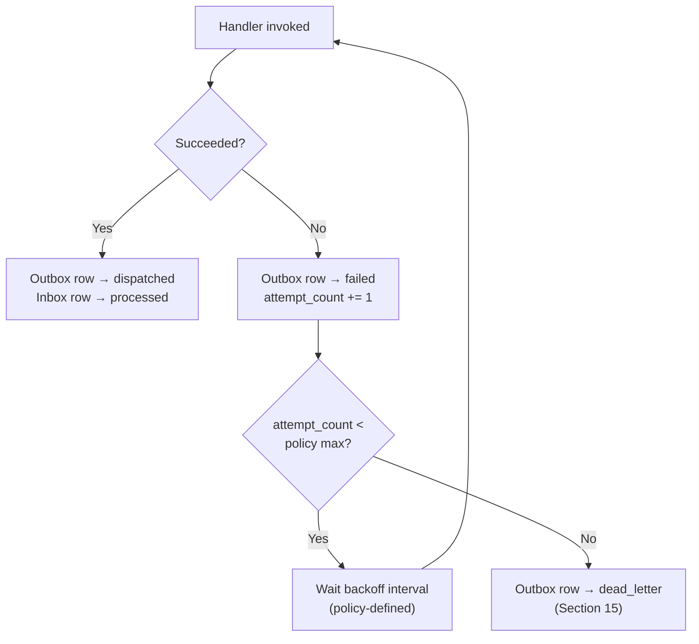

## 15. Dead Letter Queue Strategy

**Phase 1:** there is no separate DLQ table — `dispatch_status = 'dead_letter'` on the outbox row itself, alongside `attempt_count`, `last_error`, and `last_attempted_at` (Section 9's envelope already carries everything needed). This keeps the model to one table per module rather than introducing a parallel structure. **Phase 3+:** Redpanda's native dead-letter-topic pattern is used instead, with the same envelope fields preserved in the DLQ message.

A dead-lettered event is never silently dropped. It requires one of: manual operator remediation and requeue (reset `dispatch_status` to `pending`), a code fix followed by requeue, or an explicit, logged decision that the event is permanently non-actionable (recorded, not deleted — Section 20). Dead-lettering an event that represents a chain-of-custody-significant fact (e.g. a failed `evidence.ingested` dispatch) additionally raises through `platform.audit_log`, since a stuck evidentiary event is a compliance concern, not just an operational one.

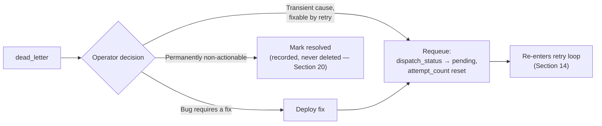

## 16. The Outbox Pattern

**The mechanism that makes "publish" atomic with the business state change it announces.** A module's write path, in one database transaction: (1) write/update its own business rows, (2) insert one row into its own `outbox_events` table. Both commit together or neither does — there is no window where the state change happened but the event was lost, and no window where the event exists but the state change didn't happen. A separate process (the Phase 1 dispatcher or the Phase 3+ relay, Section 2) polls for `dispatch_status = 'pending'` rows, attempts delivery, and updates status — this process runs *after* the transaction, fully decoupled from it.

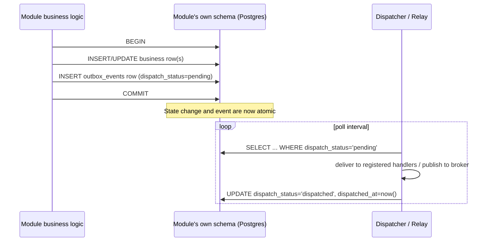

Table schema: Section 9's full envelope, one physical table per module (`ingestion.outbox_events`, `case_management.outbox_events`, etc.) — never centralized, per `database-design.md` §2's ownership rule; the dispatcher is the one sanctioned piece of infrastructure allowed to poll across schemas, and only this generic table shape, never business tables.

## 17. The Inbox Pattern

**The consumer-side companion that makes handling idempotent under at-least-once delivery.** Every consuming module owns an `inbox_events` table:

| Field | Type | Description |
|---|---|---|
| `event_id` | uuid | The source event's ID (app-ref to the publisher's outbox row — unenforced, per `database-design.md` §5's no-cross-schema-FK rule) |
| `handler_name` | text | Which handler within this module processed it — composite primary key with `event_id`, since one module may register multiple independent handlers for the same event type |
| `received_at` | timestamptz | |
| `processing_status` | text | `processing` \| `processed` \| `failed` |
| `processed_at` | timestamptz, nullable | |
| `attempt_count` | integer | |
| `last_error` | text, nullable | |

The handler attempts an `INSERT` of `(event_id, handler_name)` **before** doing any work. If the insert fails on the composite primary key (row already exists), this exact handler has already seen this exact event — skip, no side effects re-run. If the insert succeeds, proceed, then update `processing_status`.

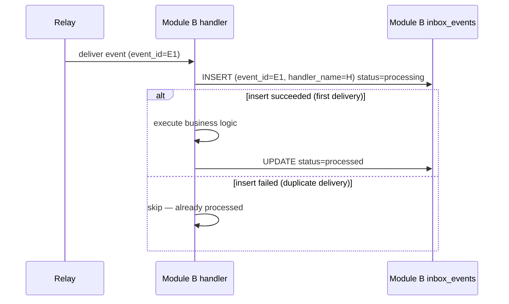

## 18. Event Ordering Guarantees

**Guaranteed:** events concerning the *same aggregate* (same `aggregate_id`) are delivered and processed in the order they were published. Phase 1's relay processes each module's outbox table in `event_id`/insertion order; Phase 3+ Redpanda preserves this by partitioning topics on `aggregate_id`, so all events for one `evidence_id` or `case_id` land on the same partition and are consumed in order.

**Not guaranteed:** any ordering across *different* aggregates, or across different event types. `evidence.ingested` for item A and `evidence.ingested` for item B may be processed in either order or in parallel — handlers must not assume otherwise. Consumers requiring a strict cross-aggregate sequence (rare, and generally a sign the workflow should be redesigned) must implement their own sequencing via the `causation_id` chain (Section 11), not rely on bus-level ordering.

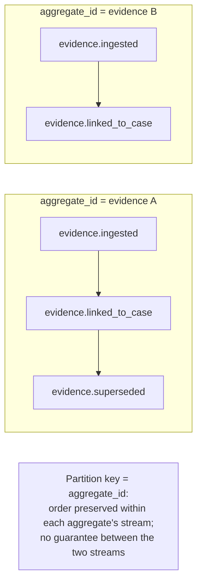

## 19. Event Replay

Replay means re-delivering historical events to reconstruct state or recover from a bug. **Phase 1:** since dispatched outbox rows are retained (Section 20), replay is resetting `dispatch_status` to `pending` for a selected range/filter and letting the relay redeliver — a future administrative capability, not exposed in `api-design.md` today, but the data model already supports it without change. **Phase 3+:** Redpanda's log retention allows a consumer group to rewind its offset and reprocess a historical range natively.

**Replay is only safe because of Section 17's Inbox Pattern.** A replayed event is, from a handler's perspective, indistinguishable from a redelivered one — the same idempotency check applies. The one deliberate caution: handlers with an externally-visible, non-idempotent-by-nature side effect (most notably `notification`'s delivery of an email/chat message) must guard *especially* tightly on their inbox check, since replaying `investigation.correlation_generated` should never re-send an email an analyst already received — this is called out explicitly in Section 25's `notification` consumer table.

**Worked example.** Suppose a bug in `investigation`'s confidence-scoring logic is fixed, and the team wants historical `evidence.ingested` events reprocessed so already-created (but under-scored) proposed relationships get recalculated. The operator selects the affected `evidence_id` range, resets those rows' `dispatch_status` to `pending` in `ingestion.outbox_events`, and the relay redelivers them. `investigation`'s handler re-runs (its inbox check on the *original* `event_id` will show `processed` — so the operator additionally clears the corresponding `investigation.inbox_events` rows for the `recalculate_confidence` handler specifically, a deliberate, logged, narrow operation, not a blanket inbox wipe). `notification`'s handler is untouched by this replay, since it isn't subscribed to `evidence.ingested` — no risk of a spurious re-notification from this particular replay.

## 20. Event Retention and Archival

- **Retention (hot table):** dispatched outbox rows are retained in their live table for a recommended 90 days (supports replay and debugging of recent workflows) before archival; dead-lettered rows are retained until explicitly resolved — never auto-purged, regardless of age. `inbox_events` rows follow the same 90-day default, covering the maximum plausible retry/replay window.
- **Archival (cold storage):** rows older than the retention window are exported to the same S3-compatible object storage already provisioned for evidence (`system-design.md` §9), in a dedicated bucket, and removed from the hot table — this is the same pattern `database-design.md` §12 already establishes for database backups, applied to event history. `outbox_events` and `inbox_events` are themselves candidates for the time-range partitioning strategy in `database-design.md` §7, for the same reasons `evidence` and `audit_log` are.
- **Legal-hold awareness carries through.** If an archived event's `payload` references evidence under legal hold, that event's archival copy is excluded from any retention-driven deletion, mirroring `database-design.md` §7 and §12's legal-hold exclusion rules exactly — an event about held evidence is itself part of the record that must survive.

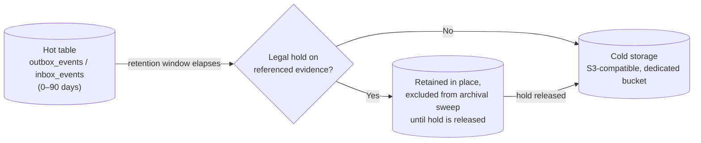

## 21. Event Security and Signing

- **Transport:** Phase 1's in-process relay has no network exposure at all. Phase 3+ Redpanda requires TLS between all producers/consumers and the broker, plus SASL or mTLS authentication — the event bus gets its own access control, distinct from `api-design.md`'s bearer-token model, since modules (not end users) are the actors here.
- **Payload sensitivity:** Section 8's "thin event + reference" policy is also a security control, not just an efficiency one — evidence-derived events avoid embedding sensitive content inline, preferring an `evidence_id` reference a consumer resolves (with its own authorization check) via the owning module's interface. An event should never be a way to bypass the access control a direct `GET /evidence/{id}` call would enforce.
- **Publisher authentication:** every outbox write is attributed to `actor_type`/`actor_ref` (Section 9); connector/system accounts publishing events authenticate the same way they do at the API layer (`api-design.md` §3).
- **Event integrity hash (Phase 1+):** events representing chain-of-custody- or audit-significant facts (`evidence.ingested`, `evidence.superseded`, `case.status_changed`, `investigation.finding_reviewed`) carry a hash of their `payload`, computed at publish time, checkable by any consumer to detect in-transit or at-rest tampering — a lightweight extension of the same hashing already used for `evidence_custody_events` and `audit_log` (`database-design.md` §4, §10), applied here at the event level.
- **Full asymmetric event signing (Phase 4+, open question):** cryptographic signing with per-module signing keys, for deployments needing cross-trust-boundary event verification (e.g. federated/multi-agency scenarios in the PRD's Future Roadmap). Not a Phase 1 requirement — flagged here as an open item requiring an ADR before adoption, consistent with how `system-design.md` treats other consequential, not-yet-decided infrastructure additions.

**Compliance mapping** — this section is how the event bus satisfies the PRD security requirements that apply to it specifically:

| PRD requirement | How this section satisfies it |
|---|---|
| SR-1 (encryption at rest/in transit) | Phase 1: envelope+payload stored in Postgres under the same at-rest encryption as every other table; Phase 3+: TLS to Redpanda |
| SR-4 (tamper-evident audit, even administrators can't silently edit) | Event integrity hash on audit-significant events (this section); the outbox/inbox tables themselves are append-only per `database-design.md` §8 |
| SR-9 (prompt-injection/exfiltration risk from untrusted content) | Thin-event policy (Section 8) means raw OSINT/social-media text never transits the bus as a payload field an AI handler blindly trusts — `investigation`'s handlers fetch and re-validate content through `ingestion`'s interface, which is the CEM §13 validation boundary, not the event bus |

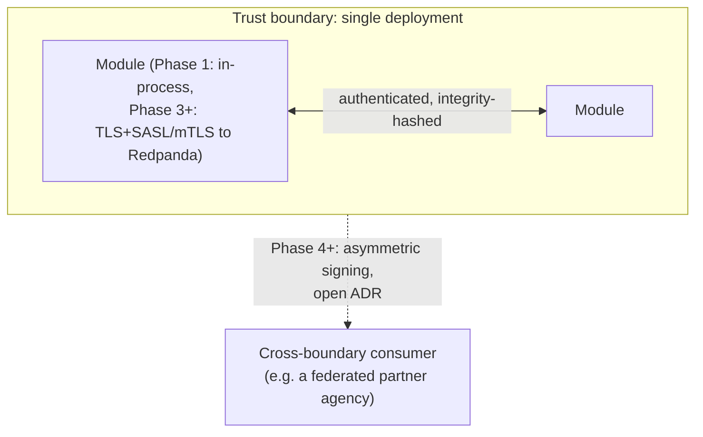

## 22. Event Validation, Authorization, and Schemas

- **Schema registry.** `platform.event_schema_registry` (`event_type`, `event_version`, `owning_module`, `payload_schema`, `is_active`) — the event-bus counterpart to CEM's `attribute_schema_registry` (`database-design.md` §3.2). Every event type's payload shape is registered here before it can be published.
- **Validation happens twice.** At publish time, in the *same transaction* as the outbox write (Section 16) — an invalid payload never gets a chance to be written, let alone dispatched. At consume time, again, defense-in-depth — a consumer does not trust the wire even though the platform itself produced the message, which matters once Phase 5 extraction puts a real network boundary between producer and consumer.
- **Authorization to publish** is enforced by checking the calling module's identity against `event_schema_registry.owning_module` for the `event_type` being written — a module cannot write another module's event type to its own outbox even by mistake.
- **Authorization to consume** is, in Phase 1, technically unenforceable at runtime (one process, one memory space) — it is enforced architecturally, the same way module-boundary violations are: an undocumented subscription is caught in code review against Section 25's catalog, not by a runtime gate. Phase 3+ Redpanda ACLs make this a real, enforced technical control once consumers are separate processes.

**Illustrative registry row:**

| `event_type` | `event_version` | `owning_module` | `is_active` |
|---|---|---|---|
| `investigation.correlation_generated` | `1.0.0` | `investigation` | `true` |

Any outbox write attempting `event_type = investigation.correlation_generated` from a module identity other than `investigation` is rejected at the same layer that performs Section 26's payload validation — ownership and shape are checked together, in one place, before the row is ever committed.

## 23. Event Evolution and Compatibility Rules

Mirrors `api-design.md` §14 exactly, applied to events instead of endpoints:

- **Additive changes** (new optional payload field, new event type, new enum value within an existing field) are always safe and never require a version bump. **Every consumer must ignore unknown fields and unknown event types without failing** — the dispatcher itself must never crash on an event type it has no registered handler for.
- **Breaking changes** (removing/renaming a field, changing a field's meaning or type, tightening what was previously optional) require a `event_version` MAJOR bump and a **dual-publish period**: the owning module publishes both the old and new version of the event type until every known consumer has migrated, then retires the old version with advance notice — the direct event-bus analogue of `api-design.md`'s `/v1`/`/v2` deprecation window.
- **Coherence with the CEM and the API.** An event payload derived from CEM fields (Section 8) that changes shape because of a CEM MAJOR version bump (CEM §12) is, by definition, a breaking event change too — the CEM schema version, any affected event's `event_version`, and any affected API version (`api-design.md` §14) must be bumped and recorded together, not independently, exactly as `api-design.md` already specifies for its own layer.
- **Backward-compatibility checks are a CI concern**, extending the existing `pr-validation.yml` pattern (`.github/workflows/`) once event schema files exist to lint — a schema change that isn't a valid MINOR extension of the previous version should fail the pipeline before merge, not be caught in production.

## 24. Event Discovery

This document — specifically Section 25's catalog — **is** the primary discovery mechanism: the definitive, human-readable answer to "what events exist and who publishes/consumes them." At runtime, `platform.event_schema_registry` (Section 22) serves as a live, queryable mirror of the same information, intended to back a future administrative endpoint (e.g. `GET /api/v1/admin/events/catalog`, not yet defined in `api-design.md`) for tooling and dashboards — noted here as a forward-pointer, not specified further, since new API endpoints are `api-design.md`'s concern, not this document's.

## 25. Event Catalog

The complete published/consumed event inventory per module. "Idempotency Key" in the Consumed tables is the **business-level** natural key (Section 12, layer 2) enforced in addition to — never instead of — the generic `(event_id, handler_name)` Inbox check.

**At a glance:**

| Module | Publishes | Consumes | Notes |
|---|---|---|---|
| `platform` | 4 | 0 | Base of the dependency DAG; publishes identity-lifecycle facts, depends on nothing |
| `ingestion` | 3 | 0 | Pure publisher — triggered by API calls, not events |
| `osint` | 2 | 0 | Pure publisher |
| `threat_intel` | 2 | 1 | The only domain-producer module that consumes (`evidence.ingested`, for IOC matching) |
| `forensics` | 2 | 0 | Pure publisher |
| `social_media` | 2 | 0 | Pure publisher |
| `case_management` | 5 | 1 | Consumes `investigation.finding_reviewed` without storing a reference back (§5, §25.7) |
| `investigation` | 3 | 4 | Broadest subscription set by design — the sole cross-domain reader (§5) |
| `notification` | 2 | 3 | Terminal consumer; tightest idempotency keys in the system (replay-safety, §19) |

**Representative payload schemas** (three more of the catalog's higher-traffic events, in full — every other event's payload follows the same "key fields" style shown in each row below and is registered in `platform.event_schema_registry`, Section 22):

`threat_intel.ioc_matched` (`event_version: 1.0.0`):

| Field | Type | Required |
|---|---|---|
| `ioc_id` | uuid | yes |
| `matched_evidence_id` | uuid | yes |
| `indicator_type` | text | yes |
| `confidence` | numeric | yes |
| `matched_at` | timestamptz | yes |

`case.status_changed` (`event_version: 1.0.0`):

| Field | Type | Required |
|---|---|---|
| `case_id` | uuid | yes |
| `previous_status` | text | yes |
| `new_status` | text | yes |
| `actor_user_id` | uuid | yes |
| `changed_at` | timestamptz | yes |

`investigation.correlation_generated` (`event_version: 1.0.0`):

| Field | Type | Required |
|---|---|---|
| `case_id` | uuid | yes |
| `relationship_id` | uuid, nullable | one of `relationship_id`/`entity_id` |
| `entity_id` | uuid, nullable | one of `relationship_id`/`entity_id` |
| `confidence` | numeric | yes |
| `generated_by` | text | yes — model/run reference, per CEM §10's `created_by` |

### 25.1 `platform`

**Published**

| Event | Trigger | Payload (key fields) | Consumers | Retry Policy |
|---|---|---|---|---|
| `user.created` | Admin creates a user (`api-design.md` §4.1) | `user_id`, `email`, `roles` | none registered today | Best-effort |
| `user.disabled` | Admin disables a user | `user_id` | none registered today | Best-effort |
| `role.granted` | Role assigned to a user | `user_id`, `role_id` | none registered today | Best-effort |
| `role.revoked` | Role removed from a user | `user_id`, `role_id` | none registered today | Best-effort |

**Consumed:** none. `platform` sits at the base of `database-design.md` §5's dependency DAG and is referenced by every other module, but references nothing itself — consistent with it publishing identity-lifecycle facts for future use without depending on any other module's state today.

### 25.2 `ingestion`

**Published**

| Event | Trigger | Payload (key fields) | Consumers | Retry Policy |
|---|---|---|---|---|
| `evidence.ingested` | `POST /evidence` commits (CEM §13 validation passes) | `evidence_id`, `category`, `artifact_type`, `collected_at`, `collector_user_id` | `threat_intel`, `investigation` | Standard |
| `evidence.superseded` | `POST /evidence/{id}/supersede` commits | `evidence_id` (original), `supersedes_by_evidence_id` | `investigation` | Standard |
| `evidence.validation_failed` | A submitted evidence object fails CEM §13 validation | `intake_id`, `errors[]` | none registered today (dashboard/ops use) | Best-effort |

**Consumed:** none — `ingestion` is a pure publisher in Phase 1, triggered by direct API/interface calls, not by other modules' events.

### 25.3 `osint`

**Published**

| Event | Trigger | Payload (key fields) | Consumers | Retry Policy |
|---|---|---|---|---|
| `osint.finding_captured` | A connector or manual entry creates a finding | `finding_id`, `source_id`, `reliability_rating` | none registered today (findings reach `investigation` only via `evidence.ingested` after publish, per Section 5) | Best-effort |
| `osint.source_activated` / `osint.source_deactivated` | Admin toggles a source | `source_id` | none registered today | Best-effort |

**Consumed:** none — `osint`'s work is driven by its own connector polling schedule (Section 3's "no immediate answer needed" case), never by another module's state changes.

### 25.4 `threat_intel`

**Published**

| Event | Trigger | Payload (key fields) | Consumers | Retry Policy |
|---|---|---|---|---|
| `threat_intel.ioc_registered` | New IOC created | `ioc_id`, `indicator_type`, `value` | none registered today | Best-effort |
| `threat_intel.ioc_matched` | `threat_intel` finds one of its IOCs present in newly ingested evidence | `ioc_id`, `matched_evidence_id`, `confidence` | `investigation` (Section 5's documented exception) | Standard |

**Consumed**

| Event | Source Module | Handler Action | Idempotency Key | Retry Policy |
|---|---|---|---|---|
| `evidence.ingested` | `ingestion` | Scan the new evidence's `attributes` against active IOCs; publish `threat_intel.ioc_matched` for each hit | `(ioc_id, matched_evidence_id)` — never create a duplicate match row for the same pair | Standard |

### 25.5 `forensics`

**Published**

| Event | Trigger | Payload (key fields) | Consumers | Retry Policy |
|---|---|---|---|---|
| `forensics.artifact_registered` | `POST /forensics/artifacts` commits | `artifact_id`, `artifact_kind` | none registered today | Best-effort |
| `forensics.artifact_processed` | Artifact parsing/normalization completes | `artifact_id`, `evidence_id` (once published) | none registered today (reaches `investigation` via `evidence.ingested`) | Standard |

**Consumed:** none — like `osint`, `forensics` is driven by examiner action and its own processing pipeline, not by subscribing to other modules.

### 25.6 `social_media`

**Published**

| Event | Trigger | Payload (key fields) | Consumers | Retry Policy |
|---|---|---|---|---|
| `social_media.content_captured` | Connector or manual entry captures content | `content_id`, `platform`, `account_handle` | none registered today (reaches `investigation` via `evidence.ingested`) | Best-effort |
| `social_media.account_registered` | New account added for monitoring | `account_id`, `platform` | none registered today | Best-effort |

**Consumed:** none — the same rationale as `osint` and `forensics`; all three domain-producer modules are pure publishers except `threat_intel`, whose matching logic specifically needs to react to new evidence arriving (Section 5).

### 25.7 `case_management`

**Published**

| Event | Trigger | Payload (key fields) | Consumers | Retry Policy |
|---|---|---|---|---|
| `case.created` | `POST /cases` commits | `case_id`, `owning_user_id` | none registered today | Standard |
| `case.status_changed` | `POST /cases/{id}/status` commits | `case_id`, `previous_status`, `new_status` | `notification` | Standard |
| `evidence.linked_to_case` | `POST /cases/{id}/evidence` commits | `case_id`, `evidence_id` | `investigation` | Standard |
| `evidence.unlinked_from_case` | `DELETE /cases/{id}/evidence/{evidence_id}` commits | `case_id`, `evidence_id` | `investigation` | Standard |
| `case.report_generated` | Report generation job (`api-design.md` §7) completes | `case_id`, `report_id` | `notification` | Critical-fast |

**Consumed**

| Event | Source Module | Handler Action | Idempotency Key | Retry Policy |
|---|---|---|---|---|
| `investigation.finding_reviewed` | `investigation` | Append a `case_status_history` row summarizing the disposition, **in `case_management`'s own vocabulary — no stored pointer into `investigation`'s tables**, per `database-design.md` §5's acyclicity rule | `(case_id, relationship_id, disposed_at)` used only to compute the natural key for the inbox check — never persisted as a foreign reference | Standard |

### 25.8 `investigation`

**Published**

| Event | Trigger | Payload (key fields) | Consumers | Retry Policy |
|---|---|---|---|---|
| `investigation.correlation_run_completed` / `_failed` | An AI correlation run finishes | `run_id`, `case_id`, `findings_generated_count` | `notification` | Standard |
| `investigation.correlation_generated` | A new proposed entity/relationship is created | `case_id`, `relationship_id` or `entity_id`, `confidence` | `notification` | Standard |
| `investigation.finding_reviewed` | An analyst confirms/rejects a proposed finding | `case_id`, `relationship_id`, `disposition`, `reviewed_by` | `case_management` | Standard |

**Consumed**

| Event | Source Module | Handler Action | Idempotency Key | Retry Policy |
|---|---|---|---|---|
| `evidence.ingested` | `ingestion` | Index new evidence for correlation candidacy | `evidence_id` (inbox check alone is sufficient — indexing is naturally idempotent per-item) | Standard |
| `evidence.linked_to_case` | `case_management` | Mark evidence eligible for this case's correlation runs | `(case_id, evidence_id)` | Standard |
| `evidence.unlinked_from_case` | `case_management` | Mark evidence ineligible; does not retroactively invalidate already-`confirmed` relationships | `(case_id, evidence_id)` | Standard |
| `threat_intel.ioc_matched` | `threat_intel` | Consider the match as correlation input for the case owning the matched evidence | `(ioc_id, matched_evidence_id)` | Standard |

### 25.9 `notification`

**Published**

| Event | Trigger | Payload (key fields) | Consumers | Retry Policy |
|---|---|---|---|---|
| `notification.dispatched` | A notification is successfully delivered on a channel | `notification_id`, `channel` | none registered today (ops/metrics use) | Best-effort |
| `notification.delivery_failed` | A delivery attempt exhausts its channel-level retries | `notification_id`, `channel`, `error` | none registered today (ops alerting use) | Best-effort |

**Consumed**

| Event | Source Module | Handler Action | Idempotency Key | Retry Policy |
|---|---|---|---|---|
| `investigation.correlation_generated` | `investigation` | Create and dispatch a notification to the case's assigned investigator(s) | `(recipient_user_id, source_module='investigation', source_reference_id=relationship_id)` — **the tightest idempotency key in the catalog**, since a replayed event must never re-send an email the analyst already received (Section 19) | Critical-fast |
| `case.status_changed` | `case_management` | Notify assigned investigator(s) of the transition | `(recipient_user_id, source_reference_id=case_id, new_status)` | Critical-fast |
| `case.report_generated` | `case_management` | Notify the requester the report is ready for download | `(recipient_user_id, source_reference_id=report_id)` | Critical-fast |

## 26. Complete Event Lifecycle

**State machine for a single event, from creation to terminal state:**

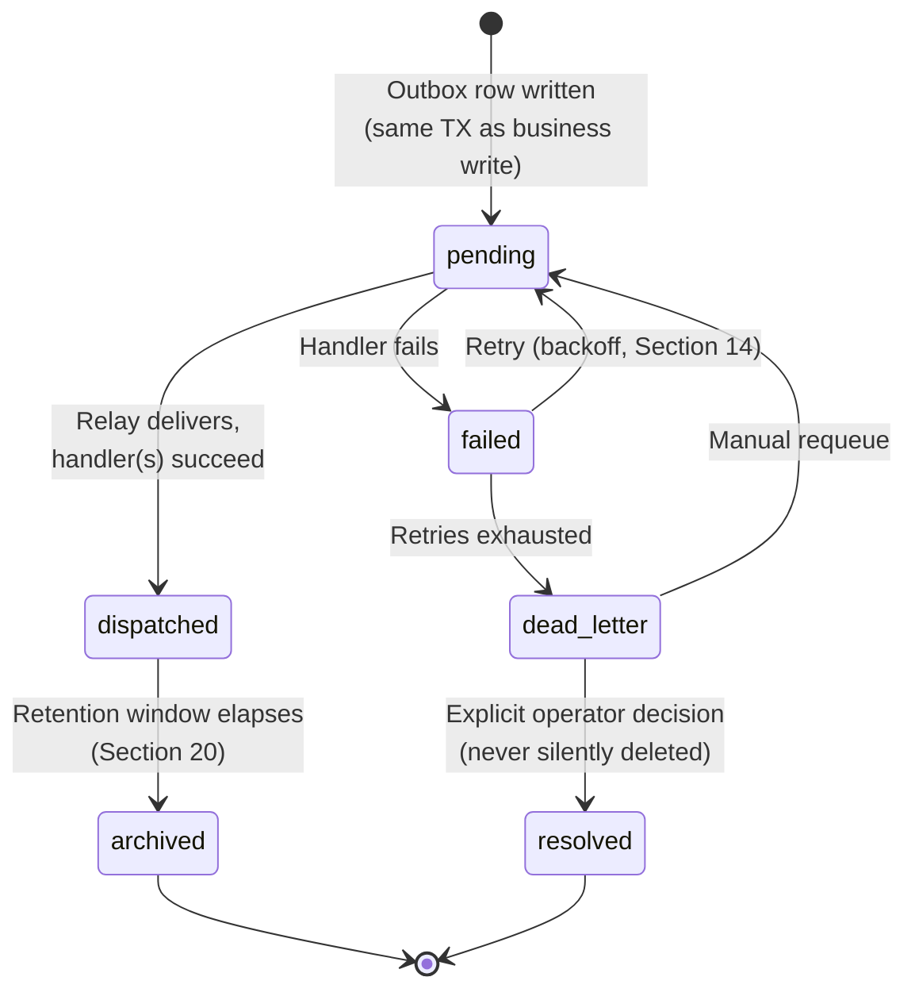

**End-to-end cross-module trace, tying the whole catalog together** (a single `correlation_id` spans every step; each event's `causation_id` points at the one before it):

```mermaid
sequenceDiagram
    participant Analyst
    participant ING as ingestion
    participant CASE as case_management
    participant TI as threat_intel
    participant INV as investigation
    participant NOTIF as notification

    Analyst->>ING: POST /evidence
    ING->>ING: outbox: evidence.ingested (corr=C1, cause=req1)
    ING-->>TI: (relay) evidence.ingested
    TI->>TI: match against IOCs
    TI->>TI: outbox: threat_intel.ioc_matched (corr=C1, cause=evt-ingested)
    TI-->>INV: (relay) threat_intel.ioc_matched
    Analyst->>CASE: POST /cases/{id}/evidence
    CASE->>CASE: outbox: evidence.linked_to_case (corr=C1, cause=req2)
    CASE-->>INV: (relay) evidence.linked_to_case
    INV->>INV: correlate; propose relationship
    INV->>INV: outbox: investigation.correlation_generated (corr=C1, cause=evt-linked)
    INV-->>NOTIF: (relay) investigation.correlation_generated
    NOTIF->>Analyst: notification: new correlation to review
    Analyst->>INV: PATCH /relationships/{id}/status (confirmed)
    INV->>INV: outbox: investigation.finding_reviewed (corr=C1, cause=req3)
    INV-->>CASE: (relay) investigation.finding_reviewed
    CASE->>CASE: append case_status_history
```

### 26.1 Failure Scenario Walkthroughs

**Scenario: a handler bug causes repeated failures.** `investigation`'s `evidence.ingested` handler throws on a malformed `attributes` payload from a newly added connector. Attempt 1 fails at T+0s, outbox row → `failed`, `attempt_count=1`. Standard policy retries at T+1s, T+3s, T+7s, T+15s — all fail identically, since the bug is deterministic, not transient. At `attempt_count=5`, the row moves to `dead_letter`; `investigation_events_dead_lettered_total{event_type="evidence.ingested"}` increments (Section 28), triggering the corresponding alert. The evidence object itself is unaffected — it was already committed as `validated` by `ingestion` before this event was even published (Section 16's atomicity guarantee), so the *evidence* is safe even though its *correlation* is stalled. An engineer fixes the connector's mapping profile (`canonical-evidence-model.md` §9), then requeues the dead-lettered row (Section 15) — `investigation` catches up without any evidence having been lost or duplicated.

**Scenario: the relay/broker itself is unavailable.** Phase 3+, Redpanda is unreachable for several minutes (network partition or maintenance). Outbox writes continue succeeding normally — they're local database transactions, independent of the broker (Section 16's whole point). Rows simply accumulate as `pending`; `<module>_outbox_pending_count` and `_oldest_pending_age_seconds` climb (Section 28), surfacing the outage as a backlog metric before any event is lost. Once the broker recovers, the relay resumes publishing from where it left off — no event is missed, none is duplicated beyond the normal at-least-once tolerance every handler already assumes (Section 13). This is precisely why the Outbox Pattern is chosen over publishing directly from application code: a broker outage becomes a visible backlog, not a silent gap in the record.

## 27. Failure, Duplicate, and Replay Handling — Summary

- **Failure handling:** a handler exception marks the outbox row `failed`, not `dead_letter`, immediately — Section 14's named retry policy governs backoff before the next attempt; exhaustion moves it to `dead_letter` (Section 15), which always requires explicit resolution, never silent drop.
- **Duplicate handling:** guaranteed safe by construction — the Inbox Pattern (Section 17) makes redelivery a no-op at the mechanical level; Section 25's per-consumer idempotency keys make convergent-but-distinct events safe at the business level. A duplicate is never an error condition a handler needs to detect itself; the infrastructure detects it first.
- **Replay handling:** safe for the same reason duplicates are safe (Section 19), with the one standing caution restated: externally-visible side effects (`notification`'s deliveries) need the tightest idempotency keys in the system, and Section 25 documents exactly that for every `notification` consumer entry.

### 27.1 Anti-Patterns to Avoid

Concrete mistakes this architecture is designed to make structurally difficult, called out explicitly so they aren't reintroduced by accident during implementation:

- **Publishing an event outside the business transaction.** If the outbox insert isn't in the same transaction as the state change (Section 16), the two can diverge — a committed state change with no event, or a published event for a change that got rolled back. There is no correct way to "fix this up after the fact"; it must be structural.
- **Skipping the Inbox check "just this once" for a simple handler.** Every handler is a candidate for redelivery, including ones that look too simple to need it — Section 13's at-least-once guarantee has no exceptions, so neither does Section 17's Inbox Pattern.
- **Centralizing the outbox table.** A shared `platform.outbox_events` would mean every module writing to a table it doesn't own — the one deliberate exception to schema ownership is the *dispatcher reading* across schemas (Section 2), never a module *writing* into another's outbox.
- **Relying on ordering across aggregates.** Section 18 guarantees per-aggregate order only; a handler that assumes `evidence.ingested` for item A always precedes `evidence.ingested` for item B (with no causal relationship between them) will fail intermittently and be very hard to reproduce.
- **Putting full sensitive payloads on the bus "for convenience."** Section 8's thin-event policy exists specifically so the event bus never becomes a second, unaudited path to evidence content that bypasses `api-design.md`'s access control.
- **Treating a dead-lettered event as resolved by deleting it.** Section 15 and Section 20 both require dead letters to be explicitly resolved and retained, never silently purged — a deleted dead letter is a lost, unexplained gap in the record.
- **Adding a new consumer subscription without a corresponding Section 25 catalog entry.** Even though Phase 1 can't enforce this at runtime (Section 22), an undocumented subscription breaks Section 24's discovery guarantee and is exactly the kind of drift this document exists to prevent.

## 28. Monitoring, Observability, and Event Metrics

Extends `system-design.md` §12's observability model with event-bus-specific signals, namespaced per module exactly as that section specifies. Every structured log line emitted by the dispatcher or a handler includes, at minimum, `event_id`, `event_type`, `correlation_id`, `causation_id`, and `trace_id` (Section 9, 11) — this is what makes it possible to filter logs down to "everything that happened for this one workflow" without needing a dedicated tracing backend, even in Phase 1 before any module is network-separated.

- **Rate:** `<module>_events_published_total{event_type}`, `<module>_events_consumed_total{event_type,handler}`.
- **Errors:** `<module>_events_failed_total{event_type,handler}`, `<module>_events_dead_lettered_total{event_type}`.
- **Latency:** `<module>_event_dispatch_latency_seconds` (outbox write → dispatched), `<module>_event_processing_duration_seconds` (per handler).
- **Backlog (a USE-style saturation signal specific to this architecture):** `<module>_outbox_pending_count`, `<module>_outbox_oldest_pending_age_seconds` — a growing, aging backlog on any module's outbox is the single most important early-warning signal that a consumer is falling behind or a handler is silently failing.
- **Correlation-id-scoped tracing:** because every event in a workflow shares one `correlation_id` (Section 11), a single query against structured logs/traces reconstructs the full cross-module timeline for any workflow — this is the event-bus-native equivalent of distributed tracing, available even in Phase 1 before any module is network-separated.
- Dead-letter counts and backlog age are exactly the metrics Section 14/15's alerting thresholds should be defined against; specific alert thresholds are an operational tuning concern, not part of this contract (same stance `api-design.md` and `database-design.md` take on their own operational numbers).

**Dashboards** built on these signals should be organized per module (matching Section 25's catalog structure) with one additional cross-cutting view: a "workflow health" dashboard keyed on `correlation_id` cardinality and completion rate — what fraction of workflows that started (an `evidence.ingested` with no prior `causation_id`, i.e. a workflow root) reach a terminal, expected state (a `case.report_generated` or a `notification.dispatched` closing the loop) within a reasonable time window. A workflow that starts but never reaches a terminal event within that window is a leading indicator of a stuck handler even before any single event trips a dead-letter alert.

**Illustrative alerting signals** (thresholds are recommended starting points, tunable per deployment, not a contract):

| Signal | Suggested condition | Severity |
|---|---|---|
| `<module>_outbox_oldest_pending_age_seconds` | > 5 minutes | Warning — a handler or the relay may be stuck |
| `<module>_events_dead_lettered_total` | Any increase | Warning (Best-effort policy) → Critical (Critical-fast policy) |
| `notification_events_dead_lettered_total{event_type="investigation.correlation_generated"}` | Any increase | Critical — an analyst may be missing a time-sensitive alert |
| `<module>_event_processing_duration_seconds` (p99) | Sustained increase vs. baseline | Warning — possible handler regression or dependency slowdown |

## 29. Event Contracts — Summary

An "event contract" is the combination of: a registered entry in `platform.event_schema_registry` (Section 22), a documented row in Section 25's catalog (trigger, payload, consumers, retry policy, idempotency key), and adherence to Sections 6–9's naming/versioning/envelope conventions. A change to any of these three without updating the other two is, by definition, a contract violation — this document, `database-design.md`'s `outbox_events`/`inbox_events` tables, and the runtime `event_schema_registry` must always describe the same set of facts. Section 23's evolution rules are what keep that true as the event catalog grows.

**The three components of every contract, and where each is authoritative:**

| Component | Authoritative source | Kept in sync via |
|---|---|---|
| Naming, versioning, envelope shape | Sections 6–9 of this document | Code review against this document |
| Ownership, payload schema, active/deprecated status | `platform.event_schema_registry` (Section 22) | Publish-time and consume-time validation (Section 22) |
| Trigger, consumers, retry policy, idempotency key | Section 25's catalog | Section 27.1's rule: no undocumented subscription |

## 30. Implementer Checklist

A condensed, practical checklist distilled from Sections 1–29 — for a developer implementing a new event publisher or consumer, or reviewing a PR that adds one.

**Adding a new published event:**
- [ ] Name follows `<aggregate>.<past_tense_fact>` (Section 6)
- [ ] Registered in `platform.event_schema_registry` with an initial `event_version` of `1.0.0` and the correct `owning_module` (Section 22)
- [ ] Payload follows the thin-event-plus-reference policy — no full sensitive content inlined (Section 8, 21)
- [ ] Outbox insert happens in the *same transaction* as the business write it announces (Section 16) — never after, never in a separate transaction "for simplicity"
- [ ] Envelope fields populated in full, including `correlation_id` (propagated from the originating request) and `causation_id` (Section 9, 11)
- [ ] Added to Section 25's catalog with trigger, payload summary, consumers (even if currently none), and a named retry policy
- [ ] If the payload derives from CEM fields, field names match the CEM exactly (Section 8)

**Adding a new consumer/handler:**
- [ ] Subscription is documented in Section 25's catalog before (or in the same change as) the code that registers it — an undocumented subscription is a review-blocking issue (Section 5, 27.1)
- [ ] Handler performs the Inbox insert-first check before any side effect, on `(event_id, handler_name)` (Section 17)
- [ ] A business-level idempotency key is identified and enforced for any handler that creates a new row as a side effect (Section 12, layer 2)
- [ ] Handler tolerates unknown/additional payload fields without failing (Section 23)
- [ ] Handler is safe under replay — especially if it has an externally-visible side effect like sending a notification (Section 19)
- [ ] A named retry policy is assigned, matching the event's actual stakes (Standard / Critical-fast / Best-effort — Section 14)
- [ ] Cross-module reference direction stays consistent with `database-design.md` §5's DAG — a new consumption relationship must not introduce a data-reference cycle even if the event *flow* is bidirectional (Section 5, 25.7's `case_management`/`investigation` example)

## Glossary

| Term | Definition |
|---|---|
| **Integration event** | A published, versioned, cross-module fact — a row in a module's `outbox_events` table (Section 4) |
| **Domain event** | An internal-only state change a module's own code reacts to; never crosses the outbox boundary (Section 4) |
| **Outbox Pattern** | Writing a business state change and its announcing event in the same DB transaction, so publishing is atomic with the change (Section 16) |
| **Inbox Pattern** | A consumer recording `(event_id, handler_name)` before processing, so redelivery is a safe no-op (Section 17) |
| **Envelope** | The uniform metadata wrapper around every event's payload — `event_id`, `event_type`, `correlation_id`, etc. (Section 9) |
| **Payload** | The event-specific business data, the one part of an event that varies by `event_type` (Section 8) |
| **Correlation ID** | Identifies a whole business workflow across every event it produces (Section 11) |
| **Causation ID** | Identifies the single event/request that directly triggered this one (Section 11) |
| **Trace ID** | W3C-Trace-Context-shaped technical execution identifier, for observability tooling (Section 11) |
| **Dead Letter Queue (DLQ)** | The terminal state (`dispatch_status = dead_letter`) for an event whose retries are exhausted — never silently dropped (Section 15) |
| **At-least-once delivery** | The bus's actual guarantee — an event may be delivered more than once; handlers must be idempotent (Section 13) |
| **Aggregate** | The entity an event is about (`evidence`, `case`, `relationship`, ...) — also the Redpanda partition key (Section 9, 18) |
| **Relay / Dispatcher** | The process that moves events from `pending` outbox rows to delivered handlers — in-process in Phase 1, a broker producer/consumer pair in Phase 3+ (Section 2) |
| **Thin event** | An event payload carrying only enough denormalized data for the common consumer case, plus a reference for anything more (Section 8) |
| **Dual-publish / deprecation window** | Publishing both an old and new `event_version` simultaneously during a breaking change, until every consumer migrates (Section 23) |
| **Idempotency key (business-level)** | A natural key on a handler's side effect that prevents duplicate downstream records even across genuinely distinct events converging on the same fact (Section 12, layer 2) |
| **Partition key** | The `aggregate_id` field used to route events to the same Redpanda partition, preserving per-aggregate order (Section 9, 18) |

---

*Keep this document synchronized with [System Design](system-design.md) §6 (which should stay consistent with, and defer to, Section 25's catalog as the authoritative event list), [Database Design](database-design.md) §3 (whose compact `outbox_events` definition this document's Section 9 extends), and [API Design](api-design.md) (whose "Events Published"/"Idempotency" rows for each endpoint should match this catalog exactly). Any event added, removed, or changed in implementation should be reflected here in the same change.*
