# SentinelAI — Frontend Architecture

**Status:** Draft — Authoritative Frontend Reference
**Last updated:** 2026-07-19
**Related documents:** [PRD](prd.md) · [Architecture](architecture.md) · [System Design](system-design.md) · [Database Design](database-design.md) · [API Design](api-design.md) · [Event-Driven Architecture](event-driven-architecture.md) · [Canonical Evidence Model](canonical-evidence-model.md) · [Security Architecture](security-architecture.md)

This is the authoritative frontend architecture for `apps/web`. It is **architecture, not implementation** — no React code, no CSS, no component code appears below. Every decision is described at the level of structure, data flow, and responsibility, the same altitude `system-design.md` and `security-architecture.md` are written at.

**Framework note, stated once here rather than left implicit:** this document assumes **React** as `apps/web`'s UI library, with **React Query (TanStack Query)** as its server-state layer (Section 10) — the first two sections of `system-design.md` §9's "Frontend (`apps/web`) — Not yet chosen" open question. This resolves the *library* choice; the surrounding tooling (build system, routing library, meta-framework or plain SPA) remains open and is called out explicitly wherever it matters (Section 2). Per `CLAUDE.md`'s standing convention, this choice should be recorded as an ADR before implementation begins (Section 48).

Forty-nine sections, organized into nine parts:

| Part | Sections | Focus |
|---|---|---|
| I. Foundations | §1–2 | Philosophy, SPA architecture |
| II. Structure & Navigation | §3–8 | Folders, routes, layout, auth, authz, navigation |
| III. State & Data | §9–13 | State split, React Query, API client, errors, loading |
| IV. Forms & Feedback | §14–17 | Forms, validation, notifications, modals |
| V. Design System | §18–22 | Theme, tokens, component hierarchy, shared library, feature modules |
| VI. Feature Surfaces | §23–29 | Dashboard, Investigation, Case Management, Evidence Explorer, Entity Graph, Timeline, Search |
| VII. Data Interaction Patterns | §30–35 | Filters, tables, virtualization, infinite scroll, uploads, offline |
| VIII. Quality & Non-Functional | §36–44 | Accessibility, shortcuts, i18n, performance, splitting, error boundaries, testing, Storybook |
| IX. Diagrams, Checklist & Cross-Reference | §45–49 | Consolidated diagrams, checklist, full cross-reference |

### Diagram index

| Diagram | Section |
|---|---|
| Feature-module dependency graph | [§3](#3-feature-based-folder-structure) |
| Route hierarchy | [§4](#4-route-hierarchy) |
| Layout composition | [§5](#5-layout-architecture) |
| Authentication screen flow | [§6](#6-authentication-flow) |
| State management data flow | [§9](#9-state-management) |
| Component hierarchy | [§20](#20-component-hierarchy) |
| Data flow through the frontend (evidence example) | [§11.1](#111-data-flow-through-the-frontend) |
| Entity Graph interaction flow | [§27](#27-entity-graph-ui) |
| File upload state machine | [§34](#34-file-uploads) |
| Full analyst journey (screen flow) | [§46](#46-screen-flow-diagrams) |
| Authentication UI state machine | [§47](#47-ui-state-diagrams) |
| Async job UI state machine | [§47](#47-ui-state-diagrams) |
| Form UI state machine | [§47](#47-ui-state-diagrams) |

---

## 1. Frontend Philosophy

- **Analyst-first, not admin-tool-first.** Every screen is designed around what an investigator (PRD §5's personas — Maria, Daniel, Priya, Tomas, Aisha, Robert) needs to do next, not around exposing the data model for its own sake.
- **The UI never outruns the evidentiary rigor the backend enforces.** An AI-proposed finding looks visibly, unmistakably different from a confirmed one (Section 24, 27) — the interface is where PRD FR-7.3's human-in-the-loop guarantee becomes something an analyst actually experiences, not just a backend rule.
- **The server is the source of truth; the client is thin.** No business rule, validation rule, or authorization decision is duplicated client-side as if it were authoritative — client-side copies of these rules (Section 7, 15) exist purely for responsiveness, and the server's answer always wins on any disagreement.
- **Self-contained by default.** No external CDN dependencies (mirrors `security-architecture.md` §35) — the client must build and run identically in a cloud deployment and a fully air-gapped one (PRD §8).
- **Fast feedback under real working conditions.** Investigators work under time pressure and often on constrained networks (PRD §8's deployment-flexibility NFR) — performance (Section 39) and graceful degradation under a flaky connection (Section 35) are treated as core requirements, not polish.
- **Progressive disclosure over density-for-its-own-sake.** Investigative data is inherently dense (an evidence item alone has dozens of CEM fields); the UI's job is to surface what matters for the task at hand first, with full detail always one click away, never the default view.
- **Accessible by construction** (Section 36) — not retrofitted, given WCAG 2.1 AA is a real procurement requirement for this customer base (PRD §10), not aspirational.

**What each principle rules out in practice, so they aren't read as platitudes:**

| Principle | Rules out |
|---|---|
| Server is source of truth | A client-side cache of "what this user is allowed to do" ever being trusted over a live `403` (§7) |
| Never outrun evidentiary rigor | Any UI treatment that visually implies an AI finding is settled before an analyst confirms it (§10, §24, §27) |
| Self-contained by default | Any component or dependency that silently requires internet access to render correctly (§1, §35, §41) |
| Progressive disclosure | A list view whose default state dumps every CEM field (§26) instead of the fields relevant to the task |

## 2. SPA Architecture

`apps/web` is a **client-rendered single-page application** — no server-side rendering in Phase 1. It communicates exclusively with `apps/server/entrypoints/http` through the REST contract in `api-design.md`; it holds no direct connection to Postgres, Redis, or object storage, and no business logic that duplicates what the API already enforces.

**Trade-off, stated honestly:** an SPA's heavier initial JavaScript payload is a real cost against the low-bandwidth on-prem networks `system-design.md` §9 flags as a frontend-framework decision criterion. This is mitigated, not ignored — Sections 39–41's code-splitting and lazy-loading are treated as load-bearing requirements *because* of this trade-off, not optional polish. If bundle-size mitigation ever proves insufficient for a real low-bandwidth deployment, revisiting SSR or a hybrid rendering approach is the documented escape hatch — flagged here and as an open item, not decided against permanently.

**Deployment/environment support**, matching PRD §8's three deployment profiles rather than an arbitrary browser matrix: modern evergreen browsers (Chromium- and Firefox-based) are the primary target across cloud, dedicated-cloud, and air-gapped profiles alike; no functionality depends on a specific browser's telemetry or auto-update behavior, since air-gapped environments frequently run a pinned, manually-updated browser version rather than an auto-updating one — the application must degrade gracefully on an older-but-still-modern engine rather than assuming the newest available web platform features.

`apps/web` is built and deployed as static assets (`system-design.md` §13's deployment diagrams already show it served via CDN/edge in the target topology, and directly by the host in the Phase 1 single-host topology) — it has no server-side runtime of its own.

**Surrounding tooling, left open deliberately.** This document fixes React + React Query (header note) as the library choice; it does not fix a build tool, a routing library, or whether a lightweight meta-framework is used purely for its build/dev tooling (without adopting SSR). These are implementation decisions with real but secondary consequences (dev-loop speed, bundle-analysis tooling quality) — left for the ADR this document already calls for (Section 48), rather than bundled into this architecture decision by default.

## 3. Feature-Based Folder Structure

`apps/web/src` is organized **by feature, not by technical layer** — no `components/`, `hooks/`, `services/` grab-bags at the top level. This deliberately mirrors `apps/server/modules/*`'s domain-bounded structure (`architecture.md`), so a developer who understands the backend's module boundaries already understands the frontend's:

```
apps/web/src/
  app/                  — routing, providers, root layout, bootstrap
  shared/               — cross-feature components, hooks, utilities (app-local, not yet package-worthy)
  features/
    auth/                — login, MFA, SSO callback, session context
    dashboard/           — role-aware landing screen (§23)
    cases/                — case list/detail, status, evidence linking, reports (mirrors case_management)
    evidence/             — evidence explorer, evidence detail, upload (mirrors ingestion)
    investigation/        — review queue, entity graph, correlation runs (mirrors investigation)
    osint/                 — source config, findings (mirrors osint)
    threat-intel/          — IOCs, threat actors, feeds (mirrors threat_intel)
    forensics/             — artifacts (mirrors forensics)
    social-media/          — accounts, captured content (mirrors social_media)
    notifications/         — notification inbox, rules (mirrors notification)
    admin/                 — users, roles, audit log, connector registry (mirrors platform)
```

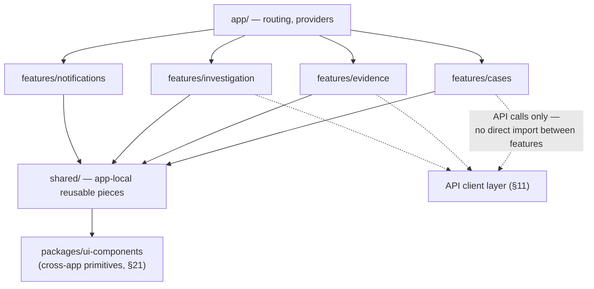

Each feature owns its own routes, data-fetching hooks (Section 10), and components; **features never import from one another directly** — the only sanctioned cross-feature communication is through shared data (a React Query cache entry another feature also queries) or navigation (a route link), never a direct component/hook import across the `features/` boundary. This is the frontend expression of the same discipline `apps/server/README.md`'s module boundary rules enforce on the backend.

## 4. Route Hierarchy

| Route | Feature | Auth required | Notes |
|---|---|---|---|
| `/login` | `auth` | No | §6 |
| `/auth/sso/:provider/callback` | `auth` | No | §6 |
| `/dashboard` | `dashboard` | Yes | Default post-login landing route, §23 |
| `/cases` | `cases` | Yes | List, §25 |
| `/cases/:caseId` | `cases` | Yes | Overview tab, §25 |
| `/cases/:caseId/evidence` | `cases` | Yes | §25 |
| `/cases/:caseId/graph` | `investigation` | Yes | §27 |
| `/cases/:caseId/timeline` | `cases` | Yes | §28 |
| `/cases/:caseId/reports` | `cases` | Yes | §25 |
| `/evidence` | `evidence` | Yes | Global explorer, §26 |
| `/evidence/:evidenceId` | `evidence` | Yes | §26 |
| `/investigation/review` | `investigation` | Yes | Cross-case review queue, §24 |
| `/osint`, `/threat-intel`, `/forensics`, `/social-media` | respective | Yes | Source/config + rich-record views |
| `/notifications` | `notifications` | Yes | §16 |
| `/admin/*` | `admin` | Yes, `admin` role | §10 of `api-design.md` |
| `*` (not found) | `app` | — | Respects `api-design.md` §2.4's existence-ambiguity — never distinguishes "doesn't exist" from "you can't see it" |

Every route maps to a resource `api-design.md` already documents — there is no frontend route without a corresponding, already-specified API surface, and no route is added without a corresponding entry here.

## 5. Layout Architecture

A three-region investigative workbench, appropriate for the case/evidence/graph density this platform's actual work involves:

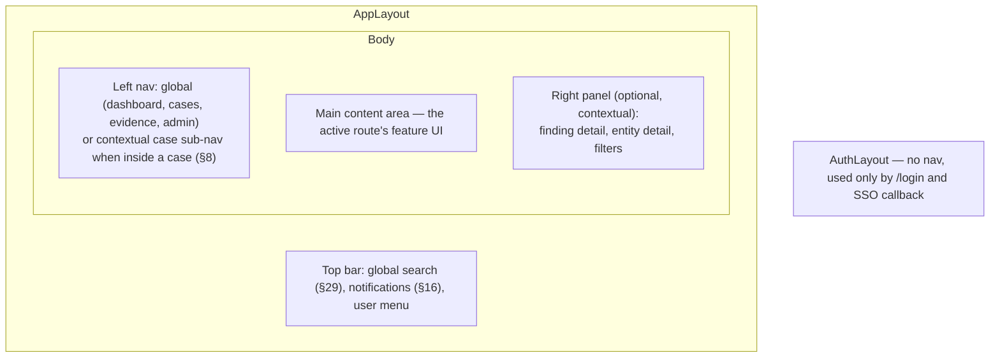

Three layout tiers: **`AuthLayout`** (bare, no navigation chrome — login/SSO only); **`AppLayout`** (the full shell above, used by every authenticated route); **`CaseLayout`** (nested inside `AppLayout` for any `/cases/:caseId/*` route, adding the case-scoped sub-navigation — overview/evidence/graph/timeline/reports — described in Section 8). The right panel is contextual and optional — most views don't need it; the Investigation review UI (Section 24) and Entity Graph (Section 27) use it heavily.

| Region | Persistent across routes? | Owns |
|---|---|---|
| Top bar | Yes, within `AppLayout` | Global search (§29), notification bell (§16), user menu, theme toggle (§18) |
| Left nav | Yes, contents change by context | Global nav or `CaseLayout`'s case sub-nav (§8) |
| Main content | No — swaps per route | The active feature's primary UI |
| Right panel | No — appears only when a view needs it | Contextual detail (finding review §24, entity/relationship detail §27, filters §30) |

## 6. Authentication Flow

Mirrors `api-design.md` §9 and `security-architecture.md` §5 at the screen level:

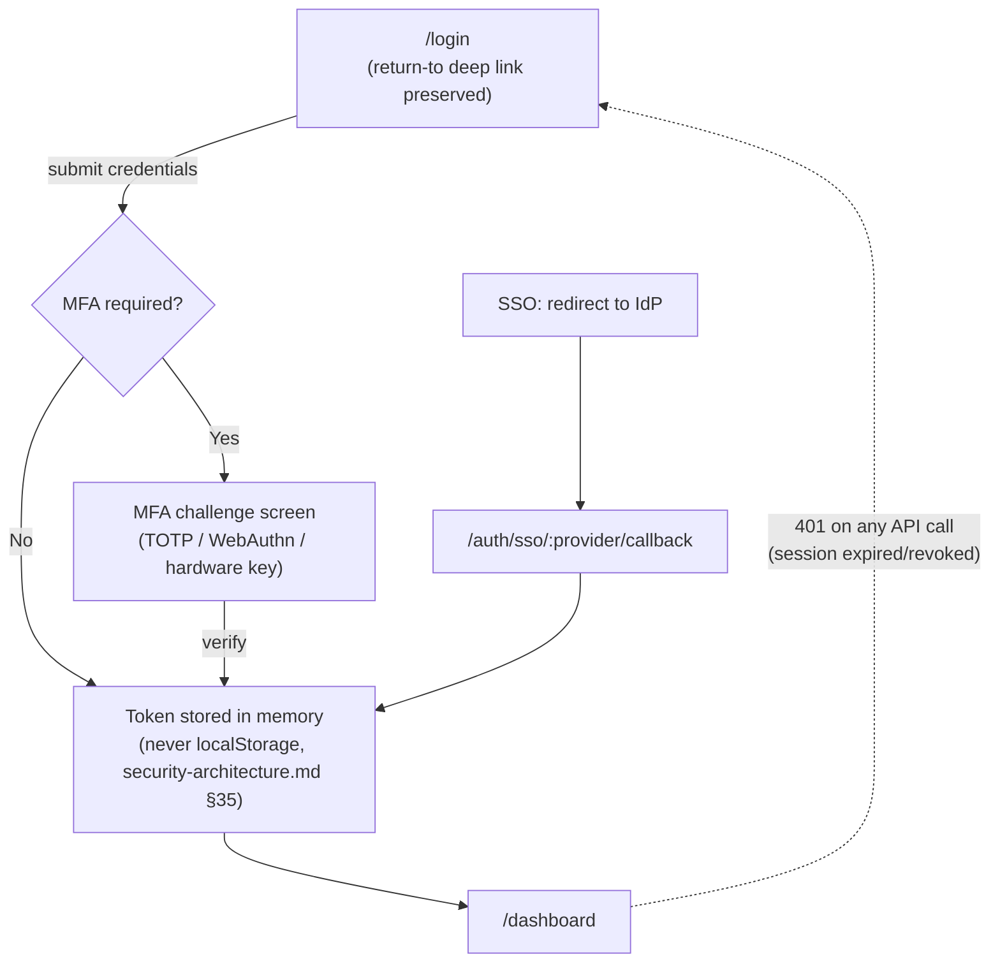

The session token lives only in memory (an in-request-scope auth context), never in `localStorage`/`sessionStorage` — `security-architecture.md` §35's explicit prohibition, restated here as a frontend architectural requirement, not a suggestion. A silent, transparent token refresh runs ahead of expiry so an active analyst is never abruptly logged out mid-task; a `401` from any API call triggers a single, global redirect to `/login` with the current route preserved as a return-to target, so re-authenticating resumes the analyst's work rather than dropping them at the dashboard.

## 7. Authorization (RBAC)

The client mirrors, and never replaces, the server's authorization model (`security-architecture.md` §6). Role and case-scope information comes from `GET /me` (`api-design.md` §4.1) and any per-case grant data, cached in the auth context established in Section 6. Client-side checks exist purely for UX: hiding or disabling an action a user's role can't perform, redirecting away from a route they lack access to. **A client-side permission check is never the actual security boundary** — the API enforces every authorization decision independently (`security-architecture.md` §6's diagram), and the client must correctly handle a `403` even for an action its own UI logic thought was permitted (e.g. a role change that took effect in another tab). A permission-gate pattern — conceptually, "render this only if the current user's role/case-scope satisfies X" — is used consistently rather than ad hoc role checks scattered through feature code.

| Role | Sees on dashboard (§23) | Can do in Investigation UI (§24) | Can do in Admin (§10 of `api-design.md`) |
|---|---|---|---|
| `investigator` | Assigned cases, own review queue | Review/disposition findings on assigned cases | None |
| `supervisor` | Team/portfolio view + own | Review/disposition on team's cases | None |
| `admin` | System-oriented, not case-oriented | Full visibility (not necessarily disposition rights unless also `investigator`) | Full |
| `compliance` | N/A — not a case-working role | Read-only, audit-oriented views | Audit log read access only |

This table is illustrative, not authoritative — `security-architecture.md` §6 and `api-design.md` §3 are the actual source of truth for what each role can do; the frontend's permission gates must be kept in sync with those, not treated as an independent policy definition.

## 8. Navigation Model

Two navigation contexts: **global** (dashboard, cases, evidence, OSINT/threat-intel/forensics/social-media, admin — always visible in `AppLayout`'s left nav) and **contextual/case-scoped** (once inside `/cases/:caseId/*`, `CaseLayout`'s sub-nav — overview, evidence, graph, timeline, reports — replaces or supplements the global nav for the duration of that context). Breadcrumbs surface the current location for deep routes (`Cases > Warehouse investigation > Evidence > SMS-4471`). A command palette (Section 37) provides keyboard-driven navigation as a power-user shortcut layered on top of, not replacing, conventional click navigation. Recently-viewed cases are surfaced on the dashboard (Section 23) as a quick-resume mechanism for an analyst juggling several active cases.

## 9. State Management

State is split into **four architecturally distinct categories, never merged into one global store**:

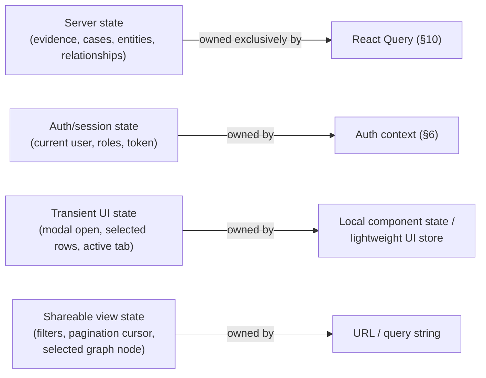

- **Server state** (evidence, cases, entities, relationships, notifications — anything that came from the API) lives exclusively in React Query's cache (Section 10) — never copied into a separate client store, which would create two sources of truth that can drift.
- **Auth/session state** (Section 6) lives in a dedicated, narrowly-scoped context — deliberately not folded into general "app state," since it has different lifetime and security properties (in-memory only, never persisted).
- **Transient UI state** (is this modal open, which table rows are selected, which tab is active) is local to the component or feature that owns it — it does not need to be "global" just because the app has a global store available.
- **Shareable view state** (active filters, pagination cursor, the currently-selected entity in the graph) lives in the URL, not component state — so a filtered evidence view or a specific graph node an analyst is examining survives a page refresh and can be shared with a supervisor via a link (Section 30's filter architecture depends on this).

**Worked example — why the split matters.** An analyst filters the Evidence Explorer to `category=mobile_forensics` (URL state), selects three rows to bulk-link to a case (transient UI state), while the underlying evidence list itself is server state fetched and cached by React Query. If these were all one global store, refreshing the page to recover from an unrelated UI glitch would either lose the filter (bad — it's meant to survive) or require manually rehydrating server data into a client store that duplicates what React Query already does correctly (wasteful, and a second source of truth that can drift from the server). Keeping them separate means the refresh loses only what should be lost — the transient row selection — while the filter (URL) and the underlying data (React Query, re-fetched fresh) both recover correctly with zero extra code.

## 10. React Query Architecture

React Query (TanStack Query) is the exclusive server-state layer:

- **Query keys mirror the API's resource hierarchy** — `['evidence', 'list', filters]`, `['evidence', evidenceId]`, `['cases', caseId, 'graph', graphFilters]`, `['relationships', relationshipId]` — so cache invalidation can be reasoned about directly from `api-design.md`'s endpoint structure.
- **Invalidation is tied to specific mutations, not broad refetch-everything.** `PATCH /relationships/{id}/status` succeeding invalidates `['relationships', id]` and `['cases', caseId, 'graph']` — the two views that specific mutation actually affects — not the entire cache.
- **Stale time is set per data volatility, not a single global default:** evidence (`api-design.md` §5) is immutable once `validated` — a long or infinite stale time is correct and avoids needless refetching; notifications (Section 16) use a short stale time or light polling, since new ones can arrive at any moment; async job status (correlation runs, report generation — `api-design.md` §2.12) polls at a defined interval only while `status` is `queued`/`running`, and stops polling the instant a terminal state is reached.
- **Optimistic updates are used deliberately, not by default — and never for consequential, evidentiary actions.** Marking a notification read (Section 16) is optimistic (low-risk, trivially reversible). **Confirming or rejecting an AI finding is never optimistic** — the UI waits for the server's actual response before showing the new status, because a finding's disposition is exactly the kind of state PRD FR-7.3 treats as consequential, and an optimistic UI that briefly shows "confirmed" before the server has actually processed it would be misleading in a way this platform cannot afford, even for a few hundred milliseconds.

**Illustrative query/mutation map**, showing the stale-time and invalidation policy concretely rather than only in the abstract:

| Query key | Stale time policy | Invalidated by |
|---|---|---|
| `['evidence', evidenceId]` | Long/infinite once `status: validated` (immutable) | `POST /evidence/{id}/supersede` (Section 5 of `api-design.md`) |
| `['cases', caseId, 'graph', filters]` | Short — reflects live analyst activity | `PATCH /relationships/{id}/status`, `PATCH /entities/{id}/status`, new `evidence.linked_to_case` |
| `['notifications', 'list']` | Short, or light polling | `PATCH /notifications/{id}/read` (optimistic), server-pushed new notification |
| `['correlation-runs', runId]` | N/A — actively polled while `queued`/`running` (Section 13, 47) | Polling stops itself on reaching a terminal status |
| `['cases', 'list', filters]` | Medium | `POST /cases`, `PATCH /cases/{id}`, `POST /cases/{id}/status` |

## 11. API Client Architecture

A single, thin client layer wraps every HTTP call, implementing `api-design.md`'s conventions once, consistently, rather than per-feature:

- Attaches `Authorization: Bearer <token>` from the auth context (Section 6).
- Generates and attaches `X-Correlation-Id` per user-initiated workflow (propagated across every API call that workflow triggers, per `api-design.md` §2.8 and `event-driven-architecture.md` §11 — a single analyst action, like reviewing a finding, carries one correlation ID end to end) and relies on the server for `X-Request-Id` per call.
- Attaches `Idempotency-Key` automatically for every mutating request that requires one (`api-design.md` §2.9) — feature code never has to remember to generate one.
- Parses the standard response envelope (`data`/`meta`/`pagination` or `error`, `api-design.md` §2.4) into a single, consistent shape every feature's data-fetching hooks consume.
- Provides a typed cursor-pagination helper (`api-design.md` §2.5) that integrates directly with React Query's infinite-query pattern (Section 33).
- Centralizes `401` handling (global logout/redirect, Section 6) and `429` handling (respects `Retry-After`, surfaces rate-limit feedback, Section 12) so no individual feature reimplements either.

| Concern | Header/mechanism | Owned by |
|---|---|---|
| Authentication | `Authorization: Bearer <token>` | Auth context (§6) |
| Workflow tracing | `X-Correlation-Id` | API client, per user-initiated workflow |
| Per-call tracing | `X-Request-Id` | Server-generated, read from response |
| Write idempotency | `Idempotency-Key` | API client, auto-generated per mutating call |
| Optimistic concurrency | `If-Match` / `ETag` | API client, for mutable resources (`api-design.md` §2.7) |
| Conditional caching | `If-None-Match` | API client, for immutable evidence reads |

No feature-level code constructs these headers manually — every data-fetching hook (Section 10) goes through this single client layer, which is what guarantees the conventions in `api-design.md` §2 are actually followed consistently rather than per-developer-discipline.

### 11.1 Data Flow Through the Frontend

A full-stack view of how a single piece of data — an evidence item — moves from database to screen, showing where each section of this document sits in that path:

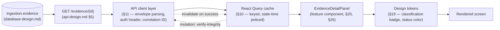

Every arrow above corresponds to a section of this document with a defined responsibility — there is no step where data crosses a boundary without a documented owner, which is what makes a change at any one layer (a new API field, a new token role, a new component) traceable to exactly where it needs to be threaded through.

## 12. Error Handling

A client-side error taxonomy maps `api-design.md` §2.4's error codes to a specific UI treatment — errors are never shown as an undifferentiated "something went wrong":

| API error code | UI treatment |
|---|---|
| `VALIDATION_FAILED` (422) | Inline, field-level errors on the originating form (Section 15) |
| `VALIDATION_FAILED` (400) | Generic malformed-request message — a client bug, not a user-correctable one |
| `UNAUTHENTICATED` | Global redirect to `/login` (Section 6) |
| `FORBIDDEN` / `NOT_FOUND` | An access-denied or not-found state that **deliberately preserves the API's existence ambiguity** (`api-design.md` §2.4) — never reveals whether a resource exists but is inaccessible vs. doesn't exist at all |
| `CONFLICT` / `IDEMPOTENCY_KEY_CONFLICT` | Retry guidance, surfaced inline near the action that triggered it |
| `EVIDENCE_IMMUTABLE` / `LEGAL_HOLD_VIOLATION` | A specific, explanatory domain message — these are meaningful states an investigator needs to understand, not generic failures |
| `RATE_LIMITED` | Backoff messaging respecting `Retry-After` (Section 11) |
| `INTERNAL_ERROR` / `SERVICE_UNAVAILABLE` | Generic retry affordance, caught by an error boundary if it escapes the request layer (Section 42) |

Transient/global errors surface through the notification/toast system (Section 16); form/field errors surface inline at the point of entry (Section 15) — the two are never conflated into one mechanism.

**Worked example — why the `NOT_FOUND`/`FORBIDDEN` ambiguity matters at the UI layer specifically.** An investigator without case-scope access to Case #142 requests its evidence and receives `api-design.md` §2.4's deliberately ambiguous response. If the frontend rendered a distinct "you don't have permission" message here, it would leak the case's existence to someone who shouldn't even know it exists — defeating the exact protection the API was designed to provide. The UI must therefore show the same generic "not found or not accessible" state for both a genuinely nonexistent case and one that exists but is off-limits, resisting the natural instinct to be more "helpful" with error messaging than the backend's own security model allows.

## 13. Global Loading Architecture

Three granularities, no single blocking app-wide spinner except the very first auth-check on load:

- **Route-level:** a route's primary data fetch shows a skeleton matching that route's eventual layout, paired with Section 40's code-splitting so the loading state appears immediately rather than after a bundle download.
- **Component-level:** an individual panel or table shows its own skeleton while its query loads, while the rest of the page stays interactive — a slow evidence list shouldn't block the case overview panel next to it from rendering.
- **Action-level:** a button or form shows a spinner/disabled state during a mutation in flight.

**Async job progress (correlation runs, report generation, `api-design.md` §2.12) is a distinct pattern, not ordinary loading** — a persistent, dismissible progress indicator reflecting `queued`/`running`/`completed`/`failed`, since these operations can take meaningfully longer than a normal request and the analyst may navigate away and back while one is in progress (Section 47's async job state machine formalizes this).

## 14. Form Architecture

Every form's target shape is the corresponding API request body `api-design.md` already documents in full — a form is not designed from a blank slate, it's designed *from* the endpoint it submits to. Key forms: case creation (`POST /cases`), evidence linking (search + select, `POST /cases/{id}/evidence`), manual evidence entry, relationship review (confirm/reject + note, `PATCH /relationships/{id}/status`), admin user/role management, notification rule configuration, manual IOC entry.

**Manual evidence entry is schema-driven, not hardcoded per category.** Because CEM §6 defines a different `attributes` shape per `(category, artifact_type)`, and `database-design.md` §3.2's `attribute_schema_registry` (exposed via `GET /attribute-schemas`, `api-design.md` §4.2) is the authoritative source for which fields apply, the evidence-entry form **renders its fields from that registry response** rather than maintaining a hardcoded field list per artifact type in the frontend. This means a new evidence category or artifact type (CEM §5–6 is explicitly designed to grow) requires no frontend code change to become enterable — the same extensibility principle CEM §9 applies to backend ingestion, applied here to the form that produces manual entries.

| Form | Target endpoint | Notable behavior |
|---|---|---|
| Case creation | `POST /cases` | Simple, static fields |
| Manual evidence entry | `POST /evidence` | Schema-driven (above) |
| Evidence linking | `POST /cases/{id}/evidence` | Search-and-select, not free text |
| Relationship/entity review | `PATCH /relationships\|entities/{id}/status` | Non-optimistic (Section 10); disposition + optional note |
| Manual IOC entry | `POST /threat-intel/iocs` | Static fields, `indicator_type` drives value-format validation |
| Notification rule config | `POST /notification-rules` | `trigger_event_type` selected from the live event catalog (`event-driven-architecture.md` §25), not a hardcoded list |
| Admin user/role management | `POST /admin/users`, role grant endpoints | Restricted to `admin` role (Section 7) |

## 15. Validation

Two layers, mirroring `api-design.md` §2.4's 400-vs-422 distinction and `security-architecture.md`'s "client-side checks are UX only" principle applied to a new domain:

- **Client-side validation** (required fields, format/range checks, and — where derivable — the same rules CEM §13 and the attribute schema registry already define) gives immediate feedback without a round trip.
- **Server validation is always authoritative.** A `422` response's field-level `details[]` (`api-design.md` §2.4) is always correctly surfaced on the form even when client-side validation passed — client validation is an optimization for the common case, never assumed to be complete or a substitute for what the server enforces (the exact CEM §13 rule set, which the frontend does not attempt to reimplement in full, only approximate for responsiveness).

## 16. Notification System

**Two distinct concepts, deliberately not conflated**, since it's an easy and consequential mistake to make:

1. **The product notification feature** (`event-driven-architecture.md`'s `notification` module — new AI correlation, case status change, report ready) is **domain data**, fetched via `GET /notifications` (`api-design.md` §8) and owned by React Query (Section 10) like any other server state, surfaced through a persistent notification bell/inbox in the top bar (Section 5). It has server-side persistence, a `read`/unread state, and its own delivery guarantees (`event-driven-architecture.md` §25.9).
2. **Transient UI toast messages** ("saved successfully," "upload failed") are a **pure frontend concern** — ephemeral, client-only, never persisted, never fetched from the API. A toast confirming a successful mutation and a notification-inbox item about an AI correlation are architecturally unrelated even though both might visually appear as a small message near the top of the screen — they come from different systems, have different lifetimes, and must not share implementation or be mentally conflated by whoever builds this.

| Property | Product notification (inbox) | Transient toast |
|---|---|---|
| Data source | `GET /notifications` (server state, §10) | None — client-only, ephemeral |
| Lifetime | Persistent until read/dismissed server-side | A few seconds, then gone |
| Triggered by | Backend events (`event-driven-architecture.md` §25.9) | Client-side mutation results |
| Survives page refresh | Yes | No |
| Example | "New correlation found in Case #142" | "Report generated successfully" |

## 17. Modal Architecture

Three modal categories: **confirmation dialogs** (destructive/consequential actions — rejecting a finding, unlinking evidence from a case); **form modals** (quick case creation, evidence linking) for actions that don't warrant a full route; **detail/preview modals** (a quick look at an evidence item without leaving a list context). **Principle for choosing modal vs. route:** if a view needs to be bookmarked, deep-linked, or shared (Section 9's URL-state principle), it is a route, not a modal — the Entity Graph (Section 27) and any evidence detail view an analyst might want to send a supervisor are always routes. **No modal stacking** — opening a second modal while one is open replaces it rather than layering, since stacked modals are disorienting mid-investigation and rarely represent an intentional workflow.

| Category | Example | Dismiss behavior |
|---|---|---|
| Confirmation | Reject a finding, unlink evidence, close a case | Requires explicit confirm; cancel returns to prior state unchanged |
| Form | Quick case creation, evidence linking search | Cancel discards unsaved input (with a warning if dirty, Section 47) |
| Detail/preview | Quick look at an evidence item from a list | Dismissible by escape/backdrop click, no confirmation needed (read-only) |

## 18. Theme System

Light and dark themes, driven by OS preference by default with an explicit, persisted per-user override; switching is instantaneous, requiring no reload. A high-contrast mode is a first-class theme variant, not an afterthought, given Section 36's accessibility requirement. All visual treatment flows through Section 19's design tokens — no feature or component hardcodes a color, spacing value, or typography choice outside that token layer, which is what makes theme switching (and any future rebrand or white-label need) a token-layer change rather than a component-by-component one.

## 19. Design Tokens

Named, semantic token categories — described as a taxonomy, not as CSS values:

| Category | Examples of roles (not values) |
|---|---|
| Color — surface/text | background, surface, border, text-primary, text-secondary |
| Color — status | evidence status (`validated`/`quarantined`/`superseded`, CEM §2), job status (`queued`/`running`/`completed`/`failed`) |
| Color — classification | `Public`/`Restricted`/`Confidential` (`security-architecture.md` §38) — a **consistent, platform-wide** visual treatment, never redefined per feature |
| Color — confidence | A gradient role for AI finding confidence scores (CEM §7–8), always paired with the numeric value and never color alone (Section 36) |
| Spacing scale | A fixed, small set of steps every layout composes from |
| Typography scale | Heading/body/caption roles, not ad hoc sizes |
| Elevation | Roles for modal/panel/dropdown layering |
| Motion | Duration/easing roles for transitions, kept minimal and non-distracting given the focus-intensive nature of the work |

Every component (Section 20–21) consumes tokens by role, never a raw value — the enforcement mechanism for Section 18's theming and Section 44's visual consistency.

**Worked example — classification tokens end to end.** `security-architecture.md` §38 defines four classification levels. The Design Tokens layer defines one color role per level (not a hex value — a role like "classification-restricted"); the `StatusBadge` composite (Section 20) consumes that role plus the level's text label and an icon (Section 36's color-plus-text rule); the Evidence Explorer (Section 26), Entity Graph (Section 27, via classification inheritance from `security-architecture.md` §38), and Case Overview (Section 25) all render the *same* badge component for the *same* underlying level — so an analyst learns the visual language once and it holds everywhere, and a future change to how `Confidential` is displayed is a single token-layer edit, not a hunt through every feature that happens to show a classification badge.

## 20. Component Hierarchy

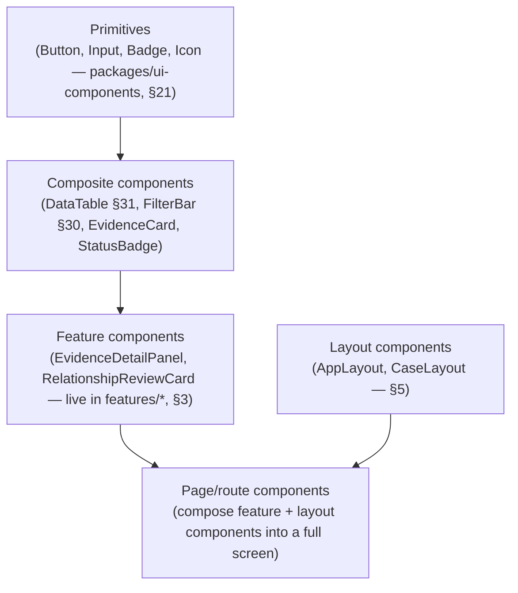

Primitives are generic and domain-unaware (a `Button` knows nothing about evidence or cases); composites are domain-*shaped* but reusable (a `DataTable` doesn't know it's rendering evidence specifically); feature components are domain-specific and live with their feature (Section 3); page components are pure composition, holding minimal logic of their own.

## 21. Shared Component Library

Two tiers, distinguished by a clear promotion rule: **`apps/web/src/shared`** holds app-local, cross-feature composites that aren't yet (or may never be) generic enough for reuse outside `apps/web`. **`packages/ui-components`** — already scaffolded in this repository (`architecture.md`) — holds genuinely generic primitives with no SentinelAI-domain knowledge at all, intended for reuse the moment a second consuming app exists (or simply because a component is cleanly generic regardless). **The promotion rule:** a component moves from `shared/` to `packages/ui-components` when it either (a) has zero remaining dependency on domain concepts, or (b) a second app genuinely needs it — never preemptively, matching this project's established anti-premature-abstraction stance (`CLAUDE.md`).

**Illustrative contents, by tier** (not exhaustive — the point is the tiering, not a complete inventory):

| Tier | Location | Examples |
|---|---|---|
| Primitives | `packages/ui-components` | Button, Input, Select, Checkbox, Badge, Icon, Spinner, Tooltip |
| Composites | `packages/ui-components` or `apps/web/src/shared`, per the promotion rule | DataTable (§31), FilterBar (§30), Modal shell (§17), Toast (§16), StatusBadge (§19's worked example) |
| Feature components | `apps/web/src/features/*` | EvidenceDetailPanel (§26), RelationshipReviewCard (§24), EntityGraphCanvas (§27), CaseStatusControl (§25) |
| Layout components | `apps/web/src/app` | AppLayout, AuthLayout, CaseLayout (§5) |

## 22. Feature Modules

Formalizes Section 3's structure: each feature owns its routes, its React Query hooks (Section 10), its components, and any feature-local state — a vertical slice mirroring one backend module, not a horizontal technical layer. The mapping is 1:1 with `apps/server/modules/*` for every domain feature, plus three frontend-only features with no single backend-module counterpart: `auth` (spans `platform`'s identity endpoints), `admin` (spans `platform`'s admin endpoints), and `dashboard` (a composition layer over several features' data, owning no data of its own).

| Feature | Backend counterpart | Primary screens |
|---|---|---|
| `auth` | `platform` (identity endpoints) | Login, MFA, SSO callback (§6) |
| `dashboard` | None — composition only | Landing screen (§23) |
| `cases` | `case_management` | Case list, case workspace tabs (§25) |
| `evidence` | `ingestion` | Evidence Explorer, upload (§26, §34) |
| `investigation` | `investigation` | Review queue, Entity Graph (§24, §27) |
| `osint` | `osint` | Source config, findings list |
| `threat-intel` | `threat_intel` | IOC list, threat actor profiles, feeds |
| `forensics` | `forensics` | Artifact list/detail |
| `social-media` | `social_media` | Monitored accounts, captured content |
| `notifications` | `notification` | Notification inbox, rule config (§16) |
| `admin` | `platform` (admin endpoints) | Users, roles, audit log, connector registry |

Each row's feature is independently developable and independently code-split (Section 40) — a developer working on `osint` never needs to load or reason about `admin`'s code, and a build change to one feature's bundle doesn't invalidate another's cache.

## 23. Dashboard Architecture

The post-login landing screen (`/dashboard`) is **task-oriented, not metrics-oriented** — it answers "what do I need to do next," not "here are some numbers." Role-aware composition, directly reflecting PRD §5's personas: an `investigator` sees their assigned open cases, their pending AI-finding review queue (Section 24), and recent notifications (Section 16); a `supervisor` (PRD's "Robert") additionally sees a team/portfolio view — case status distribution across their team, not just their own assignments. Widget-based, each widget independently data-fetched (Section 10) and independently loading/error-stated (Section 13) — a slow or failed widget never blocks the rest of the dashboard from rendering.

| Widget | Persona(s) | Data source |
|---|---|---|
| Assigned open cases | `investigator`, `supervisor` | `GET /cases?status=open` (Section 25) |
| Pending finding review queue | `investigator` | `GET /relationships?status=proposed` scoped to assigned cases (Section 24) |
| Recent notifications | All | `GET /notifications` (Section 16) |
| Team/portfolio case status distribution | `supervisor` | `GET /cases` aggregated client-side over the supervisor's team scope |
| Recently viewed cases | All | Local, client-only recency tracking (Section 8) |

## 24. Investigation UI

Arguably the single most important screen in the product, given PRD §6's framing of AI-assisted correlation as the core differentiator. Two connected surfaces:

- **The review queue** (`/investigation/review`): a list of `proposed` entities and relationships awaiting analyst disposition, filterable by case, confidence, and entity/relationship type (mirroring `api-design.md` §6's query parameters directly).
- **The finding detail view**: for a single proposed relationship or entity, shows its confidence score, its type, and — made **prominent, never buried** — every piece of supporting evidence it traces back to (CEM §13's mandatory `supporting_evidence_ids`), each one a direct link into the Evidence Explorer (Section 26). This traceability display is the UI's core trust mechanism: PRD FR-7.2 requires every AI finding be explainable in terms of source evidence, and this view is where that requirement becomes something an analyst can actually see and evaluate before deciding.
- **Disposition actions** (accept/reject + optional note) call `PATCH /relationships/{id}/status` or `.../entities/{id}/status` (Section 10's non-optimistic-update rule applies here specifically) and, on success, offer a direct path into the Entity Graph (Section 27) to see the finding in context.

**Worked example: a review session.** An investigator opens `/investigation/review` with 20 pending findings across two cases. The list is a standard paginated table (Section 31) sorted by confidence descending by default. Selecting a finding opens its detail in the right panel (Section 5) without navigating away from the queue — the list stays visible and scrollable underneath. Keyboard shortcuts (Section 37) let the analyst confirm/reject and advance to the next finding without reaching for the mouse; each disposition is a non-optimistic mutation (Section 10), so the queue's count only decrements once the server has actually recorded the disposition — an analyst who works through all 20 findings has, at every moment, a queue view that accurately reflects server state, not a client-side illusion of progress that could be wrong if a mutation silently failed.

## 25. Case Management UI

A tabbed case workspace under `CaseLayout` (Section 5, 8): **Overview** (title, status, key metadata, status-transition controls with confirmation for consequential transitions), **Evidence** (linked evidence list + a link/unlink action that opens the Evidence Explorer, Section 26, scoped to add to this case), **Graph** (Section 27), **Timeline** (Section 28), **Reports** (generated report list + a trigger for a new report generation job, using Section 13's async-job loading pattern, with a download action once complete — `api-design.md` §7). The case list (`/cases`) is a standard filterable/sortable table (Section 31) scoped to the caller's visible cases per `security-architecture.md` §6's ABAC rules — the frontend does not attempt to show cases the API wouldn't return.

| Tab | Primary data source | Key actions |
|---|---|---|
| Overview | `GET /cases/{id}` | Edit title/description, status transition (`POST /cases/{id}/status`) |
| Evidence | `GET /cases/{id}/evidence` | Link (`POST`), unlink (`DELETE`), open Evidence Explorer scoped to this case |
| Graph | `GET /cases/{id}/graph` | Section 27 in full |
| Timeline | Aggregated across evidence/custody/status/finding events | Filter by event type/date range (Section 28) |
| Reports | `GET /cases/{id}/reports` | Trigger new report (`POST`, async), download completed ones |

## 26. Evidence Explorer

The global, cross-case evidence browse/search surface (`GET /evidence`, `api-design.md` §5), the primary place CEM's full data model becomes visible to a human. Category/artifact-type/status/date-range filtering (Section 30) plus full-text search (Section 29). The detail view renders the Core Evidence Object (CEM §2) plus a dedicated **custody-ledger visualization** — given how central chain of custody is to this product's legal value proposition, the custody events (`api-design.md` §5's `GET /evidence/{id}/custody-events`) get their own clear, chronological, hash-chain-aware presentation, not a buried tab.

**Detail rendering is category/artifact-type-aware via a pluggable registry, not a single generic view.** A mobile-forensics SMS message and a blockchain transaction have entirely different `attributes` shapes (CEM §6); the Evidence Explorer registers a detail-rendering component per `(category, artifact_type)` — falling back to a generic key-value renderer for any combination without a registered specific view — mirroring the backend's pluggable-connector extensibility pattern (CEM §9) on the rendering side. Classification (§38 of `security-architecture.md`) is always shown as a badge combining color *and* text label (Section 36).

**What every detail view shows regardless of category** (the CEM §2 core envelope, always rendered consistently even though `attributes` varies): title, category/artifact type, source/provenance, collected/ingested timestamps, integrity status (with a manual re-verify action calling `POST /evidence/{id}/verify-integrity`), confidence/reliability rating, classification badge, and the linked-cases list. Category-specific `attributes` render below this common header via the registry described above — so an analyst always knows *where* to look for the universal facts regardless of what kind of evidence they're viewing, with the category-specific detail predictably placed after it.

## 27. Entity Graph UI

Visual, interactive graph exploration backed by `GET /cases/{id}/graph` (`api-design.md` §6):

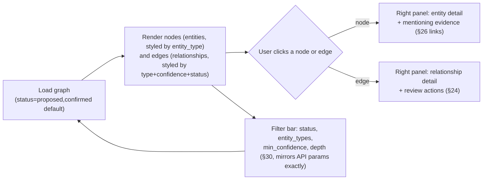

**Proposed edges are visually, unmistakably distinct from confirmed ones** (e.g., a dashed/lighter treatment vs. solid/full-weight) — this is not a cosmetic choice, it's the same trust-preserving principle from Section 24 expressed in a graph rather than a list. Interaction (expand a node's neighborhood, adjust `depth`, filter by confidence) maps directly onto the API's own query parameters — the graph UI never computes a filtered subgraph client-side from a larger fetched set; it always re-requests the server's own filtered view, keeping client and server in agreement about what "the graph" currently means. Rendering at scale requires virtualization/level-of-detail handling (Section 32) — a case with hundreds of entities cannot be rendered as hundreds of simultaneously-live DOM/canvas nodes without a performance strategy.

**Node/edge visual encoding**, so "styled by type/confidence/status" is concrete:

| Element | Encodes | Via |
|---|---|---|
| Node shape/icon | `entity_type` (CEM §7 — person, device, account, organization, location, digital asset, financial instrument, event) | Design tokens (Section 19) |
| Node border | `status` (`proposed`/`confirmed`/`rejected`) | Same visual language as Section 24's finding cards, kept consistent between list and graph views |
| Edge style | `type` (CEM §8) and `status` — dashed for `proposed`, solid for `confirmed` | — |
| Edge weight/opacity | `confidence` — a higher-confidence edge reads as visually stronger | Confidence color/weight token (Section 19) |

## 28. Timeline UI

A chronological, human-readable projection across every timestamped fact the backend already tracks: evidence `collected_at`/`ingested_at` (CEM §2), custody events (CEM §4), case status transitions (`database-design.md` §3.4's `case_status_history`), and finding-review events (`investigation.finding_reviewed`, `event-driven-architecture.md` §25.8) — assembled into one narrative view per case, critical for constructing an investigative narrative and for disclosure review (PRD FR-2.4). Filterable by event type and date range; zoomable, since a case's early quiet period and a later burst of activity need different levels of temporal detail to read clearly.

| Timeline event type | Source | Distinguishing detail shown |
|---|---|---|
| Evidence collected/ingested | CEM §2 `collected_at`/`ingested_at` | Category, artifact type, collector |
| Custody event | CEM §4 ledger | Event type (`accessed`, `exported`, `transferred`, ...), actor |
| Case status transition | `database-design.md` §3.4 | Previous → new status, actor |
| Finding reviewed | `event-driven-architecture.md` §25.8 | Disposition, reviewer, linked evidence |

Because this view aggregates across several distinct data sources rather than one endpoint, it is composed client-side from several React Query results (Section 10) rather than depending on a single "timeline" API resource — each contributing query keeps its own cache/stale-time policy appropriate to its own data (evidence timestamps rarely change; a case's status history grows actively while a case is open).

## 29. Search Architecture

Two tiers: **global/command-palette search** (Section 37 — quick jump to a case, evidence item, or entity by name/ID) and **scoped list search** (the `q` full-text parameter on a given list view, e.g. the Evidence Explorer, `api-design.md` §2.6). **Search is always server-side.** The client never attempts to filter an unbounded dataset locally — the only client-side filtering that occurs is a light, responsive narrowing over an *already-fetched, already-small* page of results (e.g. the 50 rows currently on screen), which is a UX nicety, never a substitute for the server's `q` parameter against the full dataset.

| Search tier | Trigger | Scope | Result destination |
|---|---|---|---|
| Command palette | `Cmd/Ctrl+K` (§37) | Cross-resource: cases, evidence, entities by name/ID | Direct navigation to the matched resource |
| Evidence Explorer search | Typing in the `q` field (§26) | `title`/`description` full-text, within current filters | In-place result list update |
| Case list search | Typing in the `q` field (§25) | Case titles/descriptions | In-place result list update |

The command palette's cross-resource search debounces client-side before issuing the server request (a UX-latency optimization, distinct from the "never filter unbounded data client-side" rule above — debouncing controls *when* a server request fires, not whether the filtering itself happens server-side).

## 30. Filter Architecture

Filters live in URL query state (Section 9), never component-local state, so a filtered view is shareable and survives a refresh. A shared filter-bar composite (Section 20–21) is driven by a **per-resource filter schema** declared once per feature, mapping directly and only onto the query parameters `api-design.md` §2.6 documents for that endpoint — no filter control exists in the UI for a parameter the API doesn't support, and no supported parameter goes unexposed without a deliberate reason, keeping the two in sync by construction rather than by convention alone.

**Worked example.** The Evidence Explorer's filter schema declares `category`, `artifact_type`, `status`, `collected_after`/`collected_before`, and `tags` — the exact set `api-design.md` §5's `GET /evidence` documents. Adding a new filterable field to that endpoint (say, `reliability_rating`) means updating one schema declaration in the `evidence` feature; the filter bar, the URL-state serialization (Section 9), and the query key (Section 10) all pick it up automatically rather than requiring three separate hand-written integrations.

## 31. Tables

A single shared, generic data-table component (Section 21) used everywhere a resource is listed: server-side sorting (mapped to the `sort` query parameter), server-side pagination, per-column show/hide and reorder (a persisted user preference), row-level actions, and baked-in loading/empty/error states so every feature gets consistent behavior without reimplementing it. **Cursor-paginated tables (`api-design.md` §2.5 — evidence, custody events, notifications) never offer "jump to page N" navigation** — only next/previous — because that's what the underlying pagination mechanism actually supports; offset-paginated tables (small, bounded lists — roles, connectors, notification rules) may offer full page-number navigation, since a stable total genuinely exists for those.

**Baked-in states, not reimplemented per table:** loading (skeleton rows matching the eventual column layout), empty (a distinct message from "no results for this filter" vs. "nothing exists yet" — genuinely different situations an analyst needs to tell apart), and error (Section 12's taxonomy applied inline, with a retry action). Every feature's list view (evidence, cases, IOCs, artifacts, notifications, admin lists) is the same shared table component configured differently, not N independent table implementations — this is what makes Section 48's checklist item "empty/loading/error states baked in" actually true rather than aspirational.

## 32. Virtualization

Client-side virtualization (rendering only the currently-visible rows/nodes into the DOM, regardless of how many are logically loaded) is an architectural requirement, not an optional optimization, for: the Evidence Explorer table at volume, a heavily-accessed evidence item's custody ledger (Section 26), the admin audit log viewer, and the Entity Graph (Section 27) once a case's entity/relationship count grows large. Described here as a required capability every one of these surfaces must have — the specific virtualization technique is an implementation detail out of this document's scope.

## 33. Infinite Scrolling

Reserved for naturally append-consumed, glanceable feeds — the notification inbox (Section 16) and, potentially, the admin audit log — built on React Query's infinite-query pattern (Section 10) driven by cursor pagination (`api-design.md` §2.5). **Decision rule distinguishing this from Section 31's paginated tables:** a feed the user scans and doesn't need to reference by page number uses infinite scroll; structured, comparison-oriented data (evidence lists, case lists) uses an explicit paginated table, since investigators frequently need to reference "page 2 of the evidence list" in a way an endlessly-scrolling feed doesn't support well.

## 34. File Uploads

Implements the three-step presigned-URL flow (`api-design.md` §2.11, `security-architecture.md` §24) client-side: `POST /evidence/uploads` reserves an ID and URL; the client uploads the binary **directly to object storage**, with a visible progress indicator (forensic files can be large and slow) and automatic retry scoped specifically to that direct-upload step, since it's the leg most exposed to an unreliable network; then `POST /evidence` finalizes the record. Client-side pre-validation (file type/size) mirrors but never replaces server validation (Section 15's principle). Because an uploaded file lands in quarantine pending malware scanning before it's servable (`security-architecture.md` §25), the UI shows an honest **"processing"** state after finalize, rather than implying the evidence is immediately available for use.

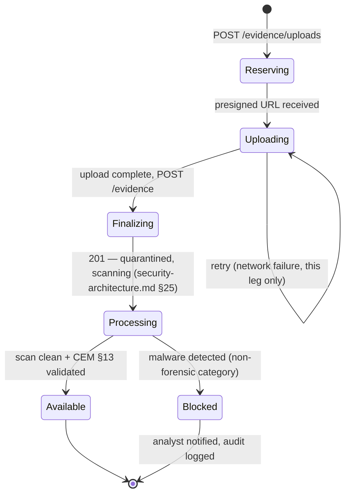

## 35. Offline Handling

**Scope, defined precisely to avoid a common conflation:** this is about graceful behavior when `apps/web`'s connection to *its own* backend drops — a field laptop with an intermittent VPN link — not a full offline-first, local-data-syncing client. **Full offline-first write capability is explicitly out of scope for Phase 1**, and deliberately so: reconciling writes made while disconnected against an evidentiary system with strict chain-of-custody and integrity guarantees (CEM §4, `security-architecture.md` §21) is a genuinely hard problem this platform's trust model doesn't need to take on before it's proven necessary. What Phase 1 does provide: clear "connection lost" messaging, mutating actions disabled while disconnected rather than silently queued, automatic reconnect/retry once connectivity returns, and **locally preserved in-progress form input** (e.g. a partially-typed review note) so a dropped connection doesn't destroy an analyst's unsaved work — a meaningfully useful, low-risk subset of "offline handling" without the integrity risk of offline writes.

## 36. Accessibility

WCAG 2.1 AA is the target, consistent with PRD §10's procurement reality for this customer base, not an aspirational stretch goal. Fully keyboard-navigable (Section 37), semantic HTML and ARIA landmarks throughout (an architectural expectation of every component, Section 20–21), color-contrast-compliant tokens (Section 19), rigorous focus management (especially around modals, Section 17 — a focus trap while open, focus restored to the triggering element on close). **Status and classification information is always conveyed by more than color alone** — an icon plus a text label, never a color swatch by itself — both an accessibility requirement (a colorblind analyst must be able to distinguish evidence status or classification level) and, per `security-architecture.md` §38, a security-adjacent one, since classification is meant to be unambiguous to every authorized viewer.

| Surface | Accessibility concern | Mitigation |
|---|---|---|
| Entity Graph (§27) | A visual-only graph is fundamentally hard to make screen-reader-accessible | A structured, linear list-view alternative of the same entities/relationships is always available as a non-graph fallback |
| Data tables (§31) | Large tables with many interactive cells | Proper table semantics, keyboard-navigable cell focus, sortable-column state announced |
| Modals (§17) | Focus loss, screen-reader users trapped or lost | Focus trap while open, focus restored on close, labelled by their heading |
| Status/classification badges (§19, §38 of `security-architecture.md`) | Color-only encoding | Icon + text label always paired with color, never color alone |
| Toasts (§16) | Time-limited, easy to miss for a screen-reader or low-vision user | Sufficient display duration, also available via the persistent notification/toast history where applicable |

## 37. Keyboard Shortcuts

A command palette (`Cmd/Ctrl+K`, Section 29) for navigation and quick actions; a documented, discoverable shortcut reference (a help overlay, not a hidden feature); and — specific to this platform's actual daily-use pattern — dedicated shortcuts for the high-frequency finding-review workflow (Section 24), letting an analyst accept/reject/move-to-next-finding without leaving the keyboard. Given how many findings a busy investigation can produce, this is a genuine efficiency requirement for the persona actually using this screen most, not a nice-to-have.

**Illustrative shortcut set** (a starting reference, not exhaustive — the help overlay is the authoritative, always-current source once implemented):

| Shortcut | Action | Context |
|---|---|---|
| `Cmd/Ctrl+K` | Open command palette (§29) | Global |
| `G then C` | Go to Cases (§25) | Global |
| `G then E` | Go to Evidence Explorer (§26) | Global |
| `G then R` | Go to review queue (§24) | Global |
| `A` | Accept/confirm the focused finding | Review queue, Graph right panel (§24) |
| `X` | Reject the focused finding | Review queue, Graph right panel (§24) |
| `J` / `K` | Next/previous finding in the queue | Review queue (§24) |
| `Esc` | Close the active modal/panel (§17) | Modal or right panel open |
| `?` | Open the shortcut help overlay | Global |

## 38. Localization Readiness

PRD §8 already scopes full UI localization as a future-roadmap item, not MVP — this section is about being **ready**, not implementing it now, following the same forward-compatibility discipline used throughout this project's architecture. Concretely: no user-facing string is hardcoded inline in component logic — all copy routes through a single text layer, even while that layer only ever resolves to English today; dates, numbers, and relative times are formatted through a locale-aware layer from day one (CEM's evidence timestamps, case dates, etc.); and layouts tolerate variable text length rather than assuming English string lengths, since retrofitting flexible layout after the fact is far more expensive than designing for it now.

**Worked example of the cost of skipping this now.** A status badge (Section 19–20) sized to fit "Confirmed" (9 characters) will visibly break the moment it needs to fit a longer translated equivalent in a future locale — not a hypothetical, but the single most common real-world localization retrofit cost. Designing every fixed-looking label as a flexible container from day one, even while the only shipped locale is English, means that cost is paid once, now, cheaply, instead of later, across every screen that was built assuming English string lengths.

## 39. Performance Optimization

Targets PRD's `<2s` common-view render NFR (`system-design.md` §8): route/feature-level code-splitting (Section 40–41), React Query's caching discipline (Section 10) avoiding redundant fetches, virtualization for large lists/graphs (Section 32), optimized asset delivery, and re-render discipline — state kept close to where it's consumed rather than lifted further up the tree than necessary (an architectural principle, not a specific technique). A **performance budget** — a bundle-size ceiling per route chunk — is tracked in CI, extending the existing `.github/workflows/pr-validation.yml` pattern once `apps/web` exists to measure, so a regression is caught at PR time rather than discovered in production.

| Concern | Target | Mechanism |
|---|---|---|
| Common-view render (PRD NFR) | < 2s | Section 40–41 code-splitting, Section 10 caching |
| Initial bundle (shell + dashboard only) | Minimized, measured in CI | Section 41's vendor/feature chunk separation |
| Large list/graph interaction | No dropped-frame scroll/pan on realistic case sizes | Section 32 virtualization |
| Constrained-network usability (PRD §8) | Usable, not just "loads eventually" | Section 13's granular loading states avoid an all-or-nothing blocking wait |

## 40. Lazy Loading

Route-based code splitting is the default, not an opt-in optimization — each feature module (Section 3) loads its JavaScript on first navigation to one of its routes, not as part of the initial bundle every user pays for on login. This is what makes Section 2's SPA trade-off (heavier payload vs. richer interactivity) tractable for constrained-network deployments — the initial bundle is only the shell (Section 5) plus whatever the landing dashboard (Section 23) actually needs.

## 41. Bundle Splitting

A vendor/framework chunk, separate from application code and long-cacheable since it changes far less often; per-feature chunks (Section 40); and one specific, deliberate callout: **the Entity Graph's rendering library (Section 27) is almost certainly a heavy dependency and must be its own split chunk**, loaded only when a user actually opens a graph view — an investigator who never opens the graph should never download its rendering engine.

## 42. Error Boundaries

Error boundaries (components that catch rendering errors in their subtree, preventing a full app crash) are placed at three levels: the **app root** (a catastrophic, rare fallback), **per-route** (a rendering bug in one feature doesn't take down the persistent nav/shell around it), and **around the Entity Graph specifically** (Section 27's complex, data-dependent visualization is disproportionately likely to hit an edge case — a boundary here keeps the rest of the case workspace usable even if the graph itself fails to render for a given case). Every boundary reports the error it caught for observability — client-side errors are a genuine signal (`security-architecture.md` §49), and a spike in a specific boundary firing can indicate an API contract mismatch, a bad deploy, or, in the worst case, an attempted exploit worth investigating.

| Boundary level | Scope of failure contained | Fallback shown |
|---|---|---|
| App root | Anything not caught below | Full-page apology + reload action |
| Per-route | One feature's rendering bug | The persistent shell (nav, top bar) stays usable; only the route's content area shows a fallback |
| Entity Graph | A graph-rendering edge case for one case | The rest of the case workspace (Evidence, Timeline, Reports tabs) remains fully usable |

## 43. Testing Strategy

Layered, no specific test framework named (architecture only):

- **Unit tests** — pure logic: validation helpers, formatting utilities, the permission-gate logic (Section 7).
- **Component tests** — the shared library (Section 21) tested in isolation across its documented states (Section 44).
- **Integration tests** — a feature's data-fetching (Section 10) plus UI together, with the network boundary mocked using **`api-design.md`'s documented request/response examples as the mock fixtures directly** — the API documentation and the test fixtures are the same source, not maintained separately and allowed to drift.
- **End-to-end tests** — critical journeys: login through MFA, create a case, ingest and link evidence, review an AI finding, generate and download a report — deliberately the same journey `security-architecture.md`'s capstone diagram and `api-design.md`'s sequence diagrams already walk through at the API/security layer, now covered end to end at the UI layer too.

| Layer | Verifies | Runs against |
|---|---|---|
| Unit | Pure logic in isolation | Nothing external |
| Component | A single component's states/interactions | Mocked props/callbacks only |
| Integration | A feature's data-fetching + rendering together | Mocked network, using `api-design.md`'s documented examples as fixtures |
| End-to-end | A full critical user journey | A real (test) backend instance, exercising the actual API contract |

Non-optimistic mutations (Section 10) — finding review chief among them — get deliberate integration-test coverage of their *pending* state specifically, not just their success/failure outcomes, since that in-between state (Section 47's `Submitting`) is exactly where a regression toward accidental optimism would first show up.

**Coverage emphasis, not a rigid ratio:** more unit and component tests than integration tests, more integration tests than end-to-end — the conventional testing-pyramid shape — but weighted toward extra integration coverage specifically for §24's review workflow and §34's upload flow, since those are the two surfaces where a subtle regression (an accidentally-optimistic update, a race in the upload-then-finalize sequence) would be both easy to introduce and disproportionately costly given this platform's evidentiary stakes.

## 44. Storybook Strategy

The shared component library (Section 21) is developed and documented in isolation via a component-explorer tool, primarily against `packages/ui-components` so the library is verifiable independent of any single consuming app. Every primitive and composite gets coverage of its meaningful states — default, loading, error, empty, disabled — which serves three purposes at once: living documentation of Section 19's design tokens in practice, a design-review surface independent of a full app build, and a visual-regression testing base (screenshot diffing) feeding into Section 43's testing strategy.

**Required states per component category**, so "meaningful states" is concrete rather than left to individual judgment:

| Component category | Required states |
|---|---|
| Any data-driven composite (DataTable §31, StatusBadge) | Default, loading, empty, error |
| Any form input | Default, focused, error/invalid, disabled, filled |
| Any interactive primitive (Button, etc.) | Default, hover/focus, active, disabled, loading |
| Modal (§17) | Open, closing, with-form-content, confirmation-variant |
| Notification/toast (§16) | Info, success, warning, error variants |

A component's Storybook coverage is treated as incomplete — and a review-blocking gap — if it's missing any state its category requires, not just whichever states happened to come up during initial development.

**Design system governance.** Changes to `packages/ui-components` are reviewed with the same rigor as changes to any other shared, cross-cutting package in this repository (`CONTRIBUTING.md`'s CODEOWNERS-based review already applies at the repository level) — a breaking change to a primitive's public shape (not its internal styling) is treated analogously to `api-design.md` §14's API evolution rules: additive changes are unrestricted, breaking changes require updating every consumer in the same change or a documented migration path, since `packages/ui-components` may eventually be consumed by more than just `apps/web`.

## 45. Mermaid Component Diagrams

Covered throughout — the component hierarchy (Section 20), the feature-module dependency graph (Section 3), the state-management data-flow diagram (Section 9), and the layout composition diagram (Section 5) are this document's component-level diagrams; this section is a pointer to them rather than a duplicate, consistent with how `system-design.md`'s diagram index works.

## 46. Screen Flow Diagrams

A single, capstone user journey at screen granularity — distinct from `api-design.md`'s API-level sequence diagrams and `event-driven-architecture.md`'s event-level diagrams, which describe the same underlying journey at a different altitude:

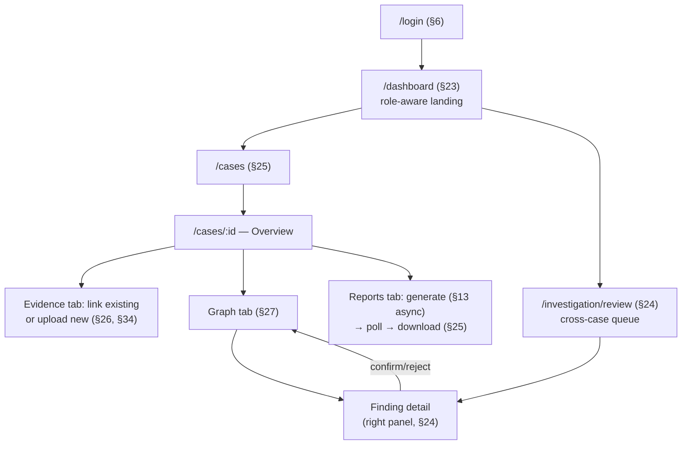

**A second journey — administrative/connector-facing**, deliberately distinct from the investigator-facing one above since it serves a different persona and cadence:

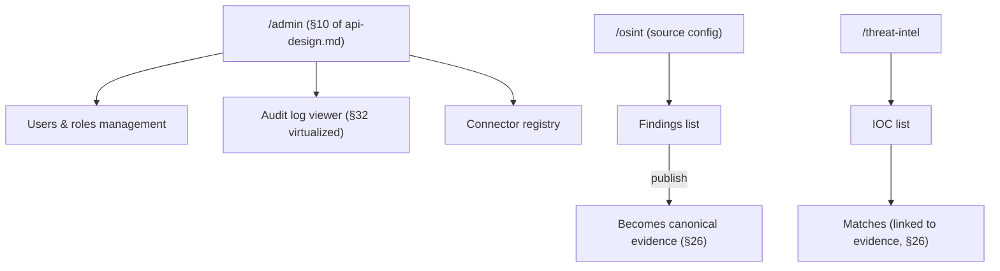

## 47. UI State Diagrams

**Authentication state machine** (Section 6):

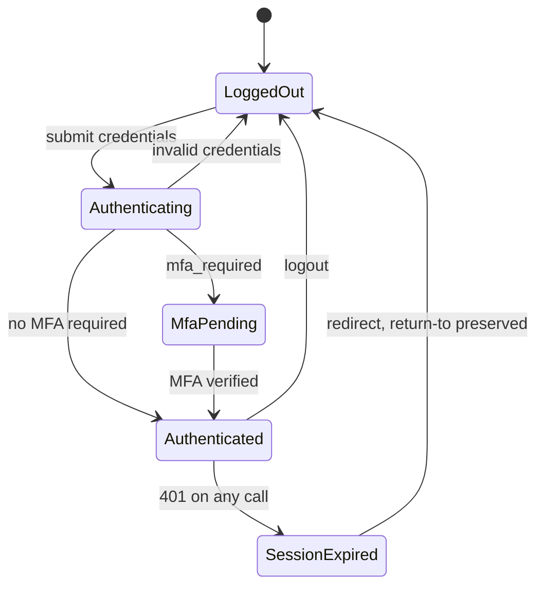

**Async job UI state machine** (correlation runs, reports — Section 13, `api-design.md` §2.12):

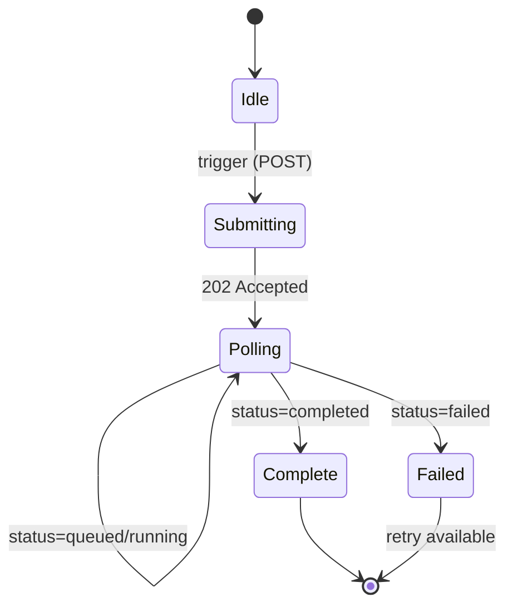

**Form state machine** (Section 14–15):

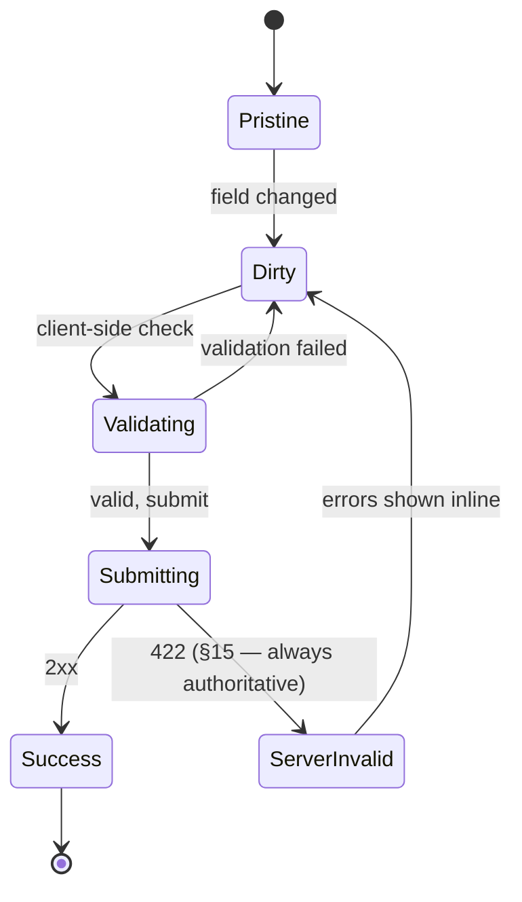

## Worked UX Scenarios

Two end-to-end scenarios, each composing several sections above — the same kind of capstone treatment `security-architecture.md` §2.1 and `event-driven-architecture.md` §26.1 give their own domains.

**Scenario: an examiner uploads a large forensic image and links it to a case.** Priya (PRD's forensics-examiner persona) opens a case (§25), navigates to its Evidence tab, and starts an upload (§34). The client reserves an evidence ID and presigned URL (`api-design.md` §2.11), then uploads the multi-gigabyte file directly to object storage with a progress indicator — this leg runs independently of the API and gets its own retry logic (§34), since a large upload over a possibly-imperfect network is the single most failure-prone step in the whole flow. Once uploaded, the client calls the finalize endpoint; the record now exists but is `pending_validation`/quarantined pending malware scan (`security-architecture.md` §25) — the UI shows an honest "processing" state, not a false "ready" state (§34). Once scanning and CEM §13 validation complete, React Query's cache for that evidence item (§10) reflects the new `validated` status on next fetch, and Priya links it to her case (§25's Evidence tab action) — at which point it becomes visible in that case's Timeline (§28) and eligible for the next correlation run (§24).

**Scenario: a supervisor reviews an analyst's work across a busy day.** Robert (PRD's case-supervisor persona) opens the dashboard (§23) and sees his team's portfolio widget rather than a personal task list — a different composition of the same dashboard components an investigator sees, driven by his role (§7). He opens a case Maria has been working, checks its Timeline (§28) to see the day's activity at a glance, and reviews a couple of AI findings she hasn't yet dispositioned by opening the case's Graph tab (§27) rather than the cross-case review queue, since he wants findings in the context of this specific case's evidence, not mixed with other cases'. He confirms one finding directly from the graph's right panel (§24's disposition action, available from both the queue and the graph view) — the same non-optimistic mutation path either entry point uses, so the finding's state is consistent regardless of which screen was used to change it.

**Scenario: an OSINT researcher works on a poor connection at a field site.** Tomas (PRD's OSINT-researcher persona) is entering manual findings from a location with an intermittent link back to the deployment's server. A brief drop mid-form-entry (§35) preserves his typed input locally rather than losing it; the UI clearly indicates the connection is down and disables the submit action rather than silently queuing a write for later — consistent with §35's explicit decision against offline write capability given this platform's chain-of-custody stakes. When connectivity returns, the form remains exactly as he left it and he submits normally. Meanwhile, the Evidence Explorer (§26) he had open earlier shows cached data from React Query (§10) rather than an error state, since evidence's long stale-time policy means a temporarily-stale cached view is a reasonable degradation, not a failure — the difference between "can't write right now" (correctly blocked) and "can still see what was already loaded" (correctly allowed) is exactly the distinction §35 draws.

## Anti-Patterns to Avoid

Concrete mistakes this architecture is designed to make structurally difficult, named explicitly so they aren't reintroduced by accident:

- **Duplicating server state into a client store "for convenience."** The moment evidence or case data is copied out of React Query's cache into a separate global store, the app has two sources of truth that can silently disagree (§9).
- **Optimistically updating a finding's disposition.** It's tempting for perceived responsiveness, but directly undermines the trust model §1 and §10 establish — the UI must never show "confirmed" before the server has actually confirmed it.
- **Hardcoding a category's `attributes` fields in the evidence entry form.** This defeats the entire point of the schema-driven approach (§14) and creates a maintenance burden that grows with every new CEM category.
- **Distinguishing `NOT_FOUND` from `FORBIDDEN` in the UI.** Doing so leaks resource existence the API deliberately conceals (§12's worked example) — resist the instinct to be "more helpful" than the security model allows.
- **Treating the product notification feature and toast messages as the same system.** They have different data sources, lifetimes, and purposes (§16) — sharing an implementation between them creates confusion about what's persisted and what's ephemeral.
- **Building offline write queuing "since we're already handling connection loss."** §35 explicitly scopes offline handling to graceful degradation, not write-sync, given this platform's chain-of-custody stakes — don't let a reasonable-sounding feature request expand that scope without revisiting the underlying risk analysis.
- **Encoding status or classification in color alone.** Convenient to implement, but fails both accessibility (§36) and the platform's own classification-clarity requirement (`security-architecture.md` §38).
- **Adding a filter control the API doesn't support, or vice versa.** §30's filter-schema-per-resource discipline exists precisely to keep the UI and `api-design.md`'s documented query parameters from silently drifting apart over time.
- **Importing directly between feature modules.** Even a "small, obviously safe" cross-feature import erodes §3's boundary discipline the same way a direct cross-schema query would erode the backend's module boundaries — route around it through shared data or navigation instead.
- **Skipping virtualization "until it's actually slow."** Retrofitting virtualization onto an already-built list or graph view is meaningfully harder than building it in from the start (§32) — treat it as a requirement for any view that can realistically grow large, not an optimization to defer.
- **Promoting a component to `packages/ui-components` preemptively.** §21's promotion rule is deliberate — promoting before a second real need exists just relocates the same premature-abstraction risk `CLAUDE.md` already warns against on the backend.

## 48. Checklist

**Before shipping any screen (cross-cutting, applies to every feature):**
- [ ] Loading, empty, and error states are all handled, not just the happy path (§13, §31)
- [ ] Keyboard-navigable and screen-reader-labelled (§36)
- [ ] Filters/pagination/selection state that should survive a refresh lives in the URL (§9)
- [ ] No user-facing string bypasses the text layer (§38)

**Before adding a new feature module (Section 3, 22):**
- [ ] Maps to a real backend module or documented cross-cutting concern — not introduced speculatively
- [ ] Owns its own routes, hooks, and components; imports nothing directly from another feature
- [ ] Every route added has a corresponding entry in Section 4 and a real `api-design.md` endpoint behind it

**Before adding a new form (Section 14–15):**
- [ ] Target shape matches a documented `api-design.md` request body exactly
- [ ] Server-side `422` field errors are correctly surfaced, not just client-side validation
- [ ] If the form's fields vary by a CEM category/artifact_type, it's schema-driven (Section 14), not hardcoded

**Before merging a change to `packages/ui-components` (Section 21, 44):**
- [ ] Every new/changed state required by that component's category (§44's table) has Storybook coverage
- [ ] A breaking prop/shape change is treated as a breaking change, not a silent modification (§21's governance note)
- [ ] Design tokens are consumed by role, not hardcoded (§19)

**Before adding a new data-fetching hook (Section 10):**
- [ ] Query key follows the established resource-hierarchy convention
- [ ] Stale time is chosen deliberately based on the data's actual volatility, not copy-pasted from an unrelated query
- [ ] Optimistic updates are used only for low-risk, reversible actions — never for finding-disposition or other evidentiary mutations

**Before adding a new list/table view (Section 26, 30–33):**
- [ ] Filters live in URL state, map 1:1 to real API query parameters
- [ ] Pagination style (cursor next/previous vs. offset page numbers) matches the underlying endpoint's actual pagination model
- [ ] Virtualization is in place if the list can realistically grow large

**Before adding a new async operation (Section 13, 47):**
- [ ] Uses the standard `queued`/`running`/`completed`/`failed` UI state pattern, not a bespoke loading treatment
- [ ] Polling stops on reaching a terminal state — no orphaned intervals
- [ ] The analyst can navigate away and return without losing track of an in-progress job

**Performance (Section 32, 39–41):**
- [ ] A new large/growable list or graph view has virtualization in place, not deferred (Anti-Patterns note above)
- [ ] A new route participates in code-splitting rather than joining the initial bundle unnecessarily
- [ ] A heavy, occasionally-used dependency (e.g. a graph-rendering library, §41) is isolated to its own chunk, not bundled into a path every user pays for
- [ ] The common-view render target (`<2s`, PRD NFR) is checked, not assumed
- [ ] React Query's caching (§10) is relied on rather than a redundant manual cache layered on top

**Accessibility & internationalization (Section 36, 38):**
- [ ] New interactive elements are keyboard-operable and properly labelled
- [ ] New fixed-width text containers are avoided in favor of flexible ones
- [ ] No new hardcoded user-facing string bypasses the text layer

**General:**
- [ ] No bearer token or sensitive session data touches `localStorage`/`sessionStorage` (`security-architecture.md` §35)
- [ ] No new external CDN/SaaS-only asset dependency introduced (§1, `security-architecture.md` §35, §41)
- [ ] Status/classification information is never conveyed by color alone (Section 36)
- [ ] A new error boundary is added around any newly introduced complex/high-risk-of-crash view (Section 42)
- [ ] A new feature module follows Section 3's folder convention and does not import directly from another feature

## 49. Cross-Reference Summary

Every other architecture document this one depends on, and specifically how:

| Document | What this document draws from it |
|---|---|
| [PRD](prd.md) | §5's personas shape the Dashboard (§23) and Investigation UI (§24); §9's accessibility/performance NFRs drive §36, §39; §7's human-in-the-loop requirement (FR-7.3) is the design principle behind §1, §10, §24, §27 |
| [Architecture](architecture.md) | The modular monolith's module boundaries are mirrored in §3's feature-folder structure and §21's `packages/ui-components` distinction |
| [System Design](system-design.md) | §9's frontend-framework open question is partly resolved by this document (React + React Query, header note); §8's performance NFR is §39's target; §13's deployment topology is where `apps/web` is served from (§2) |
| [Database Design](database-design.md) | Indirectly, via the API — pagination style (§2.5) and sortable/filterable fields (§31, §30) trace back to indexing decisions there; `attribute_schema_registry` (§3.2) drives §14's schema-driven form |
| [API Design](api-design.md) | The primary dependency of nearly every section — §11's API client, §12's error taxonomy, §14's form shapes, §2.5's pagination model (§31, §33), §2.11's upload flow (§34), §2.12's async job pattern (§13, §47) all map directly to it |
| [Event-Driven Architecture](event-driven-architecture.md) | §16's notification system is the client-side surface of its `notification` module catalog (§25.9 there); async job polling (§13, §47 here) is the UI-side wait for the events that document specifies |
| [Canonical Evidence Model](canonical-evidence-model.md) | §26's Evidence Explorer renders its Core Evidence Object directly; §14's schema-driven form and §6's artifact-type-aware detail rendering both derive from its category/artifact-type taxonomy; §27's Entity Graph renders its entity/relationship model |
| [Security Architecture](security-architecture.md) | §5–9 there define §6–7 here (auth flow, RBAC-as-UX-only); §35 there (no token in browser storage) is a hard rule in §6, §48 here; §38 there (data classification) drives §19's classification tokens and §26/§36's badge treatment |

**Finer-grained mapping**, by this document's section, for the sections with the most direct dependencies:

| This document's section | Depends most directly on |
|---|---|
| §6 Authentication Flow | `api-design.md` §9, `security-architecture.md` §5, §8 |
| §7 Authorization | `api-design.md` §3, `security-architecture.md` §6 |
| §10 React Query Architecture | `api-design.md` §2.5, §2.9 |
| §14 Form Architecture | `api-design.md` per-endpoint request bodies, `canonical-evidence-model.md` §6, §9 |
| §16 Notification System | `api-design.md` §8, `event-driven-architecture.md` §25.9 |
| §24 Investigation UI | `prd.md` FR-7.2–7.4, `api-design.md` §6, `canonical-evidence-model.md` §7–8, §13 |
| §26 Evidence Explorer | `canonical-evidence-model.md` §2, §5–6, `api-design.md` §5 |
| §34 File Uploads | `api-design.md` §2.11, `security-architecture.md` §24–25 |
| §36 Accessibility | `prd.md` §10 (WCAG 2.1 AA procurement requirement) |

## Route-to-Data Mapping

A consolidated reference — every route (Section 4) alongside its primary React Query key(s) (Section 10) and the `api-design.md` endpoint(s) it depends on, useful as a single lookup when tracing a UI change back to its backend contract:

| Route | Primary query key(s) | Primary endpoint(s) |
|---|---|---|
| `/dashboard` | `['cases','list',{assigned:true}]`, `['relationships','list',{status:'proposed'}]`, `['notifications','list']` | `GET /cases`, `GET /relationships`, `GET /notifications` |
| `/cases` | `['cases','list',filters]` | `GET /cases` |
| `/cases/:id` | `['cases',id]` | `GET /cases/{id}` |
| `/cases/:id/evidence` | `['cases',id,'evidence']` | `GET /cases/{id}/evidence` |
| `/cases/:id/graph` | `['cases',id,'graph',filters]` | `GET /cases/{id}/graph` |
| `/cases/:id/reports` | `['cases',id,'reports']`, `['reports',reportId]` | `GET /cases/{id}/reports`, `POST /cases/{id}/reports`, `GET /reports/{id}` |
| `/evidence` | `['evidence','list',filters]` | `GET /evidence` |
| `/evidence/:id` | `['evidence',id]`, `['evidence',id,'custody-events']` | `GET /evidence/{id}`, `GET /evidence/{id}/custody-events` |
| `/investigation/review` | `['relationships','list',{status:'proposed'}]` | `GET /relationships` |
| `/notifications` | `['notifications','list']` | `GET /notifications` |
| `/admin/users` | `['admin','users','list']` | `GET /admin/users` |
| `/admin/audit-log` | `['admin','audit-log',filters]` | `GET /admin/audit-log` |

## Glossary

| Term | Definition |
|---|---|
| **Feature module** | A vertical slice of `apps/web/src/features/*` owning its own routes, hooks, and components, mirroring one backend module (§3, §22) |
| **Server state** | Data that originates from the API and is owned exclusively by React Query — never duplicated into a separate client store (§9) |
| **Optimistic update** | Showing a mutation's expected result in the UI before the server has confirmed it — used only for low-risk, reversible actions (§10) |
| **Query key** | The identifier React Query uses to cache and invalidate a piece of server state, structured to mirror the API's resource hierarchy (§10) |
| **Permission gate** | A UI-only conditional render based on role/case-scope — never the actual security boundary, which is always the API (§7) |
| **Schema-driven form** | A form whose fields are rendered from a backend-provided schema (the CEM attribute registry) rather than hardcoded per case (§14) |
| **Existence ambiguity** | The deliberate UI/API convention of never revealing whether a resource exists but is inaccessible vs. doesn't exist at all (§12, `api-design.md` §2.4) |
| **Async job UI pattern** | The `queued`/`running`/`completed`/`failed` polling and progress-display pattern used for correlation runs and report generation (§13, §47) |
| **Design token** | A named, semantic style role (e.g. "classification: Confidential") that all components consume instead of hardcoded values (§19) |
| **Virtualization** | Rendering only the currently-visible portion of a large list/graph into the DOM, regardless of total item count (§32) |
| **Promotion (component)** | Moving a component from `apps/web/src/shared` to `packages/ui-components` once it's generic or a second app needs it (§21) |
| **Error boundary** | A component that catches rendering errors in its subtree, preventing a full app crash (§42) |
| **Classification inheritance** | The rule that a derived entity/relationship inherits the highest classification of its supporting evidence (`security-architecture.md` §38), rendered consistently via §19's tokens |
| **Command palette** | A keyboard-triggered, cross-resource quick-navigation and quick-action surface (§29, §37) |
| **Non-optimistic mutation** | A mutation whose UI does not reflect the change until the server has confirmed it — used for consequential, evidentiary actions (§10) |

---

*Keep this document synchronized with the documents in Section 49 as they evolve — in particular, `api-design.md` changes should be reflected in this document's forms (§14), error handling (§12), and data-fetching sections (§10) in the same change, and any change to `security-architecture.md`'s auth or token-handling rules must be reflected in §6–7 immediately, not eventually.*

*This document supersedes any frontend detail stated more briefly elsewhere in the doc series — `system-design.md` §9's "Frontend (`apps/web`) — Not yet chosen" row should be read as resolved by this document's header note, with the surrounding tooling ADR (Section 48) still pending.*
