# SentinelAI — Security Architecture

**Status:** Draft — Authoritative Security Reference
**Last updated:** 2026-07-19
**Related documents:** [PRD](prd.md) · [Architecture](architecture.md) · [System Design](system-design.md) · [Database Design](database-design.md) · [API Design](api-design.md) · [Event-Driven Architecture](event-driven-architecture.md) · [Canonical Evidence Model](canonical-evidence-model.md)

This is the authoritative security architecture for SentinelAI. It is **architecture, not implementation** — no language, framework, or specific product (beyond a few named as illustrative, non-binding examples) is assumed anywhere below. Where a security topic was previously sketched in another document (PRD §9–10's requirements, `api-design.md`'s auth model, `database-design.md`'s audit tables, `event-driven-architecture.md`'s event security), this document is where it receives full, authoritative treatment — those documents should defer to this one on security specifics, not restate them independently.

Fifty-three sections, organized into seven parts:

| Part | Sections | Focus |
|---|---|---|
| I. Foundations | §1–4 | Philosophy, threat model, trust boundaries, zero trust |
| II. Identity & Access | §5–11 | Authentication, authorization, MFA, sessions, service identity |
| III. Cryptography & Key Management | §12–17 | Secrets, keys, encryption, certificates |
| IV. Evidence & Data Integrity | §18–23 | Hashing, signatures, chain of custody, audit, tamper detection |
| V. Application & Web Security | §24–37 | Upload, storage, OWASP-class controls, browser security |
| VI. Data Governance | §38–41 | Classification, legal hold, tenancy, air-gapped deployment |
| VII. Supply Chain & Operations | §42–53 | CI/CD, incident response, monitoring, compliance, checklists |

### Diagram index

| Diagram | Section |
|---|---|
| Trust boundaries | [§3](#3-trust-boundaries) |
| Network zones | [§3](#3-trust-boundaries) |
| Authentication flow | [§5](#5-authentication-architecture) |
| Authorization flow | [§6](#6-authorization-rbac--abac) |
| Key hierarchy (envelope encryption) | [§13](#13-key-management) |
| Secret management flow | [§12](#12-secrets-management) |
| Chain of custody hash chain | [§21](#21-chain-of-custody-security) |
| Audit write flow | [§22](#22-audit-security) |
| Secure upload pipeline | [§24](#24-file-upload-security) |
| Incident response workflow | [§48](#48-incident-response) |

### Section index

| # | Section | # | Section |
|---|---|---|---|
| 1 | [Security Philosophy](#1-security-philosophy) | 28 | [XSS Prevention](#28-xss-prevention) |
| 2 | [Threat Model](#2-threat-model) | 29 | [CSRF Strategy](#29-csrf-strategy) |
| 3 | [Trust Boundaries](#3-trust-boundaries) | 30 | [SSRF Protection](#30-ssrf-protection) |
| 4 | [Zero Trust Architecture](#4-zero-trust-architecture) | 31 | [Rate Limiting](#31-rate-limiting) |
| 5 | [Authentication Architecture](#5-authentication-architecture) | 32 | [DDoS Protection](#32-ddos-protection) |
| 6 | [Authorization (RBAC + ABAC)](#6-authorization-rbac--abac) | 33 | [Secure Headers](#33-secure-headers) |
| 7 | [Identity Providers](#7-identity-providers) | 34 | [CSP](#34-csp) |
| 8 | [MFA](#8-mfa) | 35 | [Browser Security](#35-browser-security) |
| 9 | [Session Management](#9-session-management) | 36 | [Input Validation](#36-input-validation) |
| 10 | [API Security](#10-api-security) | 37 | [Output Encoding](#37-output-encoding) |
| 11 | [Service-to-Service Authentication](#11-service-to-service-authentication) | 38 | [Data Classification](#38-data-classification) |
| 12 | [Secrets Management](#12-secrets-management) | 39 | [Legal Hold Protection](#39-legal-hold-protection) |
| 13 | [Key Management](#13-key-management) | 40 | [Tenant Isolation (Future)](#40-tenant-isolation-future) |
| 14 | [Encryption Standards](#14-encryption-standards) | 41 | [Air-Gapped Deployment Security](#41-air-gapped-deployment-security) |
| 15 | [Data-at-Rest](#15-data-at-rest) | 42 | [Supply Chain Security](#42-supply-chain-security) |
| 16 | [Data-in-Transit](#16-data-in-transit) | 43 | [Dependency Scanning](#43-dependency-scanning) |
| 17 | [Certificate Strategy](#17-certificate-strategy) | 44 | [Container Security](#44-container-security) |
| 18 | [Evidence Integrity](#18-evidence-integrity) | 45 | [Image Signing](#45-image-signing) |
| 19 | [Hashing Strategy](#19-hashing-strategy) | 46 | [Secure CI/CD](#46-secure-cicd) |
| 20 | [Digital Signatures](#20-digital-signatures) | 47 | [Secret Rotation](#47-secret-rotation) |
| 21 | [Chain of Custody Security](#21-chain-of-custody-security) | 48 | [Incident Response](#48-incident-response) |
| 22 | [Audit Security](#22-audit-security) | 49 | [Security Monitoring](#49-security-monitoring) |
| 23 | [Tamper Detection](#23-tamper-detection) | 50 | [Compliance Mapping](#50-compliance-mapping) |
| 24 | [File Upload Security](#24-file-upload-security) | 51 | [Security ADRs](#51-security-adrs) |
| 25 | [Malware Scanning Pipeline](#25-malware-scanning-pipeline) | 52 | [Open Security Questions](#52-open-security-questions) |
| 26 | [Object Storage Security](#26-object-storage-security) | 53 | [Security Review Checklist](#53-security-review-checklist) |
| 27 | [SQL Injection Prevention](#27-sql-injection-prevention) | | |

---

## 1. Security Philosophy

- **Security is foundational, not additive.** A successful breach of SentinelAI exposes the correlated output of many investigations at once — this is an unusually high-value target by construction, and every section below treats security as a Phase 1 requirement, never later hardening (the same stance `system-design.md` §9 and PRD §9 already establish; this document is where it's made complete).
- **Least privilege, everywhere.** Every human role, service account, database credential, and API scope grants the minimum access that role's function requires — never "broad access, trusted to self-restrict."
- **Defense in depth.** No single control is trusted as sufficient — parameterized queries *and* least-privilege DB roles *and* input validation (§27); hash chains *and* independent audit *and* periodic integrity sweeps (§23). A single control failing should never mean total compromise.
- **Fail closed, not open.** An authorization check that errors, a validation step that can't complete, an integrity verification that can't run — all deny by default rather than permit by default.
- **Human-in-the-loop is a security control, not just a product principle.** PRD FR-7.3's mandatory analyst review before any AI finding is actionable is, from a security standpoint, the control that prevents an AI failure mode (hallucination, prompt injection, adversarial input) from ever translating into an unreviewed real-world action.
- **Auditability is a security property, not only a compliance one.** An attacker who can act without leaving an attributable, tamper-evident trace has already defeated a large fraction of this platform's defenses — Sections 21–23 exist because of this, not only because PRD §10 requires it.
- **Assume breach.** Design as though a boundary will eventually be crossed — detection (§23, §49), containment (§48), and evidence-of-what-happened (§22) all matter as much as prevention.

## 2. Threat Model

**Threat actors, by likelihood and capability given this platform's actual customer base (law enforcement, intelligence, enterprise security — PRD §4):**

| Actor | Motivation | Primary target | Primary mitigations |
|---|---|---|---|
| External attacker (opportunistic to nation-state) | Data theft, disruption, intelligence value of aggregated case data | Auth boundary, API, stored evidence | §5–11 (auth), §14–17 (encryption), §30 (SSRF), §32 (DDoS) |
| Malicious or coerced insider (investigator, admin) | Unauthorized surveillance, evidence tampering, leaking a case | Evidence, case data, audit log | §6 (ABAC/least privilege), §21–23 (tamper detection), §49 (anomaly monitoring) |
| Compromised third-party connector or data source | Supply-chain foothold, SSRF pivot, poisoned evidence | Ingestion pipeline, internal network | §24–26 (upload/storage), §30 (SSRF), §42–43 (supply chain) |
| Supply chain attacker (dependency, base image, CI) | Persistent, broad-blast-radius compromise | Build/deploy pipeline | §42–46 |
| Adversarial content author (a person who knows their OSINT/social post will be scraped) | Prompt injection, XSS, poisoned correlation input | AI investigation layer, evidence display | §28 (XSS), SR-9 cross-ref, `event-driven-architecture.md` §21 |
| Physical/operational threat (device theft, improper disposal) | Data exposure outside the digital boundary | Endpoints, backups, decommissioned media | §15 (at-rest encryption), §12 (secrets) |

**STRIDE mapping to major components:**

| Component | Spoofing | Tampering | Repudiation | Info disclosure | DoS | Elevation of privilege |
|---|---|---|---|---|---|---|
| Auth/session (§5, §9) | Credential theft → §8 MFA | Session fixation → §9 rotation | — | Token leakage → §35 storage | Brute force → §31 | Privilege escalation via role bug → §6 |
| Evidence store (§18–21) | — | Hash chain (§19), object lock (§26) | Chain of custody (§21) | Classification/encryption (§15, §38) | Resource limits (§10) | DB least-privilege roles (§27) |
| API (§10) | Bearer token forgery → §14 crypto | Input validation (§36) | Audit log (§22) | Error/404 ambiguity (`api-design.md` §2.4) | Rate limiting (§31), DDoS (§32) | AuthZ checks per endpoint (`api-design.md` §3) |
| Event bus (`event-driven-architecture.md`) | Publisher auth (§21 there) | Event integrity hash | `causation_id` chain | Thin-event policy | Backlog monitoring | Event ownership rules |
| CI/CD & supply chain (§42–46) | Signed commits, image signing (§45) | Dependency pinning (§42) | CI audit logs | Least-privilege CI creds (§46) | — | Branch protection, review gates |
| AI investigation layer (`investigation` module) | Model/API-key auth for the AI provider | Output is `proposed`, never auto-applied (§1, PRD FR-7.3) | Every AI-generated finding logged with model/run reference (CEM §10) | Rate limiting on correlation-run triggers (§31) | Graceful degradation — core operations continue if AI is unavailable (`system-design.md` §11) | AI output cannot itself grant access or change permissions |
| Object storage (§26) | Scoped, short-lived presigned URLs only | Object Lock/WORM (§26), versioning | Bucket access logging | Bucket-level request limits | Per-bucket, least-privilege policies | No bucket is broadly readable/writable by a role that doesn't need it |

### 2.1 Attack Scenario Walkthroughs

Three concrete scenarios, each showing how multiple sections' controls combine — the point of these is to demonstrate that no single control in this document is expected to carry a scenario alone.

**Scenario: a compromised OSINT connector attempts SSRF.** An attacker who controls a page an OSINT connector scrapes crafts a response that triggers a redirect to `http://169.254.169.254/latest/meta-data/`, hoping to exfiltrate cloud instance credentials. §30's destination allowlist blocks the request before it's issued, regardless of the redirect chain; even if that control were somehow bypassed, §3's network zones mean the connector process has no network path to reach a metadata endpoint or internal service it has no legitimate need for; if both failed, §49's monitoring would still flag the anomalous outbound destination pattern. Three independent layers, not one.

**Scenario: a malicious insider attempts to exfiltrate a case's evidence.** An investigator with legitimate case access attempts to bulk-export every evidence item linked to a case they're assigned to, at 2am, from an unfamiliar location. §6's ABAC check permits it — they *do* have case-scope access, so this isn't a policy violation on its face. §23's anomaly detection flags the unusual volume/time/location pattern for review rather than blocking it outright (a legitimate investigator working an unusual shift should not be locked out). §21's custody log and §22's audit log independently and immutably record exactly what was accessed and exported, so — whether or not the export was legitimate — there is a complete, tamper-evident record an investigation into the investigator can rely on. This is §1's "assume breach" principle in practice: the goal isn't only to prevent the action, it's to guarantee the action cannot happen invisibly.

**Scenario: a dependency in the AI/LLM SDK layer is compromised (supply chain).** A transitive dependency used by the `investigation` module's AI integration is compromised upstream. §43's scheduled scanning (not just PR-time scanning) catches the newly-disclosed CVE against an already-deployed dependency. §44–45's minimal, signed, non-root container images limit what the compromised code can do even before the patch lands — no shell, no unnecessary tooling, least-privilege runtime. And critically, §1's human-in-the-loop principle (PRD FR-7.3) means even a fully compromised AI correlation step cannot cause real-world harm on its own — its output is a `proposed` finding requiring human confirmation before it's actionable, which is why this platform treats human review as a *security* control (§1), not only a product one.

## 3. Trust Boundaries

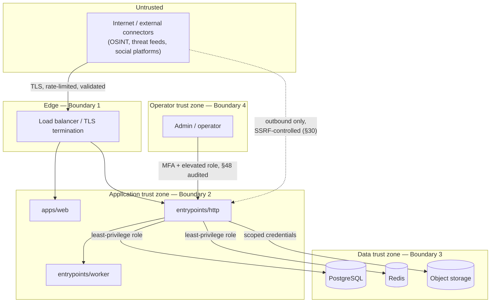

Four boundaries, each with a distinct trust level and control set: **(1)** public internet ↔ edge — untrusted, TLS + rate limiting + WAF/DDoS controls (§16, §31–32); **(2)** edge ↔ application — authenticated, every request re-verified regardless of having passed the edge (§4); **(3)** application ↔ data stores — least-privilege credentials, encrypted in transit and at rest (§15–16, §27); **(4)** operator access — the highest-privilege boundary, MFA-mandatory and fully audited (§8, §22, §48).

**Network zones** (the physical/virtual network counterpart to the logical boundaries above):

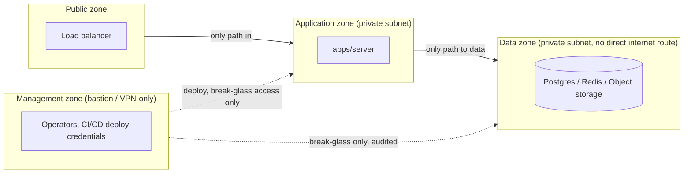

The data zone has **no direct route to or from the public internet** in any deployment profile, including cloud — this is a network-layer control, not just an application-layer permission, and it holds identically for cloud, dedicated-cloud, and air-gapped profiles (§41).

## 4. Zero Trust Architecture

"Never trust, always verify" — no request is trusted based on network origin alone, including requests that already crossed Boundary 2. Concretely: every API request is authenticated and authorized independent of source IP or network segment (`api-design.md` §3's per-endpoint auth/authz is the enforcement point); there is no "internal network = implicitly trusted" exception, not even for the admin/management zone (§3), which still requires MFA and per-action authorization.

**Phase 1's honest limitation, stated plainly:** `apps/server`'s modules share one process and one memory space — true zero-trust segmentation *between modules* doesn't exist yet, because there is no network boundary between them to enforce it at. Zero trust is fully applied at every boundary that *does* exist today (§3's four boundaries); it extends naturally to inter-module calls the moment a module is extracted (Phase 5, `architecture.md`), via §11's service-to-service authentication — the same principle, applied as soon as there's a network hop to apply it to.

**Maturity by phase**, tracked honestly rather than claimed prematurely:

| Boundary | Phase 1 | Phase 3+ | Phase 5 |
|---|---|---|---|
| Client ↔ API | Fully enforced (§5–6) | Fully enforced | Fully enforced |
| API ↔ data stores | Least-privilege credentials (§27) | Same, plus connection-level TLS everywhere | Same |
| Module ↔ module | Not applicable — single process | Not applicable — still one deployable | Fully enforced via §11's mTLS + workload identity |
| Event bus | Not applicable — in-process | TLS + SASL/mTLS (`event-driven-architecture.md` §21) | Same, with per-service ACLs |
| Operator ↔ system | Fully enforced (§3, §48) | Fully enforced | Fully enforced |

## 5. Authentication Architecture

**Token model: opaque, server-side session tokens — not self-contained JWTs.** This is a deliberate choice: `api-design.md` §9 already requires that a compromised session be "killable on demand," and self-contained JWTs make instant revocation genuinely hard (requiring a blocklist, which defeats much of a JWT's point). An opaque token backed by `platform.sessions` (`database-design.md` §3.1) can be revoked by deleting/marking one row — immediate, simple, and auditable.

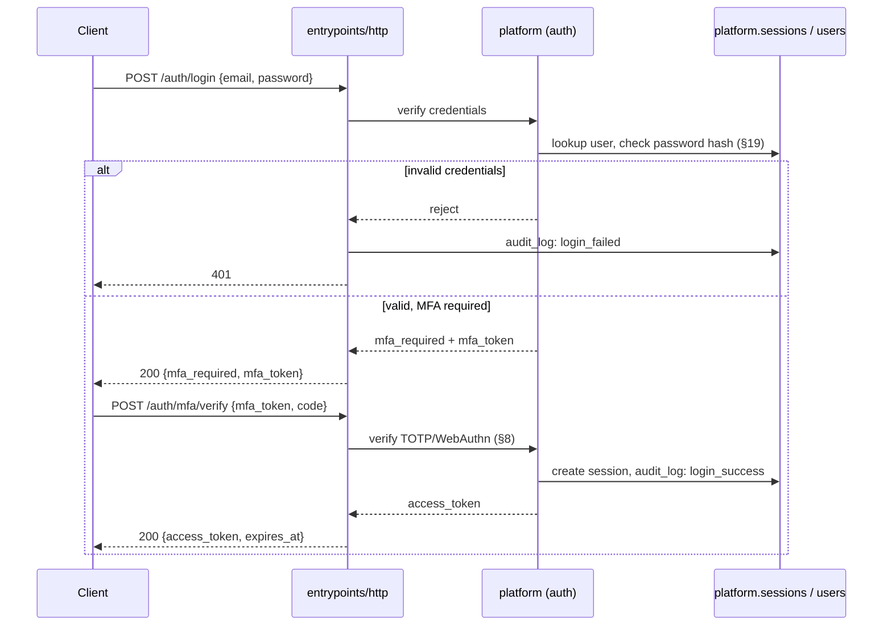

Password storage uses a slow, memory-hard KDF (§19) — never a fast general-purpose hash. Failed-login handling includes progressive backoff and eventual lockout (§31), and every login attempt — success or failure — writes to `platform.audit_log` (`database-design.md` §10).

## 6. Authorization (RBAC + ABAC)

A hybrid model, formalizing `api-design.md` §3: **RBAC** provides the coarse gate (`investigator`, `supervisor`, `admin`, `system`, `compliance`); **ABAC** provides the fine-grained decision on top of it, evaluated per request against attributes of the resource and the request context — case-scope grant, evidence `classification.sensitivity` (§38) vs. the caller's clearance, `legal_authority_ref` presence, and (for especially sensitive operations) time-of-day/location context.

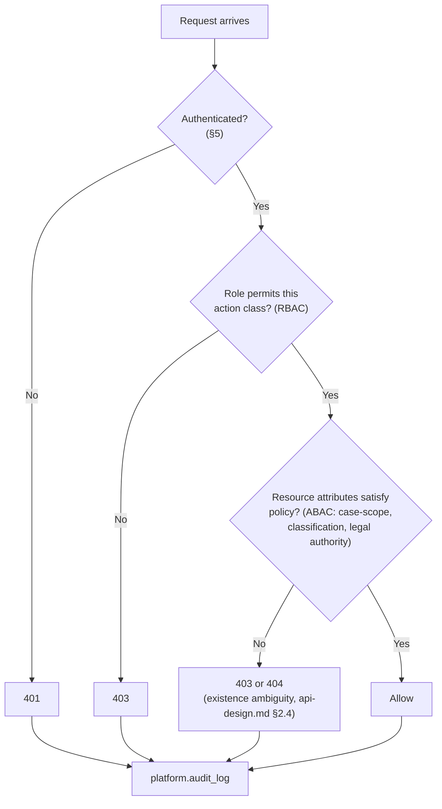

Every decision — allow or deny — is audited (§22), not just denials; a complete access history is what makes both insider-misuse detection (§23, SR-11) and legal disclosure of "who could see this evidence and when" possible. The policy evaluation is a single, centralized decision point conceptually — not scattered ad hoc checks throughout the codebase — so a policy change is made once and applies everywhere it should, and so the whole policy surface is reviewable.

**Worked example.** An `investigator` requests `GET /api/v1/evidence/{evidence_id}/custody-events` for an item classified `Confidential` (§38), linked to a case they are not assigned to. RBAC passes — `investigator` is a role permitted to call this endpoint class at all. ABAC then evaluates: is this evidence linked to a case the caller has a grant on? No — case-scope fails. The request is denied with `403`/`404` ambiguity per `api-design.md` §2.4 (Section 6's diagram, branch "No"), and the denial itself is written to `platform.audit_log` with the caller's identity, the resource requested, and the reason — a subsequent compliance review can distinguish "this analyst never had access" from "this analyst had access and used it," which matters for both insider-threat investigations (§23) and for demonstrating lawful-use governance (PRD §10) to an oversight body.

## 7. Identity Providers

- **SSO/OIDC/SAML** (`api-design.md` §9) is the primary path for organizational deployments, federated against the customer's existing identity provider — SentinelAI does not become a second identity system an agency has to separately govern.
- **Smart card / PIV / CAC support** is a first-class requirement, not an afterthought, given the law-enforcement and federal customer segment (PRD §4) — many such organizations mandate hardware-backed credential authentication by policy. This is supported as an identity provider integration (the card asserts identity via the organization's existing PKI), not a SentinelAI-specific mechanism.
- **Local accounts** exist only for initial admin bootstrap and for air-gapped deployments with no reachable external IdP — never as the default path for a production deployment with an available IdP.

| Mechanism | Typical customer | Air-gapped compatible? |
|---|---|---|
| OIDC/SAML federation | Enterprise security, most law enforcement | Yes, with an on-prem IdP |
| PIV/CAC smart card | US federal, many state/local law enforcement | Yes |
| Local accounts | Bootstrap only, or no-IdP air-gapped deployments | Yes (the only option with zero external dependency) |
- Each deployment configures exactly the IdP(s) relevant to that customer; **no cross-deployment identity federation** exists in Phase 1 — this is a single-tenant-per-deployment posture (§40) that keeps identity trust boundaries simple until multi-tenancy is deliberately designed for.
- **Attribute mapping is explicit, not assumed.** An IdP's group/role claims are mapped into SentinelAI's own RBAC roles (§6) through a deployment-specific, reviewed configuration — SentinelAI never infers a role from an IdP claim name by convention alone, since a naming coincidence in a customer's directory (e.g. a group literally named `admin` used for an unrelated purpose) must never silently grant elevated access.
- **De-provisioning is IdP-driven where possible.** When an organization disables a user in their own IdP, that should propagate to session revocation (§9) on the next token validation, not wait for a separate SentinelAI-side admin action — minimizing the window where an off-boarded user's SentinelAI session outlives their organizational access.

## 8. MFA

Mandatory for every role that can access evidence or case data — no exceptions, per PRD SR-2. Accepted factors, in order of preference:

| Factor | Preference | Why |
|---|---|---|
| WebAuthn/FIDO2 (hardware key or platform authenticator) | Preferred | Phishing-resistant — the strongest available option |
| PIV/CAC hardware credential | Preferred (government/LE deployments) | Combines authentication and MFA in one hardware-backed step (§7) |
| TOTP (authenticator app) | Acceptable, required minimum | Works fully offline — critical for air-gapped deployments (§41) |
| Backup/recovery codes | Account-recovery only | One-time use, generated at MFA enrollment |
| SMS/voice OTP | **Not supported** | SIM-swap vulnerable, requires connectivity incompatible with §41, and explicitly excluded as a matter of policy, not oversight |

## 9. Session Management

- **Token properties:** opaque, cryptographically random, sufficient entropy to resist guessing (conceptual requirement, not an implementation-specific length).
- **Expiry:** an idle timeout (session expires after a period of inactivity) and an absolute maximum session lifetime (forces re-authentication periodically regardless of activity) — both configurable per deployment, with government/high-sensitivity deployments defaulting shorter than enterprise.
- **Storage:** Redis (`system-design.md` §9) as a fast lookup cache for active-session checks on every request; `platform.sessions` in Postgres as the durable, audited system of record — the two are kept consistent, with Postgres authoritative on any disagreement.
- **Revocation is immediate and unconditional** — `POST /auth/logout` (`api-design.md` §4.1) and any admin-initiated forced logout take effect on the very next request, not eventually.
- **Concurrent sessions** are permitted by default (an analyst on a desktop and a field device) but each is independently visible and revocable — never bulk-invalidated by a change unrelated to that specific session.
- **Device/session binding** (tying a token to a device fingerprint to raise the bar on token theft) is a Phase 4+ hardening candidate, not a Phase 1 requirement — flagged in §52.

| Property | Policy |
|---|---|
| Idle timeout | Configurable, shorter default for high-sensitivity deployments |
| Absolute max lifetime | Forces re-authentication regardless of activity |
| Concurrent sessions | Permitted, each independently visible and revocable |
| Revocation latency | Immediate — next request after logout/admin action is rejected |
| Storage | Redis (fast path) + Postgres `platform.sessions` (durable, audited system of record) |

## 10. API Security

Synthesizes and extends `api-design.md`'s security-relevant conventions into a single reference:

- Every endpoint requires authentication except the small, explicit allowlist in `api-design.md` §3 (`/healthz`, `/readyz`, login/SSO entry points).
- Authorization is checked per request, never cached across requests in a way that could serve a stale grant (§6).
- Input validation happens at the boundary, before any business logic runs (§36); output is always encoded for its context (§37).
- Error responses never leak more than necessary — `api-design.md` §2.4's `NOT_FOUND` deliberately conflates "doesn't exist" with "you can't see it."
- CORS is restricted to `apps/web`'s own origin(s) only — no wildcard origins, ever, even in development (a habit worth banning early, since it's easy to leave in accidentally).
- Request size limits and timeouts are enforced on every endpoint, not just upload endpoints (§24) — an oversized or slow request is a resource-exhaustion vector regardless of which endpoint receives it.
- Rate limiting (§31) and secure headers (§33) apply platform-wide, not selectively.

## 11. Service-to-Service Authentication

**Phase 1:** no network boundary exists between modules (they share one process), so there is nothing to authenticate between them — the module-boundary rules (`architecture.md`) are the enforcement mechanism, not a network credential.

**Phase 3+/5, once modules communicate over a network:** mutual TLS between every service, plus short-lived, narrowly-scoped workload identity tokens (a SPIFFE/SPIFFE-like workload-identity **pattern** — cryptographically verifiable "this call really is from the `case-management` service," not a shared static secret — described here as the target design, not a mandated specific product). Connector/system accounts (`osint`, `threat_intel`, `forensics`, `social_media` calling back into the API) already authenticate via scoped tokens today (`api-design.md` §3); this is the same principle applied to inter-service calls once they exist. `event-driven-architecture.md` §21 already specifies TLS + SASL/mTLS for Redpanda producers/consumers — this section is the general policy that specific case implements.

**Why this matters even though Phase 1 has nothing to enforce yet.** Designing the module boundaries (`architecture.md`) as if a network already separated them — public interfaces only, no reaching into another module's internals — is precisely what makes this section's Phase 3+/5 policy a mechanical rollout rather than a redesign: extraction turns an already-disciplined in-process call into an authenticated network call, using the identity model this section already specifies, with no new trust decisions to invent under time pressure during the extraction itself.

**Least-privilege service identity, once it exists.** A given extracted service's workload identity is scoped to exactly the other services it legitimately calls (matching `database-design.md` §5's dependency DAG) — `investigation`'s service identity, for instance, is authorized to call `ingestion` and `case_management`, but an identity for, say, `osint` has no standing authorization to call `investigation` at all, since no such call exists in the architecture. The identity/authorization model enforces the same acyclic call graph the database schema ownership already enforces at the data layer.

## 12. Secrets Management

No secret is ever stored in source control (`.gitignore`d, `.env.example` placeholders only — an existing `CLAUDE.md` rule, restated here as a security architecture requirement, not just a hygiene one). Production secrets are managed by a dedicated secrets manager meeting these requirements (the specific product — e.g. Vault or a cloud-native KMS-backed manager — remains an open decision, `architecture.md` Open Questions; these are the requirements any candidate must satisfy):

- Encrypted at rest, itself protected by the key hierarchy (§13).
- Every retrieval is authenticated and audited — "who fetched this secret, when" is itself a security-relevant log (§49).
- Short-lived, dynamically issued credentials preferred over long-lived static secrets wherever the backing system supports it (e.g. database credentials issued per-session rather than a single shared password).
- Self-hostable — a cloud-only SaaS secrets manager is unusable in an air-gapped deployment (§41), so this is a hard requirement, not a preference.
- Supports rotation without downtime (§47).

**Secret inventory, by type**, so "secrets management" isn't left abstract:

| Secret type | Example | Rotation approach |
|---|---|---|
| Database credentials | Per-module DB role password | Dynamic, short-lived where the secrets manager supports it (§47) |
| API keys (outbound) | Threat-intel feed API key, AI provider key | Scheduled rotation, dual-validity overlap (§47) |
| Signing keys | Evidence/audit signing key (§20), image-signing key (§45) | Long cadence, high-ceremony rotation given broad impact |
| TLS/internal CA private keys | §17's certificate infrastructure | Tied to certificate rotation cadence |
| Session/token signing material | §5's session token generation | Short cadence; a compromise here is treated as §48's highest-urgency class |

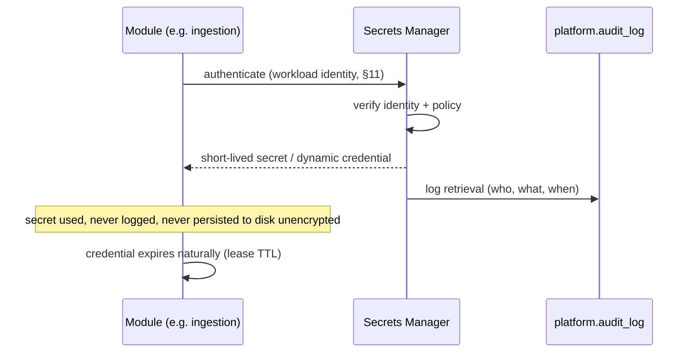

## 13. Key Management

**Envelope encryption**, the industry-standard pattern: a root/master key (the highest-protected key in the system, ideally HSM- or cloud-KMS-backed) encrypts one or more Data Encryption Keys (DEKs); DEKs, not the master key, directly encrypt actual data. Rotating the master key means re-encrypting DEKs (fast, small) rather than re-encrypting all data (slow, large) — this is why the hierarchy exists rather than using one key directly everywhere.

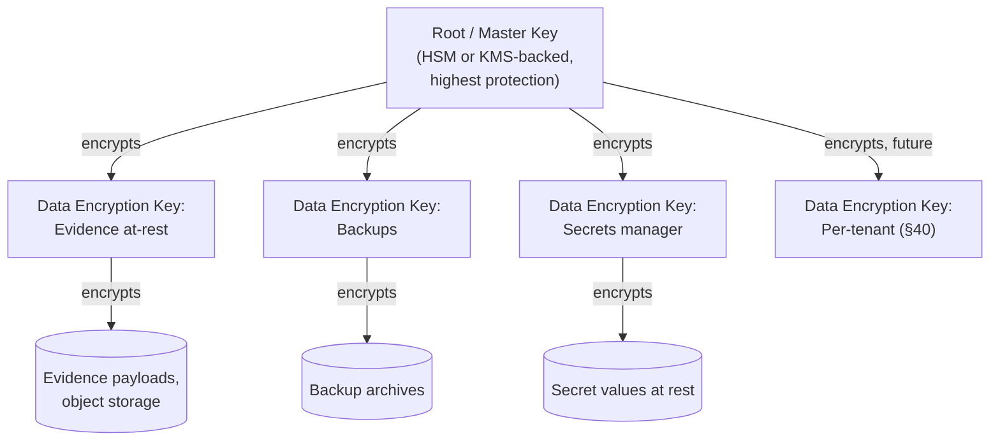

**Air-gapped requirement:** the master key must be manageable by a self-hostable KMS/HSM (a software HSM or an on-prem KMS appliance) — cloud-only KMS products (unreachable without internet egress) are unusable in that deployment profile, mirroring §12's constraint. The specific KMS/HSM product is an open decision (§52), but this requirement is not negotiable given PRD §8's deployment-flexibility NFR.

## 14. Encryption Standards

| Purpose | Standard | Notes |
|---|---|---|
| Symmetric / data-at-rest | AES-256-GCM | Authenticated encryption — integrity and confidentiality together |
| Transport | TLS 1.3 preferred, TLS 1.2 minimum | No TLS 1.1/1.0, no plaintext, anywhere (§16) |
| Asymmetric / signing | Ed25519 (preferred) or ECDSA P-384; RSA-4096 where compatibility requires it | Used for §20's digital signatures, §17's certificates |
| Hashing (integrity) | SHA-256 minimum, SHA-3-256/SHA-512 acceptable | Never MD5/SHA-1 as a primary hash (CEM §13 already establishes this for evidence specifically; this is the platform-wide rule it's an instance of) |
| Hashing (passwords) | Argon2id (preferred), bcrypt (acceptable) | A fundamentally different purpose from integrity hashing — see §19 |

No deprecated algorithm is permitted anywhere in the platform, including for legacy forensic-tool compatibility — where a legacy tool only produces an MD5/SHA-1 hash, that value is retained as a **secondary, clearly labeled** field for tool-interoperability purposes only, never as the primary integrity or security control (CEM §13's exact rule, restated here as the general policy it derives from).

**Explicitly prohibited, platform-wide, no exceptions:**

| Category | Prohibited | Reason |
|---|---|---|
| Hashing (as a primary/security control) | MD5, SHA-1 | Cryptographically broken for collision resistance |
| Symmetric encryption | DES, 3DES, RC4, unauthenticated AES modes (e.g. bare CBC without a MAC) | Weak, or lacks integrity protection |
| Transport | TLS 1.0, TLS 1.1, SSL (any version), plaintext HTTP for any authenticated endpoint | Deprecated protocol versions with known weaknesses |
| Password hashing | Any fast general-purpose hash (SHA-256 alone, MD5, etc.) used directly on a password | Fast hashes are trivially brute-forceable offline — §19's distinction exists precisely to prevent this mistake |
| Key exchange | Static, non-forward-secret key exchange | Compromise of a long-term key should not retroactively expose past sessions |

## 15. Data-at-Rest

- Full volume/disk encryption at the infrastructure layer for every data store — Postgres, Redis, object storage, backup targets.
- Object storage (MinIO/S3) server-side encryption for every evidence artifact, keyed via §13's DEK hierarchy.
- Backups are encrypted with their own DEK, stored in a separate bucket with separate credentials (`database-design.md` §12 — this document is the security rationale that decision implements).
- **Field-level encryption** for an especially sensitive subset of fields, beyond table/volume-level encryption, is a Phase 4+ enhancement candidate — flagged, not required for Phase 1 (§52).

## 16. Data-in-Transit

TLS everywhere, with no exceptions for "internal" traffic (§4's zero-trust principle applied concretely): client↔API, API↔Postgres, API↔object storage, API↔event bus (Phase 3+, `event-driven-architecture.md` §21), and service↔service (Phase 5, §11). **Certificate validation is always enforced — no environment, including local development, disables certificate verification.** This is stated explicitly because "skip TLS verify in dev" is a common, low-friction habit that has a way of leaking into production configuration; banning it from day one removes the risk entirely rather than relying on catching it later.

## 17. Certificate Strategy

- **Public-facing certificates:** issued by a standard public CA (e.g. Let's Encrypt) for cloud/dedicated-cloud deployments, or the customer's enterprise CA where required by policy.
- **Internal/service certificates:** issued by a private CA, required (not optional) for mTLS (§11) and mandatory for **air-gapped deployments**, since public CAs are unreachable without internet egress by definition.
- **Rotation** happens automatically, well before expiry, for every certificate class — an expired internal cert causing an outage is treated as a preventable operational failure, not an acceptable risk.
- **Revocation:** CRL distribution works air-gapped (an internally-hosted list); OCSP, which requires live connectivity, is used only where reachable and is never a hard dependency for validating a certificate in an air-gapped environment.

| Certificate class | Issuer | Rotation | Deployment applicability |
|---|---|---|---|
| Public-facing (client ↔ edge) | Public CA or enterprise CA | Automated, well before expiry | Cloud, dedicated cloud |
| Internal service (mTLS, §11) | Private/internal CA | Automated, short-lived preferred | All profiles, required for Phase 5 |
| Air-gapped internal | Internal CA only | Manual or internally-automated | Air-gapped (no public CA reachable) |

## 18. Evidence Integrity

Formalizes `canonical-evidence-model.md` §4 as a security control, not only a data-model feature: every payload-bearing evidence object carries a cryptographic hash (§19) computed at ingestion, re-verifiable at any later access, download, or export (`api-design.md` §5's `POST /evidence/{id}/verify-integrity`). A verification failure sets `status: quarantined` (CEM §13) — evidence is never silently served or trusted after a failed integrity check, and a quarantine event is itself audited (§22) and alerts (§49).

**Worked verification example.** An examiner calls `GET /evidence/{id}/download` six months after ingestion, for a case going to trial. Before returning the presigned URL, the system recomputes SHA-256 over the stored payload and compares it against the `integrity.hash` recorded at ingestion. A match proves the bytes are byte-for-byte identical to what was originally acquired — combined with §21's unbroken custody chain for that period, this is the technical basis for asserting the evidence hasn't been altered since collection, which is exactly what admissibility standards (PRD §10, FRE 901/902) require a proponent to be able to show. A mismatch is treated as a security incident (§48), not a data-quality bug — it means either corruption or tampering occurred, and CEM §13's `quarantined` status blocks the item from being served until the discrepancy is investigated.

## 19. Hashing Strategy

**Two distinct hashing use cases, deliberately not conflated:**

| Use case | Algorithm | Salted? | Speed | Purpose |
|---|---|---|---|---|
| Evidence/audit integrity (CEM §4, `database-design.md` §10) | SHA-256 or stronger | **No** — salting would make independent third-party verification impossible | Fast | Tamper-evidence: anyone can recompute and compare |
| Password storage (§5) | Argon2id (preferred) / bcrypt | **Yes**, per-password, automatically | Deliberately slow, memory-hard | Resist offline brute-force even if the hash store is exfiltrated |

An integrity hash is computed over the **raw payload bytes as originally acquired**, before any normalization or processing — it represents the original evidence, not SentinelAI's interpretation of it. This is why CEM §2's `integrity` object is set once, at ingestion, and never recomputed to match a later transformation.

## 20. Digital Signatures

An **optional but recommended enhancement** beyond hashing: signing an evidence hash with a private key adds non-repudiation — proof of *who* asserted the hash, not just that the content is unchanged — which directly strengthens the evidentiary foundation for admissibility standards referenced in PRD §10 (FRE 901/902, Daubert/Frye: an examiner's cryptographic signature is a modern analogue to a sworn chain-of-custody signature).

Recommended algorithm: Ed25519 (fast, small signatures, modern) or ECDSA P-384 where FIPS compliance requires it.

**Open design question, not decided here:** key custody model. Per-examiner signing keys give the strongest non-repudiation (this specific person attests to this specific hash) but add real key-management burden across many examiners; a system-level signing key is operationally simpler but weakens the non-repudiation claim to "this system attests," not "this person attests." This trade-off has legal as much as technical dimensions and is listed as an open item requiring product/legal input before adoption (§52).

## 21. Chain of Custody Security

Formalizes `canonical-evidence-model.md` §4 and `database-design.md` §4's hash-chained ledger as a security control:

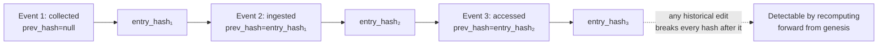

Beyond the hash chain itself, this is enforced with a **database-permission-level control**: the application's database role has **INSERT-only** privilege on `evidence_custody_events` — no `UPDATE` or `DELETE` grant exists at all, at the database layer, regardless of what application code intends to do. This means a compromised application process, not just a well-behaved one, cannot rewrite history — the guarantee doesn't depend on trusting the application code to police itself. **Separation of duties** is the complementary control: the role capable of changing evidence status is distinct from the role auditing that status, so a single compromised credential cannot both tamper with evidence and cover its own tracks in the audit trail.

## 22. Audit Security

Two audit surfaces (`database-design.md` §10) — `evidence_custody_events` (§21, narrow, evidentiary) and `platform.audit_log` (broad, system-wide) — both:

- Append-only at the database-permission layer, identical to §21's enforcement.
- Written through a **single, narrow, application-code-unbypassable interface** — there is exactly one path to write an audit entry, and it is not optional or skippable by any code path that performs an audited action; there is no alternate route that produces an unaudited side effect.
- Hash-chained (`prev_entry_hash`/`entry_hash`), independently re-verifiable by any authorized reviewer without trusting the application's own claim that nothing was altered.
- Access-restricted more tightly than ordinary application data — reading `platform.audit_log` requires `admin` or `compliance` role (`api-design.md` §10), since the audit log itself is a high-value target (an attacker who can read it learns exactly what defenses exist and how thoroughly their prior actions were logged).

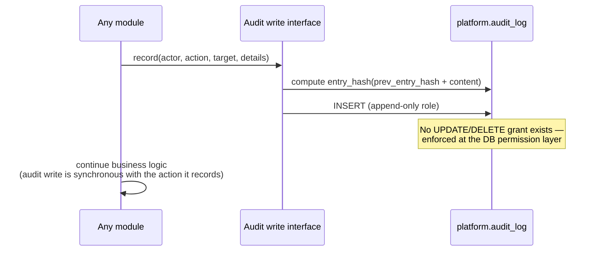

## 23. Tamper Detection

Three independent layers, catching different failure modes — no single layer is assumed sufficient on its own, consistent with §1's defense-in-depth principle:

1. **Hash chain re-verification (data tampering):** a scheduled job periodically recomputes and re-verifies the custody-event and audit-log hash chains across all records, alerting immediately on any break — proactive detection, not just "verify on read."
2. **Anomaly detection on access patterns (insider misuse, PRD SR-11):** unusual bulk export volume, access outside an analyst's normal working hours or location, access to cases outside their assignment — flagged for review, not auto-blocked (a false positive shouldn't lock out a legitimate investigator mid-case), feeding §49's monitoring.
3. **File-integrity monitoring at the infrastructure layer (system tampering):** the deployed application binaries/containers and configuration are themselves monitored for unauthorized modification — this catches an attacker who has compromised the host or supply chain (§42–46) rather than the data, a fundamentally different threat than 1–2 above.

| Layer | Detects | Response |
|---|---|---|
| Hash chain re-verification | Data tampering (evidence, audit log) | Immediate alert (§49); affected records quarantined pending investigation |
| Access-pattern anomaly detection | Insider misuse (SR-11) | Flagged for review, not auto-blocked — avoids locking out legitimate off-hours work |
| File-integrity monitoring | System/infrastructure tampering | Triggers §48's incident response — this is a host- or supply-chain-level compromise indicator |

## 24. File Upload Security

Extends `api-design.md` §2.11's presigned-URL pattern with security controls at each step:

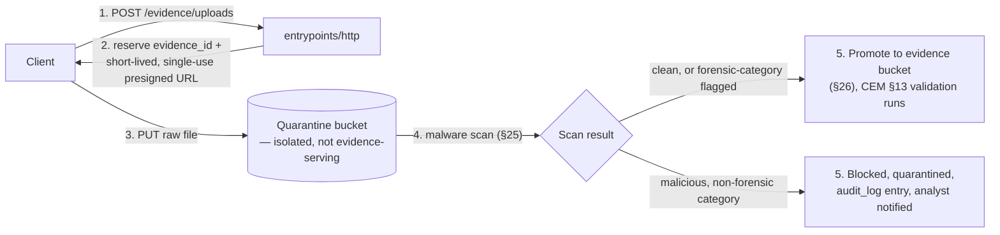

Controls: MIME/file-type **allowlist** (never a denylist — new dangerous types appear faster than a denylist can track them); enforced size limits; presigned upload URLs are short-lived and single-use where the object storage backend supports it; and — the key structural control — **an uploaded file is never reachable via the evidence-serving path until it has been scanned and validated.** The quarantine bucket exists specifically so no unscanned file is ever transiently accessible as if it were validated evidence.

## 25. Malware Scanning Pipeline

Every file lands in quarantine (§24) and is scanned before promotion — with one deliberate, domain-specific nuance: **a forensic disk image legitimately containing a malware sample is not a scanning failure — it may be the entire point of the case.** Policy, by category:

- **`digital_forensics` / `mobile_forensics` category:** malware detection is recorded as **metadata** (added to the evidence's `tags`/`attributes`, per CEM §2) and does **not** block promotion — deleting or quarantining evidence of malware defeats the investigation it's evidence for.
- **Every other category** (OSINT captures, social media media, manual uploads, reports): malware detection **blocks promotion**, keeps the file in quarantine, writes an audit entry, and notifies the uploading analyst — the normal, expected behavior for a non-forensic file.

Scan engine signature freshness is itself monitored (a scanner running stale signatures gives false confidence); in air-gapped deployments, signature updates arrive via an approved offline/manual import process (§41), never an automatic internet pull. Every scan result — clean or not — is logged, not just failures.

## 26. Object Storage Security

- **Default-deny bucket policies**, with per-purpose bucket separation: evidence, backups (already separated per `database-design.md` §12), reports/exports, and the quarantine bucket (§24) — each with its own, narrower access policy rather than one bucket with broad internal access.
- **Presigned URLs are scoped as narrowly as the object storage backend allows:** single object, short TTL, and a specific action (read *or* write, never both from the same URL).
- **Versioning enabled on the evidence bucket** — a defense-in-depth complement to the database-level immutability (`database-design.md` §1), protecting against accidental or malicious overwrite at the storage layer even if something bypassed the application layer.
- **Object Lock / WORM (Write-Once-Read-Many) mode** on the evidence bucket, where the underlying object storage supports it (S3 Object Lock and equivalents) — a storage-layer enforcement of evidence immutability that holds even against a compromised or misconfigured application, and directly reinforces both §39's legal hold guarantee and the evidentiary admissibility rationale in §20.

| Bucket | Purpose | Access policy | Special protections |
|---|---|---|---|
| Evidence | Validated evidence payloads | Read via scoped presigned URL only; write only by `ingestion` after CEM §13 validation | Versioning + Object Lock/WORM |
| Quarantine | Unscanned uploads (§24) | Write by upload initiator only; read only by the scanning process (§25) | Never reachable via any evidence-serving path |
| Backups | Encrypted DB/object backups | Separate credentials from every other bucket (`database-design.md` §12) | Legal-hold-aware retention (§39) |
| Reports/exports | Generated disclosure packages (§7 of `api-design.md`) | Read via scoped presigned URL, case-scoped (§6) | Every download is a disclosure-significant audited event (§22) |

## 27. SQL Injection Prevention

An architectural mandate, not a code-review suggestion: **parameterized queries/prepared statements are the only sanctioned way any query is built — string concatenation of any external input into a query is prohibited outright**, enforceable via code review and (once a language/framework is chosen, `architecture.md` Open Questions) static analysis tooling. This is backed by, not substituted by, least-privilege database roles (`database-design.md` §1's schema-per-module ownership already means the application's DB credential for a given module can only touch that module's own tables — a SQL injection that somehow got past parameterization still couldn't reach another module's schema). Input validation (§36) is a third, defense-in-depth layer — never the primary control, since validation can miss cases parameterization structurally can't.

**Defense in depth, worked through:** even in the worst case — a parameterization bug slips past review, and an attacker successfully injects SQL through, say, an OSINT connector's finding-ingestion path — the blast radius is still contained to `osint`'s own schema, because that connector's database credential has no grant on `case_management`, `investigation`, or any other module's tables (`database-design.md` §1–2). The attacker cannot pivot to reading or tampering with case data through that single injection point. This is the concrete payoff of schema-per-module ownership from a *security*, not just an architectural-cleanliness, standpoint.

## 28. XSS Prevention

Output is encoded for its rendering context (HTML body, HTML attribute, JavaScript, URL) at the point of render, always — never trusted as "already safe" because it came from a validated source. **This platform's risk surface here is elevated by design**: evidence content is, by definition, untrusted external content — an OSINT-scraped web page, a social media post, a forensic filename — that legitimately needs to be *displayed* to an analyst, not rejected as invalid input the way a malformed API request would be. `evidence.attributes.body` (CEM §6) containing an attempted script injection from a scraped source is an expected adversarial input this system must handle, not an edge case. Content-Security-Policy (§34) is a defense-in-depth layer; the primary control is that no capability renders evidence-derived content as raw, unencoded markup — anything with a legitimate need to render rich content passes through an allowlist-based sanitizer first.

## 29. CSRF Strategy

Because the API uses bearer tokens in an `Authorization` header (`api-design.md` §3), not cookies, for authentication, CSRF's classic attack vector — a browser automatically attaching credentials to a cross-site request — largely doesn't apply to the API surface itself. Where a session cookie is used at all (e.g. `apps/web`'s own session with its serving backend, or handling an SSO callback), CSRF tokens (synchronizer or double-submit pattern) are required on every state-changing request, and any such cookie is `SameSite=Strict` at minimum (§35).

This is a case where **the authentication architecture choice in §5 pays a security dividend in a completely different section** — choosing bearer tokens over cookie-based sessions for the API wasn't made for CSRF-avoidance reasons (§5's rationale was revocability), but it meaningfully shrinks this section's scope as a side effect. The remaining CSRF surface (the SSO callback handling, specifically) is still real and still requires the standard token-based defense — this section exists to make sure that narrower, easy-to-overlook surface isn't assumed away just because the bulk of the API doesn't need it.

## 30. SSRF Protection

**A specifically elevated risk for this platform**, given how much of it exists to fetch external, attacker-influenceable content: OSINT and threat-intelligence connectors make outbound requests whose *destination or response* can be shaped by a hostile target (a malicious OSINT subject could craft a page that causes a naive connector to fetch an internal URL on redirect, for instance). Mandatory controls:

- Outbound connector requests are validated against a destination allowlist/denylist — **private/internal IP ranges and cloud metadata endpoints (e.g. `169.254.169.254`) are always blocked**, regardless of what a response tries to redirect to.
- Redirects are not followed blindly — a redirect target is re-validated against the same destination policy before being followed.
- Connectors run under network-level egress restrictions (§3's network zones) so that even a connector process that's fully compromised cannot reach internal services it has no legitimate need to reach.

## 31. Rate Limiting

Extends `api-design.md` §2.13 with the security framing: rate limits are **stricter on authentication endpoints specifically** (`/auth/login`, `/auth/mfa/verify`) than on general API traffic, since these are the primary brute-force/credential-stuffing target. Repeated failed login attempts trigger progressive backoff and eventual temporary lockout, logged to `platform.audit_log` (§22) and feeding §49's monitoring — a burst of failed logins across many accounts is a credential-stuffing signal worth alerting on even if no single account is locked out.

## 32. DDoS Protection

Layered, matched to what's actually reachable at each layer of §3's network zones:

1. **Edge/network layer** (cloud and dedicated-cloud profiles only): a CDN or cloud DDoS protection service absorbs volumetric attacks before they reach the application. Air-gapped deployments don't have and don't need this layer — they have no public internet exposure to protect against in the first place.
2. **Application layer:** §31's rate limiting, scoped per actor, prevents any single authenticated identity from monopolizing capacity.
3. **Resource layer, the last line of defense even if traffic gets through:** connection limits, request size caps (§10, §24), and enforced timeouts prevent a smaller volume of malicious requests from exhausting server resources via slow or oversized requests rather than sheer volume.

| Layer | Applies to | Mechanism |
|---|---|---|
| Edge/network | Cloud, dedicated cloud only | CDN / cloud DDoS protection service, absorbs volumetric attacks |
| Application | All deployment profiles | Per-actor rate limiting (§31), scoped so no single identity exhausts shared capacity |
| Resource | All deployment profiles | Connection/size/timeout limits (§10, §24) — the floor every deployment gets regardless of what's above it |

## 33. Secure Headers

| Header | Purpose |
|---|---|
| `Strict-Transport-Security` | Forces HTTPS for all future requests to the origin, including on the first visit if preloaded |
| `X-Content-Type-Options: nosniff` | Prevents the browser from MIME-sniffing a response into an unintended, more dangerous content type |
| `X-Frame-Options` / `frame-ancestors` (CSP) | Clickjacking defense — prevents the app being framed by an untrusted origin |
| `Referrer-Policy` | Limits what's leaked to third parties via the `Referer` header when navigating away |
| `Permissions-Policy` | Explicitly disables browser features (camera, geolocation, etc.) the app never legitimately needs |

Applied platform-wide, on every response, not selectively per route. Header presence is a cheap, mechanically verifiable check — a candidate for automated CI verification (`.github/workflows/pr-validation.yml`'s existing pattern) once `apps/web` exists to test against, rather than relying solely on manual review to catch a missing header.

## 34. CSP

`Content-Security-Policy` defaults to `default-src 'self'` with the narrowest possible additional allowlist — given this platform's air-gapped/self-hosted deployment ethos (§35, §41), the target policy has **no external CDN or third-party script/style sources at all**, since every asset is self-hosted by design. No `unsafe-inline`, no `unsafe-eval`; if an inline script is ever genuinely required, it's nonce- or hash-allowed explicitly, never blanket-permitted. CSP violation reports feed §49's security monitoring — a violation is itself a signal worth investigating, whether it's an attempted attack or a misconfiguration.

## 35. Browser Security

- **No external CDN dependencies** — every script, style, and font is self-hosted, both for air-gapped compatibility (§41) and because it removes an entire class of third-party-compromise and Subresource-Integrity concerns rather than mitigating them.
- **Session/bearer tokens are never stored in `localStorage` or `sessionStorage`** — both are readable by any script that achieves XSS (§28), turning one XSS bug into full session theft. Preferred storage is in-memory (lost on tab close, requiring re-auth — an acceptable trade for the security gain) or an `HttpOnly` cookie where a cookie-based flow is used at all (§29), which JavaScript cannot read even under XSS.
- Any cookie that is used carries `HttpOnly`, `Secure`, and `SameSite=Strict`.
- Idle-timeout auto-lock (not just server-side session expiry, §9) at the UI layer for high-sensitivity views, so an unattended, unlocked workstation isn't a standing exposure.

## 36. Input Validation

The general policy CEM §13 is the canonical worked example of: validate at every trust boundary (API request bodies, file uploads, connector output before it's trusted, admin configuration changes) using **allowlists over denylists**, checking type, format, and range together, and **rejecting** structurally invalid input outright rather than attempting to sanitize-and-continue — `api-design.md` §2.4's 400-vs-422 distinction is this principle applied at the API layer specifically; this section is the platform-wide statement it's an instance of.

**Boundary inventory, so "every trust boundary" is concrete rather than aspirational:** the API request body (validated against CEM §13 and each endpoint's rules in `api-design.md`), file upload metadata (§24), OSINT/threat-intel/social-media connector output (validated as untrusted external content *before* it is treated as a normalized evidence candidate — a connector's own claims about a finding are not trusted merely because the connector itself is authenticated), admin/configuration changes (§46's CI/CD controls plus runtime validation), and event payloads arriving from another module (`event-driven-architecture.md` §22's publish-time and consume-time validation). A boundary not on this list should be treated as a gap to close, not an implicit exception.

## 37. Output Encoding

Beyond §28's HTML-rendering case, output encoding discipline applies to every format evidence-derived or user-derived content can reach: **API JSON** output is inherently safe when serialized correctly (proper JSON encoding is not optional or hand-rolled); **log output** must not allow a malicious value to inject fake log lines or control characters (log injection is a real, less-obvious sibling of XSS); **generated reports/exports** (PDF, disclosure packages, `api-design.md` §7) must encode evidence content for the target document format, since a naive template-substitution approach is exactly as vulnerable to injection as unescaped HTML rendering is.

## 38. Data Classification

Formalizes CEM §2's `classification.sensitivity` field into a full scheme:

| Level | Handling |
|---|---|
| Public | OSINT explicitly sourced from public records — minimal restriction |
| Restricted | Default for case-linked evidence — access requires case-scope grant (§6) |
| Confidential | Sensitive PII, victim/witness information — access logging on every read, not just writes |
| Classified (deployment-specific) | For government/intelligence deployments needing to map to a formal national classification scheme — SentinelAI's internal levels are a **mappable superset**, not an assumption of any specific scheme |

**Classification inheritance:** a derived entity or relationship (CEM §7–8) inherits the **highest** classification level among its supporting evidence — a `proposed` relationship built partly from `Confidential` evidence is itself `Confidential`, regardless of what its other supporting evidence is classified as. This prevents classification laundering through the correlation layer.

**Worked example.** Evidence item A (`Restricted`, an OSINT record) and evidence item B (`Confidential`, containing victim PII) both support a proposed relationship linking two entities. The resulting relationship is classified `Confidential` — inheriting item B's higher level — which means every downstream consumer of that relationship (§6's authorization check, §7's report generation, §37's export encoding) applies `Confidential`-level handling automatically, without needing to separately reason about which of its several supporting evidence items was the sensitive one.

## 39. Legal Hold Protection

Consolidates `database-design.md` §7/§8/§12 and CEM's `retention.legal_hold` into the authoritative security guarantee:

- Legal hold is enforced as a **hard gate at the data layer** — any deletion, purge, or archival-sweep operation checks the flag first and refuses outright if set; this is not a policy reminder relying on operator discipline.
- The hold **overrides normal retention/archival schedules** (`database-design.md` §7, `event-driven-architecture.md` §20) and **overrides backup rotation** (`database-design.md` §12) — a held item cannot silently age out of any retention window anywhere in the system.
- Changing hold status is itself a privileged, audited action, requiring a `supervisor`/`admin`/`compliance`-equivalent role — never available to the same role that could also delete the underlying evidence, per §21's separation-of-duties principle.

## 40. Tenant Isolation (Future)

Phase 1 is deliberately single-tenant (`architecture.md`); this section defines the target architecture for PRD Phase 4's multi-tenancy requirement, not a Phase 1 build item. Two models, with a recommendation specific to this customer base:

- **Logical isolation** (shared schema, `tenant_id` column on every table, enforced via row-level policy): lower operational cost, but asks government/intelligence customers to trust a shared-infrastructure boundary many will not accept by policy.
- **Physical isolation** (dedicated database/deployment per tenant): stronger guarantee, matches how this customer segment typically procures software, and avoids the entire class of cross-tenant-leak risk logical isolation carries.

**Recommendation:** physical/dedicated-deployment tenancy as the default for this platform, given the sensitivity of the data and the customer base — shared-schema multi-tenancy, if ever offered, should be an explicit, separately-evaluated option for the enterprise-security segment only, never the default. This is flagged as requiring a formal ADR (§51) before any Phase 4 multi-tenancy work begins.

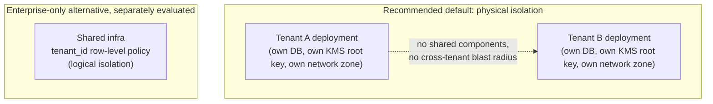

## 41. Air-Gapped Deployment Security

Consolidates every air-gapped requirement already touched on elsewhere (`system-design.md` §13, PRD §8, `database-design.md` §12) into one authoritative list:

- **Zero external network egress**, validated by periodic egress monitoring — not merely configured and assumed to hold, since a misconfiguration that silently opens an egress path in a supposedly air-gapped environment is a realistic and serious failure mode.
- **Internal CA required** for every certificate (§17) — public CAs are unreachable by definition.
- **Every dependency self-hosted:** secrets manager (§12), KMS/HSM (§13), malware-scan engine (§25) — no SaaS-only component anywhere in the critical path.
- **Signature/definition updates via an approved offline import process**, never an automatic internet pull — a documented, auditable "sneakernet" update procedure for anti-malware definitions and any other auto-updating component.
- **Internal, not internet-sourced, time synchronization** — accurate time matters directly for §21's hash-chain timestamps and §22's audit ordering, so an internal authoritative time source is a security-relevant requirement, not just an operational nicety.
- **Image and package mirroring to an internal registry** (§42, §46) — nothing in the deployment pipeline reaches out to a public registry at deploy time.

## 42. Supply Chain Security

A software bill of materials (SBOM, PRD SR-10) is maintained for every release; dependency provenance is verified before adoption, not assumed; dependency versions are pinned, not floating; and adding a new external dependency is a reviewed decision (`CONTRIBUTING.md`'s PR template already flags "new external dependency" as ADR-worthy) — the dependency footprint is kept as small as the platform's actual needs justify, since every dependency is inherited attack surface.

## 43. Dependency Scanning

Automated scanning runs on every PR (extending the existing `.github/workflows/pr-validation.yml` pattern with a dedicated dependency-scan job once a language/framework is chosen) **and** on a recurring schedule against the already-deployed dependency set, since new CVEs are discovered in dependencies that were clean when originally approved. Severity-based gating: critical/high findings block merge (PR-time) or trigger an urgent patch SLA (scheduled-scan-time); scanning covers both application-level dependencies and container base images (§44) — a clean application dependency tree sitting on a vulnerable base image is still a vulnerable deployment.

| Scan trigger | Scope | Gating |
|---|---|---|
| Every PR | New/changed dependencies | Critical/high blocks merge |
| Scheduled (daily/weekly) | Full deployed dependency set, including already-approved ones | Critical/high triggers an urgent patch SLA, not a merge block (nothing to merge yet) |
| Image build | Base image + all layers | Critical/high blocks image signing (§45), which blocks deployment |

## 44. Container Security

Minimal base images (distroless or slim — no shell, no package manager, no unnecessary tooling in a production image, which meaningfully shrinks what an attacker who gets code execution can do next); containers run as a **non-root user**; the root filesystem is read-only where the workload allows it; no container runs `--privileged`; resource limits (CPU/memory) are set on every container, both for stability and as a DDoS-adjacent control (§32); and base images are rebuilt on a regular cadence independent of application code changes, to pick up upstream OS security patches.

| Control | Requirement | Rationale |
|---|---|---|
| Base image | Distroless/slim, no shell | Shrinks what a code-execution exploit can do next |
| User | Non-root | Limits filesystem/process access even under compromise |
| Filesystem | Read-only root where workload allows | Prevents persistence of a dropped payload |
| Privilege mode | Never `--privileged` | No unnecessary host-level access |
| Resource limits | CPU/memory caps on every container | Stability + resource-exhaustion defense (§32) |
| Rebuild cadence | Regular, independent of app code changes | Picks up upstream OS patches proactively, not reactively |

## 45. Image Signing

Every container image is cryptographically signed at build time (a Sigstore/cosign-style **pattern**, described here as the target design rather than a mandated specific tool) and carries build provenance/attestation metadata (which commit, which pipeline, when). Deployment enforces **admission control that only runs verified, signed images** — an unsigned or signature-mismatched image is refused at deploy time, not merely flagged. This closes the gap between "we scanned the image for known CVEs" (§43) and "we're certain this is actually the image we scanned and built, unmodified."

## 46. Secure CI/CD

The CI/CD pipeline is itself part of the supply chain (§42) and is treated with matching scrutiny — a CI compromise is a path to inject malicious code into every future deployment, arguably a worse outcome than compromising a single running instance. Controls: least-privilege CI credentials (a CI runner has only the access its specific job needs, never broad production access by default); secrets are never written to CI logs; branch protection requires review before merge (already established via `.github/CODEOWNERS`); production deployment requires an explicit approval gate, distinct from merge-to-main; and, for air-gapped deployments, the entire pipeline — including its own dependencies — is mirrored internally (§41), with no step that reaches the public internet.

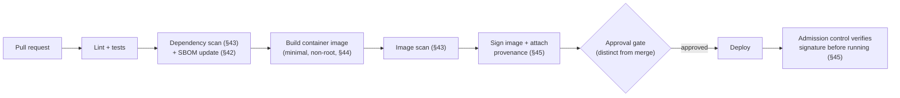

## 47. Secret Rotation

Rotation cadence is matched to secret sensitivity and blast radius, not applied uniformly: database credentials and API keys rotate frequently, especially where §12's secrets manager supports short-lived dynamic issuance (effectively continuous rotation); signing keys (§20) and root/master keys (§13) rotate on a longer, deliberate cadence given their broader impact. **Rotation never causes downtime** — the pattern is a brief dual-validity overlap window where both the old and new secret are simultaneously accepted, exactly mirroring `event-driven-architecture.md` §23's dual-publish approach to breaking changes; the old secret is retired only once nothing is still using it. An emergency/out-of-cadence rotation procedure exists for suspected compromise, feeding directly into §48's incident response process.

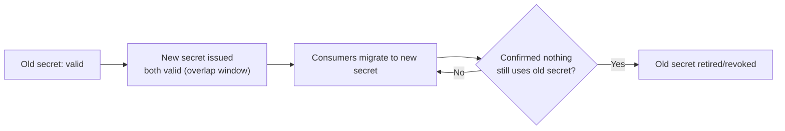

## 48. Incident Response

Phases (NIST-aligned): **Preparation** → **Detection & Analysis** (§49's monitoring is the primary input) → **Containment** → **Eradication** → **Recovery** → **Post-Incident Review**.

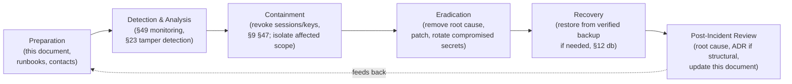

**Severity classes specific to this platform**, ranked by real-world consequence rather than generic technical severity: an **evidence-integrity breach** (undetected tampering, or a broken chain of custody) is treated as the highest severity, above a typical data breach, because of its direct legal consequence to active cases; **credential/session compromise** and **data exfiltration** follow standard severity models; and a distinct, platform-specific class — **an AI-generated finding causing real-world harm before human review caught it** — is explicitly named as an incident type this plan must cover, given PRD FR-7.3's human-in-the-loop guarantee is a *design* control, not a claim that failure is impossible.

| Severity class | Example | Why ranked here |
|---|---|---|
| Critical | Evidence-integrity breach, broken chain of custody | Direct legal consequence to active cases — worse than a typical breach for this specific platform |
| Critical | AI finding caused real-world harm pre-review | Indicates the human-in-the-loop control itself was bypassed or failed |
| High | Credential/session compromise, confirmed | Standard severity, but elevated given case-scoped data sensitivity |
| High | Data exfiltration, confirmed | Standard severity model |
| Medium | Anomalous access pattern, unconfirmed | Investigation-triggering, not yet a confirmed incident |
| Low | Isolated failed-login burst, rate-limited automatically | Handled by existing controls (§31), logged for pattern analysis (§49) |

**Current state, stated honestly:** with a single developer (`architecture.md`'s established team-size context), formal IR roles/on-call rotation are aspirational, not yet staffed — this plan is the structure to formalize as the team grows, not a claim that a 24/7 response capability exists today. Customer notification obligations under applicable law/contract (§50) are tracked alongside the technical response, not as an afterthought once the technical incident is resolved.

**Worked example: suspected credential compromise.** §49's monitoring flags an authenticated session performing actions inconsistent with the user's normal pattern (§23) — unusual hours, unfamiliar location, and a burst of evidence downloads across multiple unrelated cases. **Detection & Analysis:** the anomaly is correlated against `platform.audit_log` (§22) to build a timeline of everything that session did. **Containment:** the specific session is revoked immediately (§9 — this is why instant revocation was a hard requirement in §5, not a nice-to-have), and, out of caution, the user's password and MFA enrollment are force-reset (§47's emergency rotation path) rather than assuming the session token alone was the compromised element. **Eradication:** if the access pattern suggests a phished credential rather than a stolen token, the root cause (e.g. a phishing campaign) is investigated beyond just this one account — were other users targeted by the same campaign? **Recovery:** the user re-authenticates through the normal flow (§5) with new credentials; no data restoration is needed unless the audit trail shows actual tampering occurred, in which case §21's chain of custody determines exactly which evidence, if any, requires re-verification. **Post-Incident Review:** was the detection fast enough? Should the anomaly threshold in §23 be tuned? Does this specific case warrant an ADR (§51) — for instance, if it reveals device-binding (§9's flagged Phase 4+ candidate) should be prioritized sooner than planned.

## 49. Security Monitoring

Extends `system-design.md` §12's observability model with security-specific signals: authentication failures and lockouts (§9, §31), authorization denials (§6), anomalous access patterns (§23), CSP violation reports (§34), dead-lettered audit-significant events (`event-driven-architecture.md` §15, §21), rate-limit violations (§31), and dependency/image-scan findings (§43, §45) — aggregated into a single security-monitoring view distinct from, but overlapping, general operational observability. Security-relevant logs are retained at least as long as `platform.audit_log` (`database-design.md` §10) and are themselves subject to the same append-only, access-restricted handling.

### 49.1 PRD Security Requirements Traceability

Direct mapping from each PRD §9 requirement to the section(s) of this document that fully specify it — closing the loop between the requirement and its architecture:

| PRD requirement | Satisfied by |
|---|---|
| SR-1: encryption at rest/in transit, dedicated KMS | §13–17 |
| SR-2: MFA, SSO integration | §7–8 |
| SR-3: least privilege by default | §1, §6, §11, §27 |
| SR-4: append-only, tamper-evident audit store | §21–23 |
| SR-5: regular penetration testing, release-blocking severity gate | §43 (extended: pen-testing itself is a §52 open operational item, not yet formalized given team size) |
| SR-6: no secrets in source control, dedicated secrets manager | §12 |
| SR-7: multi-tenant cryptographic/logical isolation | §40 |
| SR-8: no cross-tenant AI model training without consent | §40, flagged alongside tenant isolation as a Phase 4 design item |
| SR-9: prompt-injection/exfiltration evaluation for untrusted content | §2.1 (scenario 3), §28, §36 |
| SR-10: SBOM and dependency vulnerability tracking | §42–43 |
| SR-11: internal-misuse anomaly detection | §23, §49 |

## 50. Compliance Mapping

A representative mapping from this document's controls to PRD §10's frameworks — illustrative of coverage, **not a substitute for a formal compliance audit or certification claim**, consistent with PRD §10's own "none of the above is fully resolved" framing:

| Control area | CJIS / NIST 800-53 | GDPR | SOC 2 / ISO 27001 |
|---|---|---|---|
| Encryption at rest/in transit (§14–17) | Media protection, SC family | Art. 32 (security of processing) | CC6 (logical access), A.10 (cryptography) |
| Audit logging (§22) | Audit & accountability (AU family) | Art. 5(2) (accountability) | CC7 (monitoring) |
| Access control / RBAC+ABAC (§6) | Access control (AC family) | Art. 25 (data protection by design) | CC6 |
| MFA (§8) | Identification & authentication (IA family) | — | CC6.1 |
| Incident response (§48) | Incident response (IR family) | Art. 33–34 (breach notification) | CC7.3–7.5 |
| Legal hold / retention (§39) | — | Art. 17 (right to erasure, with lawful-processing exceptions) | — |
| Air-gapped/self-hosted deployment (§41) | FedRAMP/StateRAMP path for government cloud, or on-prem alternative (PRD §10) | Data residency (Art. 44 international transfer restrictions) | — |
| Supply chain integrity (§42–46) | SA-11, SR family (supply chain risk management) | — | A.15 (supplier relationships) |
| Export control considerations | ITAR/EAR review affects hosting and personnel access for certain deployments (PRD §10) — not a technical control this document specifies, flagged for legal/compliance ownership | — | — |

This mapping is a starting point for a compliance officer's own gap analysis, not a claim of certification — each framework has its own formal audit process, and PRD §10 already establishes that none of these are fully resolved for this platform yet.

## 51. Security ADRs

Decisions in this document that require a formally recorded ADR (`docs/adr/`, per `CLAUDE.md`'s convention) before or as they're implemented, not silently assumed:

- Session token model (§5) — opaque vs. self-contained, and the specific mechanism
- Secrets manager product selection (§12)
- KMS/HSM product selection (§13)
- Digital signature key custody model (§20)
- Object Lock/WORM adoption and specific object storage product (§26)
- Tenant isolation model (§40) — required before any Phase 4 multi-tenancy work

## 52. Open Security Questions

Consolidated from every "flagged as open" item above:

- Session token specifics beyond "opaque, revocable" (§5)
- Device/session binding — Phase 4+ candidate (§9)
- Field-level encryption for a sensitive-field subset — Phase 4+ candidate (§15)
- Secrets manager and KMS/HSM product selection (§12, §13)
- Digital signature adoption and key custody model (§20)
- Object Lock/WORM specific adoption (§26)
- Tenant isolation model for Phase 4 (§40)
- Formal, staffed incident-response roles/on-call — currently aspirational given team size (§48)

## Security Controls Across a Single Workflow

A capstone trace showing how the sections above compose across one realistic user journey — evidence submission through report disclosure — the same kind of end-to-end view `event-driven-architecture.md` §26 provides for its own concern:

```mermaid
sequenceDiagram
    participant Analyst
    participant API as entrypoints/http
    participant ING as ingestion
    participant STORE as Object storage
    participant CASE as case_management
    participant INV as investigation

    Analyst->>API: login + MFA (§5, §8)
    API-->>Analyst: session token (revocable, §9)
    Analyst->>API: POST /evidence/uploads
    API->>API: authz check (§6), rate limit (§31)
    API-->>Analyst: presigned URL → quarantine bucket (§24)
    Analyst->>STORE: upload file
    STORE->>STORE: malware scan (§25)
    STORE->>ING: promote if clean/forensic-flagged (§25, §26)
    ING->>ING: CEM §13 validation, integrity hash (§18-19)
    ING->>ING: custody event, hash-chained, INSERT-only (§21)
    API->>API: audit_log entry (§22)
    Analyst->>API: POST /cases/{id}/evidence (link)
    API->>API: authz: case-scope check (§6)
    CASE->>INV: evidence.linked_to_case (TLS/mTLS once extracted, §11)
    INV->>INV: correlate; propose finding (status=proposed, §1)
    Analyst->>API: PATCH /relationships/{id}/status (review, §6 authz)
    Analyst->>API: POST /cases/{id}/reports
    API->>STORE: generated report → encrypted bucket (§15, §26)
    Analyst->>API: GET /reports/{id}/download
    API->>API: audit_log: disclosure-significant access (§22)
```

Every hop above is independently authenticated and authorized (§4's zero-trust principle), independently logged (§21–22), and no single control's failure collapses the whole chain — which is the practical meaning of §1's defense-in-depth principle, demonstrated rather than only asserted.

## Glossary

| Term | Definition |
|---|---|
| **RBAC** | Role-Based Access Control — coarse-grained authorization by role (§6) |
| **ABAC** | Attribute-Based Access Control — fine-grained authorization by resource/context attributes (§6) |
| **Zero Trust** | No implicit trust based on network location; every request independently verified (§4) |
| **Envelope encryption** | A master key encrypts data encryption keys, which encrypt data — rotation-efficient key hierarchy (§13) |
| **HSM / KMS** | Hardware Security Module / Key Management Service — where root keys are generated and protected (§13) |
| **WORM / Object Lock** | Write-Once-Read-Many — storage-layer enforcement that an object cannot be modified or deleted for a defined period (§26) |
| **SSRF** | Server-Side Request Forgery — tricking a server into making an unintended request, often to an internal resource (§30) |
| **CSRF** | Cross-Site Request Forgery — tricking a browser into making an unwanted authenticated request (§29) |
| **XSS** | Cross-Site Scripting — injecting executable script into content another user's browser will render (§28) |
| **STRIDE** | A threat-categorization framework: Spoofing, Tampering, Repudiation, Information disclosure, Denial of service, Elevation of privilege (§2) |
| **SBOM** | Software Bill of Materials — a complete inventory of a build's dependencies (§42) |
| **Non-repudiation** | Proof of who performed an action, such that they cannot credibly deny it — the property digital signatures add beyond integrity hashing alone (§20) |
| **Air-gapped** | A deployment with no network path to the public internet at all (§41) |

## 53. Security Review Checklist

For use in code review and pre-release review — organized by the parts of this document, not exhaustive of every section but covering the highest-leverage checks:

**Auth & access**
- [ ] Every new endpoint has an explicit auth/authz requirement documented (`api-design.md` §4 pattern) and enforced
- [ ] No new session/token storage in `localStorage`/`sessionStorage` (§35)
- [ ] Role/ABAC checks fail closed on error, not open (§1, §6)

**Data protection**
- [ ] New sensitive fields are classified (§38) and encrypted appropriately (§14–15)
- [ ] No new table holding evidentiary/audit data allows `UPDATE`/`DELETE` at the DB-permission layer (§21–22)
- [ ] Legal hold is checked before any new deletion/purge code path (§39)

**Input/output**
- [ ] All new queries are parameterized — no string-built SQL (§27)
- [ ] All new render paths for evidence-derived content are encoded/sanitized (§28, §37)
- [ ] All new file-accepting endpoints route through the quarantine-scan-promote pipeline (§24–25)

**Supply chain & deployment**
- [ ] New dependencies reviewed and pinned (§42); scanning covers them (§43)
- [ ] New/changed container images remain non-root, minimal, and signed (§44–45)
- [ ] No new external CDN or SaaS-only dependency introduced without an air-gapped-compatible alternative (§41)

**Secrets & keys**
- [ ] No secret in source control, logs, or CI output (§12, §46)
- [ ] New secrets are registered with a defined rotation cadence (§47)

**Network & infrastructure**
- [ ] New network paths respect §3's zone boundaries — no new route from the data zone to the public internet
- [ ] New outbound-request capability (a new connector, a new integration) is checked against §30's SSRF controls
- [ ] TLS is enforced end-to-end for any new inter-component connection (§16), certificate validation is never disabled (§16–17)

**Observability & incident readiness**
- [ ] New security-relevant events (auth failures, authz denials, anomalies) are wired into §49's monitoring, not just logged and forgotten
- [ ] A new incident class this platform hasn't seen before is added to §48's severity classification, not handled ad hoc the first time it occurs

**Documentation & governance**
- [ ] A structurally significant security decision is recorded as an ADR (§51), not left implicit in code
- [ ] This document is updated in the same change if the decision changes what it currently states (see closing note)

---

*Keep this document synchronized with [PRD](prd.md) §9–10 (this is where those requirements get full technical treatment), [API Design](api-design.md) §3 and §9 (auth/authz specifics), [Database Design](database-design.md) §8 and §10 (soft-delete/legal-hold and audit table enforcement), and [Event-Driven Architecture](event-driven-architecture.md) §21 (event bus security). Any security-relevant architectural change should be reflected here in the same change, and recorded as an ADR where §51 or `CLAUDE.md`'s convention requires it.*

*This document supersedes any security detail stated more briefly elsewhere in the doc series — where a future edit to `architecture.md`, `system-design.md`, `database-design.md`, `api-design.md`, `event-driven-architecture.md`, or `canonical-evidence-model.md` touches security, the change belongs here first, with those documents updated to cross-reference rather than duplicate.*
