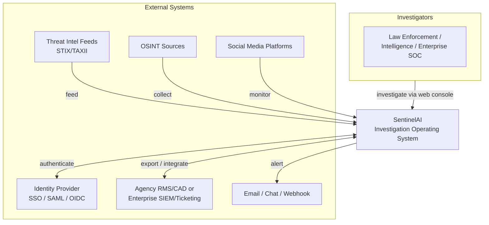
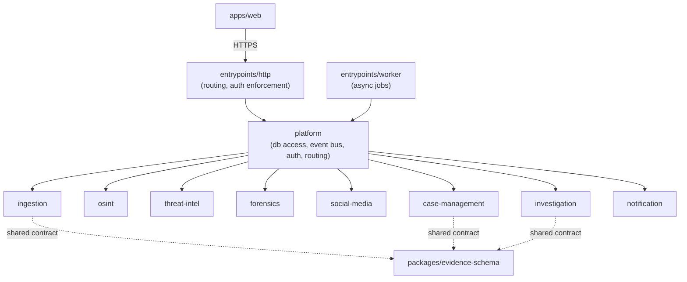
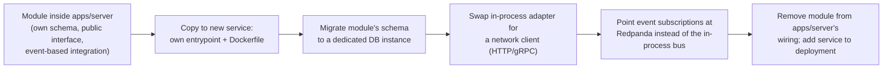
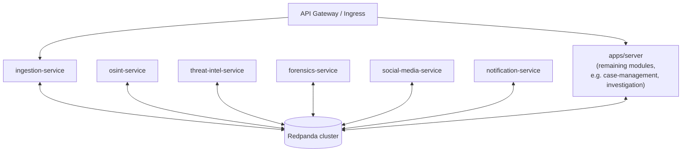
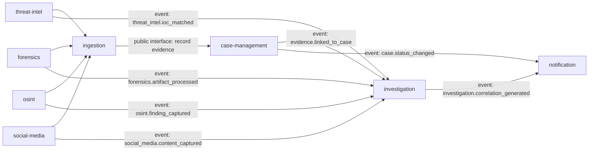
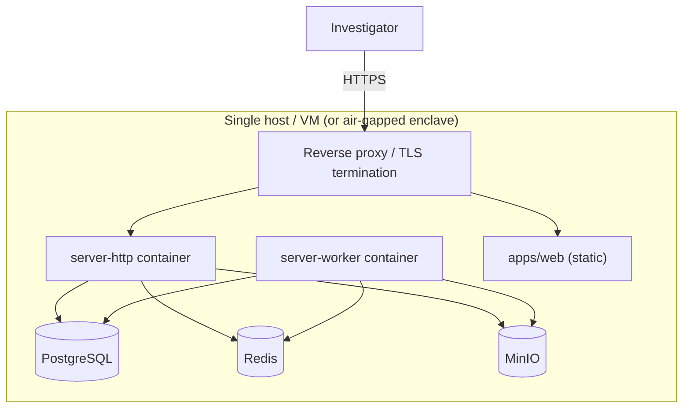
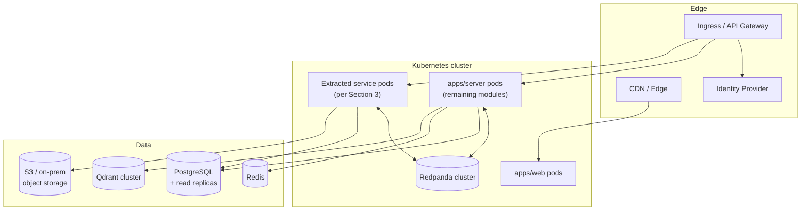

# SentinelAI — System Design

**Status:** Draft — engineering reference
**Last updated:** 2026-07-19
**Related documents:** [PRD](prd.md) · [Architecture](architecture.md) · [Roadmap](roadmap.md) · [apps/server/README.md](../apps/server/README.md)

This document is the deep technical companion to [Architecture](architecture.md): that document states the architectural *style and principles* (modular monolith now, why, and the module rules that make extraction cheap later); this document works through the *mechanics* — data flow, event contracts, scalability, fault tolerance, observability, and deployment, down to diagram level. No implementation code — this is design, not code.

**Governing constraint:** Phase 1 is built and operated by a single developer. Every design decision below is chosen so that what a solo developer can realistically build and run today becomes the enterprise-scale version tomorrow *by extension, not by rewrite*. Sections call this out explicitly as a "Forward-compatibility" note wherever the Phase 1 shortcut and the enterprise target diverge in effort but not in design.

### Diagram index

| # | Diagram | Section |
|---|---|---|
| 1 | System context | [1. High-Level Architecture](#1-high-level-architecture) |
| 2 | `apps/server` component diagram | [2. Modular Monolith Design for Phase 1](#2-modular-monolith-design-for-phase-1) |
| 3 | Extraction recipe flow | [3. Future Microservice Evolution](#3-future-microservice-evolution) |
| 4 | Target microservices topology | [3. Future Microservice Evolution](#3-future-microservice-evolution) |
| 5 | Module interaction / dependency graph | [5. Module Interactions](#5-module-interactions) |
| 6 | Evidence-to-report sequence diagram | [7. Data Flow: Evidence Ingestion → AI-Assisted Reporting](#7-data-flow-evidence-ingestion--ai-assisted-reporting) |
| 7 | Phase 1 deployment (single host) | [13. Deployment Topology](#13-deployment-topology) |
| 8 | Target deployment (Kubernetes) | [13. Deployment Topology](#13-deployment-topology) |

---

## 1. High-Level Architecture

SentinelAI is a domain-bounded investigation platform: five evidence domains (forensics, OSINT, threat intelligence, social media, plus ingestion as the common intake path) feed a canonical evidence model; an AI investigation layer correlates across them; case management is the system of record; notifications close the loop back to the analyst. See [PRD §6](prd.md#6-core-capabilities) for the product-level capability list this architecture implements.



The system is organized around **fixed domain boundaries** (Section 4) whose *deployment* topology changes over time (Sections 2–3) without the boundaries themselves changing — that stability is what lets a one-person Phase 1 evolve into a multi-team enterprise platform without a redesign.

## 2. Modular Monolith Design for Phase 1

Per [Architecture §Architectural Style](architecture.md#architectural-style), Phase 1 ships as one deployable, `apps/server`, containing all eight domain modules internally, with two entrypoints sharing one codebase:



**Design commitments that make this a modular monolith and not just a monolith:**

- Each module owns its own Postgres schema/table namespace (`ingestion.*`, `case_management.*`, etc.) inside the single Phase 1 database. No module executes a query against another module's tables.
- Modules interact only through a public interface or the `platform` event bus (Section 6) — never through direct imports of another module's internals.
- `entrypoints/http` and `entrypoints/worker` contain no business logic — they are thin composition roots that wire modules to a transport (HTTP requests, queued jobs). All logic lives in `modules/`.
- The AI investigation module is the sole cross-domain reader — every other module is a strict bounded context (Section 4).

> **Forward-compatibility:** a solo developer runs this as literally one process (or two, for `http`/`worker`). The schema-per-module and interface-only rules cost nothing extra to follow today — they're just discipline — but they are the entire reason Section 3's extraction is a folder move instead of a rewrite.

## 3. Future Microservice Evolution

Extraction is triggered by an actual bottleneck (team-coordination or independent-scaling pressure on a specific module), not a fixed date — see [Roadmap Phase 5](roadmap.md#phase-5--service-extraction-as-needed-not-on-a-fixed-schedule). Because Section 2's rules are enforced from day one, every module follows the same mechanical recipe:



Extraction is expected to be **partial and gradual** — some modules (e.g. `ingestion`, `osint`, `social-media`, which have the most divergent scaling profile) are likely to extract first; `case-management` and `investigation` are expected to stay in `apps/server` longest (see their extraction notes in `apps/server/modules/*/README.md`). The target state below shows a partially-extracted system, not a big-bang rewrite:



## 4. Domain Boundaries

Same eight bounded contexts as [Architecture §Domain Boundaries](architecture.md#domain-boundaries), detailed here at the data-ownership level relevant to implementation:

| Module | Owns (conceptual entities) | Cross-module reads via |
|---|---|---|
| `ingestion` | Intake records, normalization status, source/integrity metadata | Publishes `evidence.ingested`; queried by nothing (write path) |
| `osint` | Source connector configs, findings, reliability scores | Publishes into `ingestion` |
| `threat-intel` | IOCs, feed subscriptions, threat actor/campaign context | Publishes into `ingestion`; matches consumed by `investigation` |
| `forensics` | Artifacts, artifact custody events, hash/integrity records | Publishes into `ingestion`; custody log queried (read-only, via interface) by `case-management` |
| `social-media` | Captured content, profile/network snapshots | Publishes into `ingestion` |
| `case-management` | Cases, evidence-to-case links, chain-of-custody log, reports | Consumes events from all evidence domains; exposes public interface `investigation` reads |
| `investigation` | Correlations, hypotheses, finding dispositions | Reads across every other module's public interface/events — the one sanctioned exception to strict isolation |
| `notification` | Notification rules, delivery records | Consumes events from `case-management` and `investigation` |

`packages/evidence-schema` is the wire contract every domain normalizes into — it is what lets `investigation` reason across five otherwise-unrelated data models without each module needing to understand the others' native formats.

## 5. Module Interactions

Two interaction styles, chosen per relationship type:

- **Request/response through a public interface** — used when a module needs an immediate answer (e.g., `case-management` looking up whether an evidence item exists before linking it).
- **Event publication through the `platform` event bus** — used for "this happened, react if you care" relationships, which is most cross-module traffic in this domain (evidence arriving, findings being generated, case state changing).



`investigation` is intentionally the only module with many inbound edges — that fan-in *is* the product's core value proposition (cross-domain correlation), and confining it to one module keeps the other seven strictly decoupled from each other.

## 6. Event-Driven Architecture

Phase 1 uses an **in-process publish/subscribe bus** inside `apps/server/platform` — no broker process to operate, which matters for solo-developer velocity. Its interface is deliberately broker-shaped (publish a named event with a versioned payload; subscribe by event name) so the Phase 3+ swap to Redpanda (already provisioned, commented out, in `docker-compose.yml`) changes the transport, not the module code.

**Core event catalog** (names are illustrative of the convention — `<module>.<past-tense-fact>` — not a final schema):

| Event | Published by | Consumed by | Represents |
|---|---|---|---|
| `evidence.ingested` | `ingestion` | `case-management` | A new evidence item passed validation and normalization |
| `evidence.linked_to_case` | `case-management` | `investigation`, `notification` | Evidence was attached to a case, custody logged |
| `osint.finding_captured` | `osint` | `ingestion` | A source connector produced a new finding |
| `threat_intel.ioc_matched` | `threat-intel` | `investigation`, `notification` | Case evidence matched a known indicator |
| `forensics.artifact_processed` | `forensics` | `ingestion` | A forensic artifact finished parsing |
| `social_media.content_captured` | `social-media` | `ingestion` | Monitored content was captured |
| `investigation.correlation_generated` | `investigation` | `notification`, `case-management` | AI surfaced a candidate cross-domain correlation |
| `investigation.finding_reviewed` | `case-management` (analyst action) | `investigation`, `notification` | An analyst accepted/rejected/annotated an AI finding |
| `case.status_changed` | `case-management` | `notification` | Case lifecycle transition |

**Delivery semantics chosen deliberately for forward-compatibility:** every handler is written assuming **at-least-once delivery and required idempotency**, even though the Phase 1 in-process bus could technically guarantee exactly-once. Redpanda (the Phase 3+ target) is at-least-once by nature — writing idempotent handlers now means the transport swap in Section 3 doesn't surface a new class of bugs.

> **Forward-compatibility:** event *names and payload shapes* are the contract. The transport (in-process function call today, network message later) is an implementation detail behind `platform`'s publish/subscribe interface — this is the same adapter-swap pattern as the extraction recipe in Section 3, applied one layer down.

## 7. Data Flow: Evidence Ingestion → AI-Assisted Reporting

```mermaid
sequenceDiagram
    participant Analyst
    participant HTTP as entrypoints/http
    participant ING as ingestion
    participant CASE as case-management
    participant INV as investigation
    participant NOTIF as notification

    Analyst->>HTTP: Submit evidence (upload / connector result)
    HTTP->>ING: Ingest(evidence)
    ING->>ING: Validate & normalize against evidence-schema
    ING-->>HTTP: 202 Accepted (or validation error, FR-1.3)
    ING->>CASE: publish evidence.ingested
    CASE->>CASE: Link evidence to case, append custody log entry
    CASE->>INV: publish evidence.linked_to_case
    INV->>INV: Correlate against existing case evidence
    INV->>NOTIF: publish investigation.correlation_generated
    NOTIF->>Analyst: Notify: new correlation to review
    Analyst->>HTTP: Review finding (accept / reject / annotate)
    HTTP->>INV: Record disposition
    INV->>CASE: publish investigation.finding_reviewed
    CASE->>CASE: Update case record; available for report export
    Analyst->>HTTP: Request case report
    HTTP->>CASE: Generate report (evidence + custody + reviewed findings)
    CASE-->>Analyst: Disclosure-ready case report
```

This flow directly implements PRD FR-1.x, FR-2.x, and FR-7.x. Two properties hold throughout, non-negotiably: **every step is attributable** (who/what triggered it, when) and **nothing an AI produces reaches the report without an explicit human disposition** (FR-7.3).

## 8. External Integrations

| Integration | Direction | Format/Protocol | Consumed/provided by | Deployment note |
|---|---|---|---|---|
| Identity provider | Inbound (auth) | SSO / SAML / OIDC | `entrypoints/http` (`platform` auth) | Must work fully offline for air-gapped deployments (local IdP or cached credentials) |
| Threat intel feeds | Inbound | STIX/TAXII (preferred), vendor APIs | `threat-intel` | Feed access itself may require network egress the deployment doesn't have — degrade gracefully, don't block the module |
| OSINT sources | Inbound | Per-source APIs/scraping (pluggable connectors) | `osint` | Rate-limited/isolated per source to avoid one noisy source affecting others |
| Social media platforms | Inbound | Per-platform APIs (pluggable connectors) | `social-media` | Same isolation principle as OSINT |
| Object storage | Bidirectional | S3 API | `forensics`, `ingestion` (artifact storage) | MinIO (self-hosted) or S3 — same API, so cloud and air-gapped use identical integration code |
| Notification channels | Outbound | Email/SMTP, chat webhook, generic webhook | `notification` | Channel availability varies by deployment; must not be assumed reachable |
| Agency/enterprise systems (RMS/CAD, SIEM/ticketing) | Bidirectional | `packages/sdk` (Phase 4+) | External, via `entrypoints/http` API | Deferred past MVP per PRD §11 |
| Secrets manager | Internal | TBD (Vault or cloud-native KMS) | `platform` | Open question, see Architecture §Open Questions |

Every inbound integration above is a candidate failure point that must **not** be allowed to block core case/evidence operations — see Section 11.

## 9. Technology Stack Justification

| Layer | Choice | Why | Status |
|---|---|---|---|
| Relational store | PostgreSQL | ACID transactions are required for chain-of-custody integrity (PRD FR-1.4, FR-2.3) — evidence must be fully recorded or not recorded, never partially. Schema-per-module maps directly onto the module boundary rule (Section 2). JSONB gives flexible evidence metadata without giving up relational integrity for case links. Runs identically cloud, on-prem, and air-gapped. | Active |
| Cache / lightweight queue | Redis | Minimal operational overhead for a solo developer; doubles as session store and the Phase 1 job queue for `entrypoints/worker`. Naturally superseded by Redpanda for durable event traffic when volume demands it — not a dead end. | Active |
| Object storage | MinIO (S3-compatible) | S3 API compatibility means identical code path for local dev (MinIO), cloud (S3), and air-gapped (MinIO on customer infra) — directly serves the deployment-flexibility NFR (PRD §8). Forensic artifacts and captured media need durable, addressable blob storage separate from relational data. | Active |
| Event streaming | Redpanda (Kafka-wire-compatible) | Chosen over Kafka for lower operational footprint (no JVM/Zookeeper) — appropriate for current team size — while remaining wire-compatible with Kafka tooling/expertise an enterprise customer or future hire may already have. | Deferred to extraction/high-volume trigger (Section 3) |
| Vector store (AI/RAG) | Qdrant | Self-hostable and open-source — most managed vector DBs are cloud-SaaS-only, which would violate the air-gapped deployment requirement for the intelligence/national-security segment (PRD §8, §10). Chosen specifically because of that constraint, not general preference. | Deferred to Phase 3 AI work |
| Application language/framework (`apps/server`) | Not yet chosen | Decision criteria: must support enforceable module-boundary tooling (Section 2), a mature async story for `entrypoints/worker`, a solid Postgres driver/ORM, straightforward containerized/air-gapped packaging, and a credible AI/LLM SDK ecosystem. | **Open — blocking ADR**, see Architecture §Open Questions |
| Frontend (`apps/web`) | React + React Query (TanStack Query) | Library choice resolved in `docs/frontend-architecture.md` (header note) — meets the WCAG 2.1 AA and constrained-network criteria via that document's accessibility (§36) and performance (§39–41) sections. Surrounding tooling (build system, router) remains open. | Library chosen; tooling ADR pending |
| AI/LLM provider | Not yet chosen | `investigation` shall depend on a provider-agnostic AI interface (same port/adapter pattern as module boundaries), so hosted-vs-self-hosted remains swappable rather than baked into the module's logic. | Open — see PRD §14 risk on model/vendor dependency |
| IaC / orchestration | Terraform / Kubernetes | Deferred — a single container host is sufficient at Phase 1 scale; both are industry-standard enough that adopting them later isn't a redesign, just added infrastructure. | Deferred |

## 10. Scalability Strategy

| Phase | Strategy |
|---|---|
| **Phase 1 (solo dev)** | Vertical scaling of one `apps/server` instance; `entrypoints/worker` runs as one or a few stateless replicas behind the Redis-backed job queue for background throughput; Postgres connection pooling; Redis caching for hot read paths. |
| **Phase 4 (enterprise hardening)** | `entrypoints/http` scales horizontally behind a load balancer — safe because it's stateless by design (session/state lives in Redis/Postgres, never in-process); Postgres read replicas for reporting/analytics queries that shouldn't compete with write traffic; CDN/edge caching for `apps/web` static assets. |
| **Phase 5 (service extraction)** | Each extracted service scales independently, matched to its real load profile — `ingestion`/`osint`/`social-media` scale for ingest/poll burst volume, `investigation` scales for AI compute, `case-management` stays low-throughput/high-integrity and rarely needs horizontal scale at all. |

**Domain-specific scaling concern:** OSINT and social media connectors poll external, rate-limited APIs. Scaling those modules isn't about adding more compute — it's about per-source rate-limit isolation, so one throttled or misbehaving source connector can't starve the others or trip a shared rate limit. This is a module-internal concern in Phase 1 and becomes a service-level concern (independent deploy = independent rate-limit budget) after extraction — no design change, just a topology change.

## 11. Fault Tolerance

- **Evidence integrity is transactional, not best-effort.** Ingesting an item either fully succeeds (record + custody log entry committed together) or fully fails with a clear error (FR-1.3) — never a partially-recorded, ambiguous state. This is the platform's single most important fault-tolerance property given its evidentiary purpose.
- **Module-level bulkheading inside the monolith.** A failing event handler in one module must not crash the `entrypoints/http` or `entrypoints/worker` process, or block unrelated requests — the `platform` event dispatch layer isolates and times out per-handler failures rather than letting one module's bug take down the process.
- **Idempotent, retryable handlers everywhere** (see Section 6) — background jobs (connector polling, AI correlation runs) retry with backoff; a defined-but-not-yet-specified dead-letter path captures jobs that exhaust retries for manual review, since silently dropping a forensic parse or OSINT poll is not an acceptable failure mode here.
- **Graceful degradation of the AI layer.** If `investigation` or its AI provider is unavailable, ingestion and case management continue functioning normally — AI correlation is additive to the platform's core value, never a dependency for it. This mirrors the "analyst-in-the-loop, always" principle in [Vision](vision.md).
- **Database durability.** Automated backups and point-in-time recovery are a Phase 1 requirement, not a later hardening step — evidence data loss is not a recoverable failure mode for this product category.
- **Health checks from day one.** `entrypoints/http` and `entrypoints/worker` expose liveness/readiness checks even in Phase 1 — cheap to add now, required for both `docker-compose` restart policies today and Kubernetes probes after extraction, so this is written once.

## 12. Observability

- **Structured (JSON) logs** from every module, tagged with a correlation ID generated at the entrypoint and propagated through every in-process call for a given request/job. Choosing a trace-context-compatible ID format (W3C Trace Context) now means it becomes a genuine distributed trace ID with no format migration once modules are extracted and calls cross a network boundary.
- **Metrics**, namespaced per module so dashboards drawn today (per-module, in one process) map directly onto per-service dashboards later: RED (rate, errors, duration) for anything request-like (`entrypoints/http`, module public interfaces), USE (utilization, saturation, errors) for platform resources (Postgres, Redis, MinIO).
- **Operational telemetry is a separate system from the evidentiary audit log** (PRD SR-4, FR-9.2). Logs/metrics/traces exist to answer "what is the system doing" for engineering; the audit log exists to answer "what happened to this evidence, legally" for compliance/courts — different storage, different retention policy, different access control. Conflating them would be both an operability and a compliance mistake.
- **Alerting is likewise two separate concerns kept separate on purpose**: infrastructure/SLA alerting (uptime, error rate, queue depth) goes to engineering via standard ops tooling; the `notification` module's analyst-facing alerts (new correlation, SLA breach on a case, FR-8.3) are a product feature with its own audit trail. They should never share a pipe — an ops incident and a case SLA breach are different audiences and different urgency models.

## 13. Deployment Topology

Three deployment profiles must be supported by the same codebase (PRD §8 deployment flexibility): cloud (multi- or single-tenant), dedicated cloud (single-tenant VPC), and on-premises/air-gapped. Phase 1 targets the simplest of these; the design doesn't preclude the others.

**Phase 1 — single host (cloud VM or an air-gapped enclave with all images pre-mirrored, no external egress required):**



This is `docker-compose.yml` in production form — same containers, same topology, just not on a laptop. The air-gapped variant is identical except every image is pulled from an internal registry and there is no outbound internet path; this is precisely why MinIO/self-hosted Postgres/Redis/Qdrant were chosen over SaaS-only alternatives in Section 9.

**Target — Kubernetes, partially or fully extracted (Phase 4–5):**



The move from the first diagram to the second is entirely additive — nothing in Phase 1's design has to be undone to get there, which is the point of Sections 2–3.

---

*Keep this document synchronized with [Architecture](architecture.md) and [Roadmap](roadmap.md): when a Phase completes, when an Open Question is resolved via ADR, or when the event catalog (Section 6) changes shape, update this document in the same change.*
